<div id="mp_schema_migration" class="registered_link"></div>

After resolving errors in your schemas, you can use the schemas with a client application such as pgAdmin, ToadEdge, or the PSQL client, or migrate the schema to an EDB Postgres Advanced Server.

!!! Note
    For more information about using Toad Edge with EDB Postgres Advanced Server, see Toad Edge for Postgres.

You can choose one of the following options for migrating schemas; migrate to an:

-   Existing on-premise EDB Postgres Advanced Server
-   New on-premise EDB Postgres Advanced Server
-   EDB Postgres Advanced Server on Cloud


*Schema migration home page*

<div id="existing_on_premise_edb_advanced_server" class="registered_link"></div>

## Migrating to an Existing On-Premise EDB Postgres Advanced Server Host

You can migrate schemas to an existing on-premise EDB Postgres Advanced Server on Windows or Linux platforms.

### Migrating Schemas on Windows

1.  Select the `Existing on-premise EDB Postgres Postgres Advanced Server` option:


*Existing on-premise EDB Postgres Advanced Server home page*

2.  Select one or more schemas to migrate to EDB Postgres Advanced Server:

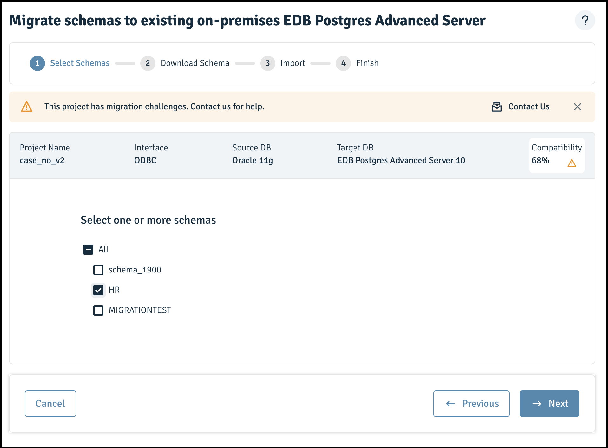

*Selecting schemas for migration*

!!! Note
    If your schemas are not 100% compatible, a banner will be displayed as shown; complete the `Contact Us` form for any assistance required.


*The Contact Us form*

3.  Download the assessed schemas:

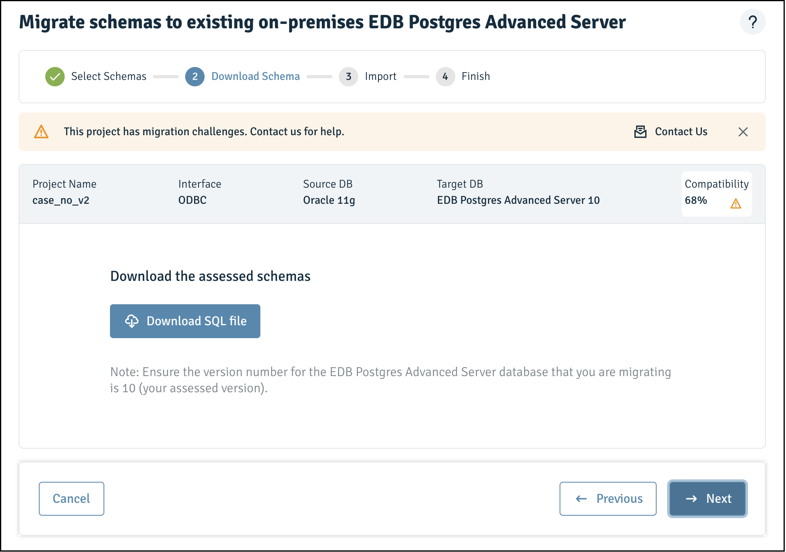

*Download the assessed schemas*

4.  Click on `Windows`:

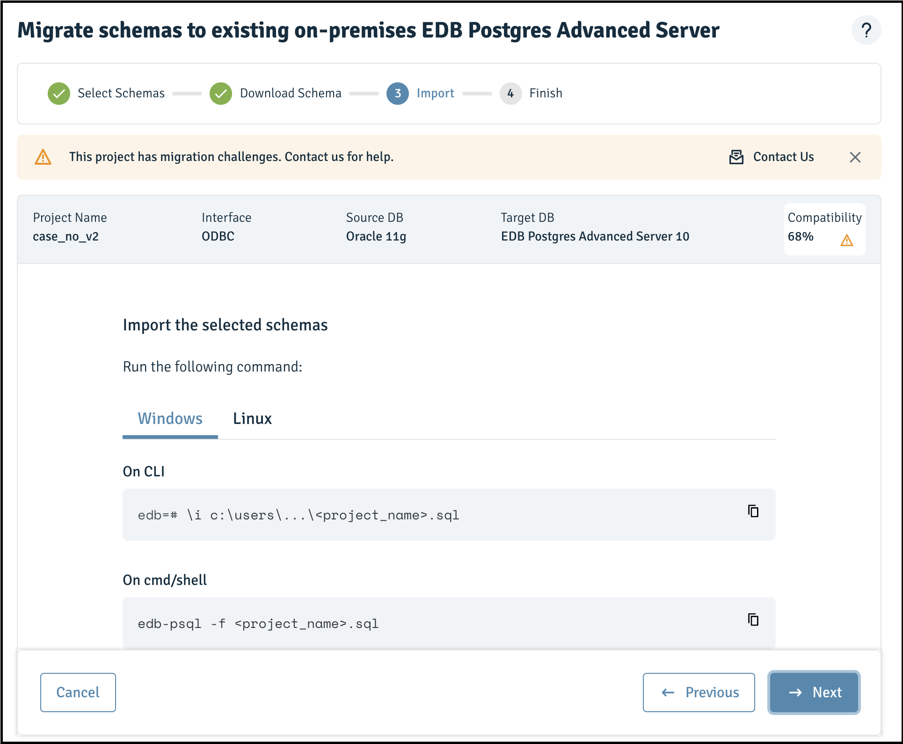

*Selecting Windows operating system*

5.  To import the schemas, run the following command:

-   On CLI

    ```text
    \i c:\users\...\<project_name>.sql
    ```

-   On cmd/shell

    ```text
    edb-psql -f <project_name>.sql
    ```

!!! Note
    You can also use `pgAdmin` instead.

The converted schemas are migrated to the target server.

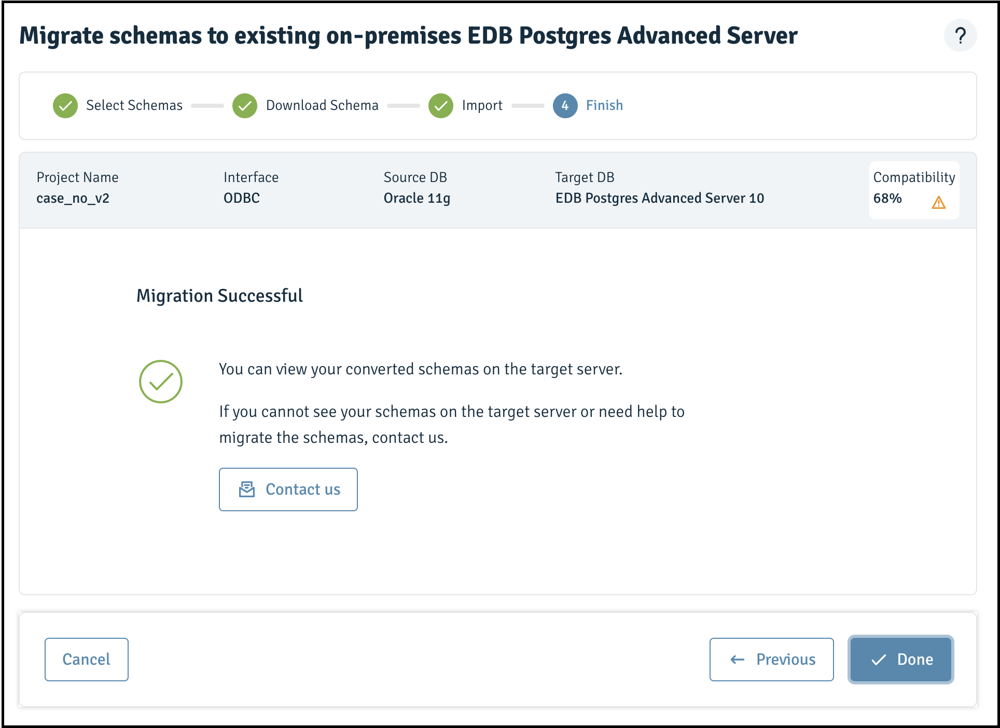

*A successful migration*

### Migrating Schemas on Linux

To migrate schemas to an existing on-premise EDB Postgres Advanced Server on Linux, complete the following steps:

1.  Click the `Existing on-premise EDB Postgres Advanced Server` option:


*Existing on-premise EDB Postgres Advanced Server home page*

2.  Select one or more schemas to migrate to EDB Postgres Advanced Server:

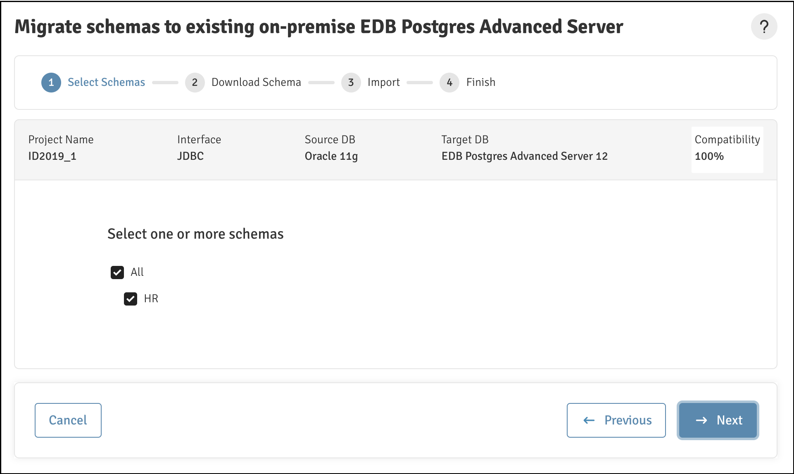

*Selecting schemas for migration*

3.  Download the assessed schemas:


*Download the assessed schemas*

4.  Click on `Linux`:

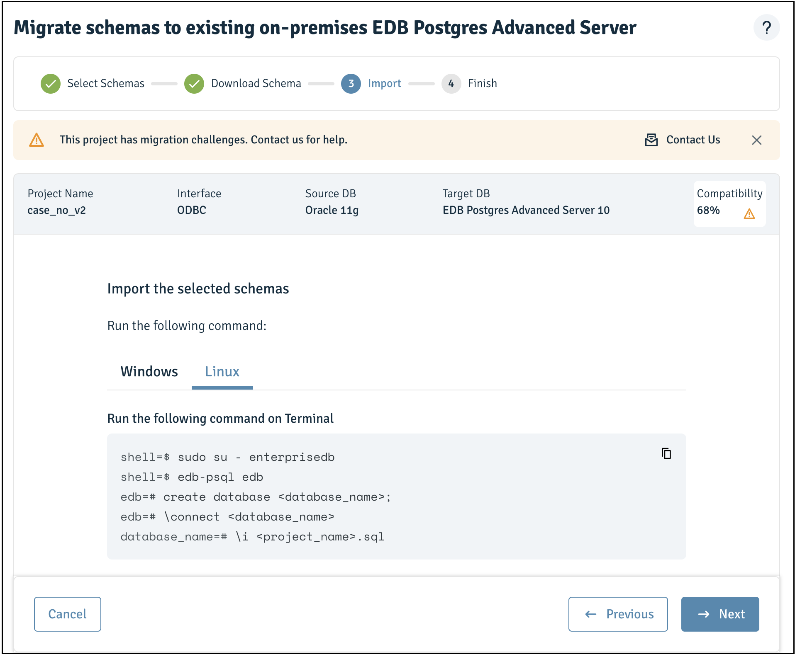

*Selecting Linux operating system*

5.  To import the schemas, invoke the following `edb-psql` client commands:

    ```text
    sudo su - enterprisedb
    edb-psql edb
    create database <database_name>;
    \\connect <database_name>
    \\i <project_name>.sql
    ```

!!! Note
    You can optionally use the `pgAdmin` client for the import.

The converted schemas are migrated to the target server.


*A successful schema migration*

<div id="new_on_premise_edb_advanced_server" class="registered_link"></div>

## Migrating to a New On-Premise EDB Postgres Advanced Server Installation

You can install new EDB Postgres Advanced Server on-premise on Windows or Linux platforms and migrate the schemas.

### Migrating Schemas on Windows

To migrate schemas to a new on-premise EDB Postgres Advanced Server on Windows, complete the following steps:

1.  Click `New on-premise EDB Postgres Postgres Advanced Server` option.

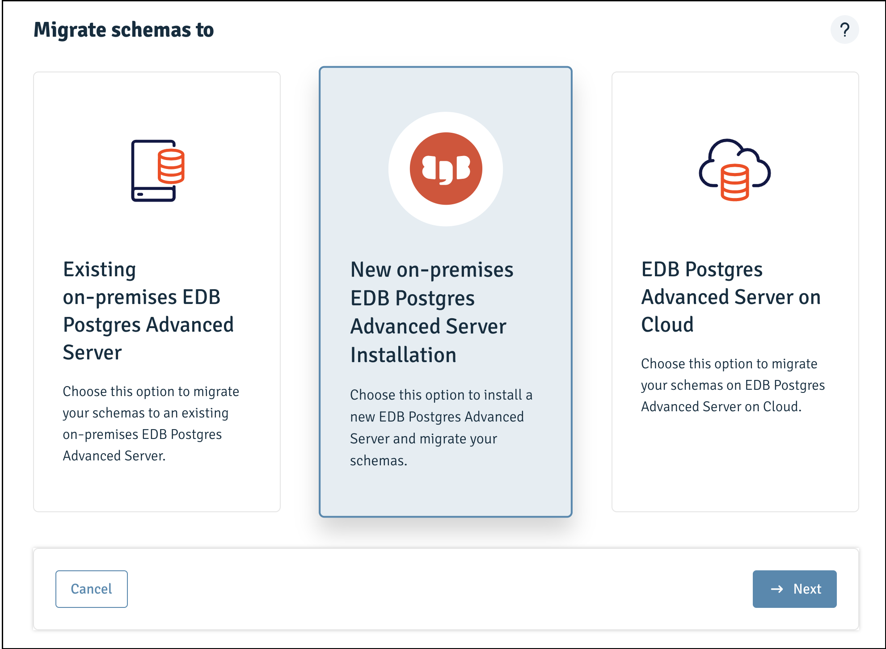

*New on-premise EDB Postgres Advanced Server home page*

2.  Select one or more schemas to migrate on EDB Postgres Advanced Server.


*Selecting schemas for migration*

3.  Select the `Windows` operating system.

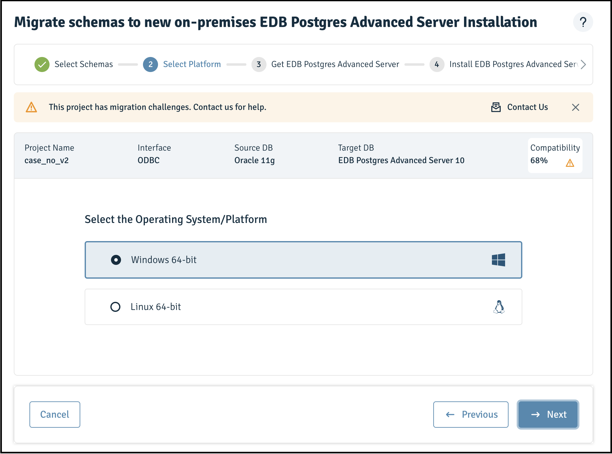

*Selecting Windows operating system*

4.  Download `Windows Installer`.


*Downloading Windows installer*

5.  For installation steps, click `EDB Postgres Advanced Server Installation Guide for Windows`.

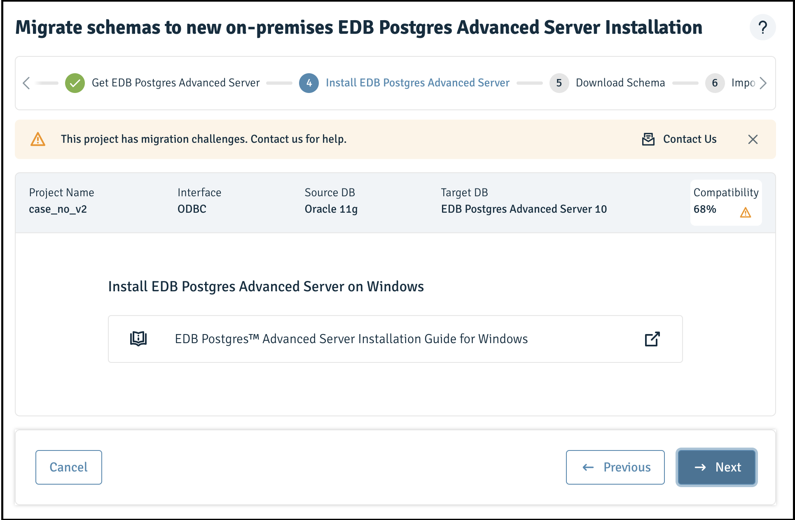

6.  Download the assessed schemas.


*Downloading the assessed file*

7.  You can import schemas by running the following command:

    -   On CLI

        ```text
        \i c:\users\...\<project_name>.sql
        ```

    -   On cmd/shell

        ```text
        edb-psql -f <project_name>.sql
        ```


*Importing schemas into EDB Postgres Advanced Server*

!!! Note
    You can also use `pgAdmin` instead.

The schemas are migrated to the target server.

<figure>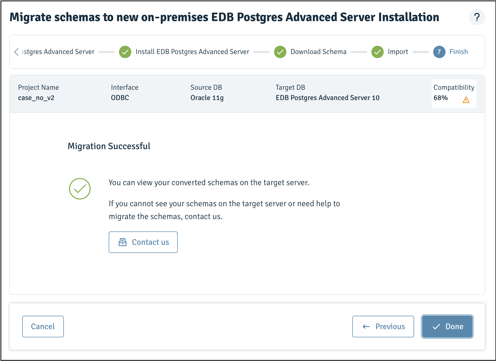</figure>

### Migrating Schemas on Linux

To migrate schemas to an on-premise EDB Postgres Advanced Server on Linux, complete the following steps:

1.  Click `New On-premise EDB Postgres Advanced Server` option.


*Migrating schemas home page*

2.  Select one or more schemas to migrate on EDB Postgres Advanced Server.


*Selecting schemas for migration*

3.  Select the `Linux` operating system.


*Selecting Linux operating system*

4.  You can select one of the following options to install the EDB Postgres Advanced Server:

    -   Repository
    -   More options

    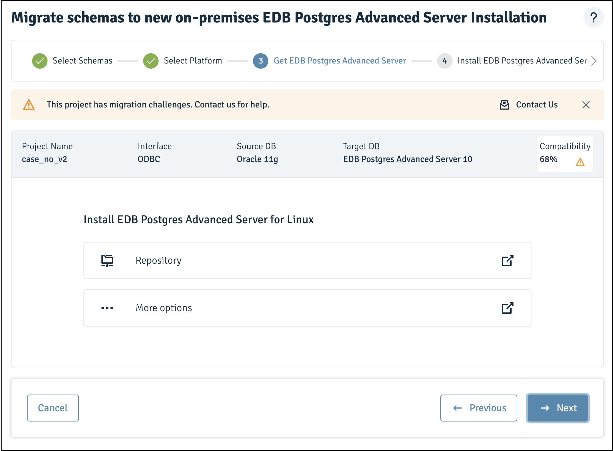

    *Selecting Linux repository*

5.  For information on the installation procedure, click `EDB Postgres Advanced Server Installation Guide` for Linux:

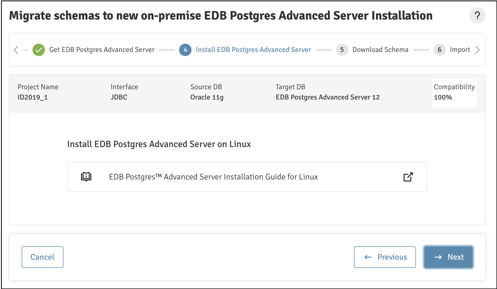

*Selecting Linux installation guide*

6.  Download the assessed schemas:


*Downloading the assessed schemas*

7.  To import the schemas, run the following command:

    ```text
    sudo su - enterprisedb
    edb-psql edb
    create database <database_name>;
    \connect <database_name>
    \i <project_name>.sql
    ```

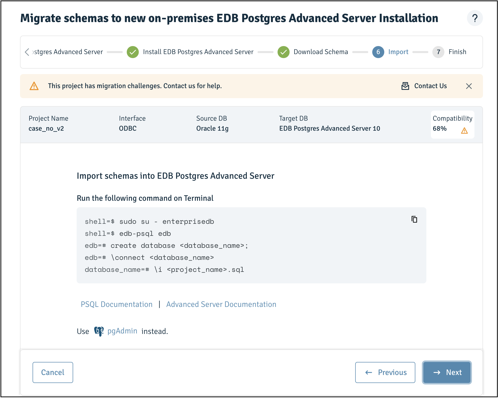

*Importing schemas into EDB Postgres Advanced Server*

!!! Note
    You can also use pgAdmin instead.

The converted schemas are migrated to the target server.


*A successful schema migration*

## Migrating to the Cloud

To migrate schemas on EDB Postgres Advanced Server to Cloud, complete the following steps:

2.  Click `EDB Postgres Advanced Server on Cloud` option:

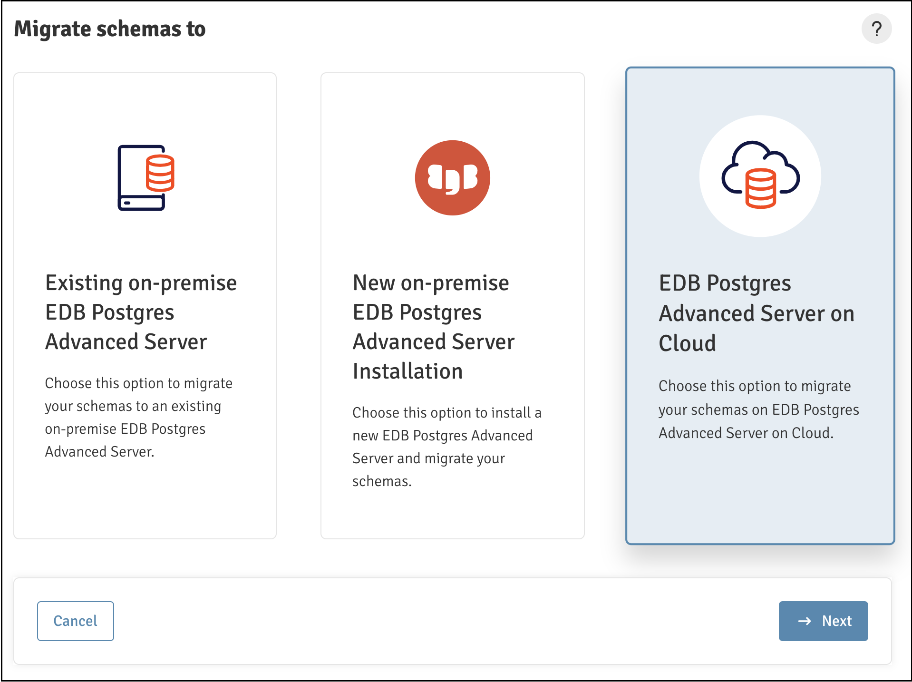

*EDB Postgres Advanced Server on Cloud*

3.  Select one or more schemas to migrate to EDB Postgres Advanced Server:


*Selecting schemas for migration*

4.  Select the cloud platform. For example, `IBM Cloud`:


*Selecting cloud option for migration*

5.  To launch a new cluster, click `Go to Cloud`:

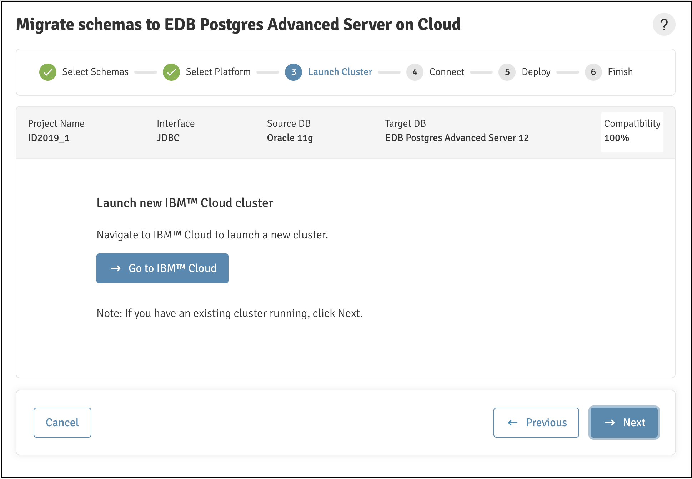

*Launching a cloud cluster*

Or, if you have an existing cluster running, click `Next`.

6.  Enter the required connection details on the `Connect` page:


*Connecting to the cloud cluster*

!!! Note
    You can click `Edit Connection` to make changes to the connection details and retest the connection details.

7.  Click `Test Connection` to verify the connection details:

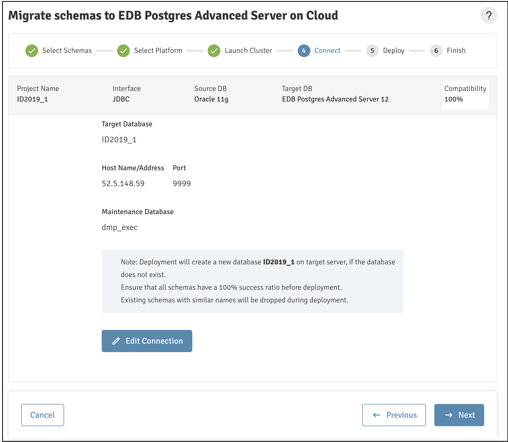

*Verify the connection details*

8.  Once the connection is successful, click `Next`:


*A successful migration*

The converted schemas are migrated to the target server.
