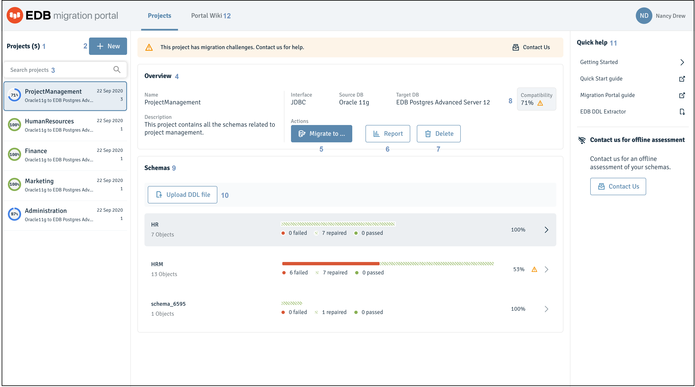

The Migration Portal home page provides quick access to migration tools.

*Figure 2-3: The Migration Portal home*

The Migration Portal home page allows access to the following Migration Portal features:

1.  **Projects**: The `Projects` panel displays a list of assessed projects.

2.  **Create project**: Click `+ New` (the button located to the right of the `Projects` label) to create a new project.

!!!Note
    Uploading large DDL files might freeze or crash the browser (depending on the browser and the system resources in use). In this scenario, try running Migration Portal in a different browser or extracting fewer schemas and uploading that file on Migration Portal.

3.  **Search projects**: Use the `Search` box to search for projects.

4.  **Overview**: The `Overview` panel provides details about the selected project and displays the compatibility percentage after schema assessment.

5.  **Migrate to**: Use the `Migrate to` button to either download an EDB Postgres Advanced Server compatible `.sql` file or migrate a schema to an EDB Postgres Advanced Server on-premise or on the cloud. For more information, see [Schema Migration](../04_mp_migrating_database/03_mp_schema_migration/#mp_schema_migration).

6.  **Report**: Use the `Report` button to view and download the schema assessment report.

7.  **Delete**: Use the `Delete` button to delete a selected project.

8.  **Warning sign**: A warning message is displayed if a project or a schema is less than 70% compatible or any DDL doesn’t succeed after multiple attempts.

9.  **Upload DDL file**: Use the `Upload new schema` button to upload a new or additional DDL file.

10. **Schemas**: The `Schemas` panel displays the assessment result from an uploaded DDL file.

11. **Quick help**: The `Quick help` panel contains quick handles to a few required resources.

12. **Portal Wiki**: The `Portal Wiki` has links to product information and different help guides.
