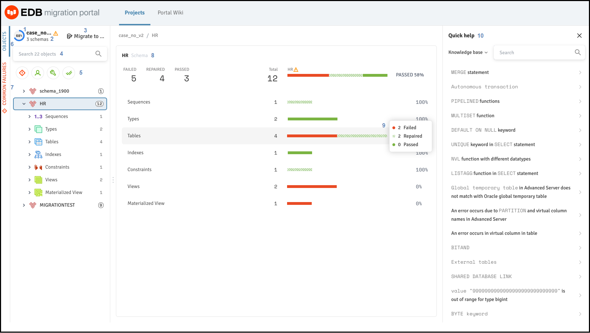

The Migration Portal Projects page provides detailed information about your migration.

*Figure 2-4: The Migration Portal Projects Page overview*

Use the following resources to gather information about your migration projects:

1.  **Compatible**: The `Compatible` gauge displays the color on the basis of the compatibility percentage of the assessed schema.

2.  **Schema Count**: Displays the number of schemas in a project.

3.  **Migrate to**: Use the `Migrate to` to migrate the schema to an *EDB Postgres Advanced Server* on-prmise or on cloud.

4.  **Search objects**: Use the `Search` box to search for objects.

5.  **Filters**: You can filter the system repaired and manual repaired objects from the left panel of the Projects page. In addition, you can select one or more filter combinations to refine the information.

6.  **Objects**: Displays the objects for the selected schemas.

7.  **Common Failures**: Displays the reason for the failed objects for the selected schemas.

    

    *Figure 2-5: Common Failures tab*

    !!! Note
        You can download a `CSV` file for the common failures for the project.

8.  **Schema**: The `Schema` panel displays the result of the assessment.

9.  **Tooltip**: Hover over a result set to display a tooltip with the number of passed, failed, and repaired objects.

10. **Quick help**: The `Quick help` panel displays links to Knowledge base articles and repair handler documentation.

11. **Search**: Use the `Search` box to search the `Knowledge base` entries or repair handler documentation for specific information.

*Figure 2-6: Searching the Knowledge Base entry*
