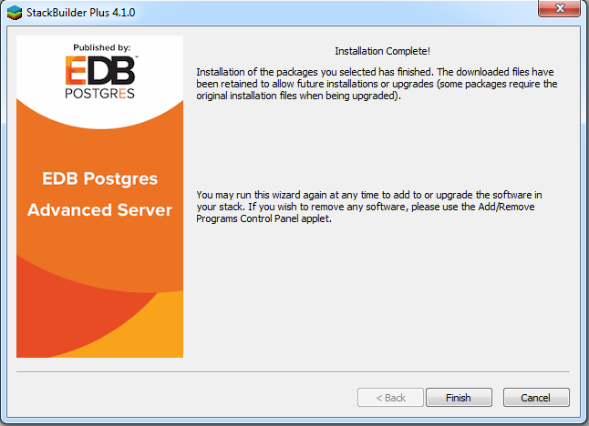

<div id="installing_mtk" class="registered_link"></div>

You can use an RPM package or Stack Builder to install Migration Toolkit. Stack Builder is distributed with both Advanced Server and the PostgreSQL one-click installer, available from EnterpriseDB.

Before installing Migration Toolkit, you must first install Java (version 1.7.0 or later). Free downloads of Java installers and installation instructions are available at:

<http://www.java.com/en/download/index.jsp>

<div id="rpm_installation" class="registered_link"></div>

## Using an RPM Package to Install Migration Toolkit

You can use an RPM package to install Migration Toolkit on a 64-bit Linux host. Before installing Migration Toolkit, you must:

-   Install a Java environment (version 1.7.0 or later) on your Migration Toolkit host.
-   You must also have credentials that allow access to the EnterpriseDB repository. For information about requesting credentials, visit:

<https://info.enterprisedb.com/rs/069-ALB-339/images/Repository%20Access%2004-09-2019.pdf>

After receiving your repository credentials you can:

1.  Create the repository configuration file.
2.  Modify the file, providing your user name and password.
3.  Install Migration Toolkit.

**Creating a Repository Configuration File**

To create the repository configuration file, assume superuser privileges and invoke the following command:

`yum -y install https://yum.enterprisedb.com/edb-repo-rpms/edb-repo-latest.noarch.rpm`

The repository configuration file is named `edb.repo`. The file resides in `/etc/yum.repos.d`.

After creating the `edb.repo` file, use your choice of editor to ensure that the value of the `enabled` parameter is `1`, and replace the `username` and `password` placeholders in the `baseurl` specification with the name and password of a registered EnterpriseDB user.

```
[edb]
name=EnterpriseDB RPMs $releasever - $basearch
baseurl=https://<username>:<password>@yum.enterprisedb.com/edb/redhat/rhel-$releasever-$basearch
enabled=1
gpgcheck=1
gpgkey=file:///etc/pki/rpm-gpg/ENTERPRISEDB-GPG-KEY
```

After saving your changes to the configuration file, you can use the `yum install` command to install Migration Toolkit:

`yum install edb-migrationtoolkit`

When you install an RPM package that is signed by a source that is not recognized by your system, yum may ask for your permission to import the key to your local server. If prompted, and you are satisfied that the packages come from a trustworthy source, enter a `y`, and press `Return` to continue.

During the installation, yum may encounter a dependency that it cannot resolve. If it does, it will provide a list of the required dependencies that you must manually resolve.

After installing Migration Toolkit, you must configure the installation. Perform the following steps before invoking Migration Toolkit.

**Using Migration Toolkit with IDENT Authentication**

By default, the `pg_hba.conf` file for the RPM installer enforces `IDENT` authentication for remote clients. Before invoking Migration Toolkit, you must either modify the `pg_hba.conf` file, changing the authentication method to a form other than `IDENT` (and restarting the server), or perform the following steps to ensure that an `IDENT` server is accessible:

1.  Confirm that an `identd` server is installed and running. You can use the yum package manager to install an `identd` server by invoking the command:

    `yum install xinetd authd`

    The command should create a file named `/etc/xinetd.d/auth` that contains:

<!-- -->

```
service auth
{
disable = yes
socket_type = stream
wait = no
user = ident
cps = 4096 10
instances = UNLIMITED
server = /usr/sbin/in.authd
server_args = -t60 --xerror --os
}
```

**Note**: if the file includes a `-E` argument at the end of `server_args`, please erase the `-E`.

Then, to start the `identd` server, invoke the commands:

```
systemctl enable xinetd
systemctl start xinetd
```

1.  Open the `pg_ident.conf` file and create a user mapping:

<!-- -->

```
# map_name system_username postgres_username
edbas enterprisedb enterprisedb
```

Where:

The name specified in the `map_name` column is a user-defined name that will identify the mapping in the pg_hba.conf file.

The name specified in the `system_username` column is enterprisedb.

The name specified in the `postgres_username` column is enterprisedb.

1.  Open the `pg_hba.conf` file and modify the `IDENT` entries.

    > On an IPv4 host:
    >
    > `host all all 127.0.0.0/0 ident map=edbas`
    >
    > On an IPv6 host:
    >
    > `host all all ::1/128 ident map=edbas`

2.  Restart the Advanced Server service before invoking Migration Toolkit.

<div id="stackbuilder_installation" class="registered_link"></div>

## Using Stack Builder to Install Migration Toolkit

Please Note: This guide uses the term Stack Builder to refer to *either* StackBuilder Plus (distributed with Advanced Server) or Stack Builder (distributed with the PostgreSQL one-click installer from EnterpriseDB).

Please note that you must have a Java JVM (version 1.7.0 or later) in place before Stack Builder can perform a Migration Toolkit installation. Free downloads of Java installers and installation instructions are available at:

<http://www.java.com/en/download/index.jsp>

The Java executable must be in your search path (`%PATH%` on Windows, `$PATH` on Linux/Unix). Use the following commands to set the search path (substituting the name of the directory that holds the Java executable for *javadir*):

> On Windows, use the command:
>
> `SET PATH=\ *javadir*;%PATH%`
>
> On Linux, use the command:
>
> `PATH=\ *javadir*:$PATH`

After setting the search path, you can use the Stack Builder installation wizard to install Migration Toolkit into either Advanced Server or PostgreSQL.

**Launching StackBuilder Plus from Advanced Server**

To launch StackBuilder Plus from an existing Advanced Server installation, navigate through the `Start` (or `Applications`) menu to the EDB Postgres menu; open the `EDB Add-ons` menu, and select the `StackBuilder Plus` menu option.

**Launching Stack Builder from PostgreSQL**

To launch Stack Builder from a PostgreSQL installation, navigate through the `Start` (or `Applications`) menu to the PostgreSQL menu, and select the `Application StackBuilder Plus` menu option.

Stack Builder opens as shown below.


Use the drop-down listbox to select the target server installation from the list of available servers. If your network requires you to use a proxy server to access the Internet, use the `Proxy servers` button to open the `Proxy servers` dialog and specify a server; if you do not need to use a proxy server, click `Next` to open the application selection window.


If you are using StackBuilder Plus to add Migration Toolkit to your Advanced Server installation, expand the `Add-ons, tools and utilities` node of the tree control, and check the box next to `EnterpriseDB Migration Toolkit`. Click `Next` to continue.

If you are using Stack Builder to add Migration Toolkit to your PostgreSQL installation, expand the `EnterpriseDB Tools` node of the tree control (located under the Registration-required and trial products node), and check the box next to `Migration Toolkit`. Click `Next` to continue.


Confirm that Migration Toolkit is included in the `Selected Packages` list and that the `Download directory` field contains an acceptable download location.


Click `Next` to start the Migration Toolkit download.


When the download completes, Stack Builder confirms that the installation files have been successfully downloaded. Choose `Next` to open the Migration Toolkit installation wizard.

When prompted by the Migration Toolkit installation wizard, specify a language for the installation and click `OK` to continue.


The Migration Toolkit installation wizard opens. Click `Next` to continue.


Carefully review the license agreement before highlighting the appropriate radio button; click `Next` to continue.


By default, Migration Toolkit will be installed in the `mtk` directory; accept the default installation directory as displayed, or modify the directory, and click `Next` to continue.


The installation wizard confirms that the `Setup` program is ready to install Migration Toolkit; click `Next` to start the installation.


A dialog confirms that the Migration Toolkit installation is complete; click `Finish` to exit the Migration Toolkit installer.



When Stack Builder finalizes installation of the last selected component, it displays the `Installation Completed` window. Click `Finish` to close Stack Builder.

After installing Migration Toolkit with Stack Builder, you must install the appropriate source-specific drivers before performing a migration; please see [Installing Source-Specific Drivers](#installing_drivers) for more information.

<div id="installing_drivers" class="registered_link"></div>

## Installing Source-Specific Drivers

Before invoking Migration Toolkit, you must download and install a freely available source-specific driver. To download a driver, or for a link to a vendor download site, visit the `Third Party JDBC Drivers` section of the `Advanced Downloads` page at the EnterpriseDB website:

<https://www.enterprisedb.com/advanced-downloads>

After downloading the source-specific driver, move the driver file into the `JAVA_HOME/jre/lib/ext` directory.
