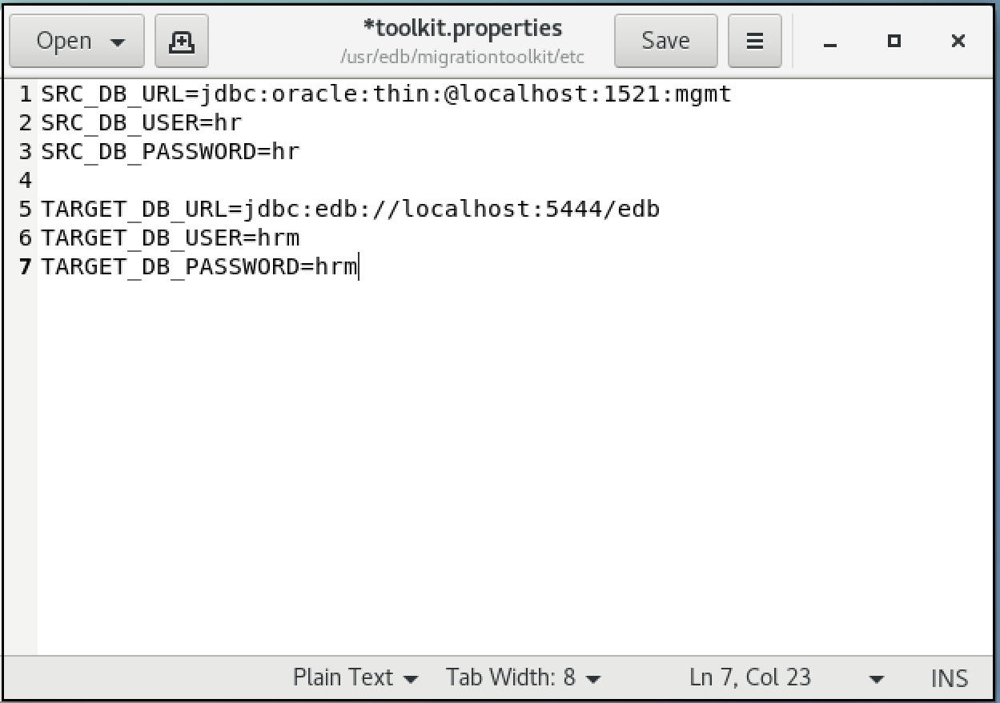

<div id="building_toolkit_properties_file" class="registered_link"></div>

Migration Toolkit uses the configuration and connection information stored in the `toolkit.properties` file during the migration process to identify and connect to the source and target databases. 

On Linux, the `toolkit.properties` file is located in: `/usr/edb/migrationtoolkit/etc`

On Windows, the file is located in: `C:\Program Files\edb\mtk\etc`

A sample `toolkit.properties` file is shown below:



Before executing Migration Toolkit commands, modify the toolkit.properties file with the editor of your choice. Update the file to include the following information:

-   `SRC_DB_URL` specifies how Migration Toolkit should connect to the source database. See the section corresponding to your source database for details about forming the URL.
-   `SRC_DB_USER` specifies a user name (with sufficient privileges) in the source database.
-   `SRC_DB_PASSWORD` specifies the password of the source database user.
-   `TARGET_DB_URL` specifies the JDBC URL of the target database.
-   `TARGET_DB_USER` specifies the name of a privileged target database user.
-   `TARGET_DB_PASSWORD` specifies the password of the target database user.

<div id="define_epas_url" class="registered_link"></div>

## Defining an Advanced Server URL

Migration Toolkit facilitates migration from the following platforms to Advanced Server:

-   Oracle
-   MySQL
-   Sybase
-   SQL Server
-   PostgreSQL

For a definitive list of the objects migrated from each database type, please refer to the [Functionality Overview](04_functionality_overview/#functionality_overview).

Migration Toolkit reads connection specifications for the source and the target database from the `toolkit.properties` file. Connection information for each must include:

-   The URL of the database
-   The name of a privileged user
-   The password associated with the specified user.

The URL conforms to JDBC standards and takes the form:

```text
{TARGET_DB_URL|SRC_DB_URL}=jdbc:edb://<host>:<port>/<database_id>
```

An Advanced Server URL contains the following information:

-   `jdbc` The protocol is always `jdbc`.

-   `edb` If you are using Advanced Server, specify `edb` for the sub-protocol value.

-   `<host>` The name or IP address of the host where the Postgres instance is running.

-   `<port>` The port number that the Advanced Server database listener is monitoring. The default port number is `5444`.

-   `<database_id>` The name of the source or target database.

-   `{TARGET_DB_USER|SRC_DB_USER}` must specify a user with privileges to CREATE each type of object migrated. If migrating data into a table, the specified user may also require `INSERT`, `TRUNCATE`, and `REFERENCES` privileges for each target table.

-   `{TARGET_DB_PASSWORD|SRC_DB_PASSWORD}` is set to the password of the privileged Advanced Server user.

<div id="define_pg_url" class="registered_link"></div>

## Defining a PostgreSQL URL

Migration Toolkit facilitates migration from the following platforms to PostgreSQL:

-   Oracle
-   MySQL
-   SQL Server
-   Advanced Server

For a definitive list of the objects migrated from each database type, please refer to the [Functionality Overview](04_functionality_overview/#functionality_overview).

Migration Toolkit reads connection specifications for the source and the target database from the `toolkit.properties` file. Connection information for each must include:

-   The URL of the database
-   The name of a privileged user
-   The password associated with the specified user.

A PostgreSQL URL conforms to JDBC standards and takes the form:

```text
{SRC_DB_URL|TARGET_DB_URL}=jdbc:postgresql://<host>:<port>/<database_id>
```

The URL contains the following information:

-   `jdbc` The protocol is always `jdbc`.

-   `postgresql` If you are using PostgreSQL, specify `postgresql` for the sub-protocol value.

-   `<host>` The name or IP address of the host where the Postgres instance is running.

-   `<port>` The port number that the Postgres database listener is monitoring. The default port number is `5432`.

-   `<database_id>` The name of the source or target database.

-   `{SRC_DB_USER|TARGET_DB_USER}` must specify a user with privileges to `CREATE` each type of object migrated. If migrating data into a table, the specified user may also require `INSERT`, `TRUNCATE`, and `REFERENCES` privileges for each target table.

-   `{SRC_DB_PASSWORD|TARGET_DB_PASSWORD}` is set to the password of the privileged PostgreSQL user.

<div id="define_oracle_url" class="registered_link"></div>

## Defining an Oracle URL

Migration Toolkit facilitates migration from an Oracle database to a PostgreSQL or Advanced Server database. When migrating from Oracle, you must specify connection specifications for the Oracle source database in the `toolkit.properties` file. The connection information must include:

-   The URL of the Oracle database
-   The name of a privileged user
-   The password associated with the specified user.

When migrating from an Oracle database, SRC_DB_URL should contain a JDBC URL, specified in one of two forms. The first form is:

```text
jdbc:oracle:thin:@<host_name>:<port>:<database_id>
```

The second form is:

```text
jdbc:oracle:thin:@//<host_name>:<port>{<database_id|service_name>}
```

An Oracle URL contains the following information:

-   `jdbc` The protocol is always `jdbc`.

-   `oracle` The sub-protocol is always `oracle`.

-   `thin` The driver type. Specify a driver type of `thin`.

-   `<host_name>` The name or IP address of the host where the Oracle server is running.

-   `<port>` The port number that the Oracle database listener is monitoring.

-   `<database_id>` The database SID of the Oracle database.

-   `<service_name>` The name of the Oracle service.

-   `SRC_DB_USER` should specify the name of a privileged Oracle user. The Oracle user should have DBA privilege to migrate objects from Oracle to Advanced Server. The DBA privilege can be granted to the Oracle user with the Oracle `GRANT DBA TO user` command to ensure all of the desired database objects are migrated.

-   `SRC_DB_PASSWORD` must contain the password of the specified user.

<div id="define_mysql_url" class="registered_link"></div>

## Defining a MySQL URL

Migration Toolkit facilitates migration from a MySQL database to an Advanced Server or PostgreSQL database. When migrating from MySQL, you must specify connection specifications for the MySQL source database in the `toolkit.properties` file. The connection information must include:

-   The URL of the source database
-   The name of a privileged user
-   The password associated with the specified user.

When migrating from MySQL, `SRC_DB_URL` takes the form of a JDBC URL. For example:

```text
jdbc:mysql://<host_name>[:<port>]/<database_id>
```

!!! Note
    For MTK versions `54.0.1` and onwards append the optional parameter `?tinyInt1isBit=false` in the JDBC URL if  datatype `tinyInt` is used to represent boolean value in the MySQL source database. 


The URL contains the following information:

-   `jdbc` The protocol is always `jdbc`.

-   `mysql` The sub-protocol is always `mysql`.

-   `<host_name>` The name or IP address of the host where the source server is running.

-   `[<port>]` The port number that the MySQL database listener is monitoring.

-   `<database_id>` The name of the source database.

-   `SRC_DB_USER` should specify the name of a privileged MySQL user.

-   `SRC_DB_PASSWORD` must contain the password of the specified user.

<div id="define_sybase_url" class="registered_link"></div>

## Defining a Sybase URL

Migration Toolkit facilitates migration from a Sybase database to an Advanced Server database. When migrating from Sybase, you must specify connection specifications for the Sybase source database in the toolkit.properties file. The connection information must include:

-   The URL of the source database
-   The name of a privileged user
-   The password associated with the specified user.

When migrating from Sybase, SRC_DB_URL takes the form of a JTDS URL. For example:

```text
jdbc:jtds:sybase://<host_name>[:<port>]/<database_id>
```

A Sybase URL contains the following information:

-   `jdbc` The protocol is always `jdbc`.

-   `jtds` The driver name is always `jtds`.

-   `sybase` The server type is always `sybase`.

-   `<host_name>` The name or IP address of the host where the source server is running.

-   `<port>` The port number that the Sybase database listener is monitoring.

-   `<database_id>` The name of the source database.

-   `SRC_DB_USER` should specify the name of a privileged Sybase user.

-   `SRC_DB_PASSWORD` must contain the password of the specified user.

## Defining a SQL Server URL

Migration Toolkit facilitates migration from a SQL Server database to a PostgreSQL or Advanced Server database. Migration Toolkit supports migration of the following object definitions:

-   schemas
-   tables
-   table data
-   constraints
-   indexes

Migration Toolkit reads connection specifications for the source database from the `toolkit.properties` file. The connection information must include:

-   The URL of the source database
-   The name of a privileged user
-   The password associated with the specified user.

If you are connecting to a SQL Server database, `SRC_DB_URL` takes the form of a JTDS URL. For example:

```text
jdbc:jtds:sqlserver:\<server_name>\[:<port>]\<database_id>
```

A SQL Server URL contains the following information:

-   `jdbc` The protocol is always `jdbc`.

-   `jtds` The driver name is always `jtds`.

-   `sqlserver` The server type is always `sqlserver`.

-   `<server_name>` The name or IP address of the host where the source server is running.

-   `<port>` The port number that the source database listener is monitoring.

-   `<database_id>` The name of the source database.

-   `SRC_DB_USER` should specify the name of a privileged SQL Server user.

-   `SRC_DB_PASSWORD` must contain the password of the specified user.
