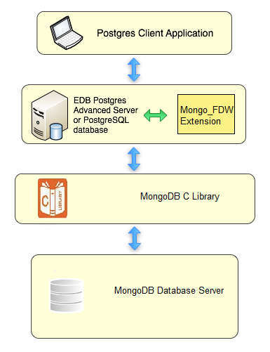

The MongoDB data wrapper provides an interface between a MongoDB server and a Postgres database. It transforms a Postgres statement (`SELECT`/`INSERT`/`DELETE`/`UPDATE`) into a query that is understood by the MongoDB database.

