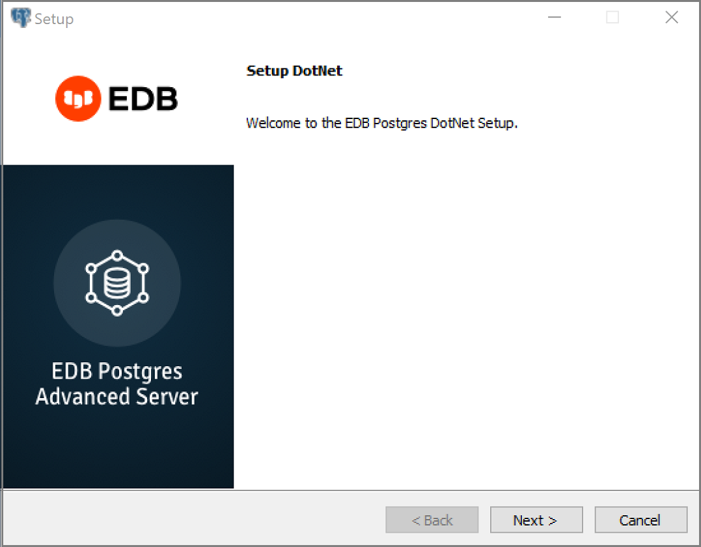
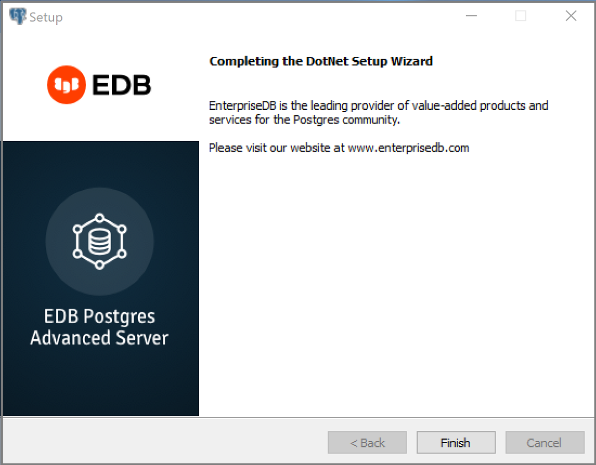

This chapter describes how to install and configure the EDB .NET Connector.

## Installing the .NET Connector

You can use the EDB .NET Connector Installer (available [from the EDB website](https://www.enterprisedb.com/software-downloads-postgres)) to add the .NET Connector to your system. After downloading the installer, right-click on the installer icon, and select `Run As Administrator` from the context menu. When prompted, select an installation language and click `OK` to continue to the `Setup` window.

The .NET Connector Installation wizard

Click `Next` to continue.

The Installation dialog

Use the `Installation Directory` dialog to specify the directory in which the connector will be installed, and click `Next` to continue.

The Ready to Install dialog

Click `Next` on the `Ready to Install` dialog to start the installation; popup dialogs confirm the progress of the installation wizard.

The installation is complete

When the wizard informs you that it has completed the setup, click the `Finish` button to exit the dialog.

You can also use StackBuilder Plus to add or update the connector on an existing Advanced Server installation; to open StackBuilder Plus, select `StackBuilder Plus` from the Windows `Apps` menu.

Starting StackBuilder Plus

When StackBuilder Plus opens, follow the onscreen instructions.

Select the `EnterpriseDB.Net Connector` option from the `Database Drivers` node of the tree control.

Selecting the Connectors installer

Follow the directions of the onscreen wizard to add or update an installation of an EDB Connector.

## Configuring the .NET Connector

Please see the following environment-specific sections for information about configuring the .NET Connector:

-   **Referencing the Library Files.** [General configuration information](#referencing_the_library_files) applicable to all components.
-   **.NET 5.0** Instructions for configuring for use with [.NET 5.0](#setup_5_0).
-   **.NET Core 3.1** Instructions for configuring for use with [.NET Core 3.1](#framework_setup_core3_1).
-   **.NET Standard 2.0** Instructions for configuring for use with [.NET Standard 2.0](#standard_setup_2).
-   **.NET Standard 2.1** Instructions for configuring for use with [.NET Standard 2.1](#standard_setup_2_1).

### Referencing the Library Files

To reference library files with Microsoft Visual Studio:

1.  Select the project in the `Solution Explorer`.
2.  Select `Add Reference` from the `Project` menu.
3.  When the `Add Reference` dialog box opens, browse to select the appropriate library files.

Optionally, the library files can be copied to the specified location.

Before you can use an EDB .NET class, you must import the namespace into your program. Importing a namespace makes the compiler aware of the classes available within the namespace. The namespace is:

 `EnterpriseDB.EDBClient`

The method you use to include the namespace varies by the type of application you are writing. For example, the following command imports a namespace into an `ASP.NET` page:

 `<% import namespace="EnterpriseDB.EDBClient" %>`

To import a namespace into a C# application, write:

 `using EnterpriseDB.EDBClient;`

### .NET Framework Setup

The following sections describe the setup for various .NET versions.

#### .NET 5.0

For .NET 5.0, the data provider installation path is:

 `C:\Program Files\edb\dotnet\net5.0\`

You must add the following dependencies to your project:

 `EnterpriseDB.EDBClient.dll`

Depending upon the type of application you use, you may be required to import the namespace into the source code. See [Referencing the Library Files](#referencing_the_library_files) for this and other information about referencing library files.

#### .NET Core 3.1

If you are using .NET Core 3.1, the data provider installation path is:

 `C:\Program Files\edb\dotnet\netcoreapp3.1\`

The following shared library files are required:

 `EnterpriseDB.EDBClient.dll`

 `System.Threading.Tasks.Extensions.dll`

 `System.Runtime.CompilerServices.Unsafe.dll`

 `System.ValueTuple.dll`

 `System.Memory.dll`

Depending upon the type of application you use, you may be required to import the namespace into the source code. See [Referencing the Library Files](#referencing_the_library_files) for this and other information about referencing library files.

#### .NET Standard 2.0

For .NET Standard Framework 2.0, the data provider installation path is:

 `C:\Program Files\edb\dotnet\netstandard2.0\`

You must add the following dependencies to your project:

 `EnterpriseDB.EDBClient.dll`

 `System.Threading.Tasks.Extensions.dll`

 `System.Runtime.CompilerServices.Unsafe.dll`

 `System.ValueTuple.dll`

!!! Note
    If your target framework is .Net Core 2.0, then include the following file in your project:

`System.Threading.Tasks.Extensions.dll`

Depending upon the type of application you use, you may be required to import the namespace into the source code. See [Referencing the Library Files](#referencing_the_library_files) for this and other information about referencing library files.

#### .NET Standard 2.1

For .NET Standard Framework 2.1, the data provider installation path is:

 `C:\Program Files\edb\dotnet\netstandard2.1\`

The following shared library files are required:

 `EnterpriseDB.EDBClient.dll`

 `System.Memory.dll`

 `System.Runtime.CompilerServices.Unsafe.dll`

 `System.Text.Json.dll`

 `System.Threading.Tasks.Extensions.dll`

 `System.ValueTuple.dll`

Depending upon the type of application you use, you may be required to import the namespace into the source code. See [Referencing the Library Files](#referencing_the_library_files) for this and other information about referencing library files.

