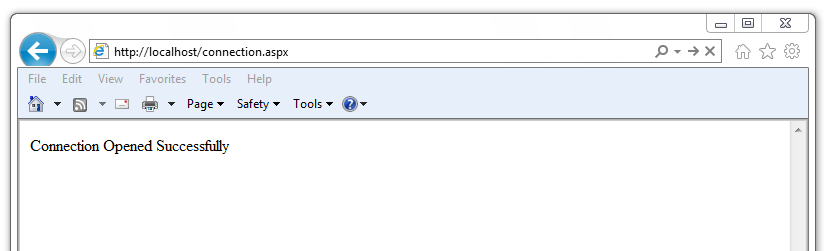

<div id="opening_a_database_connection" class="registered_link"></div>

An `EDBConnection` object is responsible for handling the communication between an instance of Advanced Server and a .NET application. Before you can access data stored in an Advanced Server database, you must create and open an `EDBConnection`.

The examples that follow demonstrate the basic steps for connecting to an instance of Advanced Server. You must:

1.  Import the namespace `EnterpriseDB.EDBClient`.
2.  Create an instance of `EDBConnection`.
3.  Initialize the `EDBConnection` object by passing a connection string as a parameter to the constructor for the `EDBConnection` class.
4.  Call the `Open` method of the `EDBConnection` object to open the connection.

<div id="connection_string_parameters" class="registered_link"></div>

## Connection String Parameters

A valid connection string should specify location and authentication information for an Advanced Server instance. You must provide the connection string before opening the connection. A connection string must contain:

-   The name or IP address of the server
-   The name of the Advanced Server database
-   The name of an Advanced Server user
-   The password associated with that user

The following parameters may be included in the connection string:

`CommandTimeout`

 `CommandTimeout` specifies the length of time (in seconds) to wait for a command to finish execution before throwing an exception. The default value is `20`.

`ConnectionLifeTime`

 Use `ConnectionLifeTime` to specify the length of time (in seconds) to wait before closing unused connections in the pool. The default value is `15`.

`Database`

 Use the `Database` parameter to specify the name of the database to which the application should connect. If a database name is not specified, the database name will default to the name of the connecting user.

`Encoding`

 The `Encoding` parameter is obsolete; the parameter always returns the string unicode, and silently ignores attempts to set it.

`Integrated Security`

 By default, `Integrated Security` is set to `false`, and Windows Integrated Security is disabled. Specify a value of `true` to use Windows Integrated Security.

`Load Role Based Tables`

 Use `Load Role Based Tables` to load table OIDs based on role. This change only impacts the loading of table type OID, and not the composite type. The default value is `false`. Setting this parameter to `true` triggers the new functionality.

`MaxPoolSize`

 `MaxPoolSize` instructs `EDBConnection` to dispose of pooled connections when the pool exceeds the specified number of connections. The default value is `20`.

`MinPoolSize`

 `MinPoolSize` instructs `EDBConnection` to pre-allocate the specified number of connections with the server. The default value is `1`.

`Password`

 When using clear text authentication, specify the password that will be used to establish a connection with the server.

`Pooling`

 By default, `Pooling` is set to `true` to enable connection pooling. Specify a value of `false` to disable connection pooling.

`Port`

 The `Port` parameter specifies the port to which the application should connect.

`Protocol`

 The specific protocol version to use (instead of automatic); specify an integer value of 2 or 3.

`SearchPath`

 Use the `SearchPath` parameter to change the search path to named and public schemas.

`Server`

 The name or IP address of the Advanced Server host.

`SSL`

 By default, `SSL` is set to `false`; specify a value of `true` to attempt a secure connection.

`sslmode`

 Use `sslmode` to specify an SSL connection control preference. `sslmode` can be:

 `prefer` - Use SSL if possible.

 `require` - Throw an exception if an SSL connection cannot be established.

 `allow` - Connect without SSL. This parameter is not supported.

 `disable` - Do not attempt an SSL connection. This is the default behavior.

`SyncNotification`

 Use the `SyncNotification` parameter to specify that `EDBDataprovider` should use synchronous notifications. The default value is `false`.

`Timeout`

 `Timeout` specifies the length of time (in seconds) to wait for an open connection. The default value is `15`.

`User Id`

 The `User Id` parameter specifies the user name that should be used for the connection.

## Example - Opening a Database Connection using ASP.NET

The following example demonstrates how to open a connection to an instance of Advanced Server and then close the connection. The connection is established using the credentials specified in the `DB_CONN_STRING` configuration parameter (see [Using the .Net Connector](05_using_the_net_connector/#using_the_net_connector) for an introduction to connection information and also see [Connection String Parameters](#connection-string-parameters) for connection parameters).

```Text
<% @ Page Language="C#" %>
<% @Import Namespace="EnterpriseDB.EDBClient" %>
<% @Import Namespace="System.Configuration" %>

<script language="C#" runat="server">

private void Page_Load(object sender, System.EventArgs e)
{
  string strConnectionString = ConfigurationManager.AppSettings
    ["DB_CONN_STRING"];

  EDBConnection conn = new EDBConnection(strConnectionString);

  try
  {
    conn.Open();
    Response.Write("Connection opened successfully");
  }

  catch(EDBException exp)
  {
    exp.ToString();
  }

  finally
  {
    conn.Close();
  }
}

</script>
```

If the connection is successful, a browser will display the following:



Connection Opened Successfully

## Example - Opening a Database Connection from a Console Application

The following example opens a connection with an Advanced Server database using a console-based application.

Before writing the code for the console application, create an `app.config` file that stores the connection string to the database. Using a configuration file makes it convenient to update the connection string if the information changes.

```Text
<?xml version="1.0" encoding="utf-8" ?>
<configuration>
  <appSettings>
      <add key="DB_CONN_STRING" value = "Server=127.0.0.1;Port=5444;
      User Id=enterprisedb;Password=enterprisedb;Database=edb"/>
  </appSettings>
</configuration>
```

Using your text editor of choice, enter the following code sample into a file:

```Text
using System;
using System.Data;
using EnterpriseDB.EDBClient;
using System.Configuration;

namespace EnterpriseDB
{

  class EDB
  {

    static void Main(string[] args)
    {
         string strConnectionString = ConfigurationManager.AppSettings
        ["DB_CONN_STRING"];

       EDBConnection conn = new EDBConnection(strConnectionString);

        try
        {
        conn.Open();
        Console.WriteLine("Connection Opened Successfully");
        }

        catch(Exception exp)
        {
        throw new Exception(exp.ToString());
        }

        finally
        {
      conn.Close();
        }
     }
  }
}
```

Save the file as `EDBConnection-Sample.cs` and compile it with the following command:

`csc /r:EnterpriseDB.EDBClient.dll /out:Console.exe EDBConnection-Sample.cs`

Compiling the sample should generate a `Console.exe` file; you can execute the sample code by entering `Console.exe`. When executed, the console should verify that the:

 `Connection Opened Successfully`

## Example - Opening a Database Connection from a Windows Form Application

The following example demonstrates opening a database connection using a .NET WinForm application. To use the example, save the following code as `WinForm-Example.cs` in a directory that contains the library files.

```Text
using System;
using System.Windows.Forms;
using System.Drawing;
using EnterpriseDB.EDBClient;

namespace EDBTestClient
{

  class Win_Conn
  {
      static void Main(string[] args)
      {
          Form frmMain = new Form();
          Button btnConn = new Button();
          btnConn.Location = new System.Drawing.Point(104, 64);
          btnConn.Name = "btnConn";
          btnConn.Text = "Open Connection";
          btnConn.Click += new System.EventHandler(btnConn_Click);

          frmMain.Controls.Add(btnConn);
          frmMain.Text = "EnterpriseDB";

          Application.Run(frmMain);
      }

      private static void btnConn_Click(object sender, System.EventArgs e)
      {
          EDBConnection conn = null;
          try
          {
              string connectionString = "Server=10.90.1.29;port=5444;
              username=edb;password=edb;database=edb";
              conn = new EDBConnection(connectionString);
              conn.Open();
              MessageBox.Show("Connection Open");
          }
          catch(EDBException exp)
          {
              MessageBox.Show(exp.ToString());
          }
          finally
          {
              conn.Close();
          }
      }
  }
}
```

Note that you must change the database connection string to point to the database that you want to connect to before compiling the file with the following command:

`csc /r:EnterpriseDB.EDBClient.dll /out:WinForm.exe WinForm-Example.cs`

This command should generate a `WinForm.exe` file within the same folder that the executable was compiled under. Invoking the executable will display:


A successful connection
