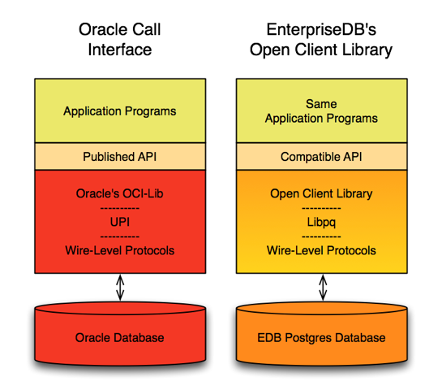

The Open Client Library provides application interoperability with the Oracle Call Interface - an application that was formerly locked in can now work with either an EDB Postgres Advanced Server or an Oracle database with minimal to no changes to the application code.

The following diagram compares the Open Client Library and Oracle Call Interface application stacks.

The EDB implementation of the Open Client Library is written in C.

installing\_and\_configuring\_the\_ocl\_connector forming\_a\_connection\_string compiling\_and\_linking\_a\_program ref\_cursor\_support ocl\_function\_reference ocl\_error\_codes\_reference multithreading\_support

