The following table describes the connection properties that you can specify through the dialogs in the graphical connection manager tools, or in the `odbc.ini` file that defines a named data source. The columns identify the connection property (as it appears in the ODBC Administrator dialogs), the corresponding keyword (as it appears in the `odbc.ini` file), the default value of the property, and a description of the connection property.

| Property                                  | Keyword name                                          | Default value     | Description                                                                                                                                                                                                                                                                                                                                                                                                                                                                                                                                                                                                                                                                                                                                                                                                                                                                                                                                                                                                       |
| ----------------------------------------- | ----------------------------------------------------- | ----------------- | ----------------------------------------------------------------------------------------------------------------------------------------------------------------------------------------------------------------------------------------------------------------------------------------------------------------------------------------------------------------------------------------------------------------------------------------------------------------------------------------------------------------------------------------------------------------------------------------------------------------------------------------------------------------------------------------------------------------------------------------------------------------------------------------------------------------------------------------------------------------------------------------------------------------------------------------------------------------------------------------------------------------- |
| Database                                  | Database                                              | None              | The name of the database to which you are connecting.                                                                                                                                                                                                                                                                                                                                                                                                                                                                                                                                                                                                                                                                                                                                                                                                                                                                                                                                                             |
| Driver                                    | Driver                                                | EDB-ODBC          | The name of the ODBC driver.                                                                                                                                                                                                                                                                                                                                                                                                                                                                                                                                                                                                                                                                                                                                                                                                                                                                                                                                                                                      |
| Server                                    | Servername                                            | Localhost         | The name or IP address of the server that you are connecting to.                                                                                                                                                                                                                                                                                                                                                                                                                                                                                                                                                                                                                                                                                                                                                                                                                                                                                                                                                  |
| dbms_name                                 | dbms_name                                             | EnterpriseDB      | Database system. Either EnterpriseDB or PostgreSQL.                                                                                                                                                                                                                                                                                                                                                                                                                                                                                                                                                                                                                                                                                                                                                                                                                                                                                                                                                               |
| Description                               | Description                                           |                   | Descriptive name of the data source.                                                                                                                                                                                                                                                                                                                                                                                                                                                                                                                                                                                                                                                                                                                                                                                                                                                                                                                                                                              |
| User Name                                 | Username                                              |                   | The name of the user that this data source uses to connect to the server.                                                                                                                                                                                                                                                                                                                                                                                                                                                                                                                                                                                                                                                                                                                                                                                                                                                                                                                                         |
| Password                                  | Password                                              |                   | The password of the user associated with this named data source.                                                                                                                                                                                                                                                                                                                                                                                                                                                                                                                                                                                                                                                                                                                                                                                                                                                                                                                                                  |
| CPTimeout                                 | CPTimeout                                             | 0                 | Number of seconds before a connection times out (in a connection pooling environment).                                                                                                                                                                                                                                                                                                                                                                                                                                                                                                                                                                                                                                                                                                                                                                                                                                                                                                                            |
| Port                                      | Port                                                  | 5444              | The TCP port that the postmaster is listening on.                                                                                                                                                                                                                                                                                                                                                                                                                                                                                                                                                                                                                                                                                                                                                                                                                                                                                                                                                                 |
| Protocol                                  | Protocol                                              | 7.4               | If specified, forces the driver to use the given protocol version.                                                                                                                                                                                                                                                                                                                                                                                                                                                                                                                                                                                                                                                                                                                                                                                                                                                                                                                                                |
| Level of Rollback on Errors               | Use the Protocol option to specify rollback behavior. | Transaction Level | Specifies how the driver handles errors:  0 - Don't rollback  1 - Rollback the transaction  2 - Rollback the statement                                                                                                                                                                                                                                                                                                                                                                                                                                                                                                                                                                                                                                                                                                                                                                                                                                                              |
| Usage Count                               | UsageCount                                            | 1                 | The number of installations using this driver.                                                                                                                                                                                                                                                                                                                                                                                                                                                                                                                                                                                                                                                                                                                                                                                                                                                                                                                                                                    |
| Read Only                                 | ReadOnly                                              | No                | Specifies that the connection is READONLY.                                                                                                                                                                                                                                                                                                                                                                                                                                                                                                                                                                                                                                                                                                                                                                                                                                                                                                                                                                        |
| Show System Tables                        | ShowSystemTables                                      | No                | If enabled, the driver reports system tables in the result set of the SQLTables() function.                                                                                                                                                                                                                                                                                                                                                                                                                                                                                                                                                                                                                                                                                                                                                                                                                                                                                                                       |
| OID Options: Show Column                  | ShowOidColumn                                         | No                | If enabled, the SQLColumns() function reports the OID column.                                                                                                                                                                                                                                                                                                                                                                                                                                                                                                                                                                                                                                                                                                                                                                                                                                                                                                                                                     |
| OID Options: Fake Index                   | FakeOidIndex                                          | No                | If enabled, the SQLStatistics() function reports that a unique index exists on each OID column.                                                                                                                                                                                                                                                                                                                                                                                                                                                                                                                                                                                                                                                                                                                                                                                                                                                                                                                   |
| Keyset Query Optimization                 | Ksqo                                                  | On                | If enabled, enforces server-side support for keyset queries (generated by the MS Jet database engine).                                                                                                                                                                                                                                                                                                                                                                                                                                                                                                                                                                                                                                                                                                                                                                                                                                                                                                            |
| Recognize Unique Indexes                  | UniqueIndex                                           | On                | If enabled, the SQLStatistics() function will report unique indexes. If not enabled, the SQLStatistics() function reports that indexes allow duplicate values.                                                                                                                                                                                                                                                                                                                                                                                                                                                                                                                                                                                                                                                                                                                                                                                                                                                    |
| Use Declare/Fetch                         | UseDeclareFetch                                       | Off               | If enabled, the driver will use server-side cursors. To enable UseDeclareFetch, specify a value of 1; to disable UseDeclareFetch, specify a value of 0.                                                                                                                                                                                                                                                                                                                                                                                                                                                                                                                                                                                                                                                                                                                                                                                                                                                           |
| CommLog                                   | CommLog                                               | Off               | If enabled, records all client/server traffic in a log file.                                                                                                                                                                                                                                                                                                                                                                                                                                                                                                                                                                                                                                                                                                                                                                                                                                                                                                                                                      |
| Parse Statements                          | Parse                                                 | Off               | If enabled, the driver parses simple SELECT statements when you call the SQLNumResultCols(), SQLDescribeCol() or SQLColAttributes() functions.                                                                                                                                                                                                                                                                                                                                                                                                                                                                                                                                                                                                                                                                                                                                                                                                                                                                    |
| Cancel as FreeStmt                        | CancelAsFreeStmt                                      | Off               | If enabled, the SQLCancel() function will call SQLFreeStmt(SQL_Close) on your behalf.                                                                                                                                                                                                                                                                                                                                                                                                                                                                                                                                                                                                                                                                                                                                                                                                                                                                                                                             |
| MyLog                                     | Debug                                                 | Off               | If enabled, the driver records its work in a log file. On Windows, the file name is C:m[ylog](<>)&lt;process-id>; and on Linux the file name is /tmp/[mylog](<>)&lt;username>&lt;process-id>.log.                                                                                                                                                                                                                                                                                                                                                                                                                                                                                                                                                                                                                                                                                                                                                                                                                 |
| Unknown Sizes                             | UnknownSizes                                          | Maximum           | Determines how the SQLDescribeCol() and SQLColAttributes() functions compute the size of a column. Specify 0 to force the driver to report the maximum size allowed for the type; specify 1 to force the driver to report an unknown length or 2 to force the driver to search the result set to find the longest value. Do not specify 2 if you have enabled UseDeclareFetch.                                                                                                                                                                                                                                                                                                                                                                                                                                                                                                                                                                                                                                    |
| Text as LongVarchar                       | TextAsLongVarChar                                     | 8190              | If enabled, the driver treats TEXT columns as if they are of type SQL_LONGVARCHAR. If disabled, the driver treats TEXT columns as SQL_VARCHAR values.                                                                                                                                                                                                                                                                                                                                                                                                                                                                                                                                                                                                                                                                                                                                                                                                                                                             |
| Unknown as Long Varchar                   | LongVarChar                                           | False             | If enabled, the driver treats values of unknown type as SQL_LONGVARCHAR values. If unchecked, the driver will treat values of unknown type as SQL_VARCHAR values. By default, values of unknown type are treated as Y values.                                                                                                                                                                                                                                                                                                                                                                                                                                                                                                                                                                                                                                                                                                                                                                                     |
| Bools as Char                             | BoolsAsChar                                           | On                | If enabled, the driver treats BOOL columns as SQL_CHAR values. If disabled, BOOL columns are treated as SQL_BIT values.                                                                                                                                                                                                                                                                                                                                                                                                                                                                                                                                                                                                                                                                                                                                                                                                                                                                                           |
| Max Varchar                               | MaxVarcharSize                                        | 255               | If enabled, the driver treats VARCHAR and BPCHAR values longer than MaxVarCharSize as SQL_LONGVARCHAR values                                                                                                                                                                                                                                                                                                                                                                                                                                                                                                                                                                                                                                                                                                                                                                                                                                                                                                      |
| Max Long Varchar Size                     | MaxLongVarcharSize                                    | 8190              | If TextAsLongVarChar is on, the driver reports TEXT values are MaxLongVarcharSize bytes long.  If UnknownAsLongVarChar is on, columns of unknown type are MaxLongVarcharSize bytes long; otherwise, they are reported to be MaxVarcharSize bytes in length.                                                                                                                                                                                                                                                                                                                                                                                                                                                                                                                                                                                                                                                                                                                                             |
| Cache Size                                | Fetch                                                 | 100               | Determines the number of rows fetched by the driver when UseDeclareFetch is enabled.                                                                                                                                                                                                                                                                                                                                                                                                                                                                                                                                                                                                                                                                                                                                                                                                                                                                                                                              |
| SysTable Prefixes                         | ExtraSysTablePrefixes                                 | [dd](<>);         | Use the SysTablePrefixes field to specify a semi-colon delimited list of prefixes that indicate that a table is a system table. By default, the list contains [dd](<>);.                                                                                                                                                                                                                                                                                                                                                                                                                                                                                                                                                                                                                                                                                                                                                                                                                                          |
| Cumulative Row Count for Insert           | MapSqlParcNoBatch                                     | Off/0             | If enabled, the SQLRowCount() function will return a single, cumulative row count for the entire array of parameter settings for an INSERT statement. If disabled, an individual row count will be returned for each parameter setting. By default, this option is disabled.                                                                                                                                                                                                                                                                                                                                                                                                                                                                                                                                                                                                                                                                                                                                      |
| LF&lt;-> CR/LF conversion                 | LFConversion                                          | System Dependent  | The LF&lt;->CR/LF conversion option instructs the driver to convert line-feed characters to carriage-return/line-feed pairs when fetching character values from the server and convert carriage-return/line-feed pairs back to line-feed characters when sending character values to the server. By default, this option is enabled.                                                                                                                                                                                                                                                                                                                                                                                                                                                                                                                                                                                                                                                                              |
| Updatable Cursors                         | UpdatableCursors                                      | Off               | Permits positioned UPDATE and DELETE operations using the SQLSetPos() or SQLBulkOperations() functions.                                                                                                                                                                                                                                                                                                                                                                                                                                                                                                                                                                                                                                                                                                                                                                                                                                                                                                           |
| Bytea as Long VarBinary                   | ByteaAsLongVarBinary                                  | Off               | If enabled, the driver treats BYTEA values as if they are of type SQL_LONGVARBINARY. If disabled, BYTEA values are treated as SQL_VARBINARY values.                                                                                                                                                                                                                                                                                                                                                                                                                                                                                                                                                                                                                                                                                                                                                                                                                                                               |
| Bytea as LO                               | ByteaAsLO                                             | False             | If enabled, the driver treats BYTEA values as if they are large objects.                                                                                                                                                                                                                                                                                                                                                                                                                                                                                                                                                                                                                                                                                                                                                                                                                                                                                                                                          |
| Row versioning                            | RowVersioning                                         | Off               | The Row Versioning option specifies if the driver should include the xmin column when reporting the columns in a table. The xmin value is the ID of the transaction that created the row. You must use row versioning if you plan to create cursors where SQL_CONCURRENCY = SQL_CONCUR_ROWVER.                                                                                                                                                                                                                                                                                                                                                                                                                                                                                                                                                                                                                                                                                                                    |
| Disallow Premature                        | DisallowPremature                                     | No/0              | Determines driver behavior if you try to retrieve information about a query without executing the query. If Yes, the driver declares a cursor for the query and fetches the meta-data from the cursor. If No, the driver executes the command as soon as you request any meta-data.                                                                                                                                                                                                                                                                                                                                                                                                                                                                                                                                                                                                                                                                                                                               |
| True is -1                                | TrueIsMinus1                                          | Off/0             | TrueIsMinus1 tells the driver to return BOOL values of TRUE as -1. If this option is not enabled, the driver will return BOOL values of TRUE as 1. The driver always returns BOOL values of FALSE as 0.                                                                                                                                                                                                                                                                                                                                                                                                                                                                                                                                                                                                                                                                                                                                                                                                           |
| Server side prepare                       | UseServerSidePrepare                                  | No/0              | If enabled, the driver uses the PREPARE and EXECUTE commands to implement the Prepare/Execute model.                                                                                                                                                                                                                                                                                                                                                                                                                                                                                                                                                                                                                                                                                                                                                                                                                                                                                                              |
| Use GSSAPI for GSS request                | GssAuthUseGSS                                         | False/0           | If set to True/1, the driver will send a GSSAPI authentication request to the server. Windows only.                                                                                                                                                                                                                                                                                                                                                                                                                                                                                                                                                                                                                                                                                                                                                                                                                                                                                                               |
| Int8 As                                   | BI                                                    | 0                 | The value of BI determines how the driver treats BIGINT values:  If -5 as a SQL_BIGINT,  If 2 as a SQL_NUMERIC,  If 8 as a SQL_DOUBLE,  If 4 as a SQL_INTEGER,  If 12 as a SQL_VARCHAR,  If 0 (on an MS Jet client), as a SQL_NUMERIC,  If 0 on any other client, as a SQL_BIGINT.                                                                                                                                                                                                                                                                                                                                                                                                                                                                                                                                                                                                                                                          |
| Extra options  Connect Settings | AB  ConnSettings                            | 0x0               | 0x1 - Forces the output of short-length formatted connection strings. Specify this option if you are using the MFC CDatabase class.  0x2 - Allows MS Access to recognize PostgreSQL's serial type as AutoNumber type.  0x4 - Return ANSI character types for the inquiries from applications. Specify this option for applications that have difficulty handling Unicode data.  0x8 - If set, NULL dates are reported as empty strings and empty strings are interpreted as NULL dates on input.  0x10 - Determines if SQLGetInfo returns information about all tables, or only accessible tables. If set, only information is returned for accessible tables.  0x20 - If set, each SQL command is processed in a separate network round-trip, otherwise, SQL commands are grouped into as few round-trips as possible to reduce network latency. Contains a semicolon-delimited list of SQL commands that are executed when the driver connects to the server. |
|                                           | Socket                                                | 4096              | Specifies the buffer size that the driver uses to connect to the client.                                                                                                                                                                                                                                                                                                                                                                                                                                                                                                                                                                                                                                                                                                                                                                                                                                                                                                                                          |
|                                           | Lie                                                   | Off               | If enabled, the driver claims to support unsupported ODBC features.                                                                                                                                                                                                                                                                                                                                                                                                                                                                                                                                                                                                                                                                                                                                                                                                                                                                                                                                               |
| Lowercase Identifier                      | LowerCaseIdentifier                                   | Off               | If enabled, the driver translates identifiers to lowercase.                                                                                                                                                                                                                                                                                                                                                                                                                                                                                                                                                                                                                                                                                                                                                                                                                                                                                                                                                       |
| Disable Genetic Optimizer                 | Optimizer                                             | Yes/1             | Disables the genetic query optimizer.                                                                                                                                                                                                                                                                                                                                                                                                                                                                                                                                                                                                                                                                                                                                                                                                                                                                                                                                                                             |
| Allow Keyset                              | UpdatableCursors                                      | Yes/1             | Allow Keyset driven cursors                                                                                                                                                                                                                                                                                                                                                                                                                                                                                                                                                                                                                                                                                                                                                                                                                                                                                                                                                                                       |
| SSL mode                                  | SSLMode                                               | Disabled          | If libpq (and its dependencies) are installed in the same directory as the EDB-ODBC driver, enabling SSL Mode allows you to use SSL and other utilities.                                                                                                                                                                                                                                                                                                                                                                                                                                                                                                                                                                                                                                                                                                                                                                                                                                                          |
| Force Abbreviated Connection String       | CX                                                    | No/0              | Enables the option to force abbreviation of connection string.                                                                                                                                                                                                                                                                                                                                                                                                                                                                                                                                                                                                                                                                                                                                                                                                                                                                                                                                                    |
| Fake MSS                                  | FakeOidIndex                                          | No/0              | Impersonates MS SQL Server enabling MS Access to recognize PostgreSQLs serial type as AutoNumber type.                                                                                                                                                                                                                                                                                                                                                                                                                                                                                                                                                                                                                                                                                                                                                                                                                                                                                                           |
| BDE Environment                           | BDE                                                   | No/0              | Enabling this option tunes EDB-ODBC to cater to Borland Database Engine compliant output (related to Unicode).                                                                                                                                                                                                                                                                                                                                                                                                                                                                                                                                                                                                                                                                                                                                                                                                                                                                                                    |
| XA_Opt                                    | INI_XAOPT                                             | Yes/1             | If enabled, calls to SQL_TABLES only include user-accessible tables.                                                                                                                                                                                                                                                                                                                                                                                                                                                                                                                                                                                                                                                                                                                                                                                                                                                                                                                                              |

## Adding a Data Source Definition in Windows

The Windows ODBC `Data Source Administrator` is a graphical interface that creates named data sources. You can open the `ODBC Data Source Administrator` by navigating to the `Control Panel`, opening the `Administrative Tools` menu, and double-clicking the appropriate `ODBC Data Sources` icon (`32- or 64- bit`).

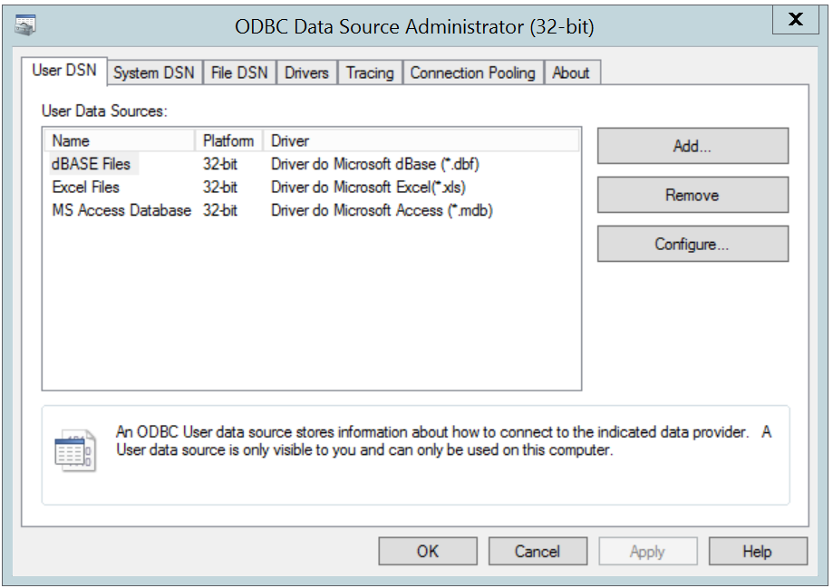

The Windows Data Source Administrator

Click the `Add` button to open the `Create New Data Source` dialog. Choose `EnterpriseDB (ANSI)` or `EnterpriseDB (UNICODE)` from the list of drivers and click `Finish`.

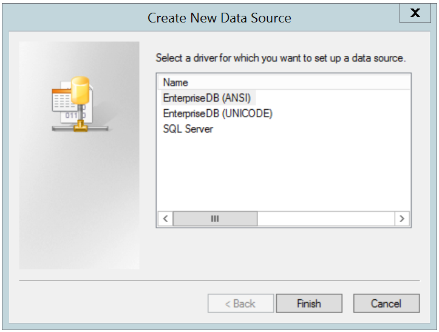

The Create New Data Source dialog

The EnterpriseDB ODBC Driver dialog opens.

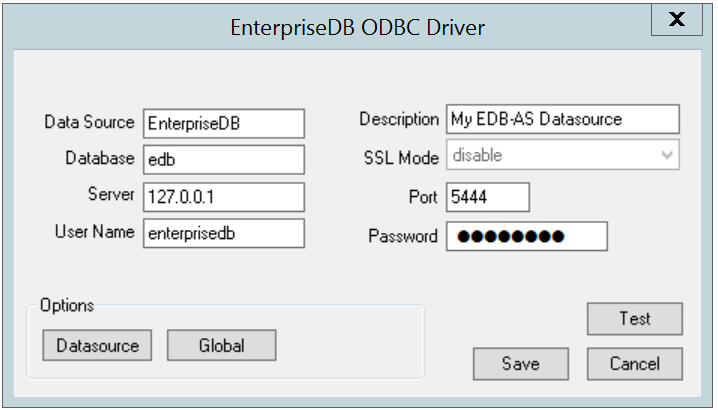

Define the data source

Use the fields on the dialog to define the named data source:

-   Enter the Database name in the `Database` field.
-   Enter the host name or IP address of Advanced Server in the `Server` field.
-   Enter the name of a user in the `User Name` field.
-   Enter a descriptive name for the named data source in the `Description` field.
-   If libpq is installed in the same directory as the EDB-ODBC driver, the drop-down listbox next to the `SSL Mode` label will be active, allowing you to use SSL and other Advanced Server utilities.
-   Accept the default port number (5444), or enter an alternative number in the `Port` field.
-   Enter the password of the user in the `Password` field.

Use the `Datasource` button (located in the `Options` box) to open the `Advanced Options` dialog and specify connection properties.

The `Global` button opens a dialog on which you can specify logging options for the EDB-ODBC driver (not the data source, but the driver itself).

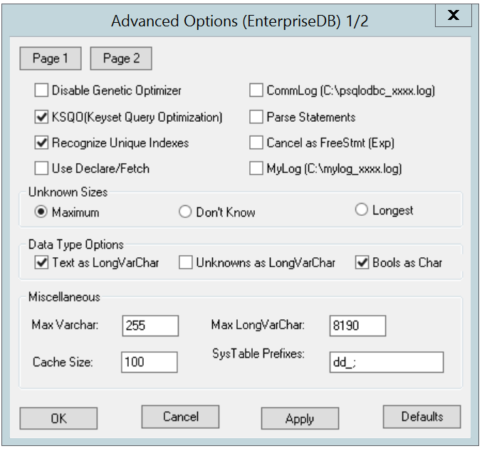

Page 1 of the Advanced Options dialog

-   Check the box next to `Disable Genetic Optimizer` to disable the genetic query optimizer. By default, the query optimizer is `on`.
-   Check the box next to `KSQO (Keyset Query Optimization)` to enable server-side support for keyset queries. By default, `Keyset Query Optimization` is `on`.
-   Check the box next to `Recognize Unique Indexes` to force the `SQLStatistics()` function to report unique indexes; if the option is not checked, the `SQLStatistics()` function will report that all indexes allow duplicate values. By default, `Recognize Unique Indexes` is `on`.
-   Check the box next to `Use Declare/Fetch` to specify that the driver should use server-side cursors whenever your application executes a `SELECT` command. By default, `Use Declare/Fetch` is `off`.
-   Check the box next to `CommLog (C:\psqlodbc_xxxx.log)` to record all client/server traffic in a log file. By default, logging is `off`.
-   Check the box next to `Parse Statements` to specify that the driver (rather than the server) should attempt to parse simple `SELECT` statements when you call the `SQLNumResultCols()`, `SQLDescribeCol()`, or `SQLColAttributes()` function. By default, this option is `off`.
-   Check the box next to `Cancel as FreeStmt (Exp)` to specify that the `SQLCancel()` function should call `SQLFreeStmt(SQLClose)` on your behalf. By default, this option is `off`.
-   Check the box next to `MyLog (C:\mylog_xxxx.log)` to record a detailed record of driver activity in a log file. The log file is named `c:\mylog\_\ *process-id*.log`. By default, logging is `off`.

The radio buttons in the Unknown Sizes box specify how the `SQLDescribeCol()` and `SQLColAttributes()` functions compute the size of a column of unknown type (see Section `Supported Data Types` for a list of known data types).

-   Choose the button next to `Maximum` to specify that the driver report the maximum size allowed for a `VARCHAR` or `LONGVARCHAR` (dependent on the `Unknowns as LongVarChar` setting). If `Unknowns as LongVarChar` is enabled, the driver returns the maximum size of a `LONGVARCHAR` (specified in the `Max LongVarChar` field in the `Miscellaneous` box). If `Unknowns as LongVarChar` is not enabled, the driver returns the size specified in the `Max VarChar` field (in the `Miscellaneous` box).
-   Choose the button next to `Dont know` to specify that the driver report a length of "unknown".
-   Choose the button next to `Longest` to specify that the driver search the result set and report the longest value found. (Note: you should not specify `Longest` if `UseDeclareFetch` is enabled.)

The properties in the `Data Type Options` box determine how the driver treats columns of specific types:

-   Check the box next to `Text as LongVarChar` to treat `TEXT` values as if they are of type `SQL_LONGVARCHAR`. If the box is not checked, the driver will treat `TEXT` values as `SQL_VARCHAR` values. By default, `TEXT` values are treated as `SQL_LONGVARCHAR` values.
-   Check the box next to `Unknowns as LongVarChar` to specify that the driver treat values of unknown type as `SQL_LONGVARCHAR` values. If unchecked, the driver will treat values of unknown type as `SQL_VARCHAR` values. By default, values of unknown type are treated as `SQL_VARCHAR` values.
-   Check the box next to `Bools as Char` to specify that the driver treat `BOOL` values as `SQL_CHAR` values. If unchecked, `BOOL` values are treated as `SQL_BIT` values. By default, `BOOL` values are treated as `SQL_CHAR` values.

You can specify values for some of the properties associated with the named data source in the fields in the `Miscellaneous` box:

-   Indicate the maximum length allowed for a `VARCHAR` value in the Max `VarChar` field. By default, this value is set to `255`.
-   Enter the maximum length allowed for a `LONGVARCHAR` value in the Max `LongVarChar` field. By default, this value is set to `8190`.
-   Specify the number of rows fetched by the driver (when `UseDeclareFetch` is enabled) in the `Cache Size` field. The default value is `100`.
-   Use the `SysTablePrefixes` field to specify a semi-colon delimited list of prefixes that indicate that a table is a system table. By default, the list contains `dd_`;.

You can reset the values on this dialog to their default settings by choosing the `Defaults` button.

Click the `Apply` button to apply any changes to the data source properties, or the `Cancel` button to exit the dialog without applying any changes. Choose the `OK` button to apply any changes to the dialog and exit.

Select the `Page 2` button (in the upper-left hand corner of the `Advanced Options` dialog) to access a second set of advanced options.

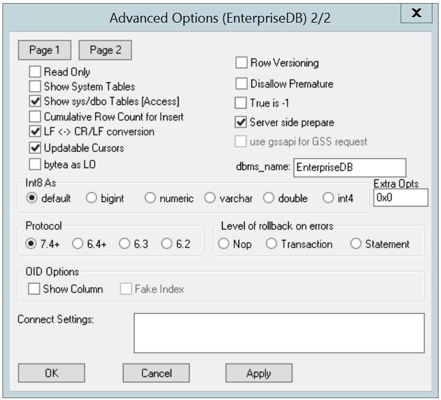

Page 2 of the Advanced Options dialog

-   Check the box next to `Read Only` to prevent the driver from executing the following commands: `INSERT`, `UPDATE`, `DELETE`, `CREATE`, `ALTER`, `DROP`, `GRANT`, `REVOKE` or `LOCK`. Invoking the `Read Only` option also prevents any calls that use ODBCs procedure call escape syntax (`call=procedure-name?`). By default, this option is `off`.
-   Check the box next to `Show System Tables` to include system tables in the result set of the `SQLTables()` function. If the option is enabled, the driver will include any table whose name starts with `pg\_` or any of the prefixes listed in the `SysTablePrefixes` field of `Page 1` of the `Advanced Options` dialog. By default, this option is `off`.
-   Check the box next to `Show sys/dbo Tables [Access]` to access objects in the `sys` schema and `dbo` schema through the ODBC data source. By default, this option is enabled (checked).
-   Check the box next to `Cumulative Row Count for Insert` to cause a single, cumulative row count to be returned for the entire array of parameter settings for an `INSERT` statement when a call to the `SQLRowCount()` method is performed. If this option is not enabled (the box is not checked), then an individual row count is available for each parameter setting in the array, and thus, a call to `SQLRowCount()` returns the count for the last inserted row.
-   Check the box next to `LF<->CR/LF` conversion to instruct the driver to convert line-feed characters to carriage-return/line-feed pairs when fetching character values from the server and convert carriage-return/line-feed pairs back to line-feed characters when sending character values to the server. By default, this option is enabled.
-   Check the box next to `Updatable Cursors` to specify that the driver should permit positioned `UPDATE` and `DELETE` operations with the `SQLSetPos()` or `SQLBulkOperations()` functions. By default, this option is enabled.
-   Check the box next to `bytea as LO` to specify that the driver should treat `BYTEA` values as if they are `SQL_LONGVARBINARY` values. If the box is not checked, EDB-ODBC will treat `BYTEA` values as if they are `SQL_VARBINARY` values. By default, `BYTEA` values are treated as `SQL_VARBINARY` values.
-   Check the box next to `Row Versioning` to include the `xmin` column when reporting the columns in a table. The `xmin` column is the ID of the transaction that created the row. You must use row versioning if you plan to create cursors where `SQL_CONCURRENCY = SQL_CONCUR_ROWVER`. By default, `Row Versioning` is `off`.
-   Check the box next to `Disallow Premature` to specify that the driver should retrieve meta-data about a query (i.e., the number of columns in a result set, or the column types) without actually executing the query. If this option is not specified, the driver executes the query when you request meta-data about the query. By default, `Disallow Premature` is off.
-   Check the box next to `True is -1` to tell the driver to return `BOOL` values of `True` as a `-1`. If this option is not enabled, the driver will return `BOOL` values of `True` as `1`. The driver always returns `BOOL` values of `False` as `0`.
-   Check the box next to `Server side prepare` to tell the driver to use the `PREPARE` and `EXECUTE` commands to implement the `Prepare/Execute` model. By default, this box is checked.
-   Check the box next to `use gssapi for GSS request` to instruct the driver to send a GSSAPI connection request to the server.
-   Enter the database system (either `EnterpriseDB` or `PostgreSQL`) in the `dbms_name` field. The value entered here is returned in the `SQL_DBMS_NAME` argument when the `SQLGetInfo()` function is called. The default is `EnterpriseDB`.

Use the radio buttons in the `Int8` As box to specify how the driver should return `BIGINT` values to the client. Select the radio button next to `default` to specify the default type of `NUMERIC` if the client is MS Jet, `BIGINT` if the client is any other ODBC client. You can optionally specify that the driver return `BIGINT` values as a `bigint (SQL_BIGINT)`, `numeric (SQL_NUMERIC)`, `varchar (SQL_VARCHAR)`, `double (SQL_DOUBLE)`, or `int4 (SQL_INTEGER)`.

The default value of the `Extra Opts` field is `0x0`. `Extra Opts` may be:

| Option | Specifies                                                                                                                                                                  |
| ------ | -------------------------------------------------------------------------------------------------------------------------------------------------------------------------- |
| 0x1    | Forces the output of short-length formatted connection string. Select this option when you are using the MFC CDatabase class.                                              |
| 0x2    | Allows MS Access to recognize PostgreSQL's serial type as AutoNumber type.                                                                                                 |
| 0x4    | Return ANSI character types for the inquiries from applications. Select this option for applications that have difficulty handling Unicode data.                           |
| 0x8    | If set, NULL dates are reported as empty strings and empty strings are interpreted as NULL dates on input.                                                                 |
| 0x10   | Determines if SQLGetInfo returns information about all tables, or only accessible tables. If set, only information is returned for accessible tables.                      |
| 0x20   | If set, each SQL command is processed in a separate network round-trip, otherwise, SQL commands are grouped into as few round-trips as possible to reduce network latency. |

The `Protocol` box contains radio buttons that tell the driver to interact with the server using a specific front-end/back-end protocol version. By default, the `Protocol` selected is `7.4+`; you can optionally select from versions `6.4+`, `6.3` or `6.2`.

The `Level of Rollback on errors` box contains radio buttons that specify how the driver handles error handling:

| Option      | Specifies                                                                                                                  |
| ----------- | -------------------------------------------------------------------------------------------------------------------------- |
| Transaction | If the driver encounters an error, it will rollback the current transaction.                                               |
| Statement   | If the driver encounters an error, it will rollback the current statement.                                                 |
| Nop         | If the driver encounters an error, you must manually rollback the current transaction before the application can continue. |

The `OID Options` box contains options that control the way the driver exposes the OID column contained in some tables:

-   Check the box next to `Show Column` to include the `OID` column in the result set of the `SQLColumns()` function. If this box is not checked, the `OID` column is hidden from `SQLColumns()`.
-   Check the box next to `Fake Columns` to specify that the `SQLStatistics()` function should report that a unique index exists on each `OID` column.

Use the `Connect Settings` field to specify a list of parameter assignments that the driver will use when opening this connection. Any configuration parameter that you can modify with a `SET` statement can be included in the semi-colon delimited list. For example:

`set search_path to company1,public;`

When youve defined the connection properties for the named data source, click the `Apply` button to apply the options; you can optionally exit without saving any options by choosing `Cancel`. Select the `OK` button to save the options and exit.

Choose the `Global` button (on the `EnterpriseDB ODBC Driver` dialog) to open the `Global Settings` dialog. The options on this dialog control logging options for the EDB-ODBC driver. Use this dialog to enforce logging when the driver is used without a named data source, or for logging driver operations that occur before the connection string is parsed.

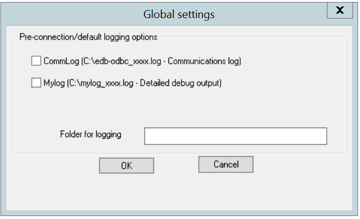

The Global Settings dialog

-   Check the box next to the `CommLog` field to record all client/server traffic in a log file. The logfile is named `C:\psqlodbc_process-id` where `process-id` is the name of the process in use.
-   Check the box next to the `Mylog` field to keep a logfile of the drivers activity. The logfile is named `c:\mylog_process-id` where `process-id` is the name of the process in use.
-   Specify a location for the logfiles in the `Folder for logging` field.

When youve entered the connection information for the named data source, click the `Test` button to verify that the driver manager can connect to the defined data source.

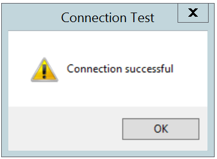

The Connection is successful

Click the OK button to exit `Connection Test` dialog. If the connection is successful, click the `Save` button to save the named data source. If there are problems establishing a connection, adjust the parameters and test again.

## Adding a Data Source Definition in Linux

The Linux `ODBC Administrator` is a graphical tool that is distributed with unixODBC; you can use the `ODBC Administrator` to manage ODBC drivers and named resources. To add the ODBC Administrator to your system, open a terminal window, assume superuser privileges, and enter:

 `yum install unixODBC`

followed by:

 `yum install unixODBC-kde`

To invoke the `ODBC Administrator`, open a terminal window and enter ODBCConfig.

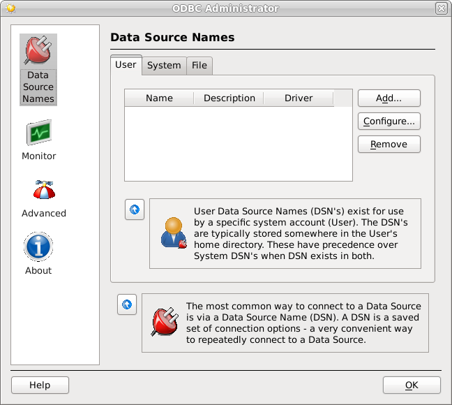

The unixODBC Data Source Administrator

When you install the Advanced Server `Connectors` component, the EDB-ODBC driver is added to the list of drivers in the ODBC Administrator. Click `Advanced`, and then select the `Drivers` tab to verify that the `enterprisedb` driver appears in the list.

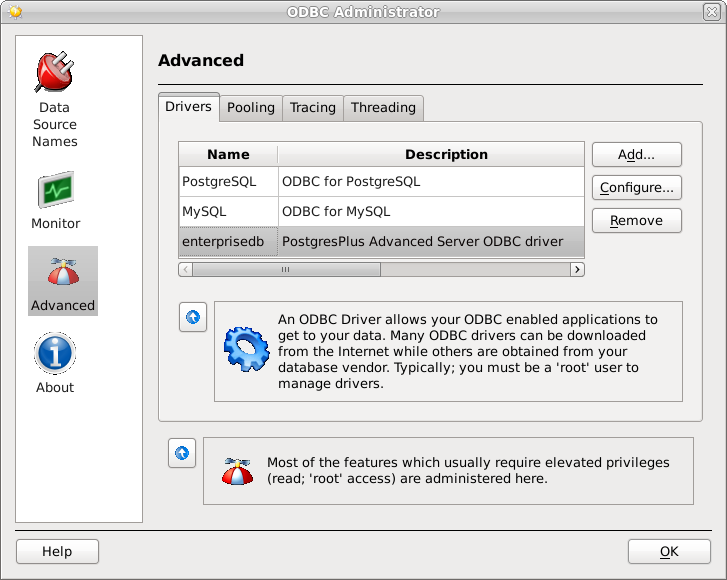

The Drivers tab shows the installed EDB-ODBC driver

If the EDB-ODBC driver does not appear in the list of drivers, you can add it using the `ODBC Administrator`. To add a driver definition, select the `Drivers` tab, and click `Add`. The `Driver Properties (new)` window opens, as shown below:

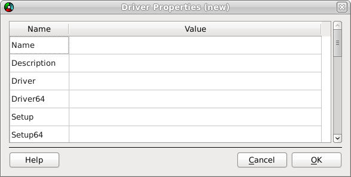

The Driver Properties window

Complete the `Driver Properties` window to register the EDB-ODBC driver with the driver manager:

-   Add a unique name for the driver to the `Name` field.

-   Add a driver description to the `Description` field.

-   Add the path to the location of the EDB-ODBC driver in the `Driver` field. By default, the complete path to the driver is:

    `/usr/edb/odbc/lib/edb-odbc.so`

-   Add the path to the location of the EDB-ODBC driver setup file in the `Setup` field. By default, the complete path to the driver setup file is:

    `/usr/edb/odbc/lib/libodbcedbS.so`

When youve described the driver properties for the EDB-ODBC driver, click `OK`. The ODBC Data Source Administrator window now includes the EDB-ODBC driver in the list of available ODBC drivers.

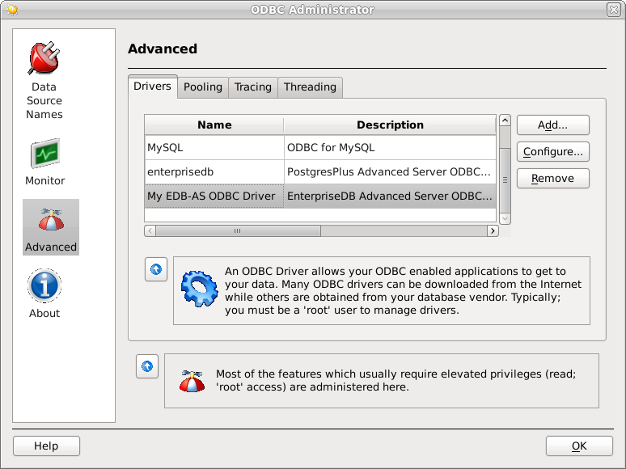

The Drivers tab shows the new driver definition

With the EDB-ODBC driver available to the driver manager, you can add a data source. Click the `Data Source` Names option in the left panel, and then choose the appropriate DSN tab for the type of data source name you would like to add:

-   Choose the `User` tab to add a named data source that is available only to the current user (the data source will be stored in `/user/.odbc.ini`).
-   Choose the `System` tab add a named data source that is available to all users. All system data sources are stored in a single file (usually `/etc/odbc.ini`).
-   Choose the `File` tab to add a named data source that is available to all users, but that is stored in a file of your choosing.

Select the appropriate tab and click `Add`. The `Create a New Data Source` window opens, as shown below:

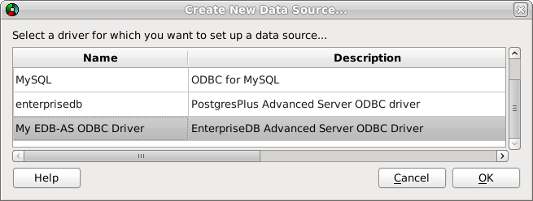

Select a driver for the named data source

Select the EDB-ODBC driver from the list, and click `OK` to open the `Data Source Properties` window.

Complete the `Data Source Properties (new)` window, specifying the connection properties for the EDB-ODBC driver.

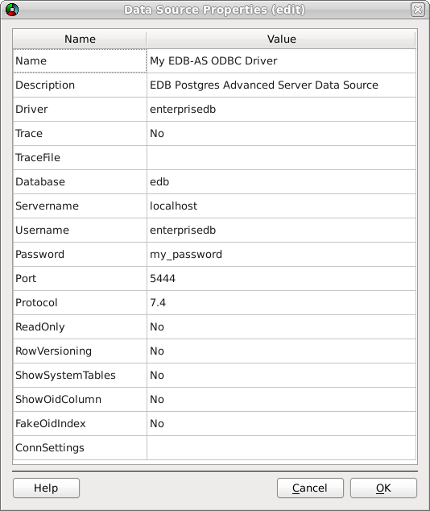

The Data Source Properties window

-   Enter the data source name in the `Name` field.
-   Enter a description of the named data source in the `Description` field.
-   The unixODBC driver includes a trace utility that records the sequence of calls made an ODBC application to a log file. Specify `Yes` in the `Trace` field to turn the trace utility on. Note that using the trace utility can slow down an application.
-   Use the `TraceFile` field to specify a file to receive information returned by the `Trace` utility.
-   Enter the name of the Advanced Server database in the `Database` field.
-   Enter the host name or IP address of Advanced Server in the `Servername` field.
-   Enter the name of a user in the `Username` field.
-   Enter the password for the user in the `Password` field.
-   Enter a port number (or accept the default value of `5444`) in the `Port` field.
-   Use the `Protocol` field to specify a front-end/back-end protocol version; the default value is `7.4`. You can optionally select from protocol versions `7.4`, `6.4`, `6.3` or `6.2`.
-   Use the `ReadOnly` field to specify `Yes` to prevent the driver from executing the following commands: `INSERT`, `UPDATE`, `DELETE`, `CREATE`, `ALTER`, `DROP`, `GRANT`, `REVOKE` or `LOCK`. Enabling the `Read Only` option also prevents any calls that use the ODBC procedure call escape syntax (`call=procedure-name?`). By default, `ReadOnly` is set to `No`.
-   Use the `RowVersioning` field to specify `Yes` if the driver should include the `xmin` column when reporting the columns in a table. The `xmin` column is the ID of the transaction that created the row. You must use row versioning if you plan to create cursors where `SQL_CONCURRENCY = SQL_CONCUR_ROWVER`. By default, `Row Versioning` is set to `No`.
-   Use the `ShowSystemTables` field to specify `Yes` if the driver should include system tables in the result set of the `SQLTables()` function. By default, this field is set to `No`.
-   Use the `ShowOidColumn` field to specify `Yes` if the driver should include the `OID` column in the result set of the `SQLColumns()` function. If `ShowOidColumn` is set to `No`, the `OID` column is hidden from `SQLColumns()`. By default, this option is set to `No`.
-   Use the `FakeOidIndex` field to specify Yes if the `SQLStatistics()` function should report that a unique index exists on each `OID` column. This is useful when your application needs a unique identifier and your table doesnt include one. The default value is `No`.
-   Use the `ConnSettings` field to specify a list of parameter assignments that the driver will use when opening this connection.

When youve defined the connection properties, click `OK`.

The new data source is added to the list of data source names:

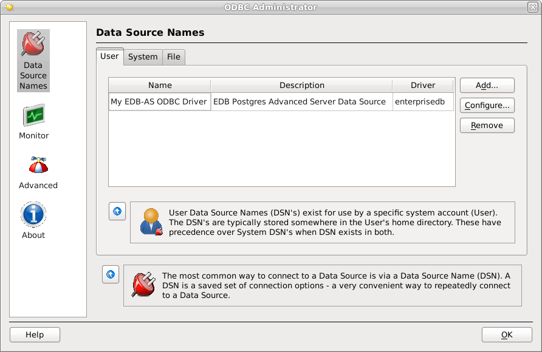

The new data source is included on the Data Source Names list
