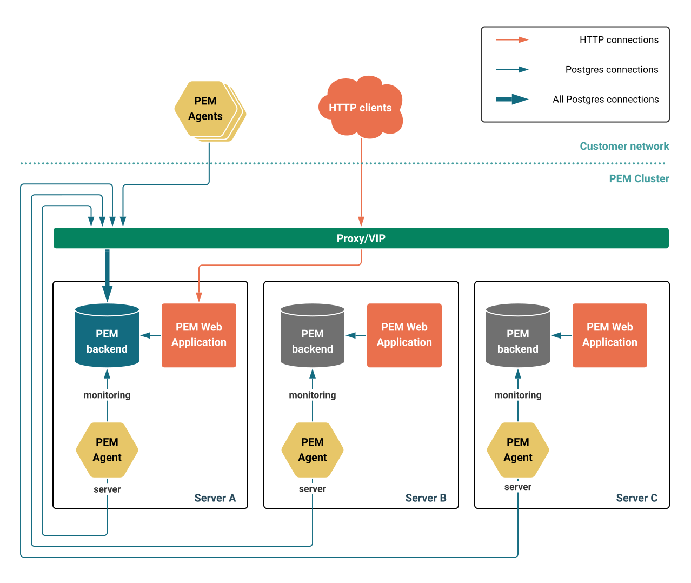
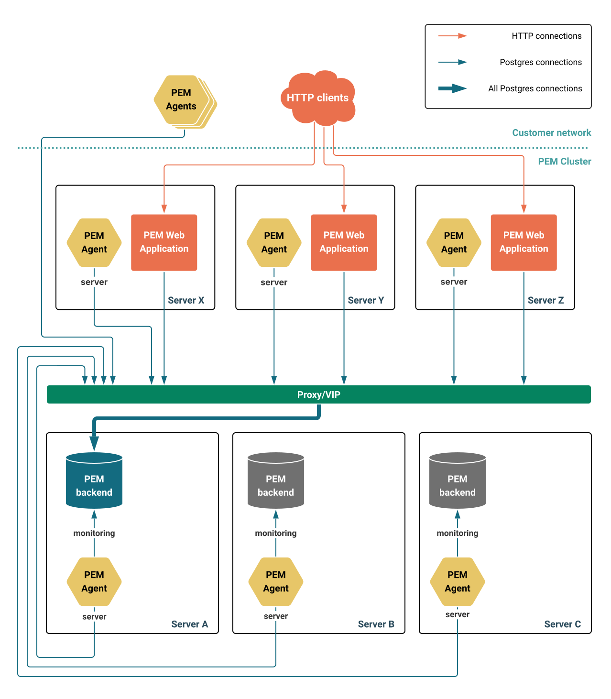
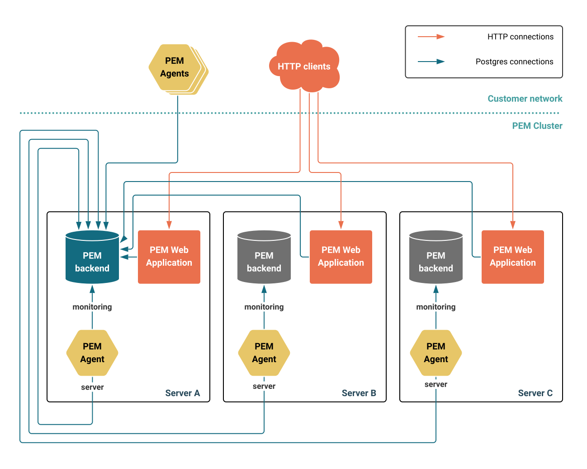
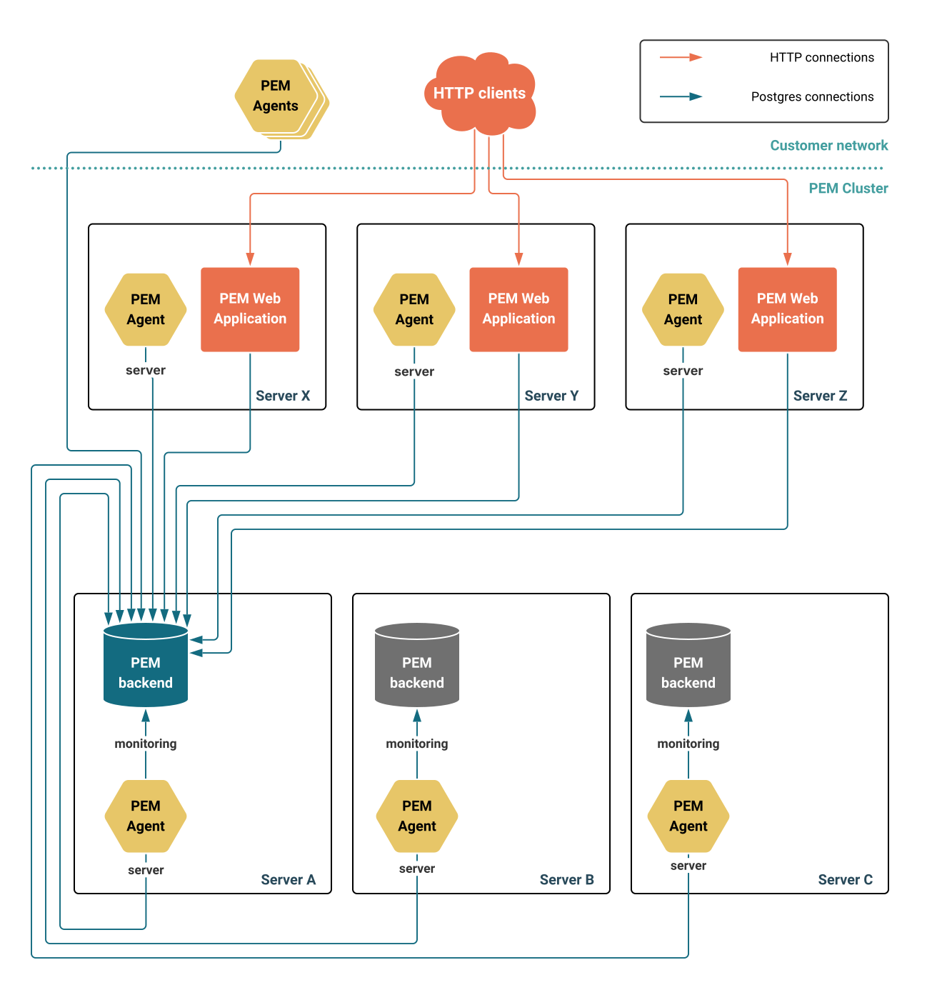

If you require your PEM deployment to be highly available, you can deploy multiple instances of the PEM backend database and frontend web application in a High Availability (HA) topology.

This page details the fundamental requirements of such a topology.

## Running multiple instances of the PEM backend database

An highly available PEM backend database functions like any other standard HA Postgres cluster. The key requirements for the backend are as follows:

### A primary

At any given time, only one instance of the PEM backend database should accept write connections. This instance is referred to as the `primary PEM backend database`, or simply the `primary`.

All other instances must function as replicas of the primary. You must implement a reliable method for promoting a replica in the event of a primary failure. This typically involves using a supported failover manager.

PEM supports the following failover solutions:

- EDB Failover Manager (EFM)
- Patroni

!!! Note
EDB Postgres Distributed is not supported as a PEM backend.
!!!

### Connections must go to the primary

All connections from active PEM web application instances and running PEM agents must connect to the primary PEM backend database.

There are two general approaches to ensure this:

1. Use a [single endpoint](#load-balancers-proxies-and-vips) that always routes to the primary. This can be implemented using various methods, such as a Virtual IP (VIP), a network load balancer, or a proxy that automatically routes traffic to the current primary.

1. Configure clients to switch endpoints when the primary changes. This is commonly done using the [multi-host connection strings], allowing clients to retry against alternate hosts when the primary is unreachable.

For more details, see [Load balancers, proxies and VIPS](#load-balancers-proxies-and-vips) and [Reference architectures](#reference-architectures).

## Running multiple PEM web application instances

High availability for the PEM web application is achieved by running multiple instances of the web application—all connected to the primary PEM backend, as described earlier. Unlike the backend, multiple frontend instances can run concurrently without issue.

!!! Note "PEM is not stateless"
PEM web application instances maintain session state. Routing requests from a single user session to different instances may lead to inconsistent behavior.This is particularly relevant if you're using a stateless load balancer. Ensure session stickiness ("sticky sessions") is enabled to route all requests from a given session to the same instance.
!!!

To ensure a consistent across all instances:

- Configure all instances to store user preferences in the PEM backend database, not locally.
- For features that generate or store files e.g. dump/restore, use a shared file system accessible to all web instances. 

## Upgrading an HA PEM deployment

When running PEM in a high availability (HA) configuration, it's critical to have a well-defined and tested upgrade procedure. This ensures minimal downtime and maintains the integrity of both the backend database and the web application during the upgrade process.

## Load balancers, proxies and VIPs

In the reference architectures below, we use the term "Proxy/VIP" to refer to any component that presents a single endpoint for inbound connections and routes traffic to the current primary. This can be implemented using a variety of tools and techniques, some of which are outlined below.

### Using a Virtual IP (VIP) managed by the failover manager

A Virtual IP (VIP) is an IP address not tied to a specific physical network interface and can move between nodes in a subnet. Because VIPs are managed by the OS networking stack, they require no additional hardware or third-party software.

To route traffic to the primary using a VIP, configure your failover manager to assign the VIP to the new primary during a failover.

- EDB Failover Manager (EFM) supports VIPs natively and is recommended if you choose this method.

- Limitation: VIPs are not suitable for multi-region or multi-subnet cloud environments.

### Using a load balancer

If your environment supports load balancers (e.g. AWS Elastic Load Balancer, on-prem F5,..), they can be used to route the traffic to the current primary. There are two common patterns:

1. Use a failover manager that reconfigures the load balancer during the failover to route inbound connections to the new primary.

2. Use a failover manager where the load balancer polls each node via an HTTP endpoint to determine which is the current primary.
   
    - Only the primary responds positively (e.g. HTTP code 200), meaning the load balancer switches all traffic to the primary within one poll interval.

    - This can be achieved via 
      - `efm-api-node-state` with EFM.
      - `/primary` or `/read-write` endpoints in Patroni.

Pattern 2 is generally preferred, as it aligns with how load balancers are designed to operated and does not require administrative access to modify load balancer configurations during the failover.

!!! Note
The reason we say “if your environment provides a load balancer” is that this solution needs to be properly implemented to avoid being a single point of failure. 
Load balancer themselves must be highly available. This typically involves using DNS failover,elastic IPs, or other infrastructure-level solutions to avoid them becoming a single point of failure.

Simply adding a standalone instance of HAProxy or pgBouncer in front of your database is not sufficient. EDB support cannot assist in designing or managing custom load balancer setups. The solution must be vetted, supported, and maintained by your organization's infrastructure or operations team.
!!!

## Multi-host connection strings

Starting with PEM 10.1, both the PEM agent and the PEM web application support multi-host connection strings to connect to the backend database.
With multi-host connection strings:
 - Clients (i.e. PEM agent or web application) try each listed host until one accepts write connections. 
 - On failover, connections are dropped and the client begins the search again. 
 - If the first host in the string is not the primary, it results in a failed connection attempt increasing the time taken to establish a connection to the primary and increasing resource usage on the monitored server and the PEM backend servers.

!!! Note "Drawback"
The multi-host connection strings are less efficient than using a single routing endpoint like a load balancer or VIP.
!!!

## Reference Architectures

All architectures below show three nodes with PEM backend databases. However, this also work with only two nodes providing the failover manager is happy with even node numbers (if not, a witness node could be used in place of a full third node). 
Likewise more than three nodes also work fine but it may not yield significant benefit for most deployments.

### C1: Colocated with single endpoint

A minimal setup where the PEM web application and backend database both run on the same host.

**Pros:**

- Transparent connections for both web application users and monitoring agents, to the same endpoint.
- Simplified Web application configuration and upgrades, as all instances connect to the loopback interface.
- Suitable for smaller deployments.

**Cons:**

- Shared resources may become a bottleneck.
- No resilience to failure of the web application. Failover occurs if the database fails unless you customise the failover conditions.

### S1: Separated with single endpoint for database

A setup where the PEM web application and backend database both run on separate hosts.

**Pros:**

- Transparent connections for monitoring agents, as they always connect to the same endpoint.
- Web application and database components are independently scalable and redundant.
- Suitable for larger deployments.

**Cons:**

- Users must manually choose a web application instance unless a frontend load balancer is used.

### CM: Colocated with multi-host connection strings

A single-endpoint setup is replaced by clients using multi-host connection strings to ensure traffic is routed to the primary. Web application and backend database are colocated.

**Pros:**

- No need to manage a load balancer or VIP for the database server.
- Redundant web applications.
- Smaller footprint than S1 and SM.

**Cons:**

- Hard to reconfigure as every monitoring agent and web application must be configured with the connection details of all backends databases.
- It can be confusing to have multiple instances of the web application running. Users must manually choose a web application instance unless a frontend load balancer is used.
- Multi-host connections are less efficient than routing through a single endpoint.

### SM: Separated with multi-host connection strings

This setup removes the single endpoint but separates the web application and backend database for improved scalability.

**Pros:**

- No need to manage a load balancer or VIP for the database server.
- Redundant web application and backend database components.
- Suitable for larger deployments for improved scalability.

**Cons:**

- Hard to reconfigure as every monitoring agent and web application must be configured with the connection details of all backend databases. 
- It can be confusing to have multiple instances of the web application running. Users must manually choose a web application instance unless a frontend load balancer is used.
- Multi-host connections are less efficient than routing through a single endpoint

