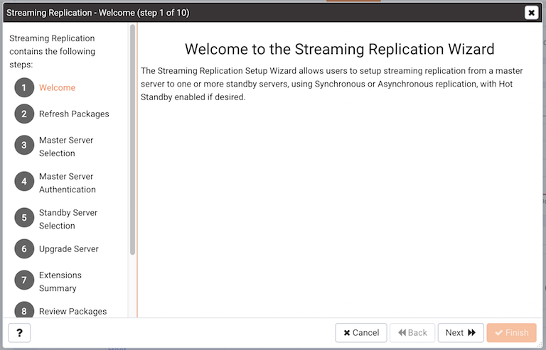
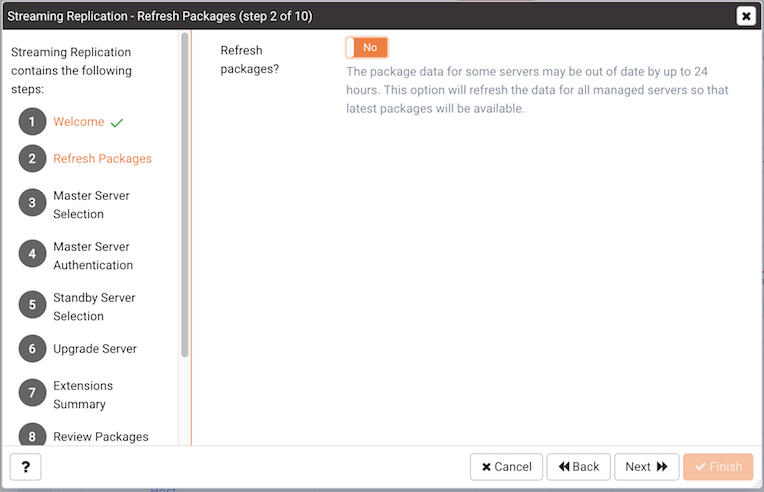
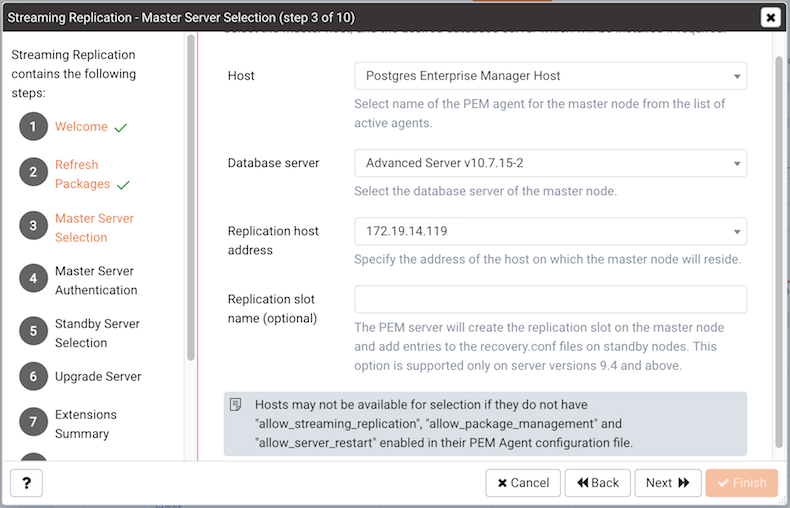
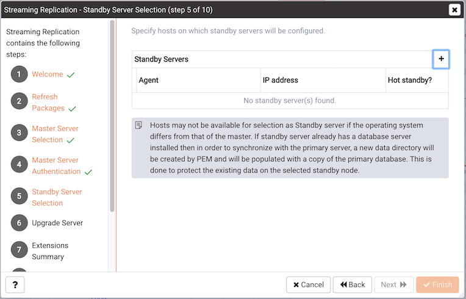
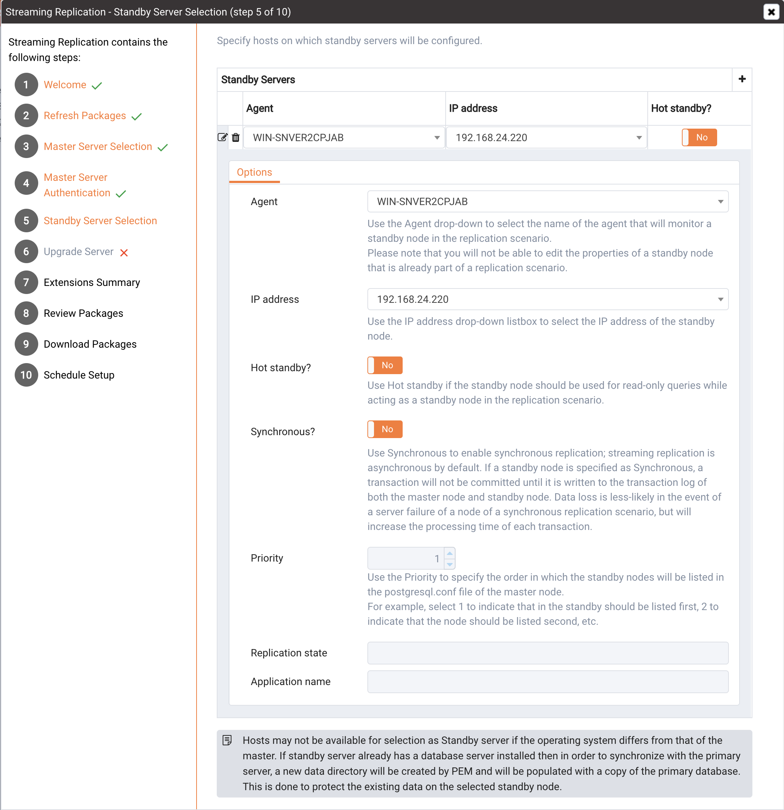
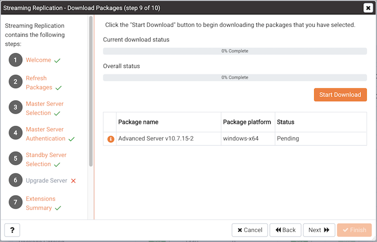
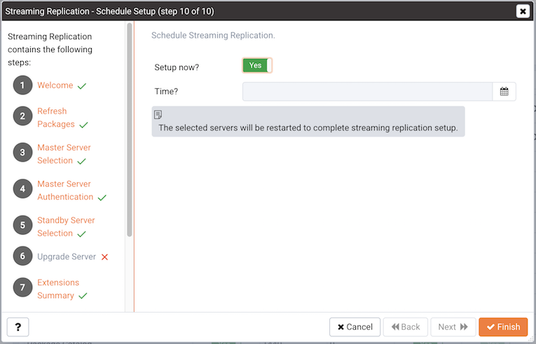

The PEM Streaming Replication Wizard walks you through the process of creating or modifying a streaming replication scenario. You can use the wizard to:

-   Install new servers to act as master and standby nodes in a replication scenario.
-   Configure existing servers in the roles of master and standby nodes in a replication scenario.
-   Add new or existing standby servers to an existing replication scenario.

If you are configuring replication using an existing server as the master node or as a standby node within the replication scenario, the servers must have been installed with the graphical installer. The Streaming Replication wizard does not support pre-existing servers installed via RPM packages at this time.

The Streaming Replication wizard is supported by PEM agent version 6.0 (or later). Please note that the Streaming Replication wizard is deprecated, and will not be available in future releases of PEM.

Each node of a replication scenario must have a resident PEM agent; remote monitoring of master or standby nodes is not supported at this time. After installing the PEM agent, you must:

-   on a Linux host, modify the PEM agent configuration file (`agent.cfg`) located in `/opt/edb/pem/agent/etc/agent.cfg` setting the following parameters to true:

> `allow_package_management`
>
> `allow_server_restart`
>
> `allow_streaming_replication`

-   on a Windows host, modify the Windows registry `(HKEY_LOCAL_MACHINE\Software\Wow6432Node\EnterpriseDB\PEM\agent)`, setting the following entries to true:

    `AllowPackageManagement`

    `AllowServerRestart`

    `AllowStreamingReplication`

After updating the configuration file or registry, restart the PEM agent service:

-   on a Linux host, open a command line, assume superuser privileges and enter the command `/etc/init.d/pemagent restart` (on RHEL or CentOS 6.x) or `systemctl pemagent restart` (on RHEL or CentOS 7.x).
-   on a Windows host, use the `Services` applet to restart the `Postgres Enterprise Manager - pemAgent` service.

Then, to open the Streaming Replication wizard, select `Streaming Replication` from the `Management` menu. The Streaming Replication wizard welcomes you.

Click `Next` to continue. The `Refresh Packages` dialog opens, offering you the option to refresh the package data that is stored on the PEM server about the currently installed packages.

The PEM installed_packages probe retrieves information about the currently installed packages that reside on hosts that are monitored by PEM agents. Select Yes to invoke the probe and update the information that is stored on the PEM server. If you have not added servers to the monitored hosts since the last probe execution (by default, the installed_packages probe executes once every 24 hours), click No to continue without executing the probe.

Click `Next` to continue.

Fields on the `master node selection` dialog prompt you to provide information about the master node of the streaming replication scenario:

-   Use the drop-down listbox in the `Host` field to select the name of the PEM agent that monitors the master node from the list of active agents. To be displayed in the listbox, the agent must be configured with allow_streaming_replication, allow_package_management, and allow_server_restart enabled (set to true) in the PEM Agent configuration file. Please note that each node of a replication scenario must have a resident agent; remote monitoring of replication nodes is not supported.

-   Use the drop-down listbox in the `Database server` field to specify the server or server version of the master node. You can select:

    -   A previously installed server to act as the master node of the replication scenario; existing servers include the word (Installed) in their description. When you select an existing server, the Validate button will be enabled.
    -   The server version of the new master node that PEM will install when configuring the streaming replication scenario. To create a new server, select a server version that does not include the word (Installed) in the description.

-   Use the drop-down listbox in the `Replication host address` field to select the address of the host on which the master node will reside.

-   Optionally, provide a name for a replication slot in the Replication slot name field; the PEM server will create the replication slot on the master node, and add entries to the recovery.conf files on standby nodes. A replication slot name can contain lower-case letters, numbers, and the underscore character. This option is valid only for database server versions 9.4 and above.

    For more information about replication slots, see the PostgreSQL Core documentation, available at:

    <http://www.postgresql.org/docs/current/static/warm-standby.html#STREAMING-REPLICATION-SLOTS>

Click `Next` to continue.

Use the `Master Server Authentication` dialog to provide authentication information for the master node.

-   Use the `Replication user name` field to specify the name of an existing role that is either a database superuser or has REPLICATION privileges, or the name of a role that will be created by PEM for use during replication-related transactions. Please note that PEM will return an error if you specify the name of an existing user with insufficient privileges.
-   Use the `Replication password` field to specify the password that will be associated with the replication user.
-   Use the `Database user name` field to specify the name of a database superuser on the master node.
-   Use the `Database password` field to specify the password associated with the database superuser.

If you are using an existing server as the master node of the replication scenario, you must use the Validate button to confirm that the connection information provided. When you press the Validate button, the server will attempt to connect with the credentials supplied.

Click `Next` to continue.

Use the table on the `Standby Server Selection` dialog to provide properties of one or more standby nodes. Click the add icon (+) to add an entry to the table.

Use the `Standby Server Options form` to provide information about the standby node:

-   Use the `Agent` drop-down listbox to select the name of the agent that resides on the standby node in the replication scenario. Please note that you will not be able to edit the properties of a standby node that is already part of a replication scenario.

-   Use the `IP address` drop-down listbox to select the IP address of the standby node.

-   Set the `Hot standby` field to Yes if the standby node should be used for read-only queries while acting as a standby node in the replication scenario.

-   Set the `Synchronous?` field to Yes to enable synchronous replication; streaming replication is asynchronous by default. If a standby node is specified as Synchronous, a transaction will not be committed until it is written to the transaction log of both the master node and standby node.

    Data loss is less-likely in a synchronous replication scenario should a failover occur, but using synchronous replication increases the processing time of each transaction.

-   Use the `Priority` drop-down listbox to specify the order in which the standby nodes will be listed in the postgresql.conf file of the master node. For example, select 1 to indicate that in the standby should be listed first, 2 to indicate that the node should be listed second, etc.

If you are adding the standby to an existing replication scenario, PEM will display the identity of the replication master in the Replication state field, and the name of the application (from the pg_stat_replication table) in the Application name field. These values are not user-modifiable.

Click the `Add/Change` button to add another standby node to the list of servers, or the Edit icon to modify the values associated with a server in the list. Use the Delete icon to remove a standby definition from the table. When you've finished defining the standby nodes, click Next.

The `Extension Summary` panel lists the extensions or modules that are installed on the nodes of the replication scenario. Any extension installed on the master node must also be installed on each standby node of the replication scenario.

If PEM is installing new servers, the Streaming Replication wizard opens to a tree control that provides an overview of the master and standby nodes and allows you to specify installation properties for each server. To review or modify the installation properties, highlight the name of a node in the tree control; provide values for the selected server in the Option value fields. Prompts on the taskbar will notify you of each required field.

When updating the installation properties, you should confirm that the user name and password specified match the name and password provided on the Master Server Selection dialog. You should also confirm that the specified port is not already in use on the host of the master or standby.

The data directory for the cluster may be created in a non-default location. If you move the data directory from the path specified during the installation, you must update the path specified in the `/etc/postgres-reg.ini` file.

After providing installation options, click `Next` to continue.

The `Download Packages` dialog displays a list of the packages that will be required to install the configured replication scenario. Click `Back` to return to a previous screen and modify the selections, or click `Start Download` to begin downloading the packages that will be used for the installation.

When the download completes, click `Next` to continue; the streaming replication wizard will open a dialog that allows you to schedule streaming replication setup.

Use fields on the `Schedule Setup` dialog to specify the most convenient time for the server to configure the replication scenario:

-   Set `Setup now?` to `Yes` to instruct PEM that it should install and configure streaming replication immediately.
-   Set `Setup now?` to `No` to enable the date and time selectors; use the selectors to specify when you would like PEM to (optionally) perform installations and configure streaming replication.

Click `Finish` to save your choice and exit the wizard; PEM will either begin the installation and configuration process or schedule the installation and configuration for the specified time. You can review the job schedule and job progress on the `Scheduled Tasks` tab; to open the Scheduled Tasks tab, highlight the name of the PEM agent for which you wish to review the job queue and select `Scheduled Tasks...` from the `Management` menu. When the Streaming Replication installation wizard completes, you can register the servers and monitor the replication scenario on the Streaming Replication dashboard.

Please note that the Streaming Replication wizard only modifies the `pg_hba.conf` file on replication nodes to allow connections by the replication user; before defining a server connection in the PEM client, you may need to modify the `pg_hba.conf` file on each node to allow the connection from the client.

## Monitoring Streaming Replication and Failover Manager

You can use the Streaming Replication Analysis dashboard to monitor Streaming Replication and Failover Manager high-availability scenarios. To view the Streaming Replication Analysis dashboard, you must enable probes that monitor replication-related activity; to change a probe configuration, highlight the server name in the PEM client tree control, and select `Manage Probes…` from the `Management` dashboard.

To view the Streaming Replication Analysis dashboard for the master node of a replication scenario, enable the following probes:

> `Streaming Replication`
>
> `WAL Archive Status`

To view the Streaming Replication Analysis dashboard for the standby node of a replication scenario, you must enable the following probe:

> `Streaming Replication Lag Time`

Then, to open the `Streaming Replication Analysis` dashboard, navigate to the `Monitoring` tab, and:

1.  Select the name of the agent that monitors the node from the `Agents` drop-down menu.
2.  Select the name of the monitored server from the `Servers` drop-down menu.
3.  Select Streaming Replication Analysis from the `Dashboards` drop-down menu.
4.  Then, to open the `Streaming Replication` dashboard, right click on the name of the master or standby node of the replication scenario in the Object Browser tree control, and select `Streaming Replication Analysis` from the `Dashboards` context menu.

### Configuring High-Availability for PEM

Replication ensures that data written to the Master node of a cluster is preserved on a Standby node; if a problem occurs on the Master node (such as hardware failure), a Standby node can easily be promoted to replace the failed node. The behavior of a replication cluster can be described as:

> **active/active** – In an active/active cluster, the master node or nodes manages write transactions while the standby nodes are available for read requests. Streaming Replication *with* hot standby or EDB Postgres Multi-Master Replication manage active/active clusters. If you are using an active/active replication scenario, you probably have a PEM agent on each node of the cluster, and are actively monitoring each node with PEM.
>
> **active/passive** – In an active/passive cluster, only the master node is used for read and write transactions. Standby nodes ensure that in the event of a failure of the master node, a complete backup is available to replace the master node. RHCS (Red Hat Cluster Suite), Veritas Replicator, or Streaming Replication *without* hot standby manage active/passive clusters. If you are using an active/passive replication scenario, you are probably only actively monitoring the master node of your replication scenario with PEM.

If PEM is configured to monitor the master and standby nodes, and a standby is promoted, the PEM agents that are currently monitoring the nodes will continue to monitor the newly promoted master unless the node on which the agent resides fails.

If PEM is configured to only monitor the master node and the master node fails, the new master node will be unmonitored unless you configure a standby PEM agent to takeover monitoring of the new master. To create an agent hierarchy that allows an agent to assume monitoring a newly promoted Master, you should install a PEM agent on the Master node, and on any Standby node that might be promoted to master; each agent should be bound to the PEM server.

To configure PEM to promote an agent on a Standby node to monitor the newly promoted Master, you must:

-   Enable takeover on any Standby node that might be promoted.
-   Add a line to your failover script that creates a flag directory, and instructs the agent to assume monitoring.

To enable takeover of a server, right-click on the name of a server in the PEM client tree control, and select Properties from the context menu. When the Properties dialog opens, check the box next to Allow takeover? on the PEM Agent tab of the Server Properties dialog. Each server that will potentially be promoted to the role of Master should be configured to allow takeover by another agent.

After allowing takeover of the server, add configuration steps to your failover script that instruct the PEM agent on a promoted Standby node (the new Master node) to assume monitoring the database server.

To instruct the agent to takeover the monitoring of a server, the failover process must create a file in a special *flag* directory which will instruct the agent to take responsibility for the specified server. By default, the flag directory used by the agent is:

> `$TMPDIR/pem/agent-AGENTID`

Where $TMPDIR is the temporary directory for the user account under which the agent runs.

The user account is usually root on a Linux system or Administrator on Windows. You can override the directory path by specifying a value for the AgentFlagDir configuration option in the registry on Windows, or in the agent_flag_dir parameter in the agent configuration file on Linux.

For example, you might add the following command to a failover script on a Linux server:

> `touch /tmp/pem/agent-<agent_id>/takeover-server-<server_id>`

where

*agent_id* is the numeric identifier of the agent that should takeover the monitoring of the server

*server_id* is the numeric identifier of the server that will be taken over.

To find the `agent_id` and `server_id`, log into the PEM client, and highlight the name of the agent or server; the numeric identifier will be displayed in the ID row on the Properties pane of the PEM client.
