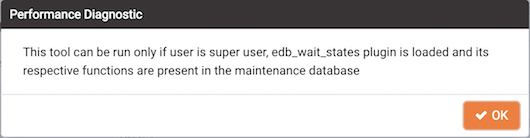
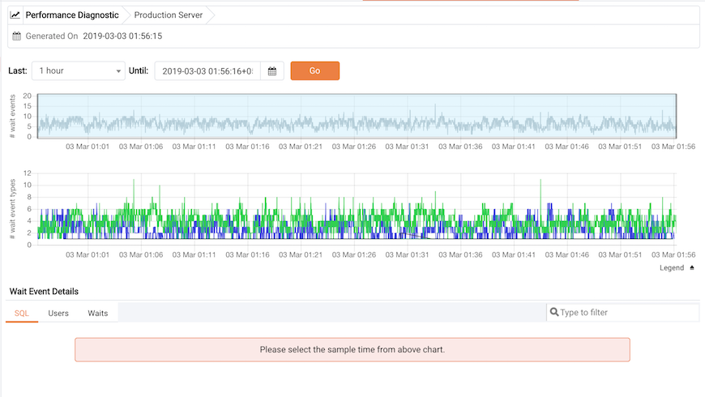
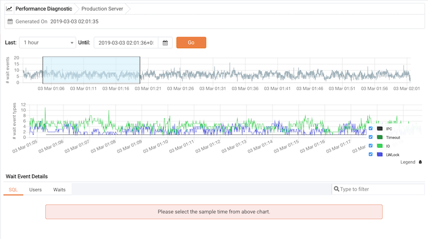
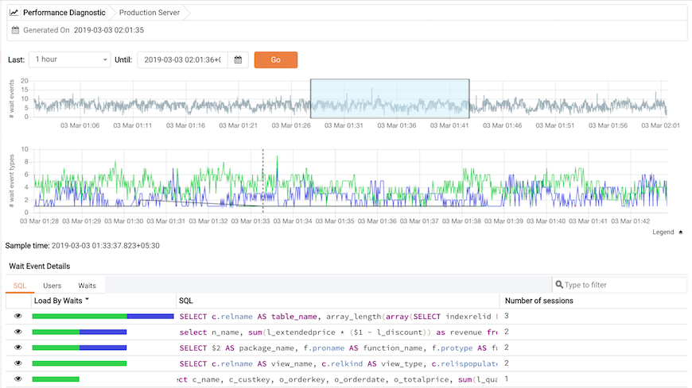
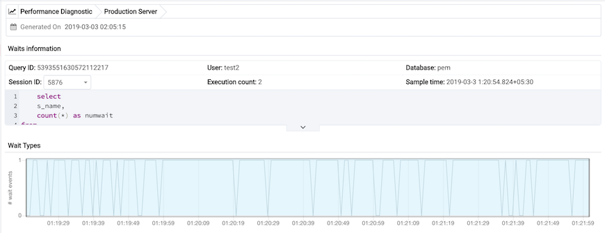
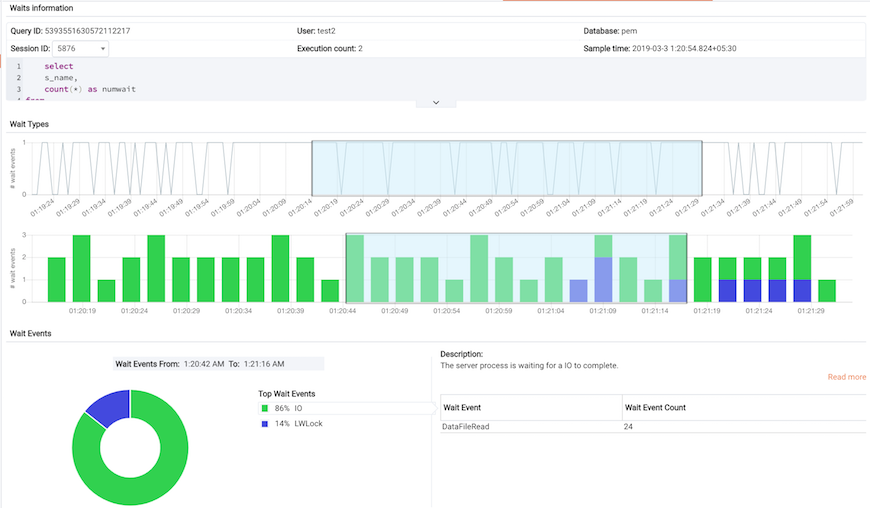

You can use the Performance Diagnostic dashboard to analyze the database performance for Advanced Server instances by monitoring the wait events. To display the diagnostic charts, PEM uses the data collected by Advanced Server’s EDB Wait States module.

For more information about EDB Wait States, see the *EDB Postgres Advanced Server Guide*, available at:

<https://www.enterprisedb.com/docs/en/11.0/EPAS_Guide_v11/EDB_Postgres_Advanced_Server_Guide.1.077.html>

You can analyze the Wait States data on multiple levels by narrowing down your selection of data. Each level of the chart is populated on the basis of your selection of data at the higher level.

**Prerequisites**

-   You must have superuser privileges to access the Performance Diagnostic dashboard.

-   You must ensure that the EDB Wait States module is installed. Modify the `postgresql.conf` file, adding the `edb_wait_states` library to the list of libraries in the `shared_preload_libraries` parameter:

    `shared_preload_libraries = '$libdir/edb_wait_states'`

    Then, restart the database server, and create the extension:

    > `CREATE EXTENSION edb_wait_states;`

    The console will display an error if you do not meet the prerequisites.

To open the Performance Diagnostic dashboard, select the `Performance Diagnostic` option from the `Management` menu of the PEM client.

By default, the top most Performance Diagnostic chart pulls the data for one hour, starting from current date and time. The default range selection in hours in the first chart can be customized in the `Performance Diagnostic` section of the `Preferences` dialog under the `File` menu. You can also use the `Preferences` dialog to display `Performance Diagnostic` in a new browser tab. Use `Open in New Browser Tab?` to display the `Performance Diagnostics` dashboard in a new browser tab.

Use the `Last` drop-down list box to select the duration for which you want to see the chart. Select the 1 hour, 4 hours, 12 hours, or 24 hours. You can also select the date and time through which you want the data to be displayed.

The first chart displays the number of wait events that have occurred over the period of time that is selected for the charts. You can narrow down the timeline in the first chart to analyze the data for a specific period. The second chart displays the total number of wait events of each type, for the timeline that you select in the first chart. You can select the specific wait event types for which you want to analyze the data.

To make differentiation easier, the graph for each wait event type is displayed in a different color. Click on `Legend` to identify the color in which a particular wait event type is displayed in the graph.

Select a point in time on the second chart for which you wish to analyze the wait events; the `Wait Event Details` panel is populated on the basis of your selection in the second chart. The panel makes wait details available on three tabs:

-   The `SQL tab` displays the list of SQL queries having wait events for the selected sample time.
-   The `Users` tab displays the details of the wait events grouped by users for selected sample time.
-   The `Waits` tab displays the number of wait events belonging to each wait event type for the selected sample time.

You can filter the data displayed on the three tabs, or sort the data alphabetically by clicking on a column header.

Click on the `Eye` icon in any row to display a new tab with details of the query for a particular row. This tab displays the `Query ID` and its corresponding sessions IDs in a dropdown list. Select the session ID for the query for which you want to analyze the data; the tab will display details corresponding to the selected session ID and query ID.

The `Waits information` table displays the waiting query. If the query is partially displayed, click the down arrow at the bottom of the section to view the complete SQL query.

The `Wait Types` panel displays the total number of wait events for the selected session ID and query ID. Select a time range in the first chart to analyze the data for a specific period.

The `Wait Types` bar graph displays the total number of wait event types for the duration that you select. To make differentiation easier, each wait event type is represented by a different color in the bar graph.

Select the range for which you want to analyze the wait event types and their corresponding wait events; the `Wait Events` donut chart is populated on the basis of your selection. In the Wait Events donut chart, all the wait event types applicable to the selected duration are displayed in the percentage format. You can select any one wait event type to see all the wait events belonging to that particular wait event type and their count. Click Read More to read about the various wait event types and wait events.

In the `Wait Events` donut chart, all the wait event types applicable to the selected timeline are displayed a percentage format. You can select any one wait event type to see all the wait events belonging to that particular wait event type and their count. Click the `Read More` link to read about the various wait event types and wait events.
