You can use the PEM web interface to create and manage clusters that reside on the console host. Before creating a cluster, you must:

-   define a server image.
-   define a database engine.

After defining a server image and a database engine, you can use PEM to create, monitor, and scale Ark clusters.

## Defining a Server Image

A server image definition describes the virtual machine that will reside on the console host, and provide the environment for an instance of Advanced Server or PostgreSQL. To create a new server image, right-click on the `Server Images` node, and select `Create`, then `Server Image`....

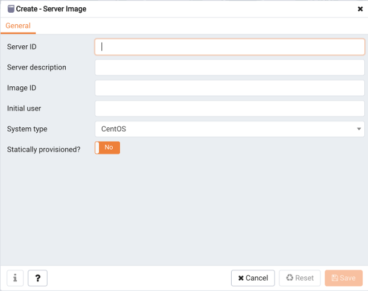

Use fields on the Create - Server Image dialog to define the server image:

-   Use the `Server ID` field to provide an identifier for the server image. The Server ID must be unique, and may not be modified after saving the server image.
-   Use the `Server description` field to provide a description of the server image.
-   Use the `Image ID` field to provide the Image ID of the server image.
-   Use the `Initial user` field to provide the name of the default operating system user. This user must have sudo root privileges to perform the initial provisioning of software on the node.
-   Use the `System type` field drop-down listbox to select the operating system type of the server; select CentOS or RHEL.
-   Set the `Statically provisioned?` slider to `Yes` to indicate that the server is statically provisioned. A statically provisioned server is a pre-installed image that contains the software required to create a database cluster.

**Deleting a Server Image**

To delete a server image, right-click on the image name in the PEM browser tree control, and select `Delete/Drop` from the context menu. The PEM server will prompt you to confirm that you wish to delete the sesrver image. Please note that you cannot remove a server image that is currently in use by an engine; before deleting the server, you must delete any dependent engines.

## Defining a Database Engine

An engine definition provides detailed information about the backing database used by a cluster; only an EDB Ark administrative user can define an engine. Once defined, all of the engines that reside within a specific tenant will be made available to all users with access to that tenant. The Ark console ships with a number of default engine definitions.

You can also create custom database engines. To create a new database engine, right-click on the `Database Engines` node, and select `Create`, then `Database Engine`....

Use fields on the `General` tab to provide information about the engine:

-   Use the `Name` field to provide a user-friendly name for the engine.
-   Use the `Engine ID` field to specify the identifier of the engine. The identifier must be unique, and cannot be modified after the engine definition is saved.
-   Use the `Database Type` drop-down listbox to select the database type (PostgreSQL or Advanced Server) that will be deployed on the engine. The database type cannot be modified after the engine definition is saved.
-   Use the `Version` drop-down listbox to select the database server version of the engine. The version cannot be modified after the engine definition is saved.
-   Use the `Server type` drop-down listbox to select the backing operating system that will be used by the engine.

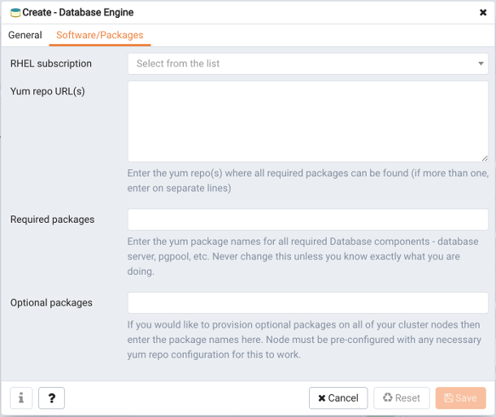

Use fields on the `Software/Packages` tab to provide information about the software that will be deployed on the engine:

-   Use the `RHEL subscription` drop-down listbox to select the RHEL subscription service that will be used when provisioning the engine. You can use the `Create - RHEL Subscription` dialog to propagate the RHEL subscription list.
-   Use the `Yum repo URL(s)` field to provide the names and credentials associated with one or more yum repositories from which software will be installed.
-   Use the `Required packages` field to provide a list of the software packages that are required by the specified server.
-   Use the `Optional packages` field to provide a list of the additional software packages that will be installed on clusters that are provisioned using the engine.

After defining the database engine click Save to add the engine to the Database Engines list in the PEM Browser tree control.

Before using the engine when deploying an Ark cluster, the engine must be enabled. You can use options on the node's context menu to manage the engine.

**Modifying a Database Engine**

To modify a database engine, right-click on the name of the database engine, and select `Properties`... from the context menu, or highlight the engine's name and select `Properties`... from the `Object` dialog. Use fields on the engine's properties dialog to update the properties associated with the engine.

### Managing Database Engines

To view a list of the currently defined engines, select the `Database Engines` node in the PEM Browser tree control and navigate to the `Properties` tab.

The `Properties` tab displays detailed information about the currently defined engines:

-   The `Name` field displays the user-friendly name of the database engine.
-   The `Engine ID` field displays the engine identifier.
-   The `Enabled` field displays the current state of the database engine.
-   The `Database type` field displays the type of database used by the engine.
-   The `Version` field displays the server version used by the engine.
-   The `Server type` field displays type of the backing operating system.
-   If applicable, the `RHEL subscription` field displays the identifier of the RHEL subscription used by the engine.

You can use options on the engine's context menu to manage the engine. To access the context menu, right-click on the engine name in the PEM Browser tree control.

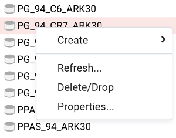

To manage the engine, select from the menu options:

| Option                  | Action                                                                                                           |
| ----------------------- | ---------------------------------------------------------------------------------------------------------------- |
| Refresh                 | Select Refresh to update the definition of the database engine.                                                  |
| Delete/Drop             | Select Delete/Drop to delete the engine. PEM will confirm that you wish to delete the engine before removing it. |
| Enable database engine  | Select Enable database engine to make the engine available for use when deploying a cluster.                     |
| Disable database engine | Select Disable database engine to make the engine unavailable for use.                                           |
| Properties...           | Select Properties... to review or modify engine properties.                                                      |

**Enabling or Disabling a Database Engine**

Enabled engines are available for use when provisioning clusters; disabled engines are not made available. There are two ways to enable or disable a database engine - you can:

-   Right-click on the engine name in the PEM browser tree control and select `Enable database engine` or `Disable database engine` from the context menu.
-   Use the `Enabled` slider on the database engine `Properties` dialog to control the state of the engine.

To open the `Properties` dialog, right-click on the engine name and select `Properties`... from the context menu or highlight the engine's name and select `Properties`… from the `Object` menu.

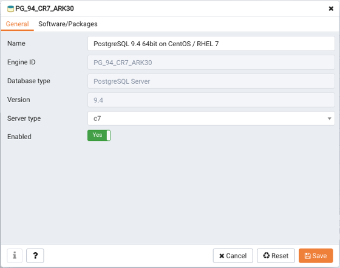

Move the `Enabled` slider to the `Yes` position to make the engine available for cluster provisioning. To disable an engine, move the slider to the `No` position.

Please note that disabling an engine has no impact on any running clusters; it simple prevents users from creating new clusters with the engine. You can use this feature to phase out the use of older engines.

**Deleting a Database Engine**

To delete an engine definition, right-click on the engine name in the PEM browser tree control, and select `Delete/Drop` from the context menu. The PEM server will prompt you to confirm that you wish to delete the engine before the engine is deleted. Please note that you cannot remove an engine that is referenced by one or more clusters and/or backups.

## Creating a RHEL Subscription

You can use the PEM web interface to attach Red Hat Subscription Manager information to engines hosted on Red Hat consoles. The Red Hat Subscription Manager tracks installed products and subscriptions to implement content management with tools like yum. For information about Red Hat Subscription Manager, visit the Red Hat [website](https://access.redhat.com/documentation/en/red-hat-subscription-management/).

When you create a new cluster that uses an engine that is associated with a Red Hat subscription, Ark registers the cluster nodes with Red Hat; when you terminate the node, the system's subcription is unregistered.

To create a RHEL subscription definition, right-click on the `RHEL Subscriptions` node, and select `Create`, then `RHEL Subscription`....

Use fields on the `General` tab to provide information about the subscription:

-   Use the `Subscription ID` field to provide a user-friendly name for the subscription. The name will identify the subscription in the RHEL Subscription drop-down on the engine details dialog.
-   Use the `Username` field to provide the name of the user account registered with the Red Hat content server.
-   Use the `Password` field to provide the password associated with the user account.
-   Use the `Server Url` field to provide the host name of the subscription server used by the service; if left blank, the default value of subscription.rhn.redhat.com will be used.
-   Use the `Base Url` field to provide the host name of the content delivery server used by the service; if left blank, the default value of `https://cdn.redhat.com` will be used.
-   Use the `Organization` field to provide the organization that will be registered with the Red Hat subscription system.
-   Use the `Environment` field to provide the name of the environment (within the organization that will be registered).
-   Use the `System name` field to provide the name of the system that will be registered.

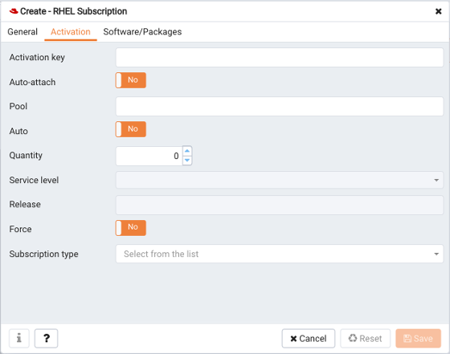

Use fields on the `Activation` tab to provide information about subscription behaviors:

-   Use the `Activation` key field to provide the activation key of the Red Hat subscription.
-   When the `Auto-attach` slider is set to `Yes`, any node associated with the subscription will automatically attach to the service.
-   Use the `Pool` field to provide the pool identifier for the Red Hat subscription service.
-   When the `Auto` slider is set to Yes, nodes provisioned with engines associated with the pool will automatically attach to the subscription service.
-   Use the `Quantity` selector to specify the number of subscriptions in the subscription pool.
-   Use the `Service level` drop-down listbox to provide the service level of the subscription.
-   Use the `Release` field to provide the operating system minor release that will be used when identifying updates to any nodes provisioned with the subscription.
-   When the `Force` slider is set to `Yes`, the node will be registered, even if it is already registered.
-   Use the `Subscription type` drop-down listbox to specify the type of consumer that is being registered.

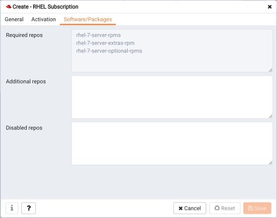

Use fields on the `Software/Packages` tab to provide information about the software that will be deployed on engines that use the repository:

-   The `Required repos` list is populated by the Ark console, and displays a list of the repositories required by the subscription definition.
-   Use the `Additional repos` field to provide the names of any additional repositories that should be enabled on the cluster node(s).
-   Use the `Disabled repos` field to provide the names of any repositories that should be disabled on the cluster node(s).

### Managing RHEL Subscriptions

To view a list of the currently defined RHEL subscriptions, highlight the `RHEL Subscriptions` node in the PEM browser tree control and navigate to the `Properties` tab.

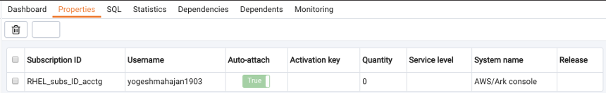

To review detailed information about a specific subscription, select the subscription name and navigate to the `Properties` tab.

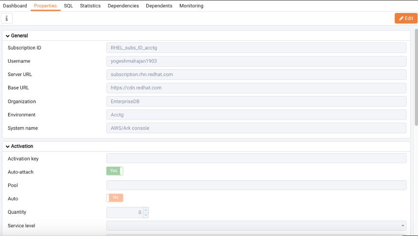

Panels on the `Properties` tab display details about the subscription. Select the edit button in the header to open a dialog that allows you to edit the subscription properties. Please note that to modify subscription information, you must provide the password associated with the subscription.

-   The `General` panel displays subscription information such as the registered user name, your organization information, and the URLs used to connect to the subscription.
-   The `Activation` panel displays information about the RHEL subscription service and its behavior.
-   The `Software/Packages` panel displays the names of repositories used by the subscription and the subscription manager command.

You can use options on the subscription's context menu to manage the subscription. To access the context menu, right-click on the subscription name in the PEM Browser tree control.

Then, to manage the subscription, select from the menu options:

| Option        | Action                                                                                                                                    |
| ------------- | ----------------------------------------------------------------------------------------------------------------------------------------- |
| Refresh       | Select Refresh to update the definition of the RHEL subscription.                                                                         |
| Delete/Drop   | Select Delete/Drop to delete the subscription. PEM will confirm that you wish to delete the subscription definition before removing it.\| |
| Properties... | Select Properties... to modify the subscription properties.                                                                               |

**Modifying Subscription Properties**

To modify the properties associated with a RHEL subscription, right-click on a subscription name and select `Properties`... from the context menu.

Before modifying properties, you must provide the `Password` associated with the subscription. After entering a password and making any desired changes to the subscription definition, click `Save` to preserve your changes and exit the dialog.

**Deleting a Subscription Definition**

To delete a subscription definition, right-click on the name of a subscription in the PEM Browser tree control, and select `Delete/Drop` from the context menu. The PEM server will prompt you to confirm that you wish to delete the subscription before the subscription is deleted.

## Creating a Cluster Template

You can use the PEM web interface to define one or more templates on each console. A template contains a predefined set of server options that determine the configuration of a database cluster. A template can simplify creation of clusters that use a common configuration, or limit user access to costly resources such as large server classes.

You must be an administrative user to create a template.

An administrative user can specify that a user is a *template only* user. A template only user must adhere to cluster definitions provided in a template when deploying an Ark cluster. A template only user will have access to only those templates that specify a role or tenant in which they have membership in the Select Roles (on Amazon or Azure) or Select Tenants (on OpenStack) section of the Add Template dialog.

If a user is specified as a Template Only user:

-   They must use a template when deploying a cluster.
-   They will be restricted to the scaling policies defined in the template.
-   They cannot modify a manually-defined cluster created by another user.
-   They can only create clusters in a server class that exists in an available template.
-   They must use a template when cloning or restoring from backup.
-   They may only delete backups of template created clusters.
-   They may not delete last backup of a template created cluster if the cluster had been deleted (removing the last artifact of any cluster).

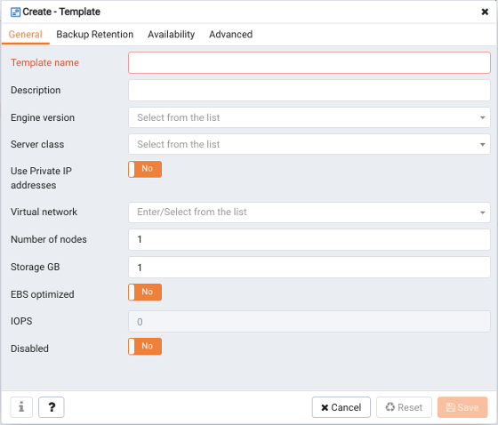

To define a new template, right click on the `Templates` node, and select `Create` then `Templates`... from the context menu.

Use fields on the `General` tab to specify general behavioral preferences for the template:

-   Provide a user-friendly name for the template in the `Template name` field.
-   Use the `Description` field to provide a description of the template.
-   Use the drop-down listbox in the `Engine version` field to select the version of the Postgres engine that you wish to use on clusters configured by the template.
-   Use the drop-down listbox in the `Server class` field to specify the size of each cluster node. The server class determines the size and type (compute power and RAM) of any cluster configured by the template.
-   If your cluster resides on an OpenStack host, use the drop-down listbox in the `Virtual network` field to specify the identity of the network in which clusters configured by the template should reside.
-   If your cluster resides on an Amazon AMI, use the drop-down listbox in the `VPC` field to specify the identity of the network in which clusters configured by the template should reside.
-   If your cluster resides on an OpenStack host, use the drop-down listbox in the `Floating IP pool` field to select the address pool in which clusters configured by the template should reside.
-   Use the drop-down listbox in the `Number of nodes` field to specify the number of nodes that should be created in each cluster.
-   Use the `Storage GB` field to specify the initial size of the data space (in Gigabytes).
-   Set the `Disabled` slider to `Yes` to indicate that the template is disabled.

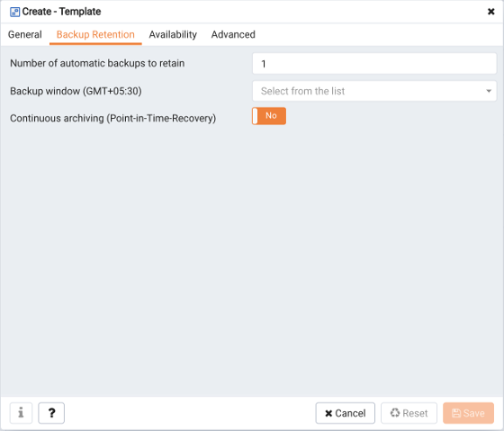

Use fields on the `Backup Retention` tab to specify the backup policies that will be applied for the template:

-   Use the `Number of automatic backups to retain` field to specify the number of backups that will be retained for the cluster. When the specified number of server backups is reached, EDB Ark will delete the oldest backup to make room for a new backup.
-   Use the `Backup Window` drop-down listbox to specify a time that it is convenient to perform a cluster backup.
-   Set the `Continuous Archiving (Point-in-Time Recovery)` slider to `Yes` to enable point-in-time recovery for the cluster. When enabled, a base backup is automatically performed that can to be used to restore to a specific point in time. All subsequent automatic scheduled backups will also support point-in-time recovery.

Use the `Availability` tab to specify the users that will have access to the template:

-   Specify one or more tenants, roles, or groups that will be allowed to use the template in the `Available to tenant/role/group` field.

Use fields on the `Advanced tab` to specify additional template policies:

-   Set the `Encrypted slider` to `Yes` to indicate that the cluster should be encrypted. EDB Ark uses the aes-xts-plain (512-bit) cipher suite to provide an encryption environment that is both secure and transparent to connecting clients. When encryption is enabled, everything residing on the cluster is encrypted except for the root filesystem.
-   Set the `Perform OS and Software update` slider to `Yes` to specify that a software update should be performed whenever the cluster is provisioned. Please note: this option is disabled if the cluster uses a statically provisioned server.

Use the `Scaling Options` sliders to indicate which options will be available to template users:

-   Set the `Manually scale replicas` slider to `Yes` to specify that users of this template will be allowed to manually scale replica nodes configured by this template.
-   Set the `Manually scale storage` slider to `Yes` to specify that users of this template will be allowed to manually scale storage on clusters configured by this template.
-   Set the `Auto scale replicas` slider to `Yes` to specify that users of this template will be able to configure automatic node scaling for clusters configured by this template.
-   Set the `Auto scale storage` slider to `Yes` to specify that users of this template will be able to configure automatic storage scaling for clusters configured by this template.

### Managing Templates

To view a list of the currently defined templates, select the `Templates` node in the PEM Browser tree control and navigate to the `Properties` tab.

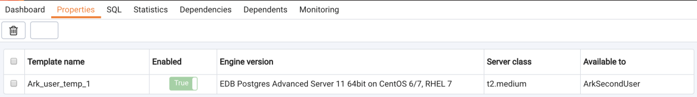

The `Properties` tab displays detailed information about the currently defined templates:

-   The `Template` name column displays the user-friendly name of the template.
-   The `Enabled` column displays `True` if the template is available for use.
-   The `Engine version` column displays the engine identifier.
-   The `Server class` column displays the server class available to cluster deployed with the template.
-   The `Available` to column displays the names of the groups/roles/tenants that have access to the template.

You can use options on the template's context menu to manage the template. To access the context menu, right-click on the template name in the PEM Browser tree control. Then, select from the menu options:

| Option           | Action                                                                                                               |
| ---------------- | -------------------------------------------------------------------------------------------------------------------- |
| Refresh          | Select Refresh to update the definition of the template.                                                             |
| Delete/Drop      | Select Delete/Drop to delete the template. PEM will confirm that you wish to delete the template before removing it. |
| Enable template  | Select Enable template to make the template available for use when deploying a cluster.                              |
| Disable template | Select Disable template to make the template unavailable for use.                                                    |
| Properties...    | Select Properties... to review or modify template properties.                                                        |

**Enabling or Disabling a Template**

Enabled templates are available for use when provisioning clusters; disabled templates are not available. There are two ways to enable or disable a template - you can:

-   Right-click on the engine name in the PEM browser tree control and select `Enable template` or `Disable template` from the context menu.
-   Use the `Enabled` slider on the template `Properties` dialog to control the state of the template. To open the `Properties` dialog, right-click on the template name and select `Properties`... from the context menu:

Please note that disabling a template has no impact on any running clusters; it simple prevents users from creating new clusters with the template.

**Modifying a Template**

To modify a template definition, right-click on the template name in the PEM browser tree control, and select `Properties`... from the context menu. The template definition dialog will open, allowing you to modify the template properties. Please note that you cannot modify the `Template ID` field; the Template ID is a system-assigned identifier.

After modifying the template definition, click `Save` to preserve your changes and close the dialog.

**Deleting a Template**

To delete a template, right-click on the template name in the PEM browser tree control, and select `Delete/Drop` from the context menu. The PEM server will prompt you to confirm that you wish to delete the template before the template is deleted.

## User Management

If allowed by the authentication model supported by your console, you can use the PEM web interface to define an Ark console user. For more information about authentication models supported by Ark, please consult the EDB Postgres Ark Administrative User's Guide, available via the `Dashboard` tab.

To define a new user, right-click on the `Users` node and select `Create`, then `User`... from the context menu.

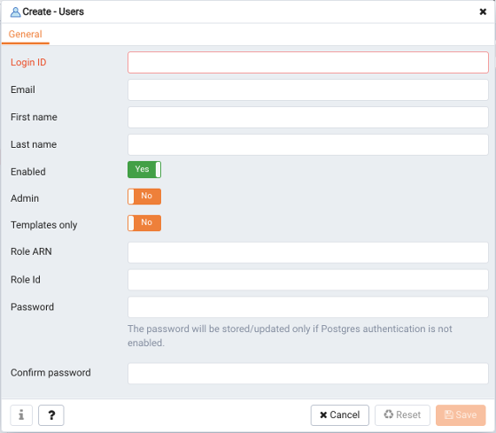

Use fields on the `General` tab to provide information about the user:

-   Use the `Login ID` field to provide the identifier that will be provided when the user logs in to the Ark server.
-   Use the `Email` field to provide a notification email for the user.
-   Use the `First name` field to provide the user's first name.
-   Use the `Last name` field to provide the user's last name.
-   Set the `Enabled` slider to `Yes` to indicate that the user account is active, and to allow the user to login.
-   Set the `Admin` slider to `Yes` to specify that the uesr will have administrative access to the Ark console.
-   Set the `Templates only` slider to `Yes` to require the user to use a template when defining a new cluster.
-   Use the `Password` field to provide a password for the user.
-   Use the `Confirm password` field to confirm the spelling of the user's password.

The `Info` tab provides information about console usage by the selected user:

-   The `Created` field displays the date and time that the user account was created.
-   The `Last login` field displays the date and time of the most recent login by the user.
-   The `Logins` field displays a count of the number of logins by the user.
-   The `Nodes` field displays the number of nodes created by the user.

**Deleting a User Account**

To delete a user account, right-click on the name of a user, and select `Delete/Drop` from the context menu. PEM will prompt you to confirm that you wish to delete the user before the account is deleted.
