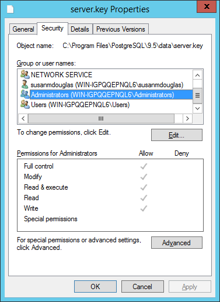

If you are updating both PEM components and the PEM backing database,you should perform PEM component updates (the server, agents and client) before updating the backing database. For more information about updating PEM component software, see [Upgrading a PEM Installation](01_upgrading_pem_installation/#upgrading_pem_installation).

The update process described in this section uses the `pg_upgrade` utility to migrate from one version of the backing server to a more recent version. `pg_upgrade` facilitates migration between any version of Postgres (version 9.3 or later), and any subsequent release of Postgres that is supported on the same platform.

`pg_upgrade` supports a transfer of data between servers of the same type. For example, you can use `pg_upgrade` to move data from a PostgreSQL 9.6 backing database to a PostgreSQL 10 backing database, but not to an Advanced Server 10 backing database. If you wish to migrate to a different type of backing database (i.e from a PostgreSQL server to Advanced Server), see Moving the Postgres Enterprise Manager Server &lt;moving_pem_server>.

You can find more information about using pg_upgrade at:

> <http://www.postgresql.org/docs/current/static/pgupgrade.html>

**Step 1 - Download and Invoke the Updated Backing Database Installer**

Installers for PostgreSQL and Advanced Server are available through the EnterpriseDB website:

> <http://www.enterprisedb.com>

After downloading the installer for the server version to which you will be upgrading, invoke the installer on the host of the PEM server. Follow the onscreen instructions of the installation wizard to configure and install the Postgres server.

You can optionally use a custom-built PostgreSQL server as a host of the PEM backing database. Note that if you are upgrading from a PostgreSQL backing database listening on port `5432`, the new server must be configured to listen on a different port.

**Step 2 - Configure the SSL Utilities on the New Server**

The new backing database must be running the same version of `sslutils` that the current backing database is running; you can download the SSL Utils package that is used in EnterpriseDB installers at:

> <http://www.enterprisedb.com/downloads/component-source-code>

You are *not* required to manually add the `sslutils` extension when using the Advanced Server as the new backing database. The process of configuring `sslutils` is platform-specific.

**On Linux**

If you are using Linux, you can download versions of the archived SSL Utils file from:

> <http://www.enterprisedb.com/downloads/component-source-code>

When the download completes, extract the `sslutils` folder, and move it into the Postgres installation directory for the Postgres version to which you are upgrading.

Open a command line, assume superuser privileges, and set the value of the PATH environment variable to allow make to locate the pg_config program:

> `export PATH=$PATH:/opt/<Postgres>/<x.x>/bin/`

Where:

> *Postgres* specifies either of the folllowing:

-   `PostgreSQL` if you are upgrading to a PostgreSQL server.
-   `PostgresPlus` if you are upgrading to an Advanced Server server.
-   `x.x` specifies the version of Postgres to which you are migrating.

Then, use `yum` to install `sslutil` dependencies:

> `yum install openssl-devel`

Navigate into the `sslutils` folder, and build the `sslutils` package by entering:

> `make USE_PGXS=1`
>
> `make USE_PGXS=1 install`

**On Windows**

`sslutils` must be compiled on the new backing database with the same compiler that was used to compile `sslutils` on the original backing database. If you are moving to a Postgres database that was installed using a PostgreSQL one-click installer (from EnterpriseDB) or an Advanced Server installer, use Visual Studio to build `sslutils`. If you are upgrading to PostgreSQL 9.3 or later, use Visual Studio 2010.

For detailed information about building a specific version of Postgres on Windows, please consult the core documentation for that version. Core documentation is available at the PostgreSQL project website at:

> <http://www.postgresql.org/docs/>

or at the EnterpriseDB website at:

> <http://www.enterprisedb.com/products-services-training/products/documentation/enterpriseedition>

While specific details of the process will vary by platform and compiler, the basic steps on each platform are the same. The example that follows demonstrates compiling OpenSSL support for PostgreSQL on a 32-bit Windows system.

Before compiling the OpenSSL extension, you must locate and install OpenSSL for your version of Windows. Before invoking the OpenSSL installer you may be required to download and install a pre-requisite redistributable (such as `vcredist_x86.exe`).

After installing OpenSSL, download and unpack the `sslutils` utility package available at:

> <http://www.enterprisedb.com/downloads/component-source-code>

Copy the unpacked `sslutils` folder to the Postgres installation directory (i.e. `C:\ProgramFiles\PostgreSQL\9.\<x>`)

Open the Visual Studio command line, and navigate into the `sslutils` directory. Use the following commands to build `sslutils`:

> `SET USE_PGXS=1`
>
> `SET GETTEXTPATH=\ <path_to_gettext>`
>
> `SET OPENSSLPATH=\ <path_to_openssl>`
>
> `SET PGPATH=\ <path_to_pg_installation_dir>`
>
> `SET ARCH=x86`
>
> `msbuild sslutils.proj /p:Configuration=Release`

Where:

> `path_to_gettext` specifies the location of the `GETTEXT` library and header files.
>
> `path_to_openssl` specifies the location of the openssl library and header files.
>
> `path_to_pg_installation_dir` specifies the location of the Postgres installation.

For example, the following set of commands builds OpenSSL support into the PostgreSQL 10 server:

> `SET USE_PGXS=1`
>
> `SET OPENSSLPATH=C:\OpenSSL-Win32`
>
> `SET GETTEXTPATH="C:\Program Files\PostgreSQL\10"`
>
> `SET PGPATH="C:\Program Files\PostgreSQL\10"`
>
> `SET ARCH=x86`
>
> `msbuild sslutils.proj /p:Configuration=Release`

When the build completes, the `sslutils` directory will contain the following files:

-   `sslutils--1.1.sql`
-   `sslutils--unpackaged--1.1.sql`
-   `sslutils--pemagent.sql.in`
-   `sslutils.dll`

Copy the compiled sslutils files to the appropriate directory for your installation; for example:

> `COPY sslutils*.sql "%PGPATH%\share\extension\"`
>
> `COPY sslutils.dll "%PGPATH%\lib\"`

**Step 3 - Stop the Services**

Stop the services of both the old backing database and the new backing database.

\-On RHEL or CentOS 6.x, open a command line and assume the identity of a superuser. Enter the command:

> `/etc/init.d/<service_name> stop`

\-On RHEL or CentOS 7.x, open a command line and assume the identity of a superuser. Enter the command:

> `systemctl/<service_name> stop`

Where `service_name` specifies the name of the Postgres service.

On Windows, you can use the `Services` dialog to control the service. To open the `Services` dialog, navigate through the `Control Panel` to the `System and Security` menu. Select `Administrative Tools`, and then double-click the `Services` icon. When the `Services` dialog opens, highlight the service name in the list, and use the option provided on the dialog to Stop the service.

**Step 4 - Use pg_upgrade to update the Server**

You can use the `pg_upgrade` utility to perform an in-place transfer of existing data between the old backing database and the new backing database. If your server is configured to enforce `md5` authentication, you may need to add an entry to the `.pgpass` file that specifies the connection properties (and password) for the database superuser, or modify the `pg_hba.conf` file to allow trust connections before invoking `pg_upgrade`. For more information about creating an entry in the `.pgpass` file, please see the PostgreSQL core documentation, available at:

> <http://www.postgresql.org/docs/current/static/libpq-pgpass.html>

During the upgrade process, pg_upgrade will write a series of log files. The cluster owner must invoke `pg_upgrade` from a directory in which they have write privileges. If the upgrade completes successfully, `pg_upgrade` will remove the log files when the upgrade completes. To instruct `pg_upgrade` to not delete the upgrade log files, include the `--retain` keyword when invoking `pg_upgrade`.

To invoke `pg_upgrade`, assume the identity of the cluster owner, navigate into a directory in which the cluster owner has write privileges, and execute the command:

> `<path_to_pg_upgrade> pg_upgrade`
>
> `-d <old_data_dir_path>`
>
> `-D <new_data_dir_path>`
>
> `-b <old_bin_dir_path> -B <new_bin_dir_path>`
>
> `-p <old_port> -P <new_port>`
>
> `-u <user_name>`

Where:

> `path_to_pg_upgrade* specifies the location of the pg_upgrade utility. By default, pg_upgrade is installed in the`bin`directory under your Postgres directory.`old_data_dir_path`specifies the complete path to the data directory of the old backing database.`new_data_dir_path`specifies the complete path to the data directory of the new backing database.`old_bin_dir_path`specifies the complete path to the bin directory of the old backing database.`new_bin_dir_path`specifies the complete path to the bin directory of the old backing database.`old_port`specifies the port on which the old server is listening.`new_port`specifies the port on which the new server is listening.`user_name\`\` specifies the name of the cluster owner.

For example, the following command:

> `C:\>"C:\Program Files\PostgreSQL\10\bin\pg_upgrade.exe"`
>
> `-d "C:\Program Files\PostgreSQL\9.6\data"`
>
> `-D "C:\Program Files\PostgreSQL\10\data"`
>
> `-b "C:\Program Files\PostgreSQL\9.6\bin"`
>
> `-B "C:\Program Files\PostgreSQL\10\bin"`
>
> `-p 5432 -P 5433`
>
> `-u postgres`

Instructs `pg_upgrade` to migrate the PEM database from PostgreSQL 9.6 to PostgreSQL 10 on a Windows system (if the backing databases are installed in their default locations).

Once invoked, `pg_upgrade` will perform consistency checks before moving the data to the new backing database. When the upgrade is finished, `pg_upgrade` will notify you that the upgrade is complete.

For detailed information about using `pg_upgrade` options, or troubleshooting the upgrade process, please see:

> <http://www.postgresql.org/docs/current/static/pgupgrade.html>

**Step 5 - Copy the Certificate Files from the Old Database to the New Database**

Copy the following certificate files from the `data` directory of the old backing database to the `data` directory of the new backing database:

-   `ca_certificate.crt`
-   `ca_key.key`
-   `root.crt`
-   `root.crl`
-   `server.key`
-   `server.crt`

Once in place on the target server, the files should have the (platform-specific) permissions described below:

**Permissions and Ownership on Linux**

|                    |          |             |
| ------------------ | -------- | ----------- |
| File Name          | Owner    | Permissions |
| ca_certificate.crt | postgres | -rw-------  |
| ca_key.key         | postgres | -rw-------  |
| root.crt           | postgres | -rw-------  |
| root.crl           | postgres | -rw-------  |
| server.key         | postgres | -rw-------  |
| server.crt         | postgres | -rw-r--r--  |

On Linux, the certificate files must be owned by `postgres`. You can use the following command at the command line to modify the ownership of the files:

> `chown postgres <file_name>`

Where `file_name` specifies the name of the certificate file.

The `server.crt` file may only be modified by the owner of the file, but may be read by any user. You can use the following command to set the file permissions for the `server.crt` file:

> `chmod 644 server.crt`

The other certificate files may only be modified or read by the owner of the file. You can use the following command to set the file permissions:

> `chmod 600 <file_name>`

Where `file_name` specifies the name of the file.

**Permissions and Ownership on Windows**

On Windows, the certificate files moved from the source host must be owned by the service account that performed the PEM server and backing database installation on the target host. If you invoked the PEM server and Postgres installer using the `Run as Administrator` option (selected from the context menu of the installer), the owner of the certificate files will be `Administrators`.

To review and modify file permissions on Windows, right-click on the file name, and select `Properties`.

Navigate to the `Security` tab and highlight a `Group or user name` to view the assigned permissions. Select `Edit` or `Advanced` to access dialogs that allow you to modify the permissions associated with the selected user.

**Step 6 - Update the New Server Configuration File**

The `postgresql.conf` file contains parameter settings that specify server behavior. You will need to modify the `postgresql.conf` file on the new server to match the configuration specified in the `postgresql.conf` file of the old server.

By default, the `postgresql.conf` file is located:

-   For Postgres version lower than 10 on Linux, in `/opt/PostgreSQL/<version.x>/data`
-   For Postgres version 10 or higher when installed with graphical installers on Linux, in `/opt/PostgreSQL/<version>/data`
-   For Postgres version 10 or higher when installed with an RPM on Linux, in `/usr/edb/PostgreSQL/<version>/data`
-   For any Postgres version on Windows, in `C:\Program Files\PostgreSQL\<version.x>\data`

Where, `version` is the major version of Postgres on your system.

Use your choice of editor to update the `postgresql.conf` file of the new server. Modify the following parameters:

-   The `port` parameter to listen on the port monitored by your original backing database (typically, `5432`).
-   The `ssl` parameter should be set to `on`.

You must also ensure that the following parameters are enabled. If the parameters are commented out, remove the pound sign from in front of each `postgresql.conf` file entry:

-   `ssl_cert_file = 'server.crt' # (change requires restart)`
-   `ssl_key_file = 'server.key' # (change requires restart)`
-   `ssl_ca_file = 'root.crt' # (change requires restart)`
-   `ssl_crl_file = 'root.crl'`

Your installation may have other parameter settings that require modification to ensure that the new backing database behaves in a manner comparable to the old backing database. Review the `postgresql.conf` files carefully to ensure that the configuration of the new server matches the configuration of the old server.

**Step 7 - Update the New Server Authentication File**

The `pg_hba.conf` file contains parameter settings that specify how the server will enforce host-based authentication. When you install the PEM server, the installer modifies the `pg_hba.conf` file, adding entries to the top of the file:

> `# Adding entries for PEM agents and admins to connect to PEM server`
>
> `hostssl pem +pem_user 192.168.2.0/24 md5`
>
> `hostssl pem +pem_agent 192.168.2.0/24 cert`
>
> `# Adding entries (localhost) for PEM agents and admins to connect to PEM server`
>
> `hostssl pem +pem_user 127.0.0.1/32 md5`
>
> `hostssl postgres +pem_user 127.0.0.1/32 md5`
>
> `hostssl pem +pem_user 127.0.0.1/32 md5`
>
> `hostssl pem +pem_agent 127.0.0.1/32 cert`

By default, the `pg_hba.conf` file is located at the following location:

-   For Postgres version lower than 10 on Linux, in `/opt/PostgreSQL/<version>.x/data`
-   For Postgres version 10 or higher when installed with graphical installers on Linux, in `/Opt/PostgreSQL/<version>/data`
-   For Postgres version 10 or higher when installed with RPMs on Linux, in `/var/lib/PostgreSQL/<version>/data`
-   For Advanced Server version 10 or higher when installed with RPMs on Linux, in `/var/lib/edb/AS<version>/data`
-   For any Postgres version on Windows, in `C:\Program Files\PostgreSQL\version.x\data`

Where, `version` is the major version of Postgres on your system and *x* is the minor version.

Using your editor of choice, copy the entries from the `pg_hba.conf` file of the old server to the `pg_hba.conf` file for the new server.

**Step 8 - Restart the New Postgres Server**

Start the service of the new backing database.

\-On RHEL or CentOS 6.x, open a command line and assume the identity of a superuser. Enter the command:

> `/etc/init.d/<service_name> start`

\-On RHEL or CentOS 7.x, open a command line and assume the identity of a superuser. Enter the command:

> `systemctl stop <service_name>`

Where `service_name` is the name of the backing database server.

If you are using Windows, you can use the `Services` dialog to control the service. To open the `Services` dialog, navigate through the `Control Panel` to the `System and Security` menu. Select `Administrative Tools`, and then double-click the `Services` icon. When the `Services` dialog opens, highlight the service name in the list, and use the option provided on the dialog to start the service.
