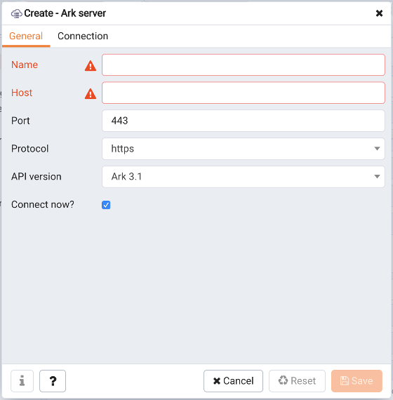
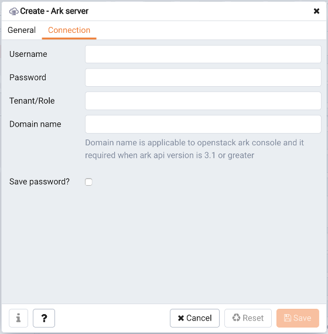

You can use the `Create - Server` dialog to register an existing Ark console with the PEM server. To access the dialog, right-click on an Ark Server node to access the context menu; navigate through the `Create` option to select `Ark Server....`

Use the fields on the `General` tab to describe the general properties of the Ark console:

-   Use the `Name` field to specify a user-friendly name for the server. The name specified will identify the server in the PEM Browser tree control.
-   Use the `Host` field to provide the name of the Ark console host.
-   Use the `Port` field to specify the port that the PEM server will use when connecting to the Ark console.
-   Use the `Protocol` drop-down listbox to select the connection protocol that the PEM server will use when connecting to the Ark console.
-   Use the `API version` drop-down listbox to select the version of the Ark API that the PEM server will use when managing the Ark console.

Use fields on the `Connection` tab to specify connection details for the Ark console:

-   Specify the name of the connecting user in the `Username` field. The specified user must be an existing user in the backing database of the Ark console.
-   Provide the password associated with the specified user in the `Password` field.
-   Specify the name of the OpenStack tenant or `Ark Port` field.
-   Use the `Domain` name field to specify the name of the OpenStack domain to which the server will connect if the Ark API version specified on the General tab is version 3.1 or greater.
-   Check the box next to `Save password?` to save the password associated with the console registration; if do not save the password, you will be prompted for the password when you attempt to connect to the server.

When you have provided registration information for the Ark console, click the `Save` button to save the Ark console definition.
