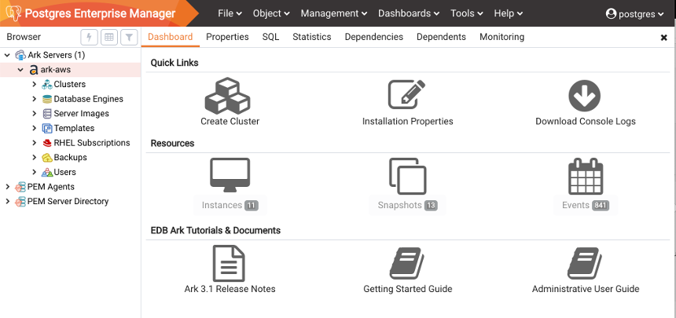
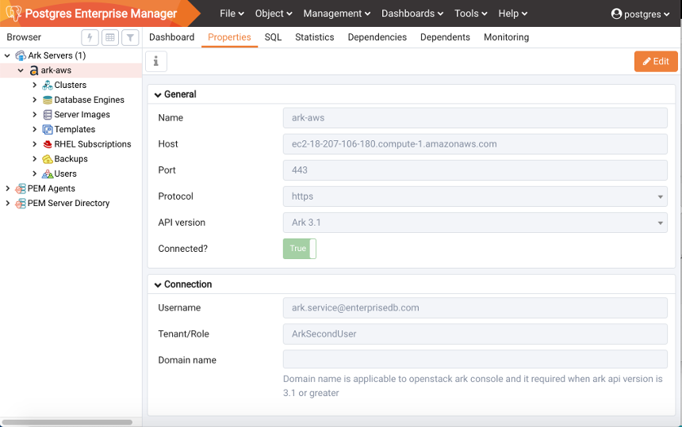
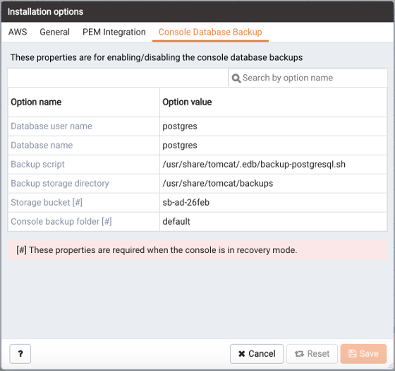

The PEM web interface provides dialogs that allow you to review and modify the Ark console attributes.

The `Dashboard` tab displays icons that provide quick access to Ark information and features. If the tab is accessed from the top-level `Ark Servers` node, it includes informational links that are applicable to all consoles. If the tab is accessed from a console name node, the tab includes information specific to that console:

The `Quick Links` icons allow you to:

-   Click the `Create Cluster` icon to define a new cluster on the selected console.
-   Click the `Installation Properties` icon to review the deployment properties for the selected console.
-   Click the `Download Console` Logs icon to download the log files for the selected console.

The `Resources` icons provide access to information about the objects that reside on the console:

-   Click the `Instances` icon to review information about the instances that reside on the console.
-   Click the `Snapshots` icon to review information about console backups.
-   Click the `Events` icon to review information about events that have been logged for the selected console.

The `EDB Ark Tutorials & Documents` icons provide access to information that is specific to the Ark version that is deployed on the console:

-   Click the `Ark 3.0 Release Notes` icon to review the release notes.
-   Click the `Getting Started Guide` icon to review a usage guide for the Ark console.
-   Click the `Administrative User Guide` icon to review the Ark Administrative User Guide.

To view console properties, select the name of a console in the PEM Browser tree control and select the `Properties` tab.

Panels on the `Properties` tab display configuration details for the console.

The `General panel` displays:

-   The `Name` field displays the console name.
-   The `Host` name displays the IP address of the console.
-   The `Port` field displays the port at which a browser can connect to the console.
-   The `Protocol` field displays the connection protocol used to connect to the console.
-   The `API version` field displays the version of the API used to manage console objects.
-   The `Connected?` field displays the current state of the console.

The `Connection` panel displays:

-   The `Username` field displays the name of the user that deployed the console.
-   The `Tenant/Role` field displays the name of the tenant or role in which the console is hosted.
-   If deployed on an OpenStack host and using API version 3.1 or later, the `Domain name` field displays the OpenStack domain in which the console is hosted.

Use options on the console's context menu to manage a console registration; right-click on the console name in the PEM browser tree control and select from the following menu options:

| Option                | Action                                                                                                                                                                                                                                                                             |
| --------------------- | ---------------------------------------------------------------------------------------------------------------------------------------------------------------------------------------------------------------------------------------------------------------------------------- |
| Refresh               | Select Refresh to update the definition of the server or server objects that reside on the console.                                                                                                                                                                                |
| Connect Server        | Select Connect Server to connect to the selected Ark console. After authenticating with the Ark console host, the tree control will display a host-specific icon to the left of the console name. Expand the tree control to review and manage objects that reside on the console. |
| Delete/Drop           | Select Delete/Drop to delete the registration of the selected Ark console. Please note that deleting a console registration does not remove the console from the backing database. PEM will confirm that you wish to delete the registration before removing it.                   |
| Download console logs | Select Download console logs to download the log files from the selected console.                                                                                                                                                                                                  |
| Installation options  | Select Installation options to open the Installation options dialog and review or modify console deployment properties.                                                                                                                                                            |
| Disconnect Server     | Select Disconnect Server to disconnect from the selected Ark console.                                                                                                                                                                                                              |
| Properties            | Select Properties to review the properties specified when registering an Ark console; if the server is disconnected, you may modify the property values. After modifying property values, select Save to preserve your changes.                                                    |

## Downloading Console Logs

Use options on the console `Dashboard` panel or context menu to download a zip file that contains the server logs for the underlying application server. You can use the log file to confirm changes to server status or verify server activity. To download a console log you can either:

-   Right click on the console name in the PEM Browser tree control and select `Download console logs` from the context menu.
-   Highlight a console name in the tree control and navigate to the `Dashboard` tab; then, select the `Download console logs` option from the `Quick Links` panel.

A popup will ask you to confirm your selection; click `OK` to download the log file.

You can also review the console logs via an ssh session. Log files are stored in `/var/log/edb-ark`; the current log file is `/var/log/edb-ark/ark.log`. Use the Linux tail utility to display the most recent entries in any of the server logs. For example, to review the last 10 lines in the server log file, use SSH to connect to the console host's backing database and enter:

> `tail file_name`

Where *file*\_*name* specifies the complete path to the log file. Include the -F option to instruct the tail utility to display only the last 10 lines of the log file, and new log file entries as they are added to the file:

> `tail -F file_name`

## Reviewing the Console Deployment Options

The `Installation options` dialog displays the deployment properties of the selected console. To open the dialog, right-click on a console name and select `Installation options` from the context menu.

The first tab of the `Installation options` dialog displays provider-specific details about the console deployment. The properties displayed may include:

| Option                              | Action                                                                                                                                 |
| ----------------------------------- | -------------------------------------------------------------------------------------------------------------------------------------- |
| AWS cross account accesskey         | The Amazon access key ID associated with the AWS role that will be used for account.                                                   |
| AWS cross account secretkey         | The Amazon secret key associated with the AWS role that will be used for account administration.                                       |
| Service account externalid          | The Amazon external ID that should be used by the Ark service user.                                                                    |
| Service account rolearn             | The Amazon Role ARN (resource name) that should be used by the Ark service user when performing management functions on behalf of Ark. |
| Enable self registration            | If the Ark console should allow self-registration for Ark users.                                                                       |
| Azure application registration ID   | The application ID associated with the Azure account that hosts the Ark console.                                                       |
| Azure active directory ID           | The directory ID associated with the Azure account that hosts the Ark console.                                                         |
| Azure storage account               | The Azure block storage account you wish to use with this Ark server.                                                                  |
| Azure subscription ID               | The Azure account that hosts the Ark console.                                                                                          |
| OpenStack admin role                | The name of the OpenStack administrative user.                                                                                         |
| OpenStack identity service endpoint | The location of the OpenStack identity service endpoint.                                                                               |
| Service account ID                  | The name of the service account on the console's backing database.                                                                     |
| Service account password            | The password for the postgres user on the console's backing database.                                                                  |

The `General` tab displays details about behavior related aspects of the console deployment. Displayed information may include:

| Option                           | Action                                                                                           |
| -------------------------------- | ------------------------------------------------------------------------------------------------ |
| API timeout                      | The number of minutes that an authorization token will be valid for use with the API.            |
| Contact email address            | The email address that will be included in the body of cluster status notification emails.       |
| Dashboard docs url               | The location of the content that will be displayed on the Dashboard tab of the Ark console.      |
| Dashboard hot topics url         | The location of the content that will be displayed on the Dashboard tab of the Ark console.      |
| Database backup tenant           | The name of the tenant in which the database backup will reside.                                 |
| Database name                    | The name of the console database.                                                                |
| Directory to store backups       | The directory in which backups will be stored.                                                   |
| Enable console switcher          | If the console should display console switcher functionality.                                    |
| Enable PostgreSQL authentication | If Ark will enforce the authentication method configured on the backing Postgres server.         |
| Folder to store backups          | The name of the backup folder within the storage bucket.                                         |
| Notification email               | The email address to which email notifications about the status of the Ark console will be sent. |
| Reply-to email address           | The return email address used on cluster status notification emails.                             |
| Template restrict new users      | Indicates if the Ark console will make any new user a Template Only user by default.             |
| WAL archive container            | The name of the container in which WAL archives are stored.                                      |

The `PEM integration` tab displays details about behavior related to PEM. The properties displayed may include:

| Option                       | Action                                                                                                                                                           |
| ---------------------------- | ---------------------------------------------------------------------------------------------------------------------------------------------------------------- |
| PEM server mode              | The location of the PEM server; a LOCAL server resides on the monitored PEM instance, while a REMOTE server is on a different host.                              |
| PEM sync mode                | If enabled, all roles/groups/tenants that are accessible by the role that creates the console are added to the PEM server as a member of a non-login group role. |
| PEM synchronisation interval | The number of minutes between PEM/Ark synchronisations.                                                                                                          |

The `Console database backup` tab displays details about backup behavior. The properties displayed may include:

| Option                   | Action                                                           |
| ------------------------ | ---------------------------------------------------------------- |
| Backup script            | The complete path to the backup script on the console host.      |
| Backup storage directory | The complete path to the backup script on the console host.      |
| Console backup folder    | The name of the console database.                                |
| Database name            | The name of the console database.                                |
| Database user name       | The name of the database superuser.                              |
| Backup storage directory | The directory in which backups will be stored.                   |
| Folder to store backups  | The name of the backup folder within the storage bucket.         |
| Storage bucket           | The name of the container in which backups will be stored.       |
| Storage tenant           | The name of the tenant in which the database backup will reside. |
