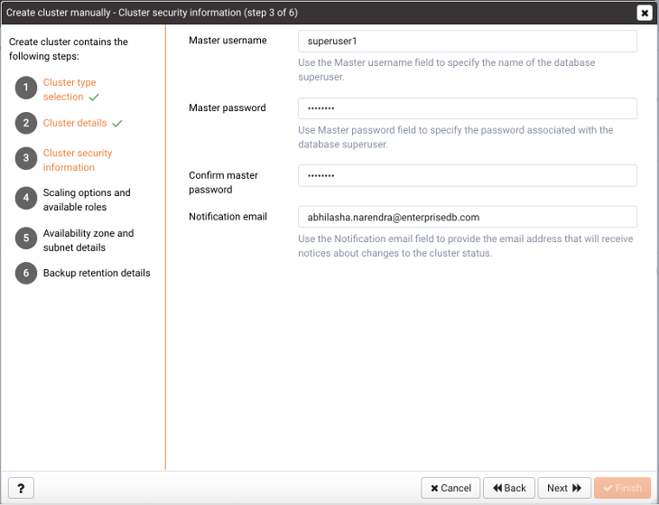
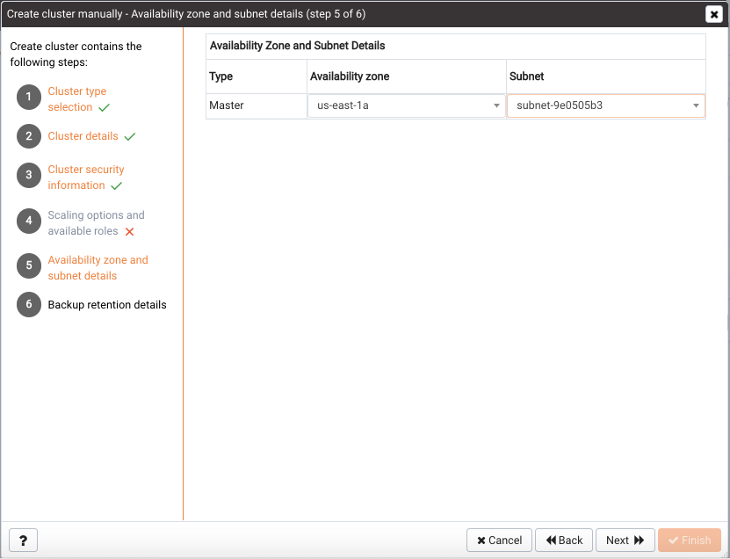
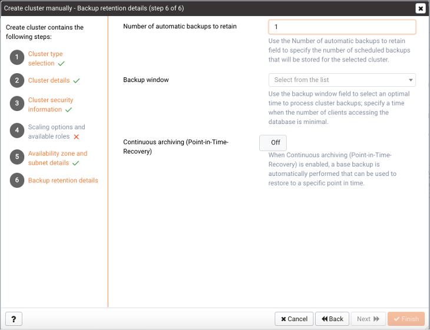
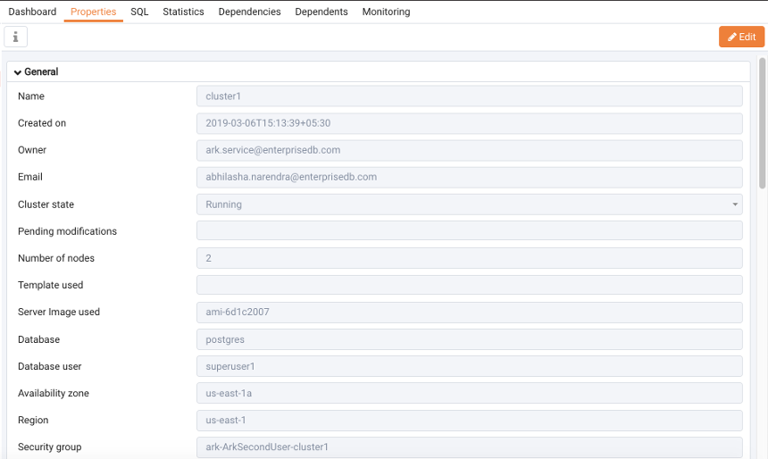
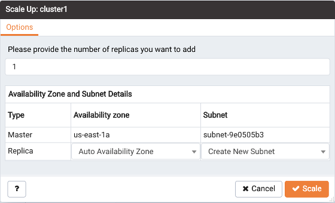
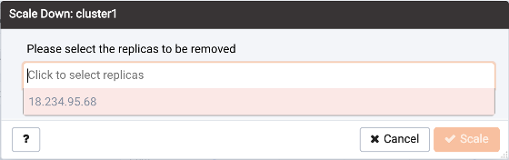
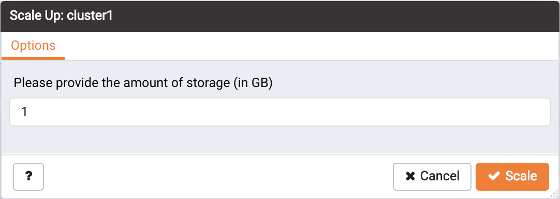

There are multiple ways to create an Ark cluster; you can:

-   define a new cluster manually.
-   clone an existing cluster.
-   restore a backup into a new cluster.

Applying a template during cluster creation simplifies the process by providing many of the cluster creation properties.

## Using the Create Cluster Wizard

The PEM Create cluster wizard simplifies the process of creating an Ark cluster by presenting a series of dialogs that define a cluster. The dialog content presented by the wizard will vary by platform and the steps involved in cluster creation will be different for template users than for those users defining a console manually.

To open the wizard, connect to the hosting server and expand the PEM browser tree control. Then, right-click on the `Clusters` node and navigate through the `Create` menu option and select `Cluster`....

Use fields on the `Cluster` type selection dialog to specify how you will define the cluster:

-   Select `Define a cluster` to provide detailed cluster configuration preferences.
-   Select `Clone a cluster` to make a modified copy of the master node of an existing cluster.
-   Select `Restore a cluster` using backup to clone a backup into the master node of a cluster. When you clone from backup, the server configuration will match the original configuration, but the server addresses will change. When the cluster creation completes, you may need to modify parameters in the postgresql.conf file on the restored cluster to reflect the available memory of the new instance if the server class has changed from the original setting. After modifying the server configuration, restart the server for the changes to take effect.

A template contains a predefined set of server options that determine the configuration of a database cluster. A template can simplify creation of clusters that use a common configuration, or limit user access to costly resources such as large server classes. An administrative user can specify that a user is a `template only` user; a template only user must adhere to cluster definitions provided in a template when deploying an Ark cluster.

-   Move the `Use template?` slider to `Yes` to use a template during cluster deployment.

Click `Next` to continue.

Use fields on the `Cluster details` dialog to provide deployment details for the cluster:

-   Specify a name for the new cluster in the `Name` field. Please Note: EDB Ark uses the name specified in the `Name` field to identify the cluster when performing management functions. The cluster name is also part of the instance name on the OpenStack console; you must not modify the name in the OpenStack management console. Changing the cluster name in the OpenStack console can break key EDB Ark features (i.e. failover).
-   If applicable, use the `Clone` from cluster drop-down listbox to select an existing cluster to clone.
-   If applicable, use the `Backup from cluster` drop-down listbox to select a backup to restore.
-   The `Backup start` time field displays the time at which the backup was taken; this field is not modifiable.
-   If applicable, use the `Recovery point` date selector to specify the date and time to which you wish to recover. The specified time may not precede the timestamp of the specified backup..
-   If applicable, use the `Template name` drop-down listbox to select a template that will provide deployment details for the cluster.
-   Use the drop-down listbox in the `Engine version` field to select the version of the Postgres engine that you wish to use.
-   Use the drop-down listbox in the `Server class` field to specify the size of each cluster node. The server class determines the size and type (compute power and RAM) of each node within the cluster. You can adjust the amount of storage used by the cluster, or number of replicas in the cluster as your resource demands change. For example, you can start with a m1.small instance, and later, easily upgrade to a more capable c1.medium instance as your performance requirements dictate.
-   To create a cluster on an Amazon host that resides in a private cloud, move the `Use Private IP addresses slider` to `Yes`; then use the `Virtual network` field to select the virtual private cloud into which the cluster will be deployed.
-   If your cluster resides on an Azure host, use the drop-down listbox in the `Virtual network` field to specify the network in which the cluster will reside.
-   If your cluster resides on an OpenStack host, use the `Virtual network` drop-down listbox to select the network in which the cluster will be deployed; then, use the `Floating IP pool` drop-down listbox to select an address pool in which the cluster will reside.
-   Use the `Number of nodes` field to specify the number of server nodes that you wish to create. The name specified in the Name field will apply to the master node; each additional node will act as a replication server for the master node.
-   Use the `Storage GB` field to specify the initial amount of the data space (in Gigabytes) available for the cluster.
-   Set the `Encrypted slider` to `Yes` to indicate that the cluster should be encrypted. EDB Ark uses the aes-xts-plain (512-bit) cipher suite to provide an encryption environment that is both secure and transparent to connecting clients. When encryption is enabled, everything residing on the cluster is encrypted except for the root filesystem.
-   If your cluster resides on an AWS host, set the `EBS Optimized` slider to `Yes` to specify that your cluster should use an Amazon EBS-optimized instance and provisioned IOPS to guarantee a level of I/O performance. The IOPS field is enabled for those clusters that will reside on an EBS-optimized instance. Use the IOPS field to specify the level of I/O performance that will be maintained for the cluster by automatic scaling. The maximum value is 30 times the size of your cluster; for example, if you have a 4 Gigabyte cluster, you can specify a maximum value of 120.
-   Set the `Perform OS` and software update slider to `Yes` to instruct the server to perform a software update when the cluster is provisioned. Please note: this option is disabled if the cluster uses a statically provisioned server.

Click `Next` to continue.

Use fields on the `Cluster security information` dialog to provide connection and notification details for the cluster:

-   Enter the name of the database superuser in the `Master username` field.
-   Enter the password associated with the database superuser in the `Master password` field.
-   Confirm the password provided in the `Master password` field in the `Confirm master password` field.
-   Use the `Notification email` field to provide the email address that will receive notices about changes to the cluster status.

Click `Next` to continue.

If you are using a template to define the cluster, the `Scaling options` and `available roles` dialog displays the scaling configuration of the new cluster as designated on the template. The information displayed on the dialog is not modifiable:

-   If the `Manually scale replicas` slider is set to `Yes`, manual replica scaling will be enabled for the new cluster; cluster users will be able to manually add replicas to the cluster.
-   If the `Manually scale storage` slider is set to `Yes`, manual scaling of storage will be enabled for the new cluster; cluster users will be able to manually add storage to the cluster when needed.
-   If the `Auto scale replicas` slider is set to `Yes`, automatic replica scaling will be enabled for the cluster; the cluster will automatically add replicas when cluster usage reaches the threshold specified in the template.
-   If the `Auto scale storage` slider is set to Yes, automatic scaling of storage available to the cluster will be enabled; the cluster will automatically add storage when the cluster reaches the threshold specified in the template.
-   The `Available to tenant/role/group` field displays the names of the platform-specific user groups that can access the new cluster.

Click `Next` to continue.

Use fields on the `Availability zone` and `subnet details` dialog to specify an availability zone/subnet pair for each node of the cluster:

-   Use the drop-down listbox in the `Availability` zone column to specify the data center in which the node listed in the Type column will be deployed, or accept the default to allow the host to select an availability zone.
-   Use the drop-down listbox in the `Subnet` field to specify the subnet that will be used by the node listed in the Type column, or accept the default to allow the host to create a new subnet for the node.

Click `Next` to continue.

Use fields on the `Backup retention details` dialog to specify your backup preferences for the cluster:

-   Use the `Number of automatic backups to retain` field to specify the number of backups that will be stored. When the specified number of backups is reached, the server will delete the oldest backup to make room for a new backup.
-   Use the `Backup window` drop-down listbox to select a time that it is convenient to backup the server (you may wish to schedule backups to occur when the CPU load is the lightest).
-   Use the `Continuous archiving (Point-in-Time Recovery)` slider to enable point-in-time recovery for the cluster. When enabled, a base backup is automatically performed that can to be used to restore to a specific point in time. All subsequent automatic scheduled backups will also support point-in-time recovery. Note that if you deselect this option, the cluster (and subsequent automatic backups) will be re-configured to not include support for point-in-time recovery.

Use the `Back` button to review or modify previous selections, or select `Finish` to create the defined cluster. Choose `Cancel` to exit without preserving your selections.

### Reviewing a List of Existing Clusters

To review a list of existing clusters that reside on a specific cluster host, highlight the `Clusters` node beneath the cluster name in the PEM client tree control, and navigate to the `Properties` tab.

The `Properties` tab displays:

-   The name of the cluster in the `Name` column.
-   The name of the cluster owner in the `Owner` column.
-   The current state of the cluster in the `Cluster state` column.
-   The number of cluster nodes in the `Number of nodes` column.
-   The server class that is being used by the cluster in the `Server class` column.
-   The engine version that is deployed on the cluster in the `Engine version` column.
-   The region in which the cluster is deployed in the `Region` column.
-   The VPC identifier of the VPC that is in use by the cluster in the `VPC identifier` column.

## Managing a Cluster

To view statistical information and log entries for a cluster, select the cluster name in the PEM Browser tree control and navigate to the `Dashboard` tab.

The `Cluster nodes` table displays each node of the cluster, and the current state of the node.

-   Use the refresh icon in the upper-left corner of the panel header to refresh the displayed content; the most-recent entries in the cluster log file are displayed nearest to the top of the panel.
-   Use the search box in the upper-right corner of the panel header to search the table content for key words or strings; separate string values with a pipe character (\|) to include entries that match more than one search term.

Icons in the left most column indicate the role of the node within the cluster; a disc icon indicates that the node is a master node within the scenario, and a copy symbol indicates that a node is currently acting as a replica.

The following columns display connection information about each node:

-   The `Address` column displays the IP address of the node.
-   The `AZ` column displays the Availability Zone in which the node resides.
-   The `Subnet` column displays the subnet ID on which the node resides.
-   The `LBPort` column displays the port number to which a client application should connect to utilize load balancing.
-   The `DBPort` column displays the default listener port for the Advanced Server or PostgreSQL server.
-   The `CXN` column displays the current number of connections to the node.

The following columns display the health of the node:

-   The `VM` column displays the state of the virtual machine on which the cluster resides.
-   The `HA` column displays the state of the high-availability cluster.
-   The `DB` column displays the state of the database server.
-   The `UP` column displays the current status of the packages installed on the cluster. Periodically, the cluster manager performs a check to see if the packages are up to date.

Indicators display the health of the node:

-   A green checkmark indicates that an object is healthy.
-   A yellow alert symbol calls attention to an object that requires attention.
-   A red error symbol signifies that an object is not available.
-   An hourglass signals that the cluster is processing a request.
-   A question mark indicates that the state of the resource is unknown.

Graphs display usage information about the cluster:

-   The memory usage of the cluster.
-   The average number of connections made to the cluster.
-   The average CPU Load of the cluster.

The `Events` panel displays events that are logged for the current cluster.

-   Use the refresh icon in the upper-left corner of the panel header to refresh the displayed content; the most-recent entries in the cluster log file are displayed nearest to the top of the panel.
-   Use the search box in the upper-right corner of the panel header to search the log file content for key words or strings; please note that the search is not context-sensitive.

You can use options on the cluster's context menu to manage the cluster. To access the context menu, right-click on the cluster name in the PEM Browser tree control. Then, to manage the cluster, select from the menu options:

| Option              | Action                                                                                                             |
| ------------------- | ------------------------------------------------------------------------------------------------------------------ |
| Refresh             | Select Refresh to update the definition of the server or server objects that reside on the console.                |
| Delete/Drop         | Select Delete/Drop to delete the cluster. PEM will confirm that you wish to delete the cluster before removing it. |
| Download SSH Key    | Select Download SSH Key to download the SSH key for the cluster.                                                   |
| Backup...           | Select Backup... to take a backup of the cluster.                                                                  |
| Scale Up            | Select Scale Up to add replicas or storage to the selected cluster.                                                |
| Scale Down          | Select Scale Down to remove replicas from the selected cluster.                                                    |
| Scale Machine Type  | Select Scale Machine Type to change the size of the virtual machine on which the cluster resides.                  |
| Upgrade OS/Software | Select Upgrade OS/Software to perform a yum update on each node of the cluster.                                    |
| Properties...       | Select Properties... to review or modify cluster properties.                                                       |

To view information about the cluster configuration, select the cluster name in the PEM Browser tree control and navigate to the `Properties` tab.

Panels on the `Properties` tab display deployment details for the cluster.

-   The `General` panel displays deployment details such as owner information, creation date, and current cluster state.
-   The `Storage` panel displays information about the storage allocated for the cluster, the amount of storage used, and the amount of storage still available.
-   The `Network` panel displays information about the network addresses and ports in use by the cluster.
-   The `Maintenance` panel displays information about the monitoring and healing policies enforced on the cluster.
-   The `Auto Scale` panel displays information about the scaling policies currently in use by the cluster; if automatic scaling is enabled, the cluster will be scaled up when the thresholds specified in the % of storage size used or # of server connections fields are reached.
-   The `Backup panel` displays the backup schedule and retention policy enforced on the cluster.

### Connecting to a Cluster Instance

To download the cluster's SSH key, select `Download SSH Key` from the console's context menu. An informational popup will provide information about connecting to the cluster instance:

Before using SSH to connect to an instance, an administrative user must modify the security group used by the cluster to allow SSH connections. For more information, please see the EDB Ark Administrative User's Guide, available via the Ark server's `Dashboard` tab.

### Taking a Cluster Backup

To take a backup of the currently selected cluster, select `Backup`... from the console's context menu or the PEM web interface's `Object` menu. A popup will open, prompting you to provide a comment so you can identify the backup later should you need to use the backup to restore or clone the cluster:

Provide a comment in the `Notes for the backup` field, and click `Backup` to start the backup. An informational popup will confirm that the backup process has started.

**Managing Backups**

To view a list of cluster backups, select the `Backups node` in the PEM Browser tree control and navigate to the `Properties` tab.

The `Properties` tab displays detailed information about completed backups:

-   The `ID column` displays the backup identifier.
-   The `Cluster` column displays the name of the cluster that was backed up.
-   The `Notes column` displays the comment provided when the backup was taken.
-   The `Engine version` column displays the engine version of the cluster.
-   The `Capacity (in GB)` column displays the names of the groups/roles/tenants that have access to the template.
-   The `Backup type` column displays Automatic if the backup is a scheduled backup, and Manual if the backup was started by a user.
-   The `Start time` column displays the time at which the backup was started.
-   The `End time` column displays time at which the backup completed.

You can use options on the backup's context menu to manage the backup. To access the context menu, right-click on the backup identifier in the PEM Browser tree control. Then, select from the menu options:

| Option      | Action                                                                                                           |
| ----------- | ---------------------------------------------------------------------------------------------------------------- |
| Refresh     | Select Refresh to update the backup information.                                                                 |
| Delete/Drop | Select Delete/Drop to delete the backup. PEM will confirm that you wish to delete the backup before removing it. |

### Scaling a Cluster

You can use the `Scale Up` and `Scale Down` menu options to add replicas or storage to your cluster, or to delete unneeded replica nodes. Access the scaling options on either the cluster's context menu or on the PEM web interface's `Object` menu.

To add one or more replicas to a cluster, select `Scale Up`, then `Replicas`.

When the `Scale Up` dialog opens, specify the number of replicas that you would like to add to the cluster. If applicable, select a subnet and an availability zone for each replica, and click `OK`.

The server will confirm that you wish to add the specified number of replicas; click `Yes` to continue. An informational popup will confirm when the replica(s) are being added.

To remove one or more replicas from a cluster, select `Scale Down`.

When the `Scale Down` dialog opens, click in the field and select a replica address from the list of replicas. To select more than one replica for removal, click in the field again, and select an additional address. When you've finished selecting replicas for removal, click `OK`. The server will confirm that you wish to remove the replicas; click OK to continue. An informational popup will confirm when the replica(s) are being removed.

To add more storage space to a cluster, select `Scale Up`, then `Storage`.

When the `Scale Up` dialog opens, specify the amount of storage (in Gigabytes) that you would like to add to the cluster, and click `OK`. The server will confirm that you wish to add the specified storage; click `Yes` to continue. An informational popup will confirm when the storage is being added.

### Scaling a Machine Type

To modify the instance type on which a cluster resides, select `Scale Machine Type` from the console's context menu or from the PEM web interface's Object menu.

Use fields on the `Scale machine type` dialog to specify your scaling preferences:

-   The `Cluster name` field displays the name of the cluster; this field is not modifiable.
-   Move the `Perform OS` and `software update` slider to `Yes` to perform a software update with the cluster is provisioned; this option can be time consuming.
-   Use the `Server class` drop-down listbox to select the new server class for the cluster.

When you've specified your preferences, click `Scale` to continue. The server will ask you to confirm your changes; click `Continue` to start the scaling process. An informational popup confirms when the scaling begins.

### Upgrading a Cluster

You can use the `Upgrade OS/Software` option to invoke a `yum update` command on each node of your cluster, updating any installed packages to the most recent version available through your specified repositories. To perform an upgrade, select `Upgrade OS/Software` from the console's context menu or from the PEM web interface's Object menu.

Before starting an upgrade, PEM will prompt you to confirm that you wish to `Continue`. Please note that a software update can take some time to complete; we recommend scheduling software updates during a maintenance window. After performing a `yum update`, the cluster nodes will be rebooted (initiating any kernel updates required).
