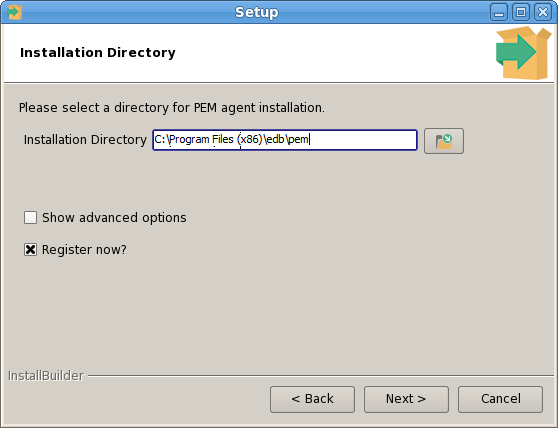
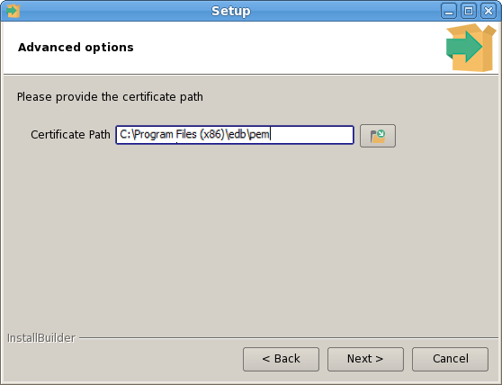
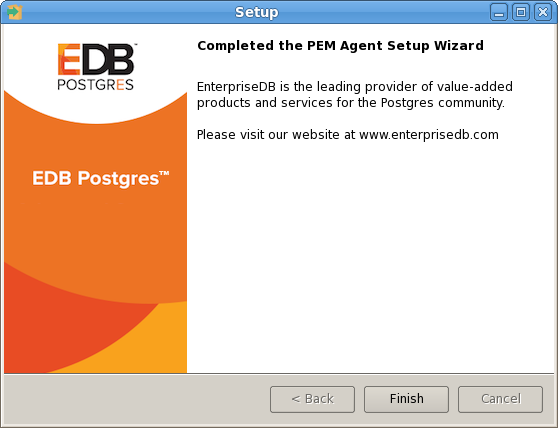

<div id="installing_pem_agent_on_windows" class="registered_link"></div>

To invoke the PEM agent installer, assume `Administrative` privileges and navigate into the directory that contains the installer. Then, invoke the installer with the command:

> `pem_agent-7.<x>.<x>-<x>-platform.exe`

The `Setup…` page opens, welcoming you to the PEM Agent installer.


Click `Next` to continue to the `License Agreement`.


Carefully review the license agreement before highlighting the appropriate radio button and accepting the agreement; click `Next` to continue to the `Installation Directory` dialog.



By default, the PEM agent is installed in the `/home/opt/PEM directory`. You can accept the default installation directory, or modify the contents of the `Installation Directory` field, specifying an alternate installation directory for the PEM agent.

By default, the PEM agent installer places a certificate in the Administrator’s `%APPDATA%\pem` directory. Check the `Show advanced options` box to indicate that you would like the PEM agent installer to include a dialog that allows you to specify an alternate path for the certificate file.

Check the box next to `Register now?` to instruct the installer to register the newly installed PEM agent with the PEM server.

Click `Next` to continue to the `PEM Server Installation Details` dialog.


Enter the connection details for the PEM server on the `PEM server installation details` dialog:

-   Specify the name or IP address of the system on which the PEM database server resides in the `Host` field. Please note: If the PEM-HTTPD web server and PEM database are hosted on different systems, you must specify *the host of the PEM database*.
-   Specify the name of the database superuser in the `User Name` field.
-   Specify the password associated with the database superuser in the `Password` field.
-   Specify the port that PostgreSQL is monitoring in the `Port` field.

Click `Next` to continue. The installer will attempt to connect to the server to verify that the details are correct.

<div class="note">

<div class="title">

Note

</div>

The PEM server must allow connections from the PEM agent installer. If you encounter a connection error, confirm the connection properties specified on the `PEM Server Installation Details` dialog are correct, and confirm that the `pg_hba.conf` file (on the PEM server) will allow a connection to the server described in the error message.

</div>


The tree control displayed in the `Browser` panel of the PEM web interface displays the value entered in the `Description` field to identify the PEM agent. Specify a descriptive name for the agent, such as the hostname of the machine the agent is installed on, or a name that reflects the host's functionality.

Provide a descriptive name, or accept the default provided by the PEM agent host, and click `Next` to continue.

If you checked the `Show advanced options` checkbox, the `Advanced options` dialog opens.



By default, the PEM agent installer places the certificate in the `/root/.pem directory`. Specify an alternate path for the certificate or accept the default and click `Next`.

The wizard is now ready to install the PEM agent; click `Back` to amend the installation directory, or `Next` to continue.


Click `Next` on the `Ready to Install` dialog to instruct the installer to copy files to the system and register the agent on the PEM server.


The PEM agent installer displays progress bars to mark the PEM agent's installation progress.



When the installation has completed, the PEM agent will be running and reporting operating system and host data to the PEM server. To start monitoring Postgres instances on the host of the PEM agent, they must now be added to PEM’s enterprise directory and bound to the agent.

## Invoking the Agent Installer from the Command Line

The command line options of the PEM agent installers offer functionality in situations where a graphical installation may not work because of limited resources or system configuration. You can:

-   Include the `--mode unattended` option when invoking the installer to perform an installation without additional user input.
-   Include the `--mode text` option when invoking the installer to perform an installation from the command line with an interactive installer.

Not all command line options are suitable for all platforms. For a complete reference guide to the command line options, include the `--help` option when you invoke the installer.

### Invoking the PEM Agent Installer in Unattended Mode

You can perform an unattended PEM server installation by providing installation preferences on the command line when invoking the installer. Please note that the system on which you are installing the PEM server must have internet access.

Before invoking the PEM agent installer in unattended mode, you must:

-   install the PEM server; the `pg_hba.conf` file of the PEM server must allow connections from the host of the PEM agent.
-   disable SE Linux on the host of the PEM agent; for more information, see section [Software Prerequisites](../02_postgres_enterprise_manager_overview/#software_prerequisites).
-   ensure that the monitored Postgres database has SSL enabled, and is accepting connections.

You must have Administrator privileges to install the PEM agent. Use the following command to invoke the PEM agent installer in unattended mode:

> `pem-agent-7.<x>.<x>-windows-x64.exe --mode unattended`  
> `--pghost <pem_server_host_address> --pgport <pem_server_port>`  
> `--pguser postgres --pgpassword <pguser_password>`  
> `--agent_description <agent_name>`

Where:

> *pem_server_host_address* specifies the IP address of the host of the PEM server.
>
> *pem_server_port* specifies the port used by the backing PEM database; by default, the database uses port `5432`.
>
> *pguser_password* specifies the password associated with the PEM database superuser.
>
> *agent_name* specifies a descriptive name for the PEM agent.

### Invoking the PEM Agent Installer in Text Mode

You can invoke the PEM agent installer at the command line to perform an interactive installation if your system does not support a full graphical installation. Please note that the system on which you are installing the agent must have access to the PEM server.

You must have Administrative privileges to install the PEM server. You can invoke the PEM server installer with the following command:

```
pem-server-7.<x>.<x>-windows-x64.exe --mode text
```

**Example**

When you invoke the PEM agent installer, the installer welcomes you.

```
--------------------------------------------------------------------
Welcome to the Postgres Enterprise Manager (PEM) Agent Setup Wizard.
--------------------------------------------------------------------
```

Before installing the PEM server, you must review and accept the terms of the PEM license agreement:

```
Please read the following License Agreement. You must accept the
terms of this agreement before continuing with the installation.

Press [Enter] to continue:
Do you accept this license? [y/n]:
-----------------------------------------------------------------
```

Next, you will be prompted for an installation directory; you can use the default installation directory, or specify an alternate location.

By default, the PEM agent installer places a certificate in the Administrator’s `%APPDATA%\pem` directory. Enter a `Y` after `Show advanced options` to access menu options that allow you to specify an alternate path for the certificate file.

```
Installation Directory
Please select a directory for PEM agent installation.
Installation Directory [/opt/edb/pem]:
Show advanced options [y/N]:
-----------------------------------------------------------------
```

When prompted, provide information about the PEM server installation:

```
PEM server installation details``
Please verify the PEM server installation details
Host [localhost]:
User Name [postgres]:
Password :
Port [5432]:
-----------------------------------------------------------------
```

You can provide a descriptive name for the agent, or press return to accept the default:

```
Agent Details
Please provide the agent description
Description [localhost]:
-----------------------------------------------------------------
```

The installer will prompt you before it proceeds with the installation; press Return to start the installation:

```
Setup is now ready to begin installing the PEM agent on your
computer.
Do you want to continue? [Y/n]:
Please wait while Setup installs the PEM agent on your computer.
Installing
0% ______________ 50% ______________ 100%
#########################################
```

The installer will notify you when the installation is complete:

```
EnterpriseDB is the leading provider of value-added products and services for the Postgres community.
Please visit our website at www.enterprisedb.com.
```

<div class="note">

<div class="title">

Note

</div>

When configuring a shell/batch script run by a Windows agent that has PEM 7.11 or later version installed, the `AllowBatchJobSteps` parameter must be set to `True` in the `agent.cfg` file. The pemagent will not execute any batch/shell script by default.

</div>
