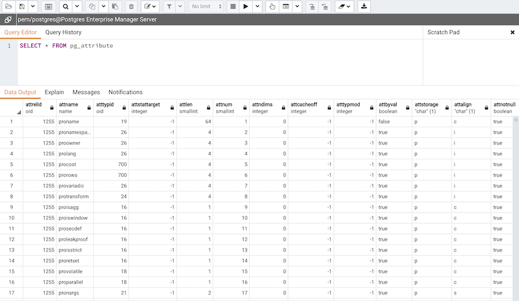
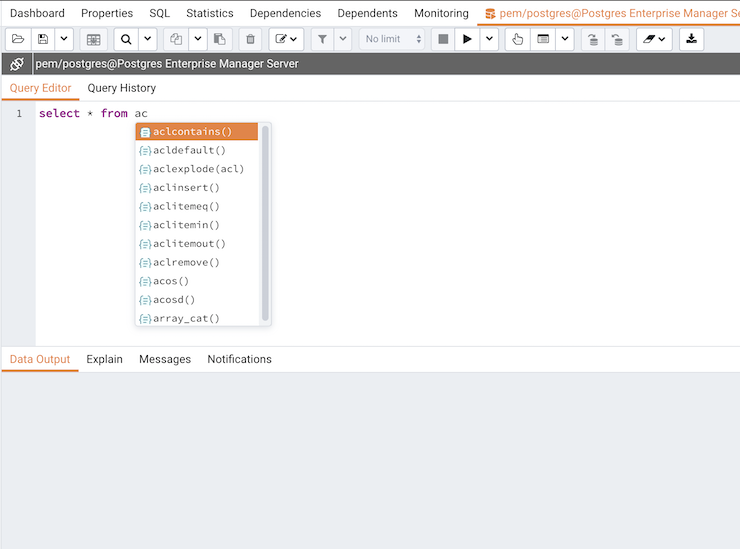
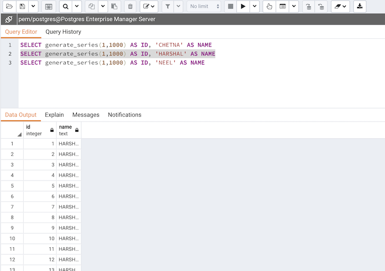
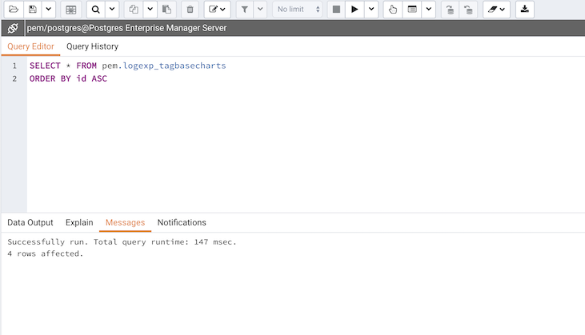
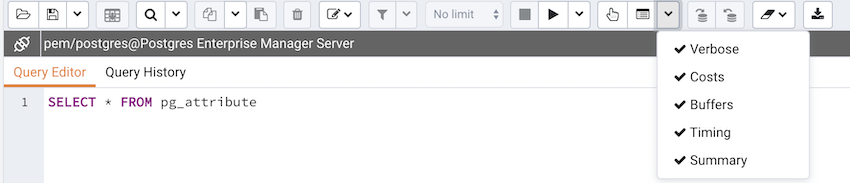
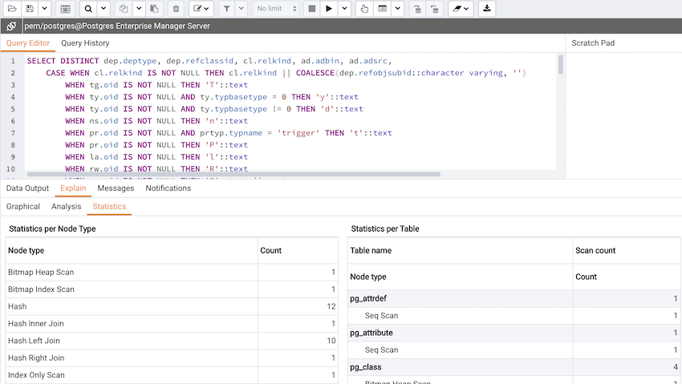
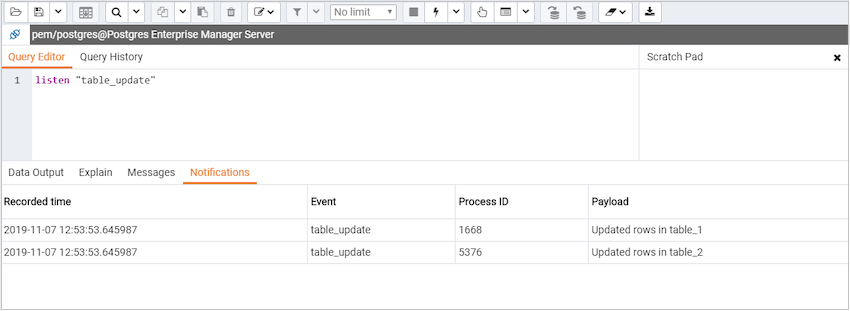
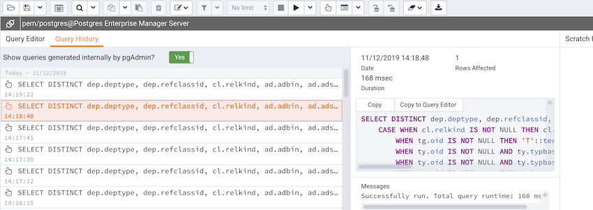
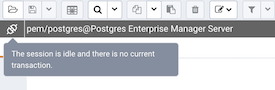
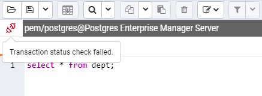

PEM contains a feature-rich Interactive Development Environment (IDE) that allows you to issue ad-hoc SQL queries against Postgres servers.

You can access the Query Tool via the *Query Tool* menu option on the *Tools* menu, or through the context menu of select nodes of the Browser tree control. The Query Tool allows you to:

-   Issue ad-hoc SQL queries.
-   Execute arbitrary SQL commands.
-   Edit the result set of a SELECT query if it is [updatable](#updatable-result-set).
-   Displays current connection and transaction status as configured by the user.
-   Save the data displayed in the output panel to a CSV file.
-   Review the execution plan of a SQL statement in either a text, a graphical format or a table format (similar to <https://explain.depesz.com>).
-   View analytical information about a SQL statement.

You can open multiple copies of the Query tool in individual tabs simultaneously. To close a copy of the Query tool, click the *X* in the upper-right hand corner of the tab bar.

The Query Tool features two panels:

-   The upper panel displays the *SQL Editor*. You can use the panel to enter, edit, or execute a query. It also shows the *History* tab which can be used to view the queries that have been executed in the session, and a *Scratch Pad* which can be used to hold text snippets during editing. If the Scratch Pad is closed, it can be re-opened (or additional ones opened) by right-clicking in the SQL Editor and other panels and adding a new panel.
-   The lower panel displays the *Data Output* panel. The tabbed panel displays the result set returned by a query, information about a query's execution plan, server messages related to the query's execution and any asynchronous notifications received from the server.

**The Query Tool Toolbar**

The *Query Tool* toolbar uses context-sensitive icons that provide shortcuts to frequently performed tasks. If an icon is highlighted, the option is enabled; if the icon is grayed-out, the task is disabled.

Hover over an icon to display a tool-tip that describes the icon's functionality:

<table style="width:9%;"><colgroup><col style="width: 1%" /><col style="width: 5%" /><col style="width: 1%" /></colgroup><thead><tr class="header"><th>Icon</th><th>Behavior</th><th>Shortcut</th></tr></thead><tbody><tr class="odd"><td><em>Open File</em></td><td>Click the <em>Open File</em> icon to display a previously saved query in the SQL Editor.</td><td>Accesskey + O</td></tr><tr class="even"><td><em>Save</em></td><td>
Click the <em>Save</em> icon to perform a quick-save of a previously saved query, or to access the <em>Save</em> menu:
<blockquote><ul><li>Select <em>Save</em> to save the selected content of the SQL Editor panel in a file.</li><li>Select <em>Save As</em> to open a new browser dialog and specify a new location to which to save the selected content of the SQL Editor panel.</li></ul></blockquote></td><td>Accesskey + S</td></tr><tr class="odd"><td><em>Save Data Changes</em></td><td>Click the <em>Save Data Changes</em> icon to save the data changes (insert, update, or delete) in the Data Output Panel to the server.</td><td>F6</td></tr><tr class="even"><td><em>Find</em></td><td>
Use the <em>Find</em> menu to search, replace, or navigate the code displayed in the SQL Editor:
<blockquote><ul><li>Select <em>Find</em> to provide a search target, and search the SQL Editor contents.</li><li>Select <em>Find next</em> to locate the next occurrence of the search target.</li><li>Select <em>Find previous</em> to move to the last occurrence of the search target.</li><li>Select <em>Pesistent find</em> to identify all occurrences of the search target within the editor.</li><li>Select <em>Replace</em> to locate and replace (with prompting) individual occurrences of the target.</li><li>Select <em>Replace all</em> to locate and replace all occurrences of the target within the editor.</li><li>Select <em>Jump</em> to navigate to the next occurrence of the search target.</li></ul></blockquote></td><td>
Cmd+F

Cmd+G

Cmd+Shift+G

Cmd+Shift+F

Alt+G
</td></tr><tr class="odd"><td><em>Copy</em></td><td>Click the <em>Copy</em> icon to copy the content that is currently highlighted in the Data Output panel. when in View/Edit data mode.</td><td>Accesskey + C</td></tr><tr class="even"><td><em>Paste</em></td><td>Click the <em>Paste</em> icon to paste a previously row into a new row when in View/Edit data mode.</td><td>Accesskey + P</td></tr><tr class="odd"><td><em>Delete</em></td><td>Click the <em>Delete</em> icon to mark the selected rows for deletion. These marked rows get deleted when you click the <em>Save Data Changes</em> icon.</td><td>Accesskey + D</td></tr><tr class="even"><td><em>Edit</em></td><td>
Use options on the <em>Edit</em> menu to access text editing tools; the options operate on the text displayed in the SQL Editor panel when in Query Tool mode:
<blockquote><ul><li>Select <em>Indent Selection</em> to indent the currently selected text.</li><li>Select <em>Unindent Selection</em> to remove indentation from the currently selected text.</li><li>Select <em>Inline Comment Selection</em> to enclose any lines that contain the selection in SQL style comment notation.</li><li>Select <em>Inline Uncomment Selection</em> to remove SQL style comment notation from the selected line.</li><li>Select <em>Block Comment</em> to enclose all lines that contain the selection in C style comment notation. This option acts as a toggle.</li></ul></blockquote></td><td>
Tab

Shift+Tab

Cmd+/

Cmd+.

Shift+Cmd+/
</td></tr><tr class="odd"><td><em>Filter</em></td><td>
Click the <em>Filter</em> icon to set filtering and sorting criteria for the data when in View/Edit data mode. Click the down arrow to access other filtering and sorting options:
<blockquote><ul><li>Click <em>Sort/Filter</em> to open the sorting and filtering dialogue.</li><li>Click <em>Filter by Selection</em> to show only the rows containing the values in the selected cells.</li><li>Click <em>Exclude by Selection</em> to show only the rows that do not contain the values in the selected cells.</li><li>Click <em>Remove Sort/Filter</em> to remove any previously selected sort or filtering options.</li></ul></blockquote></td><td>Accesskey + F</td></tr><tr class="even"><td>Limit Selector</td><td>Select a value in the <em>Limit Selector</em> to limit the size of the dataset to a number of rows.</td><td>Accesskey + R</td></tr><tr class="odd"><td><em>Stop</em></td><td>Click the <em>Stop</em> icon to cancel the execution of the currently running query.</td><td>Accesskey + Q</td></tr><tr class="even"><td><em>Execute/Refresh</em></td><td>
Click the <em>Execute/Refresh</em> icon to either execute or refresh the query highlighted in the SQL editor panel. Click the down arrow to access other execution options:
<blockquote><ul><li>Add a check next to <em>Auto-Rollback</em> to instruct the server to automatically roll back a transaction if an error occurs during the transaction.</li><li>Add a check next to <em>Auto-Commit</em> to instruct the server to automatically commit each transaction. Any changes made by the transaction will be visible to others, and durable in the event of a crash.</li></ul></blockquote></td><td>F5</td></tr><tr class="odd"><td><em>Explain</em></td><td>Click the <em>Explain</em> icon to view an explanation plan for the current query. The result of EXPLAIN is displayed graphically on the <em>Explain</em> tab of the output panel, and in text form on the <em>Data Output</em> tab.</td><td>F7</td></tr><tr class="even"><td><em>Explain analyze</em></td><td>
Click the <em>Explain analyze</em> icon to invoke an EXPLAIN ANALYZE command on the current query.

Navigate through the <em>Explain Options</em> menu to select options for the EXPLAIN command:
<blockquote><ul><li>Select <em>Verbose</em> to display additional information regarding the query plan.</li><li>Select <em>Costs</em> to include information on the estimated startup and total cost of each plan node, as well as the estimated number of rows and the estimated width of each row.</li><li>Select <em>Buffers</em> to include information on buffer usage.</li><li>Select <em>Timing</em> to include information about the startup time and the amount of time spent in each node of the query.</li><li>Select <em>Summary</em> to include the summary information about the query plan.</li></ul></blockquote></td><td>Shift+F7</td></tr><tr class="odd"><td><em>Commit</em></td><td>Click the <em>Commit</em> icon to commit the transaction.</td><td>Shift+CTRL+M</td></tr><tr class="even"><td><em>Rollback</em></td><td>Click the <em>Rollback</em> icon to rollback the transaction.</td><td>Shift+CTRL+R</td></tr><tr class="odd"><td><em>Clear</em></td><td>
Use options on the <em>Clear</em> drop-down menu to erase display contents:
<blockquote><ul><li>Select <em>Clear Query Window</em> to erase the content of the SQL Editor panel.</li><li>Select <em>Clear History</em> to erase the content of the <em>History</em> tab.</li></ul></blockquote></td><td>Accesskey + L</td></tr><tr class="even"><td><em>Download as CSV</em></td><td>Click the <em>Download as CSV</em> icon to download the result set of the current query to a comma-separated list. You can specify the CSV settings through <em>Preferences -&gt; SQL Editor -&gt; CSV output</em> dialogue.</td><td>F8</td></tr></tbody></table>

## The SQL Editor Panel

The *SQL editor* panel is a workspace where you can manually provide a query, copy a query from another source, or read a query from a file. The SQL editor features syntax coloring and auto-completion.

To use auto-complete, begin typing your query; when you would like the Query editor to suggest object names or commands that might be next in your query, press the Control+Space key combination. For example, type "\*SELECT \* FROM\* " (without quotes, but with a trailing space), and then press the Control+Space key combination to select from a popup menu of auto-complete options.

After entering a query, select the *Execute/Refresh* icon from the toolbar. The complete contents of the SQL editor panel will be sent to the database server for execution. To execute only a section of the code that is displayed in the SQL editor, highlight the text that you want the server to execute, and click the *Execute/Refresh* icon.

The message returned by the server when a command executes is displayed on the *Messages* tab. If the command is successful, the *Messages* tab displays execution details.

Options on the *Edit* menu offer functionality that helps with code formatting and commenting:

-   The auto-indent feature will automatically indent text to the same depth as the previous line when you press the Return key.
-   Block indent text by selecting two or more lines and pressing the Tab key.
-   Implement or remove SQL style or toggle C style comment notation within your code.

You can also **drag and drop** certain objects from the tree-view which can save time in typing long object names. Text containing the object name will be fully qualified with schema. Double quotes will be added if required. For functions and procedures, the function name along with parameter names will be pasted in the Query Tool.

## The Data Output Panel

The *Data Output* panel displays data and statistics generated by the most recently executed query.

### Data Output Tab

The *Data Output* tab displays the result set of the query in a table format. You can:

-   Select and copy from the displayed result set.
-   Use the *Execute/Refresh* options to retrieve query execution information and set query execution options.
-   Use the *Download as CSV* icon to download the content of the *Data Output* tab as a comma-delimited file.
-   Edit the data in the result set of a SELECT query if it is updatable.

A result set is updatable if:

-   All columns are either selected directly from a single table, or they are not actually a table column (e.g. concatenation of 2 columns). Only columns that are selected directly from the table are editable, other columns are read-only.
-   All the primary key columns or OIDs of the table are selected in the result set.

Any columns that are renamed or selected more than once are also read-only.

Note

To work with an updatable query result set, you must have `psycopg2` driver version 2.8 or above installed.

Editable and read-only columns are identified using pencil and lock icons (respectively) in the column headers.

An updatable result set is similar to the Data Grid in View/Edit Data mode, and can be modified in the same way.

If Auto-commit is off, the data changes are made as part of the ongoing transaction, if no transaction is ongoing a new one is initiated. The data changes are not committed to the database unless the transaction is committed.

If any errors occur during saving (for example, trying to save NULL into a column with NOT NULL constraint) the data changes are rolled back to an automatically created SAVEPOINT to ensure any previously executed queries in the ongoing transaction are not rolled back.

All rowsets from previous queries or commands that are displayed in the *Data Output* panel will be discarded when you invoke another query; open another query tool browser tab to keep your previous results available.

### Explain Tab

To generate the *Explain* or *Explain Analyze* plan of a query, click on *Explain* or *Explain Analyze* button in the toolbar.

More options related to *Explain* and *Explain Analyze* can be selected from the drop down on the right side of *Explain Analyze* button in the toolbar.

Please note that pgAdmin generates the *Explain \[Analyze]* plan in JSON format.

On successful generation of *Explain* plan, it will create three tabs/panels under the Explain panel.

### Graphical Tab

Hover over an icon on the *Graphical* tab to review information about that item; a popup window will display information about the selected object. For information on JIT statistics, triggers and a summary, hover over the icon on top-right corner; a similar popup window will be displayed when appropriate.

Please note that *EXPLAIN VERBOSE* cannot be displayed graphically.

Use the download button on top left corner of the *Explain* canvas to download the plan as an SVG file.

> **Note:** Download as SVG is not supported on Internet Explorer.

Note that the query plan that accompanies the *Explain analyze* is available on the *Data Output* tab.

### Analysis Tab

The *Analysis* tab shows the plan details in table format, it generates a format similar to the format available at *explain.depsez.com*. Each row of the table represents the data for a *Explain Plan Node*. The output may contain the node information, exclusive timing, inclusive timing, actual vs. planned rows, actual rows, planned rows, or loops. When you select a row, the child rows of that selected row are marked with an orange dot.

If the percentage of the exclusive/inclusive timings of the total query time is:

> Greater than 90 --> Red
>
> Greater than 50 --> Orange (between red and yellow)
>
> Greater than 10 --> Yellow
>
> If the planner has misestimated the number of rows (actual vs planned) by:
>
> 10 times --> Yellow color
>
> 100 times --> Orange (between Red and Yellow) color
>
> 1000 times --> Red color

### Statistics Tab

The *Statistics* tab displays information in two tables:

> -   `Statistics per Node Type` tells you how many times each node type was referenced.
> -   `Statistics per Table` tells you how many times each table was referenced by the query.

### Messages Tab

Use the *Messages* tab to view information about the most recently executed query:

If the server returns an error, the error message will be displayed on the *Messages* tab, and the syntax that caused the error will be underlined in the SQL editor. If a query succeeds, the *Messages* tab displays how long the query took to complete and how many rows were retrieved:

### Notifications Tab

Use the *Notifications* tab to view details of the asynchronous notifications that a client process may have sent:

You can see details such as recorded time of the asynchronous notification event, name of the event or channel, process ID of the client process that has sent the notification, and the payload string that might have been sent along with the notification.

## Query History Panel

Use the *Query History* tab to review activity for the current session:

The Query History tab displays information about recent commands:

-   The date and time that a query was invoked.
-   The text of the query.
-   The number of rows returned by the query.
-   The amount of time it took the server to process the query and return a result set.
-   Messages returned by the server (not noted on the *Messages* tab).
-   The source of the query (indicated by icons corresponding to the toolbar).

You can show or hide the queries generated internally by pgAdmin (during 'View/Edit Data' or 'Save Data' operations).

To erase the content of the *Query History* tab, select *Clear history* from the *Clear* drop-down menu.

Query History is maintained across sessions for each database on a per-user basis when running in Query Tool mode. In View/Edit Data mode, history is not retained. By default, the last 20 queries are stored for each database. This can be adjusted in config_local.py by overriding the MAX_QUERY_HIST_STORED value.

## Connection Status

Use the *Connection status* feature to view the current connection and transaction status by clicking on the status icon in query tool:

If the server gets disconnected, the connection icon at the top left corner turns red and a tool tip is displayed. The icon turns green once you restore the server connection.

