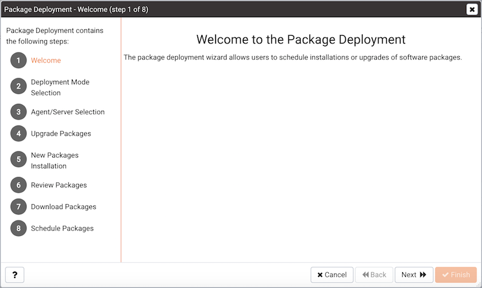
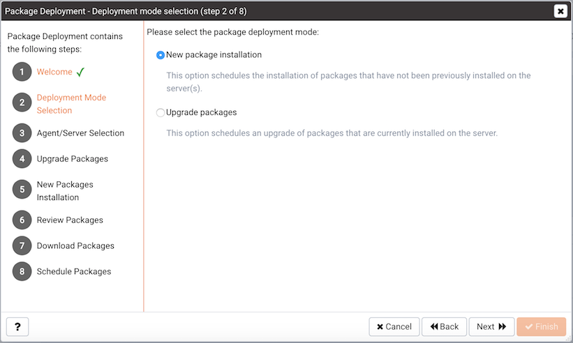
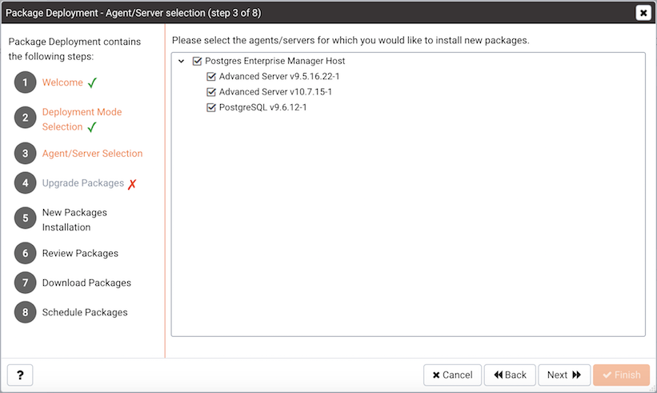
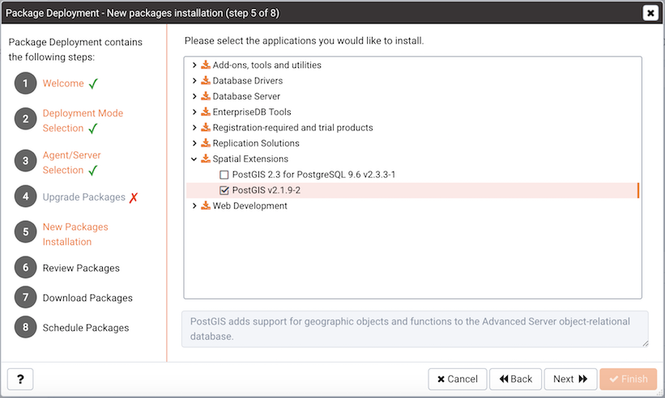
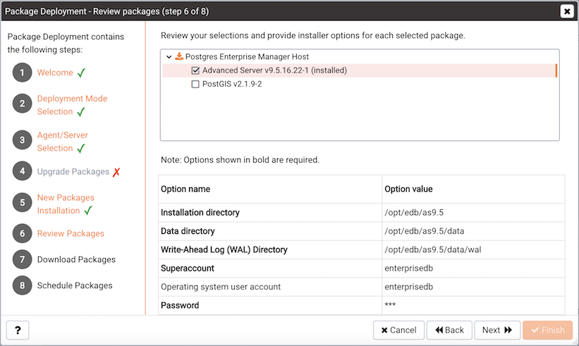
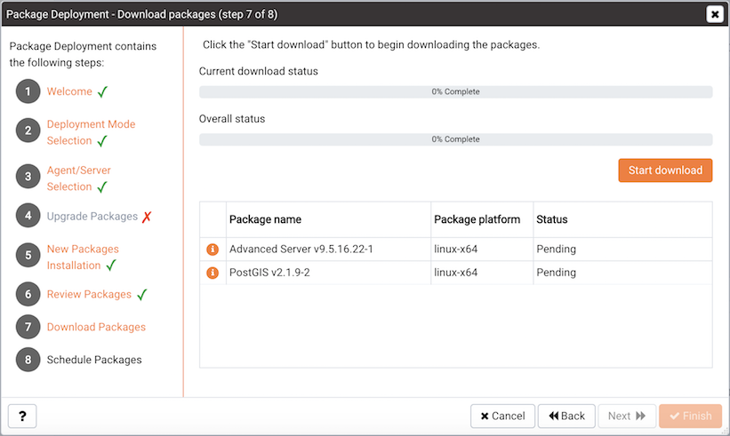
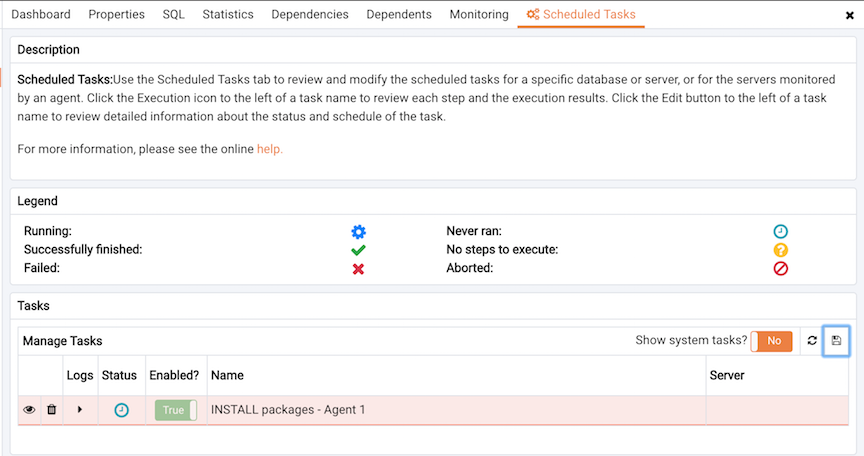
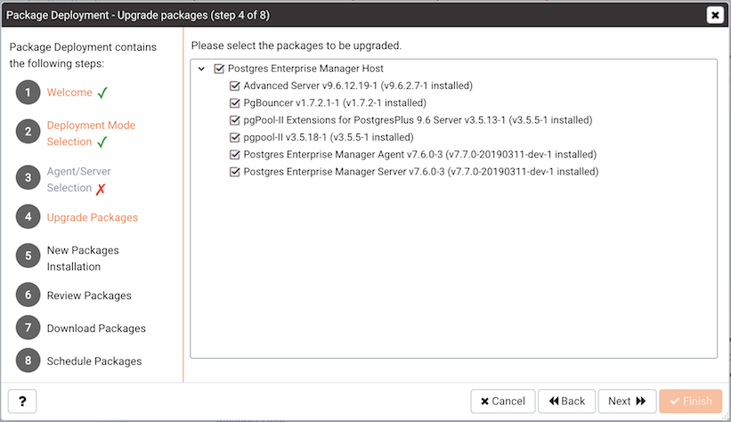

The `Package Deployment` wizard walks you through the process of scheduling the installation of new packages or upgrades of existing packages. The PEM server must have internet access to deploy packages.

Please note: the Package Deployment wizard is deprecated, and will not be available in future releases of PEM.

Before invoking the `Package Deployment` wizard, you must modify the PEM agent configuration file and restart the agent; first on the server, and then on each system where packages will be deployed.

-   On Linux, modify the `agent.cfg` file, setting the `allow_package_management` property to `true`. The configuration file is located in: `/usr/edb/pem/agent/etc`
-   On Windows, use the Registry Editor to modify the registry entry for the agent, setting the value of the `AllowPackageManagement` property to `true`. The entry is located in: `HKEY_LOCAL_MACHINE\SOFTWARE\Wow6432Node\EnterpriseDB\PEM\agent`

After modifying the agent configuration properties, you must restart the PEM agent.

-   On a Linux host, you can use the `service` command:

    > `service pemagent restart`

-   On a Windows host, use the `Services` dialog to restart the PEM agent service:

    > `Postgres Enterprise Manager - pemAgent`

After enabling package management and restarting the agents, you should also confirm that agent-level probes are enabled on the host of the PEM server, and on any system on which a package will be deployed. To access the `Manage Probes` tab, highlight the name of the PEM agent in the PEM client tree control, and select `Manage Probes...` from the `Management` menu. The following probes must be enabled:

-   the Package Catalog probe on the PEM server host.
-   the Installed Packages probe on any system on which you wish to install packages.

Then, to open the `Package Deployment` wizard, select `Package Deployment...` from the `Management` menu. The `Package Deployment wizard Welcome...` dialog opens.

Click `Next` to continue.

Use the radio buttons on the `Deployment Mode Selection` dialog to specify the type of deployment that you are scheduling:

-   Select the `New Package Installation` radio button to schedule the installation of a package that has not been previously installed on the server. This is the default.
-   Select the `Upgrade Packages` radio button to schedule an upgrade of packages that are currently installed on the server.

When you've made a selection, click `Next` to continue.

## Installing a New Package

If you select `New Package Installation` on the `Deployment Mode Selection` dialog, the Package Deployment wizard opens the `Agent/Server Selection` dialog, allowing you to specify the agents and servers on which the new applications will be installed.

Expand the tree control, and check the box next to each server on which you wish to install a new package and click `Next`.

The `New Packages Installation` dialog opens.

Expand the tree control to review a list of applications that are available for installation. Check the box next to an application name to mark the application for installation. Note that the Package Deployment wizard will automatically check the boxes next to any supporting applications required by the applications you select.

When you've selected all of the packages you wish to add, click `Next` to continue.

Review the list of packages that will be installed, and (if prompted) provide any options requested. Click `Next` to continue.

Click the `Start Download` button on the `Download Packages` dialog to instruct the Package Deployment wizard to download application installers. During the download, you can click the `Cancel Download` button to abort the batch download. When the download completes, click `Next`.

Use the options on the `scheduling` dialog to schedule an installation time for the new packages:

-   Set the slider next to `Deploy Now` to `Yes` to instruct the respective PEM agents to install the downloaded packages immediately. Please note that if a package requires a server restart, current user sessions may be interrupted.
-   Set the slider next to `Deploy Now` to `No` and use the `Time` selector to specify a later date and time that you would like the package installation to begin.

Click `Finish` to install the downloaded packages or schedule the installation and exit the package deployment wizard.

If you have scheduled an installation for a later date/time, the scheduled task will be displayed on the `Scheduled Tasks` tab. To open the `Scheduled Tasks` tab, select `Scheduled Tasks...` from the `Management` menu.

### Reviewing Scheduled Tasks

The `Scheduled Tasks` tab features a legend, displaying the icons that identify the status of each task. The `Manage Tasks` table displays a list of tasks that are pending execution or recently completed.

Set `Show system tasks?` to `Yes` to display system tasks; if it is set to `No`, only user-defined tasks are displayed. System tasks are displayed with a grey background, and may not be modified.

Highlight the name of a user-defined task and select the `Edit` icon to access detailed information about the selected task:

-   Use the `Steps` drop-down to view a list of the steps performed during the selected task.
-   The `Status` field lists the status of the current task.
-   The `Enabled?` switch displays `Yes` if the task is enabled; `No` if the task is disabled.
-   The `Name` field displays the name of the task.
-   The `Agent` field displays the name of the agent responsible for executing the task.
-   The `Last run` field displays the date and time of the last execution of the task.
-   The `Next run` field displays the date and time of the next scheduled execution of the task.
-   The `Created` field displays the date and time that the task was defined.

To remove a task, click the `Delete` icon located to the left of a task's name. The task will be marked for deletion, and removed when the tab refreshes.

## Upgrading an Installed Package

If you select `Upgrade Packages` on the `Deployment Mode Selection` dialog, the Package Deployment wizard opens a dialog that allows you to specify which agents and packages will be updated.

Expand the tree control, and check the box next to package you wish to upgrade. Click `Next` to continue.

Review the list packages, and provide any installation options requested in the `Option Name/Option Value` fields. When you've reviewed the list, click `Next` to continue.

Click the `Start Download` button to instruct the `Package Deployment` wizard to download application installers. During the download, you can click the `Cancel Download` button to abort the batch download. When the download completes, click `Next`.

Use the options on the scheduling dialog to schedule an installation time for the new packages:

-   Set the slider next to `Deploy Now` to `Yes` to instruct the respective PEM agents to install the downloaded packages immediately. Please note that if a package requires a server restart, current user sessions may be interrupted.
-   Set the slider next to `Deploy Now` to `No` and use the `Time` selector to specify a later date and time that you would like the package installation to begin.

Click `Finish` to install the downloaded packages or schedule the installation and exit the package deployment wizard. If you have scheduled the update for a later date/time, the scheduled task will be included on the Scheduled Tasks dialog (accessed through the `Scheduled Tasks...` menu selection on the agent's context menu).
