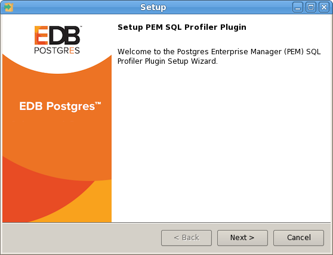
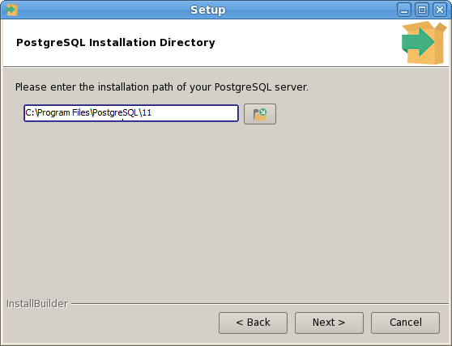
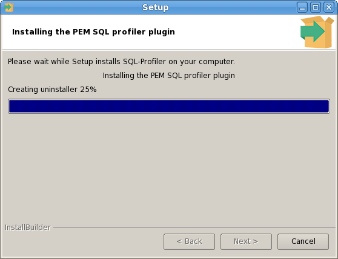
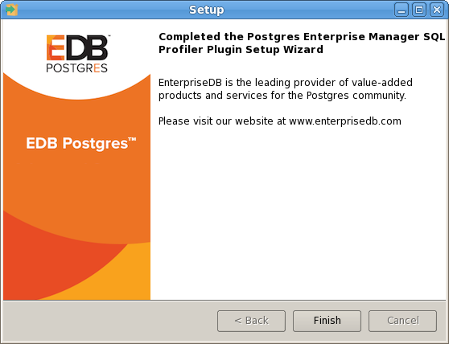
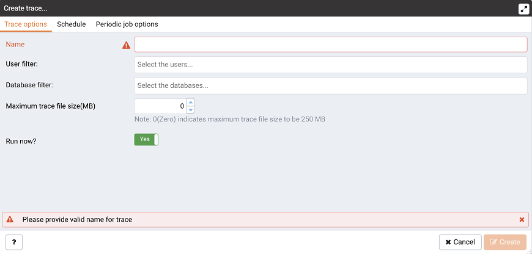

The SQL Profiler Plugin allows you to profile a server's workload. You must install the plugin on each server on which you wish to use SQL Profiler. For example, if you have a host running PostgreSQL 9.6 and PostgreSQL 10, you must install two versions of the plugin, one for each server.

SQL Profiler is officially supported only on the EnterpriseDB distributions of PostgreSQL version 9.4 or above and Advanced Server version 9.4 or above. The plugin is distributed via StackBuilder, or is available from the [EnterpriseDB website](https://www.enterprisedb.com/advanced-downloads)

The plugin is also distributed and installed with the server component of the Advanced Server installer.

The SQL Profiler plugin may be installed on servers with or without a PEM agent, however traces can only be run in ad-hoc mode on unmanaged servers, and may only be scheduled on managed servers.

Follow the installation steps listed below to install the plugin for PostgreSQL before continuing to the `Configuration` section. If you are using Advanced Server, you can skip ahead to the `Configuration` section.

You can use the graphical installer to install any version of SQL Profiler on Windows platform.

On Linux, if you have installed your database server through graphical installer then you must use the graphical installer to install the SQL Profiler. If you have installed your database server using the RPM package, then you must use the RPM package to install the SQL Profiler.

## Installing SQL Profiler using Graphical Installer

To invoke the SQL Profiler graphical installer, assume superuser privileges (or `Administrator` privileges on Windows), navigate into the directory that contains the installer, and invoke the installer with the command:

> `postgresql<pg_version>-sqlprofiler-<sql_profiler_version>`

Where, `pg_version` is the version of your postgres and `sql_profiler_version` is the version of SQL Profiler.

The SQL Profiler installer welcomes you to the Setup Wizard.

Click `Next` to continue to the `License Agreement`.

Carefully review the license agreement before highlighting the appropriate radio button and accepting the agreement; click `Next` to continue to the `Installation Directory` dialog.

Specify an alternate location for the installation directory, or accept the default location and click `Next` to continue.

The wizard is now ready to install the SQL Profiler plugin. Click `Next` to continue.

The SQL Profiler plugin installer displays progress bars as it copies files to your system.

When the installation is complete, the SQL Profiler plugin is ready to be configured.

## Installing SQL Profiler using RPMs

You can install SQL Profiler using rpm on RHEL or Centos 6 or 7, using yum command as root user:

> `yum install postgresql<pg_version>-sqlprofiler-<sql_profiler_version>`

Where, `pg_version` is the version of your postgres and `sql_profiler_version` is the version of SQL Profiler.

## Configuring SQL Profiler

The SQL Profiler plugin is not automatically enabled when the installation process completes. This allows you to restart the server at a convenient time, and prevents the plugin from being loaded unnecessarily on systems where it is not required on a continual basis.

Use the following steps to enable the plugin:

1.  Edit the `postgresql.conf` file on the server you wish to profile, modifying the `shared_preload_libraries` parameter as shown below:

    > `shared_preload_libraries = '$libdir/sql-profiler'`

2.  Restart the Postgres server.

3.  Using the `Query Tool` or the `psql` command line interface, run the `sql-profiler.sql` script in the database specified as the `Maintenance Database` on the server you wish to profile. If you are using:

-   PostgreSQL, the default maintenance database is `postgres`.
-   Advanced Server, the default maintenance database is `edb`.

To use the PEM Query Tool to run the script, highlight the name of the maintenance database in the `Browser` tree control, and navigate through the `Tools` menu to select `Query tool`. When the Query Tool opens, use the `Open` option on the `Files` menu to open a web browser and navigate to the `sql-profiler.sql` script. By default, the `sql-profiler.sql` script is located in the `contrib` folder, under your Postgres installation.

When the script opens in the `SQL Editor` panel of the Query Tool, highlight the content of the script in the SQL Editor and select the `Execute` option from the `Query` menu (or click the `Execute` icon) to invoke the script and configure SQL Profiler.

You can also use the psql command line to invoke the configuration script. The following command uses psql to invoke the `sql-profiler.sql` script on an Advanced Server database on a Linux system:

> `$ /usr/edb/as10/bin/psql -U postgres postgres <`  
> `/usr/edb/as10/share/contrib/sql-profiler.sql`

After configuring SQL Profiler, it is ready to use with all databases that reside on the server.

To access SQL Profiler functionality, highlight the name of the database in the PEM `Browser` tree control; navigate through `Server` option under `Tools` menu to the `SQL Profiler` pull-aside menu. Menu options allow you to manage your SQL traces:

-   Select `Create trace`… to define a new trace.
-   Select `Open trace`… to open an existing trace.
-   Select `Delete trace(s)`… to delete one or more traces.
-   Select `View scheduled trace(s)`… to review a list of scheduled traces.

For more information about using SQL Profiler, consult the online help text for SQL Profiler (accessed through the `Help` menu) or the *PEM Administrator's Guide*.
