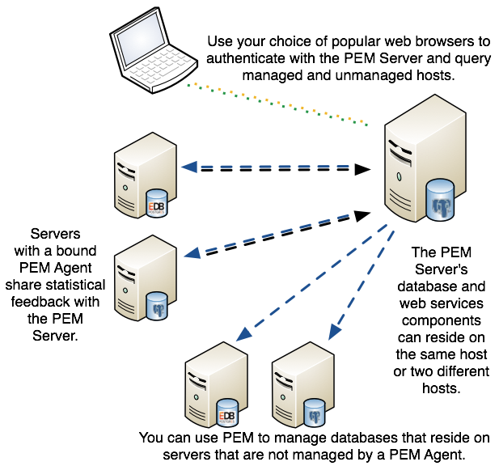

Postgres Enterprise Manager (PEM) consists of components that provide the management and analytical features of PEM:

-   **PEM server:** The PEM server is used as the data repository for monitoring data and as a server to which both Agents and Clients connect. The PEM server consists of an instance of PostgreSQL and an associated database for storage of monitoring data, and a server that provides web services.

-   **PEM web interface:** The PEM web interface allows you to manage and monitor Postgres servers and utilize PEM extended functionality. The web interface software is installed with the PEM server, and is accessed via your choice of web browser.

-   **PEM Agent:** The PEM Agent is responsible for executing tasks and reporting statistics from the Agent host and monitored Postgres instances to the PEM server. A single PEM Agent can monitor multiple installed instances of Postgres that reside on one or many hosts.

    The PEM Agent installer creates two executables: the PEM worker (`pemworker`) and the PEM Agent (`pemagent`). Each PEM worker has a corresponding PEM Agent that you can use to start or stop the PEM worker. The PEM Agent will also restart the PEM worker should it terminate unexpectedly.

    The PEM worker log file contains information related to PEM worker activity (probe activities, heartbeat responses, etc.), and is stored in `/var/log/pem/worker.log`.

-   **SQL Profiler plugin:** This plugin to the Postgres server is used to generate the monitoring data used by the SQL Profiler tool. Installation of the SQL Profiler plugin is optional, but the plugin must be installed into each instance of Postgres you wish to profile. The SQL Profiler may be used with any supported version of an EnterpriseDB distribution of a PostgreSQL server or an Advanced Server (not just those managed through the PEM server).See the [PEM SQL Profiler User's Guide](https://www.enterprisedb.com/edb-docs/p/edb-postgres-enterprise-manager) for details and supported versions.

The architectural diagram below illustrates the relationship between the various servers and workstations involved in a typical PEM installation.

## Hardware Prerequisites

For optimum performance when monitoring servers and rendering dashboards, we recommend installing PEM on a system with at least:

> -   4 CPU cores
> -   8 GB of RAM
> -   100 GB of Storage

Additional disk space is required for data storage. Please note that resource usage will vary based on which probes are defined and enabled, and the activity level on the monitored databases. Monitoring server resources (as you use PEM) will let you know when you need to expand your initial system configuration.

## Software Prerequisites

**Platforms and Versions Support**

> For information about the platforms and versions supported by PEM, visit the EnterpriseDB website at:
>
> > <https://www.enterprisedb.com/services-support/edb-supported-products-and-platforms>

**Modifying the pg_hba.conf File**

> The `pg_hba.conf` file manages connections for the Postgres server. You must ensure that the `pg_hba.conf` file on each monitored server allows connections from the PEM server, the monitoring PEM Agent, and the host of the PEM-HTTPD server.
>
> For information about modifying the `pg_hba.conf` file, see the *PEM Administrator's Guide* available at:
>
> > <https://www.enterprisedb.com/edb-docs>
>
> Information about managing authentication is also available in the Postgres core documentation available at:
>
> > <https://www.postgresql.org/docs/current/static/auth-pg-hba-conf.html>

**Firewall Restrictions**

> Please note that you must adjust your firewall to allow communication between PEM components.

**Supported Locales**

> Currently, the PEM server and web interface support a locale of `English(US) en_US` and use of a period (.) as a language separator character. Using an alternate locale, or a separator character other than a period may result in errors.
