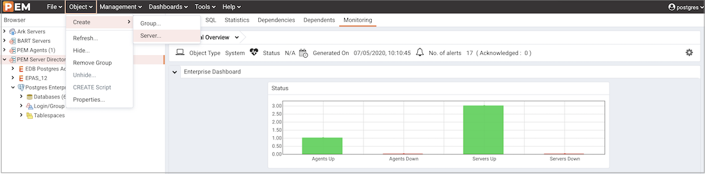
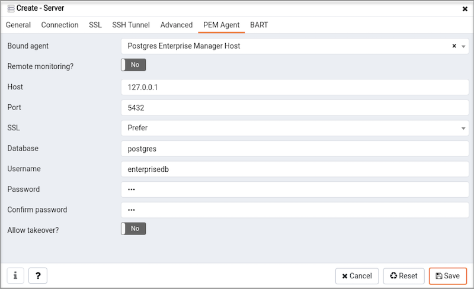
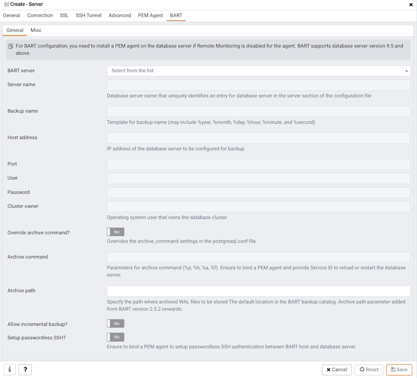
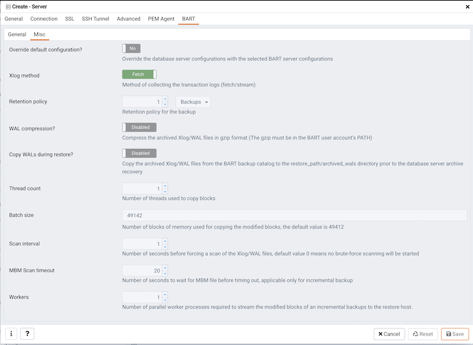

Before you can manage or monitor a server with PEM, you must register the server with PEM, and bind an agent. A server may be bound to a remote agent (an agent that resides on a different host), but if the agent does not reside on the same host, it will not have access to all of the statistical information about the instance.

## Manually Registering a Server

To manage or monitor a server with PEM, you must:

-   Register your Advanced Server or PostgreSQL server with the PEM server.
-   Bind the server to a PEM agent.

You can use the `Create - Server` dialog to provide registration information for a server, bind a PEM agent, and display the server in PEM client tree control. To open the `Create - Server` dialog, navigate through the `Create` option on the `Object` menu (or the context menu of a server group) and select `Server…`.

!!! Note
    You must ensure the `pg_hba.conf` file of the Postgres server that you are registering allows connections from the host of the PEM client before attempting to connect.

Use the fields on the `General` tab to describe the general properties of the server:

-   Use the `Name` field to specify a user-friendly name for the server. The name specified will identify the server in the PEM `Browser` tree control.
-   You can use groups to organize your servers and agents in the tree control. Using groups can help you manage large numbers of servers more easily. For example, you may want to have a production group, a test group, or LAN specific groups. Use the `Group` drop-down listbox to select the server group in which the new server will be displayed.
-   Use the `Team` field to specify a Postgres role name. Only PEM users who are members of this role, who created the server initially, or have superuser privileges on the PEM server will see this server when they logon to PEM. If this field is left blank, all PEM users will see the server.
-   Use the `Background` color selector to select the color that will be displayed in the PEM tree control behind database objects that are stored on the server.
-   Use the `Foreground` color selector to select the font color of labels in the PEM tree control for objects stored on the server.
-   Check the box next to `Connect now?` to instruct PEM to attempt a server connection when you click the Save button. Leave `Connect now?` unchecked if you do not want the PEM client to validate the specified connection parameters until a later connection attempt.
-   Provide notes about the server in the `Comments` field.

Use fields on the `Connection tab` to specify connection details for the server:

-   Specify the IP address of the server host, or the fully qualified domain name in the `Host name/address` field. On Unix based systems, the address field may be left blank to use the default PostgreSQL Unix Domain Socket on the local machine, or may be set to an alternate path containing a PostgreSQL socket. If you enter a path, the path must begin with a "/".
-   Specify the port number of the host in the `Port` field.
-   Use the `Maintenance database` field to specify the name of the initial database that PEM will connect to, and that will be expected to contain `pgAgent` schema and `adminpack` objects installed (both optional). On PostgreSQL 8.1 and above, the maintenance DB is normally called `postgres`; on earlier versions `template1` is often used, though it is preferrable to create a `postgres` database to avoid cluttering the template database.
-   Specify the name that will be used when authenticating with the server in the `Username` field.
-   Provide the password associated with the specified user in the `Password` field.
-   Check the box next to `Save password?` to instruct PEM to store passwords in encrypted format in PEM backend database for later reuse. Each password is stored on a per user, per server basis, and won't be shared with other team members. PEM will use the saved password to connect the database server next time. To remove a saved password, disconnect the database server first, and then use the `Clear Saved Password` menu item from the `Object/Context` menu.
-   Use the `Role` field to specify the name of the role that is assigned the privileges that the client should use after connecting to the server. This allows you to connect as one role, and then assume the permissions of another role when the connection is established (the one you specified in this field). The connecting role must be a member of the role specified.

Use the fields on the `SSL` tab to configure SSL:

-   Use the drop-down list box in the `SSL mode` field to select the type of SSL connection the server should use. For more information about using SSL encryption, see the PostgreSQL documentation at:

    <https://www.postgresql.org/docs/current/static/libpq-ssl.html>

You can use the platform-specific file manager dialog to upload files that support SSL encryption to the server. To access the file manager, click the icon that is located to the right of each of the following fields:

-   Use the `Client certificate` field to specify the file containing the client SSL certificate. This file will replace the default `~/.postgresql/postgresql.crt` file if PEM is installed in Desktop mode, and `<STORAGE_DIR>/<USERNAME>/.postgresql/postgresql.crt` if PEM is installed in Web mode. This parameter is ignored if an SSL connection is not made.
-   Use the `Client certificate` key field to specify the file containing the secret key used for the client certificate. This file will replace the default `~/.postgresql/postgresql.key` if PEM is installed in Desktop mode, and `<STORAGE_DIR>/<USERNAME>/.postgresql/postgresql.key` if PEM is installed in Web mode. This parameter is ignored if an SSL connection is not made.
-   Use the `Root certificate` field to specify the file containing the SSL certificate authority. This file will replace the default `~/.postgresql/root.crt` file. This parameter is ignored if an SSL connection is not made.
-   Use the `Certificate revocation list` field to specify the file containing the SSL certificate revocation list. This list will replace the default list, found in `~/.postgresql/root.crl`. This parameter is ignored if an SSL connection is not made.
-   When `SSL compression?` is set to `True`, data sent over SSL connections will be compressed. The default value is `False` (compression is disabled). This parameter is ignored if an SSL connection is not made.

**Warning:** Certificates, private keys, and the revocation list are stored in the per-user file storage area on the server, which is owned by the user account under which the PEM server process is run. This means that administrators of the server may be able to access those files; appropriate caution should be taken before choosing to use this feature.

Use the fields on the `SSH Tunnel` tab to configure SSH Tunneling. You can use a tunnel to connect a database server (through an intermediary proxy host) to a server that resides on a network to which the client may not be able to connect directly.

-   Set `Use SSH tunneling` to `Yes` to specify that PEM should use an SSH tunnel when connecting to the specified server.
-   Specify the name or IP address of the SSH host (through which client connections will be forwarded) in the `Tunnel host` field.
-   Specify the port of the SSH host (through which client connections will be forwarded) in the `Tunnel port` field.
-   Specify the name of a user with login privileges for the SSH host in the `Username` field.
-   Specify the type of authentication that will be used when connecting to the SSH host in the `Authentication` field.
-   Select `Password` to specify that PEM will use a password for authentication to the SSH host. This is the default.
-   Select `Identity file` to specify that PEM will use a private key file when connecting.
-   If the SSH host is expecting a private key file for authentication, use the `Identity file` field to specify the location of the key file.
-   If the SSH host is expecting a password, use the `Password` field to specify the password, or if an identity file is being used, the passphrase.

Use fields on the `Advanced` tab to specify details that are used to manage the server:

-   Specify the IP address of the server host in the `Host Address1` field.

-   Use the `DB restriction` field to specify a SQL restriction that will be used against the [pg_database](http://www.postgresql.org/docs/current/interactive/catalog-pg-database.html) table to limit the databases displayed in the tree control. For example, you might enter: `'live_db'`, `'test_db'` to instruct the PEM browser to display only the `live_db` and `test_db` databases. Note that you can also limit the schemas shown in the database from the database properties dialog by entering a restriction against [pg_namespace](http://www.postgresql.org/docs/current/interactive/catalog-pg-namespace.html).

-   Use the `Password file` field to specify the location of a password file (`.pgpass`). The `.pgpass` file allows a user to login without providing a password when they connect. It must be present on the PEM Server. For more information, see the Postgres documentation at:

    <http://www.postgresql.org/docs/current/static/libpq-pgpass.html>

-   Use the `Service ID` field to specify parameters to control the database service process. For servers that are stored in the Enterprise Manager directory, enter the service ID. On Windows machines, this is the identifier for the Windows service. On Linux machines, the name of the init script used to start the server is `/etc/init.d` and the name of the systemd script to start the server is systemctl. For example, the name of the Advanced Server 11 service is `edb-as-11`. For local servers, the setting is operating system dependent:

    -   If the PEM client is running on a Windows machine, it can control the postmaster service if you have sufficient access rights. Enter the name of the service. In case of a remote server, it must be prepended by the machine name (e.g. `PSE1\pgsql-8.0`). PEM will automatically discover services running on your local machine.
    -   If the PEM client is running on a Linux machine, it can control processes running on the local machine if you have enough access rights. Provide a full path and needed options to access the `pg_ctl` program. When executing service control functions, PEM will append status/start/stop keywords to this. For example:

        `sudo /usr/pgsql-x/bin/pg_ctl -D /var/lib/pgsql/x/data` 
        where `x` is the version of the PostgreSQL database server.

-   If the server is a member of a Failover Manager cluster, you can use PEM to monitor the health of the cluster and to replace the primary node if necessary. To enable PEM to monitor Failover Manager, use the `EFM cluster name` field to specify the cluster name. The cluster name is the prefix of the name of the Failover Manager cluster properties file. For example, if the cluster properties file is named `efm.properties`, the cluster name is `efm`.

-   If you are using PEM to monitor the status of a Failover Manager cluster, use the `EFM installation path` field to specify the location of the Failover Manager binary file. By default, the Failover Manager binary file is installed in `/usr/edb/efm-x.x/bin`, where `x.x` specifies the Failover Manager version.

Use fields on the `PEM Agent` tab to specify connection details for the PEM agent:

-   Select an Enterprise Manager agent using the drop-down listbox to the right of the `Bound agent` label. One agent can monitor multiple Postgres servers.

-   Move the `Remote monitoring?` slider to `Yes` to indicate that the PEM agent does not reside on the same host as the monitored server. When remote monitoring is enabled, agent level statistics for the monitored server will not be available for custom charts and dashboards, and the remote server will not be accessible by some PEM utilities (such as Audit Manager, Capacity Manager, Log Manager, Postgres Expert and Tuning Wizard).

-   Enter the IP address or socket path that the agent should use when connecting to the database server in the `Host` field. By default, the agent will use the host address shown on the `General` tab. On a Unix server, you may wish to specify a socket path, e.g. `/tmp`.

-   Enter the `Port` number that the agent will use when connecting to the server. By default, the agent will use the port defined on the `Properties` tab.

-   Use the drop-down listbox in the `SSL` field to specify an SSL operational mode; specify require, prefer, allow, disable, verify-ca or verify-full. For more information about using SSL encryption, see the [PostgreSQL documentation](https://www.postgresql.org/docs/12.1/libpq-ssl.html).

-   Use the `Database` field to specify the name of the database to which the agent will initially connect.

-   Specify the name of the role that agent should use when connecting to the server in the `User name` field. Note that if the specified role is not a database superuser, then some of the features will not work as expected. For the list of features that do not work if the specified role is not a database superuser, see [Agent privileges](../pem_agent/03_managing_pem_agent/#managing_pem_agent).

    If you are using Postgres version 10 or above, you can use the `pg_monitor` role to grant the required privileges to a non-superuser. For information about `pg_monitor` role, see [Default Roles](https://www.postgresql.org/docs/current/default-roles.html).

-   Specify the name of the user that agent should use when connecting to the server in the `User name` field. Note that if the specified user is not a database superuser, then some of the features will not work as expected. If you are using Postgres version 10 or above, you can use the `pg_monitor` role to grant the required privileges to a non-superuser. For information about `pg_monitor` role, see [Default Roles](https://www.postgresql.org/docs/current/default-roles.html).

-   Specify the password that the agent should use when connecting to the server in the `Password` field, and verify it by typing it again in the `Confirm password` field. If you do not specify a password, you will need to configure the authentication for the agent manually; for example, you can use a `.pgpass` file, and it must be present and accessible on the system, where agent is installed.

-   Set the `Allow takeover?` slider to `Yes` to specify that the server may be taken over by another agent. This feature allows an agent to take responsibility for the monitoring of the database server if, for example, the server has been moved to another host as part of a high availability failover process.

Use the fields on the `General` tab under `BART` tab to describe the general properties of the BART Server that will map to the PEM server:

-   Use the `BART server` field to select the BART server name. All the BART servers configured in the PEM console will be listed in this drop down list.
-   Use the `Server name` field to specify a name for the database server that you want to backup using the BART server. This name gets stored in the BART configuration file.
-   Use the `Backup name` field to specify a template for user-defined names to be assigned to the backups of the database server. If you do not specify a backup name template, then the backup can only be referenced in BART sub-commands by the BART-assigned integer backup identifier.
-   Use the `Host address` field to specify the IP address of the database server that you want to configure for backup.
-   Use the `Port` field to specify the port to be used for the database that you want to backup.
-   Use the `User` field to specify the user of the database that you want to backup using BART through PEM console. If you want to enable incremental backups for this database server, then the user must be a superuser.
-   Use the `Password` field to specify the password for the user of the database that you want to backup.
-   Use the `Cluster Owner` field to specify the Linux operating system user account that owns the database cluster. This is typically `enterprisedb` for Advanced Server database clusters installed in the Oracle databases compatible mode, or `postgres` for PostgreSQL database clusters and for Advanced Server database clusters installed in the PostgreSQL databases compatible mode.
-   Use the `Archive command` field to specify the desired format of the archive command string to be used in the `bart.cfg` file. Inputs provided for the Archive command will overwrite the database server's `Postgresql.conf` file. Once the server gets added, the database server will be restarted or database configurations will be reloaded.
-   Use the `Allow incremental backup?` switch to specify if incremental backup should be enabled for this database server.
-   Use the `Setup passwordless SSH?` switch to specify if you want to create SSH certificates to allow passwordess logins between the Database Server and the BART server. Ensure to bind a PEM agent before setting up the passwordless SSH authentication. Passwordless SSH will not work for a database server being remotely monitored by a PEM agent.

Use the fields on the `Misc` tab under `BART` tab to describe the miscellaneous properties of the BART Server:

-   Use the `Override default configuration?` Switch to specify if you want to override the BART server configurations with the specific database server configurations.
-   Use the `Xlog` method to specify how the transaction log should be collected during the execution of `pg_basebackup`.
-   Use the `Retention policy` field to specify the retention policy for the backup. This determines when an active backup should be marked as obsolete, and hence, be a candidate for deletion. You can specify the retention policy in terms of number of backup or in terms of duration (days, weeks, or months).
-   Use the `WAL compression` switch to specify if you want to compress the archived Xlog/WAL files in Gzip format. To enable WAL compression, the gzip compression program must be present in the BART user account’s PATH. The wal_compression setting must not be enabled for those database servers where you need to take incremental backups.
-   Use the `Copy WALs during restore` field to specify how the archived WAL files are collected when invoking the RESTORE operation. Set to enabled to copy the archived WAL files from the BART backup catalog to the &lt;restore_path>/archived_wals directory prior to the database server archive recovery. Set to disabled to retrieve the archived WAL files directly from the BART backup catalog during the database server archive recovery.
-   Use the `Thread count` field to specify the number of threads to copy the blocks. You must set `thread count` to `1` if you want to take a backup with the `pg_basebackup` utility.
-   Use the `Batch size` field to specify the number of blocks of memory used for copying modified blocks, applicable only for incremental backups.
-   Use the `Scan interval` field to specify the number of seconds after which the WAL scanner should scan the new WAL files.
-   Use the `MBM scan timeout` field to specify the number of seconds to wait for MBM files before timing out, applicable only for incremental backups.

To view the properties of a server, right-click on the server name in the PEM client tree control, and select the `Properties…` option from the context menu. To modify a server's properties, disconnect from the server before opening the `Properties` dialog.

## Automatic Server Discovery

If the server you wish to monitor resides on the same host as the monitoring agent, you can use the `Auto Discovery` dialog to simplify the registration and binding process.

To enable auto discovery for a specific agent, you must enable the `Server Auto Discovery` probe. To access the `Manage Probes` tab, highlight the name of a PEM agent in the PEM client tree control, and select `Manage Probes...` from the `Management` menu. When the `Manage Probes` tab opens, confirm that the slider control in the `Enabled?` column is set to `Yes`.

To open the `Auto Discovery` dialog, highlight the name of a PEM agent in the PEM client tree control, and select `Auto Discovery...` from the `Management` menu.

When the `Auto Discovery` dialog opens, the `Discovered Database Servers` box will display a list of servers that are currently not being monitored by a PEM agent. Check the box next to a server name to display information about the server in the `Server Connection Details` box, and connection properties for the agent in the `Agent Connection Details` box.

Use the `Check All` button to select the box next to all of the displayed servers, or `Uncheck All` to deselect all of the boxes to the left of the server names.

The fields in the `Server Connection Details` box provide information about the server that PEM will monitor:

-   Accept or modify the name of the monitored server in the `Name` field. The specified name will be displayed in the tree control of the PEM client.
-   Use the `Server group` drop-down listbox to select the server group under which the server will be displayed in the PEM client tree control.
-   Use the `Host name/address` field to specify the IP address of the monitored server.
-   The `Port` field displays the port that is monitored by the server; this field may not be modified.
-   Provide the name of the service in the `Service ID` field. Please note that the service name must be provided to enable some PEM functionality.
-   By default, the `Maintenance database` field indicates that the selected server uses a Postgres maintenance database. Customize the content of the `Maintenance database` field for your installation.

The fields in the `Agent Connection Details` box specify the properties that the PEM agent will use when connecting to the server:

-   The `Host` field displays the IP address that will be used for the PEM agent binding.
-   The `User name` field displays the name that will be used by the PEM agent when connecting to the selected server.
-   The `Password` field displays the password associated with the specified user name.
-   Use the drop-down listbox in the `SSL mode` field to specify your SSL connection preferences.

When you've finished specifying the connection properties for the servers that you are binding for monitoring, click the `OK` button to register the servers. Click `Cancel` to exit without preserving any changes.

After clicking the `OK` button, the newly registered server is displayed in the PEM tree control and is monitored by the PEM server.

## Using the pemworker Utility to Register a Server

You can use the `pemworker` utility to register a server for monitoring by the PEM server or to unregister a database server. During registration, the `pemworker` utility will bind the new server to the agent that resides on the system from which you invoked the registration command. To register a server:

On a Linux host, use the command:

 `pemworker --register-server`

On a Windows host, use the command:

 `pemworker.exe REGISTER-SERVICE`

Append command line options to the command string when invoking the `pemworker` utility. Each option should be followed by a corresponding value:

| Option                  | Description                                                                                                                                                                                                                                                                                                                                                                                                                                                                    |
| ----------------------- | ------------------------------------------------------------------------------------------------------------------------------------------------------------------------------------------------------------------------------------------------------------------------------------------------------------------------------------------------------------------------------------------------------------------------------------------------------------------------------ |
| `--pem-user`            | Specifies the name of the PEM administrative user. Required.                                                                                                                                                                                                                                                                                                                                                                                                                   |
| `--server-addr`         | Specifies the IP address of the server host, or the fully qualified domain name. On Unix based systems, the address field may be left blank to use the default PostgreSQL Unix Domain Socket on the local machine, or may be set to an alternate path containing a PostgreSQL socket. If you enter a path, the path must begin with a /. Required.                                                                                                                             |
| `--server-port`         | Specifies the port number of the host. Required.                                                                                                                                                                                                                                                                                                                                                                                                                               |
| `--server-database`     | Specifies the name of the database to which the server will connect. Required.                                                                                                                                                                                                                                                                                                                                                                                                 |
| `--server-user`         | Specify the name of the user that will be used by the agent when monitoring the server. Required.                                                                                                                                                                                                                                                                                                                                                                              |
| `--server-service-name` | Specifies the name of the database service that controls operations on the server that is being registered (STOP, START, RESTART, etc.). Optional.                                                                                                                                                                                                                                                                                                                             |
| `--remote-monitoring`   | Include the --remote-monitoring clause and a value of no (the default) to indicate that the server is installed on the same machine as the PEM agent. When remote monitoring is enabled (yes), agent level statistics for the monitored server will not be available for custom charts and dashboards, and the remote server will not be accessible by some PEM utilities (such as Audit Manager, Capacity Manager, Log Manager, Postgres Expert and Tuning Wizard). Required. |
| `--efm-cluster-name`    | Specifies the name of the Failover Manager cluster that monitors the server (if applicable). Optional.                                                                                                                                                                                                                                                                                                                                                                         |
| `--efm-install-path`    | Specifies the complete path to the installation directory of Failover Manager (if applicable). Optional.                                                                                                                                                                                                                                                                                                                                                                       |
| `--asb-host-name`       | Specifies the name of the host to which the agent is connecting.                                                                                                                                                                                                                                                                                                                                                                                                               |
| `--asb-host-port`       | Specifies the port number that the agent will use when connecting to the database.                                                                                                                                                                                                                                                                                                                                                                                             |
| `--asb-host-db`         | Specifies the name of the database to which the agent will connect.                                                                                                                                                                                                                                                                                                                                                                                                            |
| `--asb-host-user`       | Specifies the database user name that the agent will supply when authenticating with the database.                                                                                                                                                                                                                                                                                                                                                                             |
| `--asb-ssl-mode`        | Specifies the type of SSL authentication that will be used for connections. Supported values include: prefer, require, disable, verify-CA, verify-full.                                                                                                                                                                                                                                                                                                                        |
| `--group`               | Specifies the name of the group in which the server will be displayed.                                                                                                                                                                                                                                                                                                                                                                                                         |
| `--team`                | Specifies the name of the group role that will be allowed to access the server.                                                                                                                                                                                                                                                                                                                                                                                                |
| `--owner`               | Specifies the name of the role that will own the monitored server.                                                                                                                                                                                                                                                                                                                                                                                                             |

Set the environment variable `PEM_SERVER_PASSWORD` to provide the password for the PEM server to allow the pemworker to connect as a PEM admin user.

Set the environment variable `PEM_MONITORED_SERVER_PASSWORD` to provide the password of the database server being registered and monitored by pemagent.

Failure to provide the password will result in a password authentication error. The PEM server will acknowledge that the server has been registered properly.

### Using the pemworker Utility to Unregister a Server

You can use the `pemworker` utility to unregister a database server; to unregister a server, invoke the `pemworker` utility:

On a Linux host, use the command:

 `pemworker --unregister-server`

On a Windows host, use the command:

 `pemworker.exe UNREGISTER-SERVICE`

Append command line options to the command string when invoking the `pemworker` utility. Each option should be followed by a corresponding value:

| Option          | Description                                                                                                                                                                                                                                                                                                                                        |
| --------------- | -------------------------------------------------------------------------------------------------------------------------------------------------------------------------------------------------------------------------------------------------------------------------------------------------------------------------------------------------- |
| `--pem-user`    | Specifies the name of the PEM administrative user. Required.                                                                                                                                                                                                                                                                                       |
| `--server-addr` | Specifies the IP address of the server host, or the fully qualified domain name. On Unix based systems, the address field may be left blank to use the default PostgreSQL Unix Domain Socket on the local machine, or may be set to an alternate path containing a PostgreSQL socket. If you enter a path, the path must begin with a /. Required. |
| `--server-port` | Specifies the port number of the host. Required.                                                                                                                                                                                                                                                                                                   |

Use the `PEM_SERVER_PASSWORD` environment variable to provide the password for the PEM server to allow the pemworker to connect as a PEM admin user.

Failure to provide the password will result in a password authentication error. The PEM server will acknowledge that the server has been unregistered.

## Verifying the Connection and Binding

Once registered, the new server will be added to the PEM `Browser` tree control, and be displayed on the `Global Overview`.

When initially connecting to a newly bound server, the `Global Overview` dashboard may display the new server with a status of “unknown” in the server list; before recognizing the server, the bound agent must execute a number of probes to examine the server, which may take a few minutes to complete depending on network availability.

Within a few minutes, bar graphs on the `Global Overview` dashboard should show that the agent has now connected successfully, and the new server is included in the `Postgres Server Status` list.

If after five minutes, the `Global Overview` dashboard still does not list the new server, you should review the logfiles for the monitoring agent, checking for errors. Right-click the agent's name in the tree control, and select the `Probe Log Analysis` option from the `Dashboards` sub-menu of the context menu.
