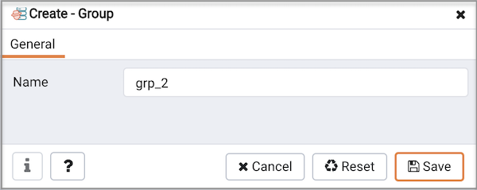

Use the `Group` dialog to add a new group to the PEM client tree control. You can use a group to simplify management of related servers or agents.

Use the `Name` field to specify a name that will identify the group in the `PEM` browser tree control.

-   Click the `Save` button to save work.
-   Click the `Cancel` button to exit without saving work.
-   Click the `Reset` button to restore configuration parameters.

To add a server or agent to a group, right-click on the name of a server or agent, and select `Properties...` to open the properties dialog. Then, use the drop-down listbox in the `Group` field to select the group in which the object should reside.
