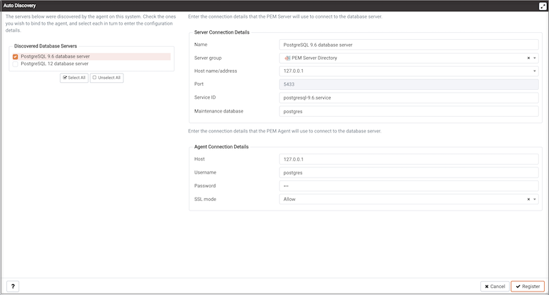

Use the `Auto Discovery` dialog to instruct a PEM agent to locate database servers that reside on a monitored system, and add a binding that allows the agent to monitor the selected server.

To enable auto discovery for a specific agent, you must enable the `Server Auto Discovery` probe. To access the `Manage Probes` tab, highlight the name of a PEM agent in the PEM client tree control, and select `Manage Probes...` from the `Management` menu. When the Manage Probes tab opens, confirm that the slider control in the `Enabled?` column is set to `Yes`.

To open the `Auto Discovery` dialog, highlight the name of a PEM agent in the PEM client tree control, and select `Auto Discovery...` from the `Management` menu.

When the `Auto Discovery` dialog opens, the `Discovered Database Servers` box will display a list of servers that are not currently monitored by a PEM agent. Check the box next to a server name to display information about the server in the `Server Connection Details` box, and provide any missing information to bind the server to the currently selected agent in the `Agent Connection Details` box.

Use the `Select All` button to select the box next to all of the displayed servers, or `Unselect All` to unselect all of the boxes to the left of the server names.

The fields in the `Server Connection Details` box provide information about the server that PEM will monitor:

-   Accept or modify the name of the monitored server in the `Name` field. The specified name will be displayed in the tree control of the PEM client.
-   Use the `Server group` drop-down listbox to select the server group under which the server will be displayed in the PEM client tree control.
-   Use the `Host name/address` field to specify the IP address of the monitored server.
-   The `Port` field displays the port that is monitored by the server; this field may not be modified.
-   Provide the name of the service in the `Service ID` field. Please note that the service name must be provided to enable some PEM functionality.
-   By default, the `Maintenance database` field indicates that the selected server uses a `postgres` maintenance database. Customize the content of the `Maintenance database` field for your installation.

The fields in the `Agent Connection Details` box specify the properties that the PEM agent will use when connecting to the server:

-   The `Host` field displays the IP address that will be used for the PEM agent binding.
-   The `Username` field displays the name that will be used by the PEM agent when connecting to the selected server.
-   The `Password` field displays the password associated with the specified user name.
-   Use the drop-down listbox in the `SSL mode` field to specify your SSL connection preferences.

When you've finished specifying the connection properties for the servers that you are binding for monitoring, click the `OK` button to save the properties. Click `Cancel` to exit without preserving any changes.

The dialog shown above displays the values required to bind an instance of Advanced Server for monitoring by PEM.
