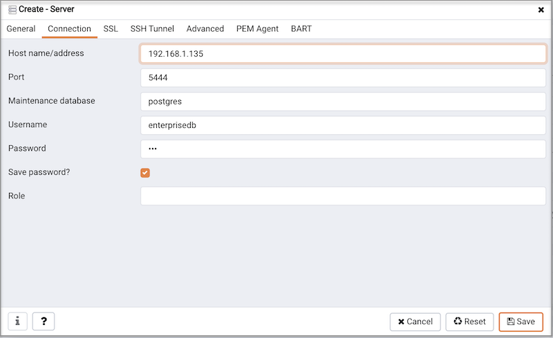
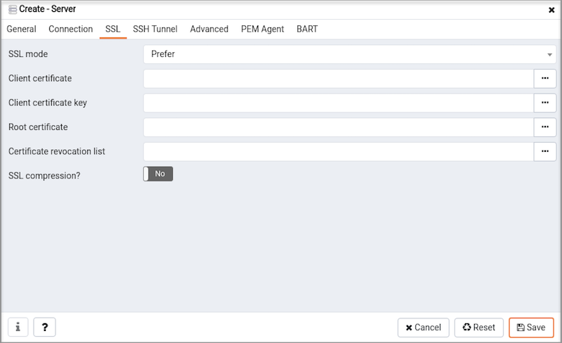

Use the `Create - Server` dialog to describe a new server connection, bind the server to a PEM agent, and display the server to the PEM tree control.

Use the fields on the `General` tab to describe the general properties of the server:

-   Use the `Name` field to specify a user-friendly name for the server. The name specified will identify the server in the PEM client tree control.
-   You can use [groups](05_group_dialog/#group_dialog) to organize your servers and agents in the PEM client tree control. Using groups can help you manage large numbers of servers more easily. For example, you may want to have a production group, a test group, or LAN specific groups. Use the `Group` drop-down listbox to select the group in which the new server will be displayed.
-   Use the `Team` field to specify a PostgreSQL role name. Only PEM users who are members of this role, who created the server initially, or have superuser privileges on the PEM server will see this server when they logon to PEM. If this field is left blank, all PEM users will see the server.
-   Use the `Background` color selector to select the color that will be displayed in the PEM tree control behind database objects that are stored on the server.
-   Use the `Foreground` color selector to select the font color of labels in the PEM tree control for objects stored on the server.
-   Check the box next to `Connect now?` to instruct PEM to attempt a connection to the database server when you click the Save button on the Create - Server dialog. Leave the `Connect now?` checkbox unchecked if you do not want to establish a connection to the server immediately. If you do not select the `Connect now?` option, the connection parameters are not validated until you attempt a connection.
-   Provide notes about the server in the `Comments` field.

Use fields on the `Connection` tab to specify connection details for the server:

-   Specify the IP address of the server host, or the fully qualified domain name in the `Host name/address` field. On Unix based systems, the address field may be left blank to use the default PostgreSQL Unix Domain Socket on the local machine, or may be set to an alternate path containing a PostgreSQL socket. If you enter a path, the path must begin with a "/".
-   Specify the port number of the host in the `Port` field.
-   Use the `Maintenance database` field to specify the name of the initial database that PEM will connect to, and that will be expected to contain the [pgAgent](../10_pgagent/#pgagent) schema and adminpack objects if installed (both are optional). On an Advanced Server database, the maintenance database is named 'edb'. On PostgreSQL 8.1 and above, the maintenance DB for PostgreSQL is named 'postgres'; on earlier versions 'template1' is often used, though it is preferrable to create a 'postgres' database for this purpose to avoid cluttering the template database.
-   Specify the name that will be used when authenticating with the server in the `Username` field.
-   Provide the password associated with the specified user in the `Password` field.
-   Check the box next to `Save password?` to instruct the PEM server to save the password in encrypted format on the PEM server backend database server for later reuse. Password will be stored per server per user basis, hence - it won't be shared with other team members. To remove a password, disconnect from the server, click on the 'Clear Saved Password' menu item under Object/Context menu of the database server.
-   Use the `Role` field to specify the name of the role that is assigned the privileges that the client should use after connecting to the server. This allows you to connect as one role, and then assume the permissions of another role when the connection is established (the one you specified in this field). The connecting role must be a member of the role specified.

Use the fields on the `SSL` tab to configure SSL.

-   Use the drop-down list box in the `SSL mode` field to select the type of SSL connection the server should use. For more information about using SSL encryption, see [Section 33.18 of the Postgres documentation](https://www.postgresql.org/docs/current/static/libpq-ssl.html).

You can use the platform-specific File manager dialog to upload files that support SSL encryption to the server. To access the File manager dialog, click the icon that is located to the right of each of the following fields.

-   Use the `Client certificate` field to specify the file containing the client SSL certificate. This file will replace the default `~/.postgresql/postgresql.crt` if PEM is installed in Desktop mode, and `<STORAGE_DIR>/<USERNAME>/.postgresql/postgresql.crt` if PEM is installed in Web mode. This parameter is ignored if an SSL connection is not made.
-   Use the `Client certificate key` field to specify the file containing the secret key used for the client certificate. This file will replace the default `~/.postgresql/postgresql.key` if PEM is installed in Desktop mode, and `<STORAGE_DIR>/<USERNAME>/.postgresql/postgresql.key` if PEM is installed in Web mode. This parameter is ignored if an SSL connection is not made.
-   Use the `Root certificate` field to specify the file containing the SSL certificate authority. This file will replace the default `~/.postgresql/root.crt`. This parameter is ignored if an SSL connection is not made.
-   Use the `Certificate revocation list` field to specify the file containing the SSL certificate revocation list. This list will replace the default list, found in `~/.postgresql/root.crl`. This parameter is ignored if an SSL connection is not made.
-   When `SSL compression?` is set to `True`, data sent over SSL connections will be compressed. The default value is `False` (compression is disabled). This parameter is ignored if an SSL connection is not made.

`WARNING:` certificates, private keys, and the revocation list are stored in the per-user file storage area on the server, which is owned by the user account under which the PEM server process is run. This means that administrators of the server may be able to access those files; appropriate caution should be taken before choosing to use this feature.

Use the fields on the `SSH Tunnel` tab to configure SSH Tunneling. You can use a tunnel to connect a database server (through an intermediary proxy host) to a server that resides on a network to which the client may not be able to connect directly.

-   Set `Use SSH tunneling` to `Yes` to specify that PEM should use an SSH tunnel when connecting to the specified server.
-   Specify the name or IP address of the SSH host (through which client connections will be forwarded) in the `Tunnel host` field.
-   Specify the port of the SSH host (through which client connections will be forwarded) in the `Tunnel port` field.
-   Specify the name of a user with login privileges for the SSH host in the `Username` field.
-   Specify the type of authentication that will be used when connecting to the SSH host in the `Authentication` field.
    -   Select `Password` to specify that PEM will use a password for authentication to the SSH host. This is the default.
    -   Select `Identity file` to specify that PEM will use a private key file when connecting.
-   If the SSH host is expecting a private key file for authentication, use the `Identity file` field to specify the location of the key file.
-   If the SSH host is expecting a password, use the `Password` field to specify the password, or if an identity file is being used, the passphrase.

Use fields on the `Advanced` tab to specify details that are used to manage the server:

-   Specify the IP address of the server host in the `Host Address` field.
-   Use the `DB restriction` field to specify a SQL restriction that will be used against the [pg_database](http://www.postgresql.org/docs/current/interactive/catalog-pg-database.html) table to limit the databases displayed in the tree control. For example, you might enter: `'live_db', 'test_db'` to instruct the PEM browser to display only the live_db and test_db databases.
-   Use the `Password file` field to specify the location of a password file (.pgpass). The .pgpass file allows a user to login without providing a password when they connect, and it must be present on the PEM server. For more information, see [Section 33.15 of the Postgres documentation](http://www.postgresql.org/docs/current/static/libpq-pgpass.html). Please note: Use of a password file is only supported when PEM is using libpq v10.0 or later to connect to the server.
-   Use the `Service ID` field to specify parameters to control the database service process. For servers that are stored in the Enterprise Manager directory, enter the service ID. On Windows machines, this is the identifier for the Windows service. On \*nix machines, this is the name of the init script used to start the server in /etc/init.d. An example of an ID on all platforms is `postgresql-9.0`. For local servers, the setting is operating system dependent:
    -   If the PEM client is running on a Windows machine, it can control the postmaster service if you have enough access rights. Enter the name of the service. In case of a remote server, it must be prepended by the machine name (e.g. PSE1\\pgsql-8.0). PEM will automatically discover services running on your local machine.
    -   If the PEM client is running on a Unix machine, it can control processes running on the local machine if you have enough access rights. Enter a full path and needed options to access the pg_ctl program. When executing service control functions, PEM will append status/start/stop keywords to this. For example: `sudo /usr/local/pgsql/bin/pg_ctl -D /data/pgsql`
-   If the server is a member of a [Failover Manager](../04_toc_pem_features/19_monitoring_a_failover_manager_cluster/#monitoring_a_failover_manager_cluster) cluster, you can use PEM to monitor the health of the cluster and to replace the primary node if necessary. To enable PEM to monitor Failover Manager, use the `EFM cluster name` field to specify the cluster name. The cluster name is the prefix of the name of the Failover Manager cluster properties file. For example, if the cluster properties file is named `efm.properties`, the cluster name is `efm`.
-   If you are using PEM to monitor the status of a [Failover Manager](../04_toc_pem_features/19_monitoring_a_failover_manager_cluster/#monitoring_a_failover_manager_cluster) cluster, use the `EFM installation path` field to specify the location of the Failover Manager binary file. By default, the Failover Manager binary file is installed in `/usr/efm-2.x/bin`, where `x` specifies the Failover Manager version.

Use fields on the `PEM Agent` tab to specify connection details for the PEM agent:

-   Specify `Yes` in the `Remote monitoring?` field to indicate that the PEM agent does not reside on the same host as the monitored server. When remote monitoring is enabled, agent level statistics for the monitored server will not be available for custom charts and dashboards, and the remote server will not be accessible by some PEM utilities (such as Audit Manager, Capacity Manager, Log Manager, Postgres Expert and Tuning Wizard).
-   Use the drop-down listbox to the right of the `Bound agent` label to select a PEM agent . One agent can monitor multiple Postgres servers.
-   Enter the IP address or socket path that the agent should use when connecting to the database server in the `Host` field. By default, the agent will use the host address shown on the `General` tab. On a Unix server, you may wish to specify a socket path, e.g. `/tmp`.
-   Enter the `Port` number that the agent will use when connecting to the server. By default, the agent will use the port defined on the `Properties` tab.
-   Use the drop-down listbox in the `SSL` field to specify an SSL operational mode; select from require, prefer, allow, disable, verify-ca or verify-full.

| Mode        | Description:                                                                                                                              |
| ----------- | ----------------------------------------------------------------------------------------------------------------------------------------- |
| require     | To require SSL encryption for transactions between the server and the agent.                                                              |
| prefer      | To use SSL encryption between the server and the agent if SSL encryption is available.                                                    |
| allow       | To allow the connection to use SSL if required by the server.                                                                             |
| disable     | To disable SSL encryption between the agent and the server.                                                                               |
| verify-ca   | To require SSL encryption, and to require the server to authenticate using a certificate registered by a certificate authority.           |
| verify-full | To require SSL encryption, and to require the server to authenticate using a certificate registered by a `trusted` certificate authority. |

> For information about using SSL encryption, see [Section 31.17 of the Postgres documentation](http://enterprisedb.com/docs/en/9.6/pg/libpq-ssl.html).

-   Use the `Database` field to specify the name of the Postgres Plus database to which the agent will initially connect.
-   Specify the name of the user that agent should use when connecting to the server in the `User name` field. Note that if the specified user is not a database superuser, then some of the features will not work as expected. If you are using Postgres version 10 or above, you can use the `pg_monitor` role to grant the required privileges to a non-superuser. For information about `pg_monitor` role, see [Default Roles](https://www.postgresql.org/docs/current/default-roles.html).
-   Specify the password that the agent should use when connecting to the server in the `Password` field, and verify it by typing it again in the `Confirm password` field. If you do not specify a password, you will need to configure the authentication for the agent manually; you can use a `.pgpass` file for example.
-   Specify `Yes` in the `Allow takeover?` field to specify that another agent may be signaled (for example, by a fencing script) to monitor the server. This feature allows an agent to take responsibility for the monitoring of the database server if, for example, the server is part of a [high availability](../02_toc_pem_agent/02_pem_agent_binding/02_pem_agent_ha/#pem_agent_ha) failover process.

If you experience connection problems, please visit the [connection problems](11_connect_error/#connect_error) page.

To view the properties of a server, right-click on the server name in the PEM client tree control, and select the `Properties...` option from the context menu. To modify a server's properties, disconnect from the server before opening the `Properties` dialog.
