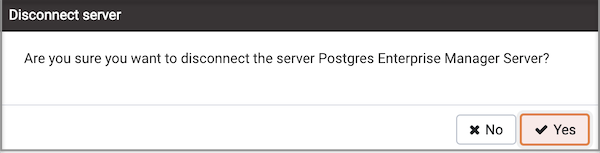

After defining a server connection, use the `Connect to Server` dialog to authenticate with a server and access the objects stored on the server. To access the dialog, right click on the server name in the PEM client tree control, and select `Connect Server` from the context menu.

If prompted, provide authentication information for the selected server:

> -   Use the `Password` field to provide the password of the user that is associated with the defined server.
> -   Check the box next to `Save Password` to instruct the server to save the password for future connections; if you save the password, you will not be prompted when reconnecting to the database server with this server definition.

The browser displays a message in a green status bar in the lower right corner when the server connects successfully.

If you receive an error message while attempting a connection, verify that your network is allowing PEM and the host of the database server to communicate. For detailed information about a specific error message, please see the [Connection Error](11_connect_error/#connect_error) help page.

To review or modify connection details, right-click on the name of the server, and select `Properties...` from the context menu.

## Disconnecting from a Server

To disconnect from a server, right-click on the server name in the `Browser` tree control and select Disconnect Server from the context menu. A popup will ask you to confirm that you wish to disconnect the selected server.

