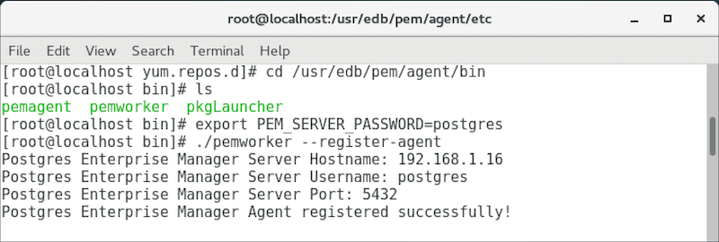

Each PEM agent must be `registered` with the PEM server. The registration process provides the PEM server with the information it needs to communicate with the agent. The PEM agent graphical installer supports agent self-registration, but you can use the `pemworker` utility to register the agent if you skip PEM agent registration during a graphical installation or use an RPM package to install a PEM agent.

The RPM installer places the PEM worker utility in the `/usr/edb/pem/agent/bin` directory. Use the following commands to register an agent:

-   **On Linux**: pemworker −−register-agent \[register-options]
-   **On Windows**: pemworker.exe REGISTER \[register-options]

The following information is required when registering an agent with the PEM Server; you will be prompted for information if it is not provided on the command line:

| Parameters                   | Command-line options               | Optional | Description                                                                                                                                                                                                                                                                                                                                                                                                    | Default Value                                  |
| ---------------------------- | ---------------------------------- | -------- | -------------------------------------------------------------------------------------------------------------------------------------------------------------------------------------------------------------------------------------------------------------------------------------------------------------------------------------------------------------------------------------------------------------- | ---------------------------------------------- |
| **PEM Database Server Host** | −−pem-server &lt;hostname/address> | No       | Address/Host name of the PEM database server                                                                                                                                                                                                                                                                                                                                                                   |                                                |
| **PEM Admin User**           | −−pem-user &lt;username>           | No       | `PEM Admin User` to connect to the PEM database server.                                                                                                                                                                                                                                                                                                                                                        |                                                |
| **PEM Database Server Port** | −−pem-port &lt;port number>        | Yes      | Port on which PEM database server is running.                                                                                                                                                                                                                                                                                                                                                                  | 5432                                           |
| **Agent Certificate Path**   | −−cert-path &lt;certificate path>  | Yes      | Path, where certificates need to be created.                                                                                                                                                                                                                                                                                                                                                                   | On Linux, "~/.pem" On Windows, “%APPDATA%/pem” |
| **Agent Display Name**       | −−display-name &lt;agent_name>     | Yes      | Display name of the PEM Agent.                                                                                                                                                                                                                                                                                                                                                                                 | System hostname                                |
| **Agent Group**              | −−group &lt;group_name>            | Yes      | The name of the group in which the agent will be displayed.                                                                                                                                                                                                                                                                                                                                                    |                                                |
| **Agent Team**               | −−team &lt;team_name>              | Yes      | The name of the group role that may access the PEM Agent.                                                                                                                                                                                                                                                                                                                                                      |                                                |
| **Agent Owner**              | −−owner &lt;owner_name>            | Yes      | The name of the owner of the PEM Agent.                                                                                                                                                                                                                                                                                                                                                                        |                                                |
| **Force registration**       | −−force-registration               | Yes      | Forcefully registers the agent to the PEM server with the arguments provided. It can be used to override the existing agent configuration.                                                                                                                                                                                                                                                                     |                                                |
| **Enable Heartbeat**         | −−enable-heartbeat-connection      | Yes      | Agent to use dedicated connection to update the heartbeat.                                                                                                                                                                                                                                                                                                                                                     | false                                          |
| **Agent User**               | −−pem-agent-user                   | Yes      | Use this user to connect the PEM database server. Specify, it when you would like to use a connection pooler between PEM Agent and PEM database server. It will generate the SSL Ceriticates, which will used by the pemworker to connect to the PEM database server instead, for this user instead of the default agent user.  **NOTE:** Specified user must be a member of 'pem_agent' role.  |                                                |

!!! Note
    You can use the `PEM_SERVER_PASSWORD` environment variable to set the password of the `PEM Admin User`. If the `PEM_SERVER_PASSWORD` is not set, the server will use the `PGPASSWORD` or `pgpass file` when connecting to the **PEM Database Server**.

Example:

Refer the [PEM Worker Usage Guide](#pem_worker_usage_output).
