

Use options on the `Preferences` dialog to customize the behavior of the PEM web interface. To open the dialog, select `Preferences` from the `File` menu. The left pane of the `Preferences` dialog displays a tree control; each node of the tree control provides access to options that are related to the node under which they are displayed.

-   Use the plus sign (+) to the left of a node name to expand a segment of the tree control.
-   Use the minus sign (-) to the left of a node name to close that node.

**The BART Servers Node**

Use the `Nodes` panel to select the BART Servers that will be displayed in the Browser tree control of BART Servers:

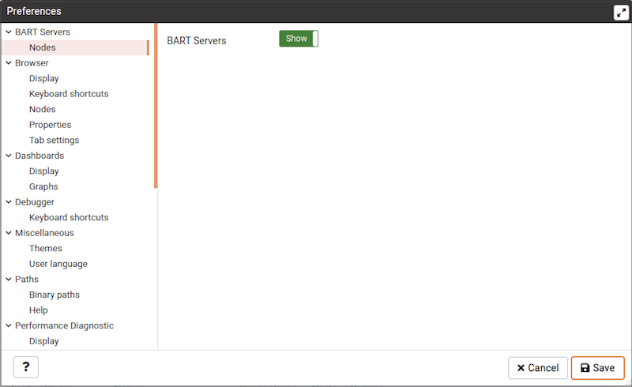

-   Slide the switch located next to BART Servers to show or hide the BART Servers in the browser tree.

**The Browser Node**

Use the fields on the `Browser` node of the tree control to personalize your workspace.

Use the fields on the `Display` panel to specify general display preferences:

-   When the `Enable browser tree animation?` switch is set to `True`, the client will display the animated tree control; if the switch is `False`, the tree control will be unanimated.
-   When the `Auto-expand sole children` switch is set to `True`, child nodes will be automatically expanded if a treeview node is expanded and has only a single child.
-   Use the `Browser tree state saving interval` field to set the treeview state saving interval. A value of `-1` will disable the treeview state saving functionality.
-   When the `Confirm before closing properties with unsaved changes` switch is set to `True`, pgAdmin will warn you before closing the properties dialog of an object if there are any unsaved changes. On user confirmation, the properties dialog will close.
-   When the `Confirm on close or refresh` switch is set to `True`, pgAdmin will attempt to catch browser close or refresh events and prompt before allowing them to continue.
-   When the `Show system objects?` switch is set to `True`, the client will display system objects such as system schemas (for example, `pg_temp`) or system columns (for example, `xmin` or `ctid`) in the tree control.
-   When the `Enable dialogue/notification animation?` switch is set to `True`, the client will display the animated dialogues/notifications; if the switch is `False`, the tree control will be unanimated.
-   Set `Show hidden groups?` to `True` to display hidden groups in the Browser tree control.
-   Set `Show system objects?` to `True` to display system objects such as system schemas (for example, `pg_temp`) or system columns (for example, `xmin` or `ctid`) in the Browser tree control.
-   Use the `Lock layout` field to lock the UI layout at different levels.

| Option            | Action                                                            |
| ----------------- | ----------------------------------------------------------------- |
| `None`            | No locking. Every panel is resizable and dockable.           |
| `Prevent docking` | This will disable the docking/undocking of the panels        |
| `Full`            | This will disable resizing, docking/undocking of the panels  |

-   When the `Show system objects?` switch is set to `True`, the client will display system objects such as system schemas (for example, `pg_temp`) or system columns (for example, `xmin` or `ctid`) in the tree control.

Use the fields on the `Keyboard shortcuts` panel to configure shortcuts for the main window navigation:

-   Use controls on the `Keyboard shortcuts` panel to specify the combination of modifier keys that define shortcuts for the PEM main window.

Use the fields on the `Nodes` panel to select the object types that will be displayed in the `Browser` tree control:

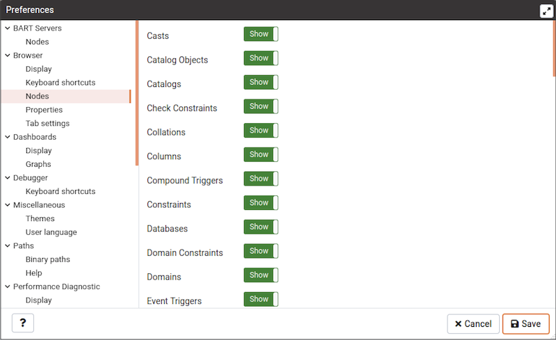

-   The panel displays a list of database objects; slide the switch located next to each object type to `Show` or `Hide` the database object. When querying system catalogs, you can reduce the number of object types displayed to increase speed.

Use fields on the `Properties` panel to specify browser properties:

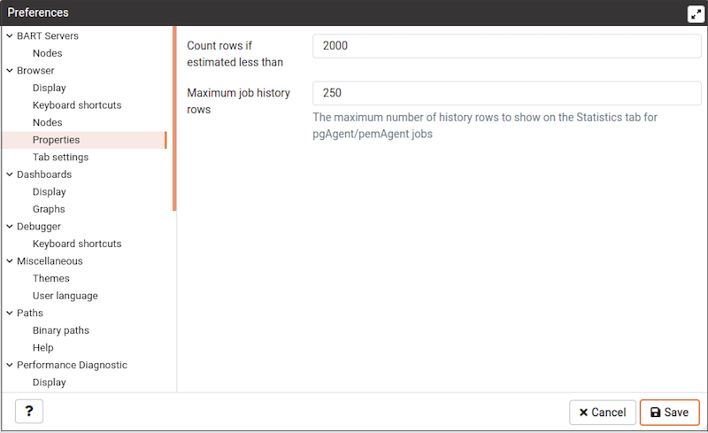

-   Include a value in the `Count rows if estimated less than` field to perform a SELECT count(`) if the estimated number of rows in a table (as read from the table statistics) is below the specified limit.  After performing the SELECT count(`), pgAdmin will display the row count. The default is 2000.
-   Provide a value in the `Maximum job history rows` field to limit the number of rows to show on the statistics tab for pgAgent jobs. The default is 250.

Use field on *Tab settings* panel to specify the tab related properties.

-   Use *Debugger tab title placeholder* field to customize the Debugger tab title.
-   When the *Dynamic tab size* If set to True, the tabs will take full size as per the title, it will also applicable for already opened tabs
-   When the *Open in new browser tab* filed is selected for Query tool, Schema Diff or Debugger, it will open in a new browser tab when invoked.
-   Use the *Query tool tab title placeholder* field to customize the query tool tab title.
-   Use *View/Edit tab title placeholder* field to customize the View/Edit Data tab title.

**The Dashboards Node**

Expand the `Dashboards` node to specify your dashboard display preferences.

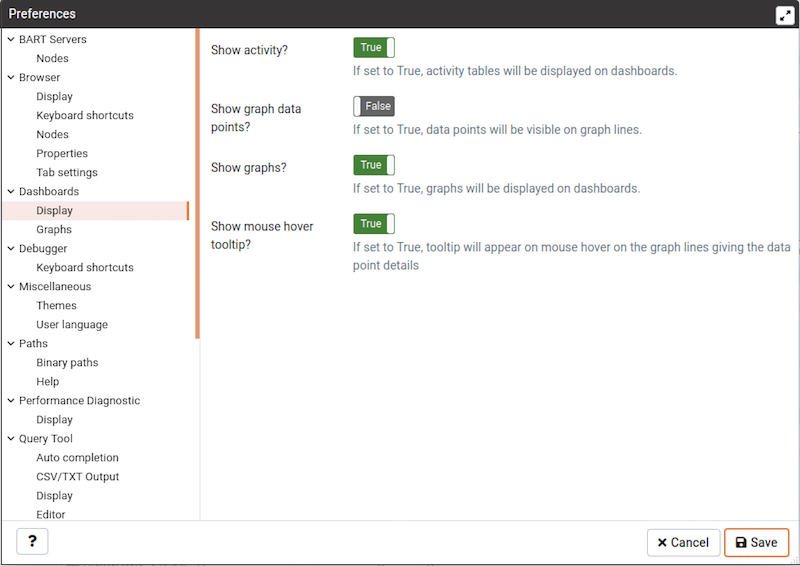

-   When the `Show activity?` switch is set to `True`, activity tables will be displayed on dashboards.
-   When the `Show graph data points?` switch is set to `True`, data points will be visible on graph lines.
-   When the `Show graphs?` switch is set to `True`, graphs will be displayed on dashboards.
-   When the `Show mouse hover tooltip?` switch is set to `True`, a tooltip will appear on mouse hover on the graph lines giving the data point details.

Use the fields on the `Graphs` panel to specify your display preferences for the graphs on the `Dashboard` tab:

Use the fields on the `Graphs` panel to specify your display preferences for the graphs on the `Dashboard` tab:

-   Use the `Block I/O statistics refresh rate` field to specify the number of seconds between block I/O statistic samples displayed in graphs.
-   Use the `Session statistics refresh rate` field to specify the number of seconds between session statistic samples displayed in graphs.
-   Use the `Transaction throughput refresh rate` field to specify the number of seconds between transaction throughput samples displayed in graphs.
-   Use the `Tuples in refresh rate` field to specify the number of seconds between tuples-in samples displayed in graphs.
-   Use the `Tuples out refresh rate` field to specify the number of seconds between tuples-out samples displayed in graphs.

**The Debugger Node**

Expand the `Debugger` node to specify your debugger display preferences.

Use the fields on the `Keyboard shortcuts` panel to configure shortcuts for the debugger window navigation:

**The Miscellaneous Node**

Expand the `Miscellaneous` node to specify miscellaneous display preferences.

-   Use the `User language` drop-down listbox to select the display language for the PEM web interface.

-   Use the `Themes` drop-down listbox to select the theme for PEM. You'll also get a preview just below the drop down. Note that, to apply the theme you need to refresh the PEM page.

**The Paths Node**

Expand the `Paths` node to specify the locations of supporting utility and help files.

Use the fields on the `Binary paths` panel to specify the path to the directory that contains the utility programs (pg_dump, pg_restore, and pg_dumpall) for monitored databases:

-   Use the `EDB Advanced Server Binary Path` field to specify the location of the EDB Postgres Advanced Server utility programs. If this path is not set, pgAdmin will attempt to find the utilities in standard locations used by EnterpriseDB.
-   Use the `Greenplum Database Binary Path` field to specify the location of the Greenplum database utility programs. If this path is not set, pgAdmin will attempt to find the utilities in standard locations used by Greenplum.
-   Use the `PostgreSQL Binary Path` field to specify the location of the PostgreSQL utility programs. If this path is not set, pgAdmin will attempt to find the utilities in standard locations used by PostgreSQL.

Use the fields on the `Help` panel to specify the location of help files.

-   Use the `EDB Advanced Server Help Path` field to specify the path to EDB Postgres Advanced Server documentation.
-   Use the `PostgreSQL Help Path` field to specify the path to PostgreSQL documentation.

Please note: the default help paths include the `VERSION` placeholder; the $VERSION$ placeholder will be replaced by the current database version.

**The Performance Diagnostic Node**

Expand the `Performance Diagnostic` node to specify your preferences for the Performance Diagnostic tool.

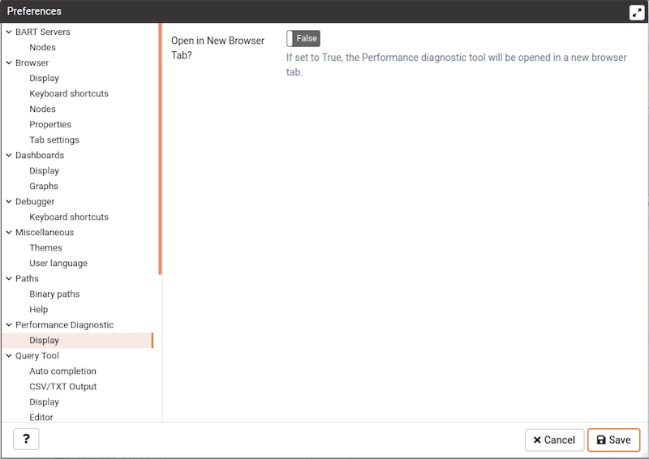

Use the fields on the `Performance Diagnostic` panel to control the Performance Diagnostic output.

-   Use the `Default graph selection` field to specify the default selection range in hours for performance diagnostic graphs.
-   When the `Open in new browser tab?` switch is set to True, the Performance Diagnostic tool will be opened in a new browser tab.

**The Query Tool Node**

Expand the `Query Tool` node to access panels that allow you to specify your preferences for the Query Editor tool.

Use the fields on the `Auto Completion` panel to set the auto completion options.

-   When the `Keywords in uppercase` switch is set to `True`, keywords are displayed in upper case.

Use the fields on the `CSV Output` panel to control the CSV output.

-   Use the `CSV field separator` drop-down listbox to specify the separator character that will be used in CSV/TXT output.
-   Use the `CSV quote character` drop-down listbox to specify the quote character that will be used in CSV/TXT output.
-   Use the `CSV quoting` drop-down listbox to select the fields that will be quoted in the CSV/TXT output; select `Strings`, *All*, or `None`.
-   Use the `Replace null values with` option to replace null values with specified string in the output file. Default is set to 'NULL'.

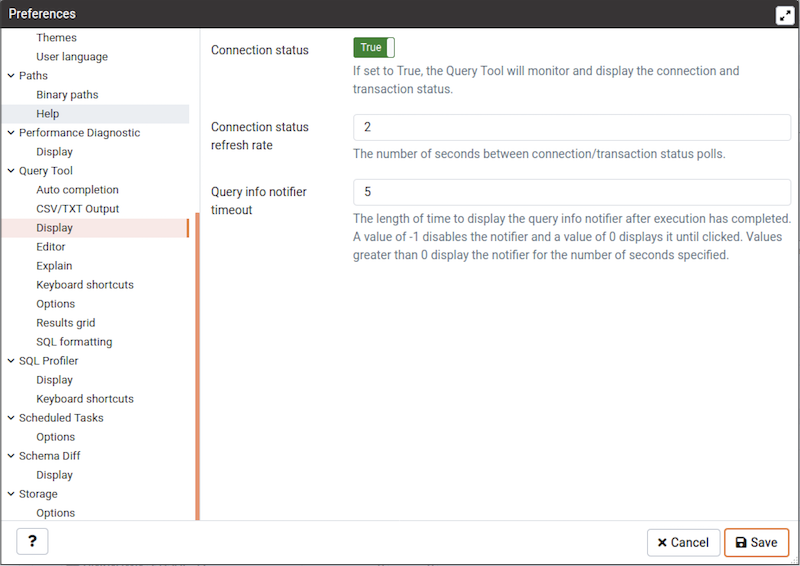

Use the fields on the `Display` panel to specify your preferences for the Query Tool display.

-   When the `Connection status` switch is set to `True`, each new instance of the Query Tool will display connection and transaction status.
-   Use the `Connection status refresh rate` field to specify the number of seconds between connection/transaction status updates.
-   Use the `Query info notifier timeout` field to control the behaviour of the notifier that is displayed when query execution completes. A value of `-1` will disable the notifier, and a value of 0 will display it until clicked. If a positive value above zero is specified, the notifier will be displayed for the specified number of seconds. The default is `5`.

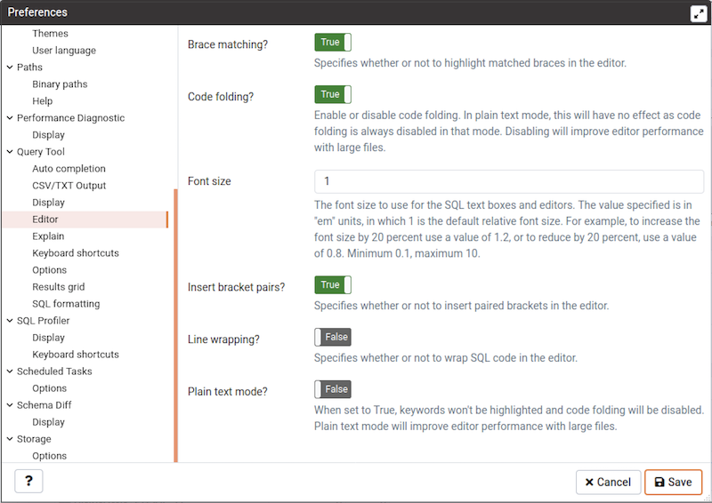

Use the fields on the `Editor` panel to change settings of the query editor.

-   When the `Brace matching?` switch is set to `True`, the editor will highlight pairs of matched braces.
-   When the `Code folding?` switch is set to `False`, the editor will disable code folding. Disabling will improve editor performance with large files.
-   Use the `Font size` field to specify the font size that will be used in text boxes and editors.
-   When the `Insert bracket pairs?` switch is set to `True`, the editor will automatically insert paired brackets.
-   When the `Line wrapping` switch is set to `True`, the editor will implement line-wrapping behavior.
-   When the `Plain text mode?` switch is set to `True`, the editor mode will be changed to text/plain. Keyword highlighting and code folding will be disabled. This will improve editor performance with large files.

Use the fields on the `Explain` panel to specify the level of detail included in a graphical EXPLAIN.

-   When the `Show Buffers?` switch is set to `True`, graphical explain details will include information about buffer usage.
-   When the `Show Costs?` switch is set to `True`, graphical explain details will include information about the estimated startup and total cost of each plan, as well as the estimated number of rows and the estimated width of each row.
-   When the `Show Timing?` switch is set to `True`, graphical explain details will include the startup time and time spent in each node in the output.
-   When the `Verbose output?` switch is set to `True`, graphical explain details will include extended information about the query execution plan.

Use the fields on the `Keyboard shortcuts` panel to configure shortcuts for the Query Tool.

Use the fields on the `Options` panel to manage Query Tool preferences.

-   When the `Auto-Commit?` switch is set to `True`, each successful query is committed after execution.
-   When the `Auto-Rollback?` switch is set to `True`, failed queries are rolled back.
-   When the `Prompt to save unsaved data changes?` switch is set to `True`, the editor will prompt the user to saved unsaved data when exiting the data editor.
-   When the `Prompt to save unsaved query changes?` switch is set to `True`, the editor will prompt the user to saved unsaved query modifications when exiting the query tool.
-   When the `Prompt to commit/rollback active transactions?` switch is set to `True`, the editor will prompt the user to commit or rollback changes when exiting the Query Tool while the current transaction is not committed.
-   When the `Sort View Data results by primary key columns?` If set to `True`, data returned when using the View/Edit Data - All Rows option will be sorted by the Primary Key columns by default. When using the First/Last 100 Rows options, data is always sorted.

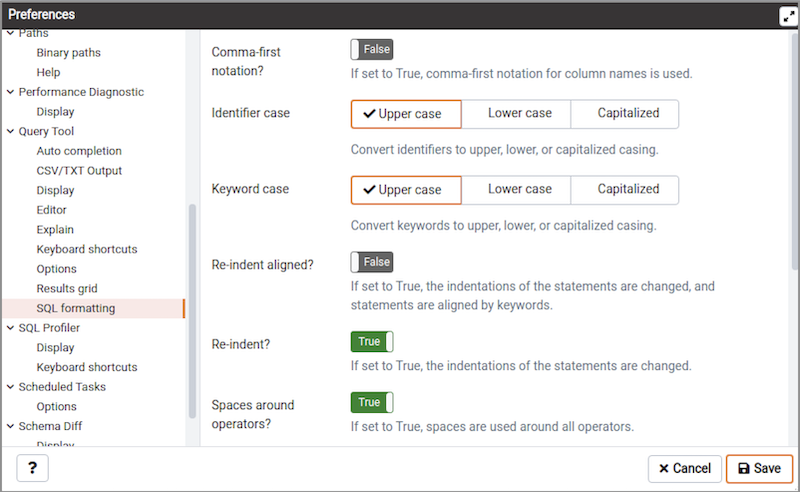

Use the fields on the *SQL formatting* panel to specify your preferences for reformatting of SQL.

-   Use the *Command-first notation* option to specify whether to place commas before or after column names.
-   Use the *Identifier case* option to specify whether to change identifiers (object names) into upper, lower, or capitalized case.
-   Use the *Keyword case* option to specify whether to change keywords into upper, lower, or capitalized case.
-   Use the *Re-indent aligned?* option to specify that indentations of statements should be changed, aligned by keywords.
-   Use the *Re-indent?* option to specify that indentations of statements should be changed.
-   Use the *Spaces around operators?* option to specify whether or not to include spaces on either side of operators.
-   Use the *Strip comments?* option to specify whether or not comments should be removed.
-   Use the *Tab size* option to specify the number of spaces per tab or indent.
-   Use the *Use spaces?* option to select whether to use spaces or tabs when indenting.
-   Use the *Wrap after N characters* option to specify the column limit for wrapping column separated lists (e.g. of column names in a table). If set to 0 (zero), each item will be on it's own line.

Use the fields on the `Results grid` panel to specify your formatting preferences for copied data.

-   Use the `Result copy field separator` drop-down listbox to select the field separator for copied data.
-   Use the `Result copy quote character` drop-down listbox to select the quote character for copied data.
-   Use the `Result copy quoting` drop-down listbox to select which type of fields require quoting; select `All`, *None*, or `Strings`.

**The SQL Profiler Node**

Use fields on the `Display` panel to specify SQL Profiler preferences.

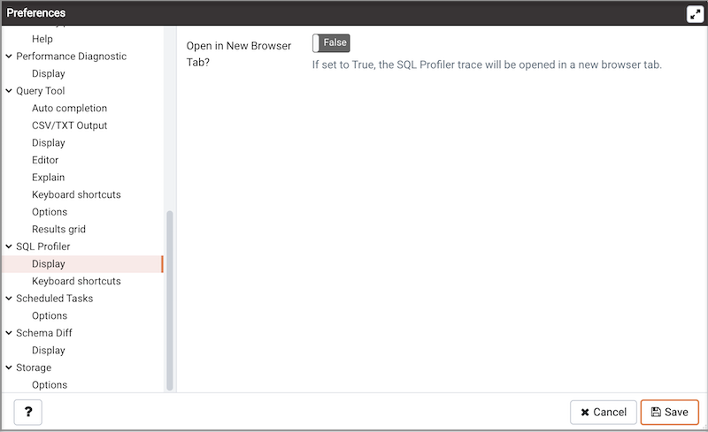

Set `Open in New Browser Tab?` to `True` to open SQL Profiler in a new browser tab when SQL Profiler is invoked.

Use the fields on the Keyboard shortcuts panel to configure shortcuts for toolbar buttons on SQL profiler trace window.

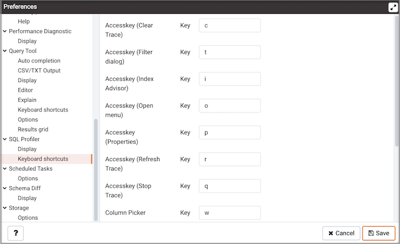

**The Scheduled Tasks Node**

Use fields on the `Options` panel to specify Scheduled Tasks preferences.

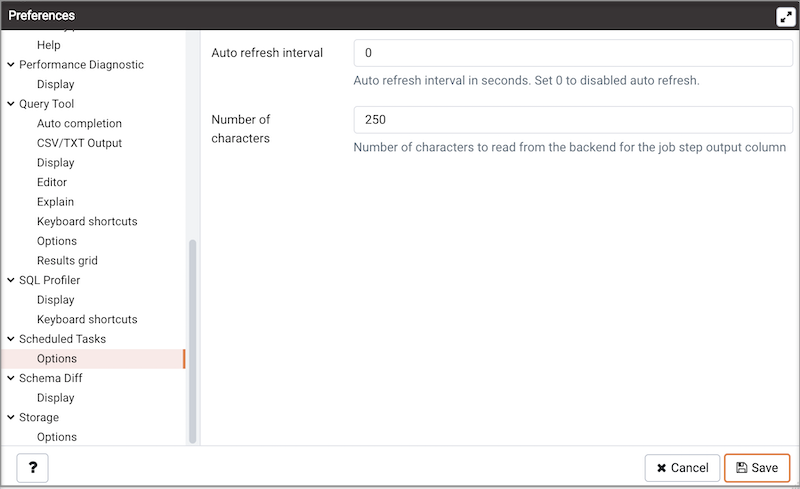

Use the `Auto refresh interval` field to specify the number of seconds between automatic refreshes; a value of 0 disables auto refresh.

**The Schema Diff Node**

Expand the `Schema Diff` node to specify your display preferences.

Use the *Ignore owner* switch to ignores the owner while comparing the objects.

Use the `Ignore whitespaces` switch to ignores the whitespaces while comparing the string objects. Whitespace includes space, tabs, and CRLF.

**The Storage Node**

Expand the `Storage` node to specify your storage preferences.

Use the fields on the `Options` panel to specify storage preferences.

-   Use the `File dialog view` drop-down listbox to select the style of icons and display format that will be displayed when you open the file manager; select `List` to display a list view, or `Grid` to display folder icons.
-   Use the `Last directory visited` field to specify the name of the folder in which the file manager will open.
-   Use the `Maximum file upload size(MB)` field on the `Options` panel of the **Storage** node to specify the maximum file size for an upload.
-   When the `Show hidden files and folders?` switch is set to `True`, the file manager will display hidden files and folders.
