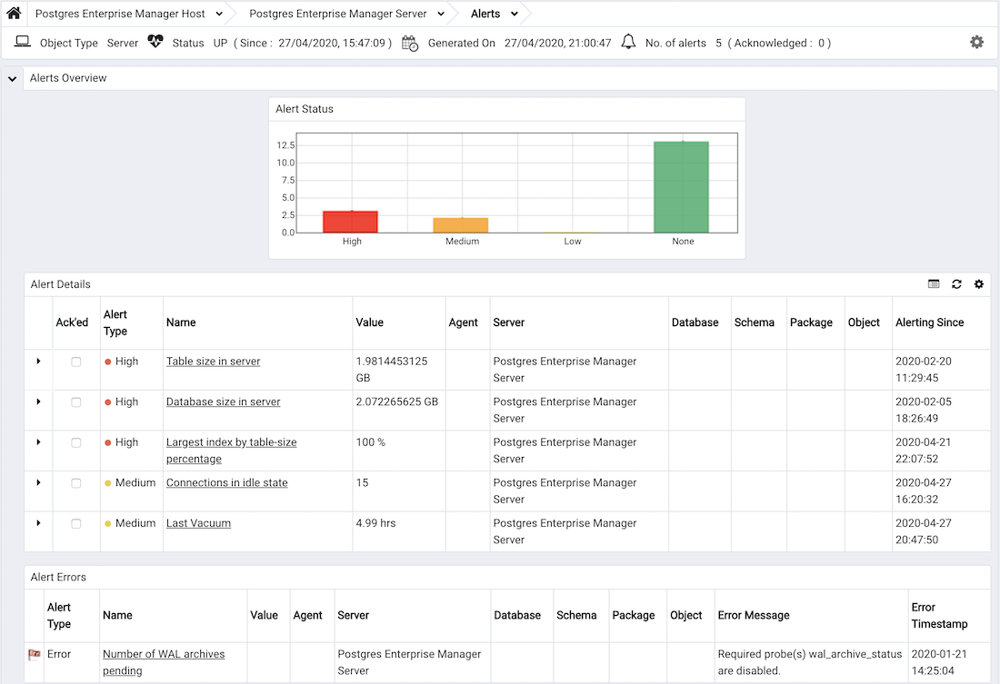

The Alerts Dashboard displays the currently triggered alerts; if opened from the Global Overview, the dashboard displays the current alerts for all monitored nodes on the system. If the Alerts Dashboard is opened from a node within a monitored hierarchy, the report will reflect alerts related to that node, and all monitored objects that reside below that object in the tree control.

Use parameters on the [PEM Server Configurations](../02_pem_server_config/#pem_server_config) dialog to specify the auto-refresh rate for the `Alerts` dashboard. To access the `Server Configuration` dialog, select `Server Configuration...` from the PEM web interface `Management` menu.

The `Alerts Dashboard` header includes the date and time that the page was last updated and a current count of triggered alerts.

The `Alerts Overview` provides an overview of triggered alerts. The right-most bar indicates the total number of configured alerts that are **not** currently in an alert state; the three left-most bars indicate the number of Low, Medium and High alerts for the selected object. The vertical key on the left side of the graph provides an alert count.

The `Alert Details` table lists the currently triggered alerts for the selected object; if opened from the global overview, the Alert Details table lists all of the currently triggered alerts for all monitored objects. Click a column heading to sort the table by the contents of a selected column; click a second time to reverse the sort order. The table contains detailed information about each alert:

-   An alert level icon displays in red for a `High` severity alert, in orange for a `Medium` severity alert, and in yellow for a `Low` severity alert.
-   Use the arrow to the right of the alert level icon to access a dialog with detailed information about the alert. Within the dialog, the `Details` tab displays detailed information about the condition that triggered the alert; the `Parameters` tab displays the values of parameters used in the alert definition. Not all alerts return data that can be viewed on the `Details` dialog; for information about which templates display detailed metrics, please see the [alert templates list](../09_pem_alerting/03_pem_alert_templates/#pem_alert_templates)

-   The `Ack'ed` column provides a checkbox to allow you to acknowledge an alert to prevent additional notifications being sent. This flag is cleared automatically if the alert condition clears and is then detected again.
-   The `Alert Type` column indicates the severity of the alert.
-   The `Name` column displays the names of the currently triggered alerts. Click the name of an alert to open the `Alerting` configuration dialogue that defines the alert.
-   The `Value` column displays the value of the metric that triggered the alert.
-   If applicable, the `Agent` column indicates the name of the agent on which the alert is defined.
-   If applicable, the `Server` column indicates the name of the server triggering the error message.
-   If applicable, the `Database` column indicates the name of the database on which the alert is defined.
-   If applicable, the `Schema` column indicates the name of the schema on which the alert is defined.
-   If applicable, the `Package` column indicates the name of the package on which the alert is defined.
-   If applicable, the `Object` column indicates the name of the monitored object on which the alert is defined.
-   If the alert definition includes specified parameters, the parameter values are displayed in the `Additional Params` column.
-   If the alert definition includes additional specified parameters, the additional parameter values are displayed in the `Additional Params Value` column.
-   The `Alerting Since` column displays the date and time that the alert triggered.

The `Alert Errors` table displays configuration-related errors (eg.accidentally disabling a required probe, or improperly configuring an alert parameter):

-   An alert indicator in the left-most column indicates that the alert was triggered by an Error.
-   The `Alert Type` column indicates the severity of the alert.
-   The `Name` column displays the name of the alert. Click an alert name to open the configuration dialogue for the alert.
-   The `Value` column displays the value of the metric that triggered the alert, if applicable.
-   If applicable, the `Agent` column displays the name of the agent triggering the alert.
-   If applicable, the `Server` column displays the name of the server triggering the alert.
-   If applicable, the `Database` column indicates the name of the database on which the alert is defined.
-   If applicable, the `Schema` column indicates the name of the schema on which the alert is defined.
-   If applicable, the `Package` column indicates the name of the package on which the alert is defined.
-   If applicable, the `Object` column indicates the name of the monitored object on which the alert is defined.
-   The `Error Message` column describes the condition that triggered the alert.
-   The `Error Timestamp` column displays the date and time that the alert was triggered.

## Customizing the Alerts Dashboard

You can customize tables and charts that appear on the Alerts dashboard. To open the `Personalize chart configuration` dialog, click the wrench icon in the upper-right corner.

The fields displayed on the dialog will vary based on the table or chart from which the dialog is opened.

Use fields on the `Personalize chart configuration` dialog to provide your display preferences:

-   Use the `Auto Refresh` field to specify the number of seconds between updates of the data displayed in the table or chart.
-   If applicable, use the `Download as` field to indicate if you would like a chart to be downloaded as a JPEG image or a PNG image.
-   If applicable, use the `Colours` selectors to specify the display colors that will be used on a chart.
-   If applicable, set the `Show Acknowledged Alerts` switch to `Yes` indicate that you would like the table to display alerts that you have acknowledged with a checkbox in the `Ack'ed` column. Set the field to `No` to indicate that the table should hide any acknowledged alerts. The switch acts as a toggle; acknowledged alerts are not purged from the table content until the time specified in the alert definition passes.

To save your customizations, click the save icon (a check mark) in the upper-right corner; to delete any previous changes and revert to the default values, click the delete icon. Save and Delete drop-down menus allow you to specify if your preferences should be applied to `All Dashboards`, or to a selected server or database. Use the close icon to close the `Personalize chart configuration` dialog without preserving your changes.
