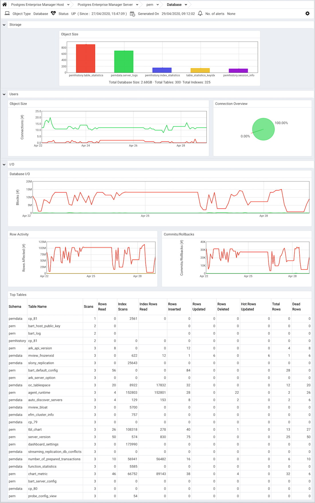
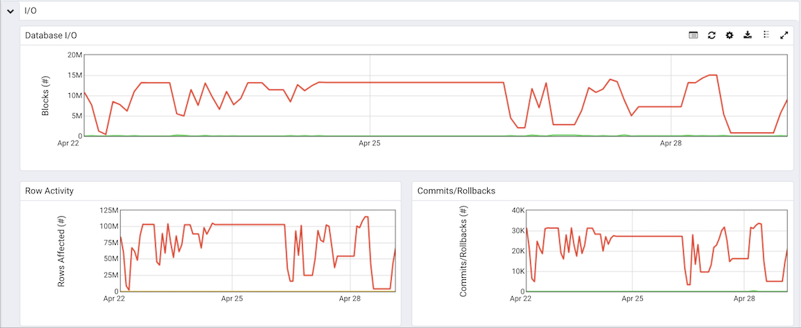
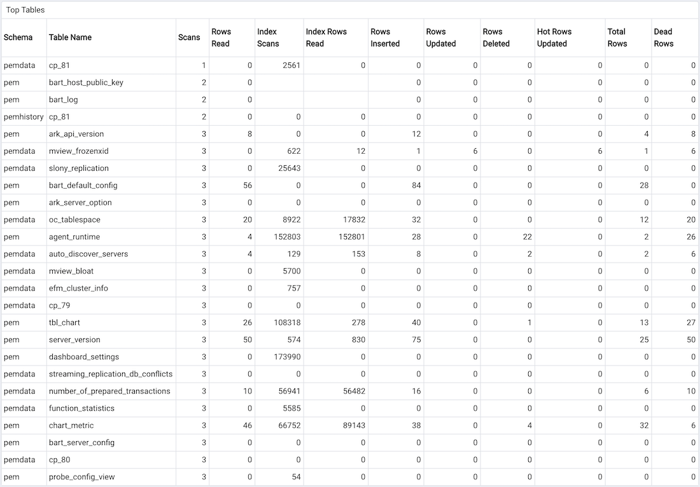

The Database Analysis dashboard provides a high-level overview of database activity for the selected database, including a comparative storage analysis of the 5 largest tables/indexes, user activity analysis, weekly I/O analysis, and an activity analysis of the tables that reside in the selected database.

Use parameters on the [PEM Server Configurations](../02_pem_server_config/#pem_server_config) dialog to specify the auto-refresh rate for the dashboard. To access the `Server Configuration` dialog, select `Server Configuration...` from the PEM web interface `Management` menu.

The Database Analysis dashboard header displays the date and time that the server started, the date and time that the Database Analysis dashboard was last updated, and the number of alerts currently triggered for the specified database (and monitored objects that reside within that database).

The `Storage` bar graph plots the relative size of the 5 largest tables and indexes that reside within the selected database. The vertical key on the left side of the graph indicates each table or index in megabytes; the key on the right side of the chart identifies the tables and indexes by name.

The `Users` section of the Database Analysis dashboard displays information about user connections:

-   The `User Activity` graph plots the active and idle connections over the previous week. The vertical key on the left side of the chart indicates the connection count.
-   The `Connection Overview` chart provides a comparative display of the active and idle connections currently established with the server (when the most recent probe executed).

The graphs in the `I/O` section present an analysis of I/O activity over the previous week.

-   The `Database I/O` graph plots the number of blocks found in cached memory and the number of blocks read from disk over the previous week. The vertical key on the left side of the graph indicates number of blocks hit.
-   The `Row Activity` graph displays the row activity for tables residing within the database over the previous week.

> The vertical key on the left side of the graph indicates the number of rows.

-   The `Commits/Rollbacks` graph displays the number of transactions committed and rolled back within the selected database over the previous week.

> The vertical key on the left side of the graph indicates the transaction count.

The `Hot Tables` table provides a detailed analysis of the activity for each table that resides within the selected database. Click a column heading to sort the table by the values within the column; click again to reverse the sort order.

-   The `Schema` column identifies the schema in which the table resides.
-   The `Table Name` column identifies the name of the table.
-   The `Scans` column displays the number of scans performed on the table.
-   The `Rows Read` column displays the number of rows read from the specified table.
-   The `Index Scans` column displays the number of index scans performed on the specified table.
-   The `Index Rows Read` column displays the number of rows read during index scans on the specified table.
-   The `Rows Inserted` column displays the number of rows inserted into the specified table.
-   The `Rows Updated` column displays the number of rows updated in the specified table.
-   The `Rows Deleted` column displays the number of rows deleted from the specified table.
-   The `Hot Rows Updated` column displays the number of hot row updates into the table; when a hot row update occurs, the new row occupies the same page as the previous row.
-   The `Total Rows` column displays the number of total rows in the table.
-   The `Dead Rows` column displays the number of rows that have been deleted, but have not been reclaimed via a VACUUM command or the AUTOVACUUM process.
