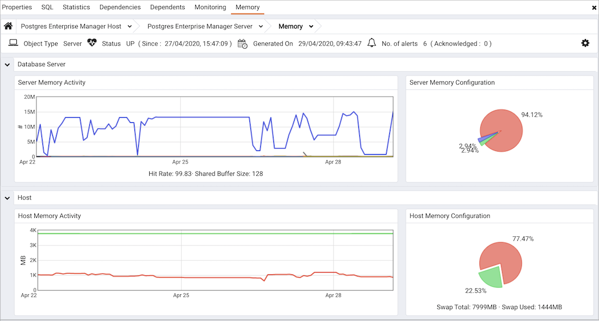

The `Memory Analysis` dashboard provides an overview of the memory usage for the selected server and server host for the previous week:

Use parameters on the [PEM Server Configurations](../02_pem_server_config/#pem_server_config) dialog to specify the auto-refresh rate for the dashboard. To access the `Server Configuration` dialog, select `Server Configuration...` from the PEM web interface `Management` menu.

The Memory Analysis dashboard header displays the date and time that the server was started, the date and time that the dashboard was last updated and the number of current alerts for objects monitored by the PEM server.

The `Database Server` section displays memory usage trends for the selected server.

-   The `Server Memory Activity` graph displays the previous week's activity on the server; the `Legend` at the bottom of the graph provide a key to the colors used to chart information for each database. A vertical key on the left side of the graph indicates the actual block count for each value.
-   The `Server Memory Configuration` pie chart displays the current memory usage (in megabytes).

The `Host` section displays the free and used memory on the host system:

-   The `Host Memory Activity` chart plots the free and used memory on the host system over the last week.
-   Sections of the `Host Memory Configuration` pie chart represent the free and available memory on the host system when the last probe executed.
