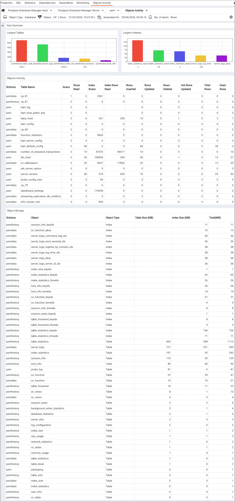
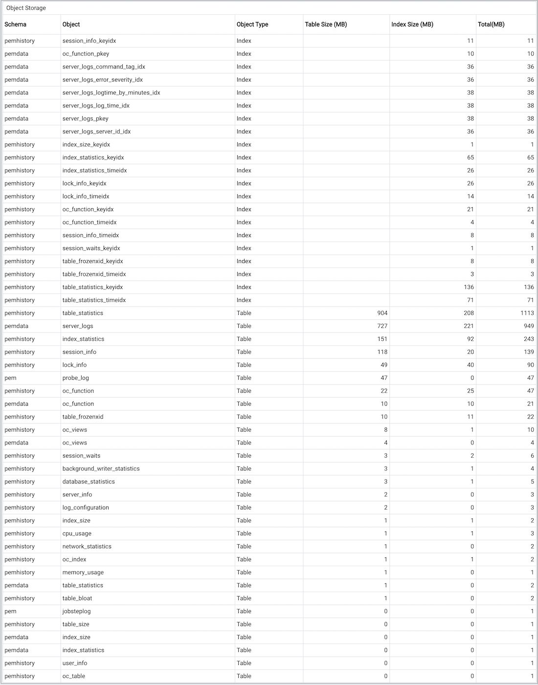

The Objects Activity Analysis dashboard provides an overview of the size and activity of the objects that reside within the selected database.

Use parameters on the [PEM Server Configurations](../02_pem_server_config/#pem_server_config) dialog to specify the auto-refresh rate for the dashboard. To access the `Server Configuration` dialog, select `Server Configuration...` from the PEM web interface `Management` menu.

The Objects Activity Analysis dashboard header displays the date and time that the server started, the date and time that the Object Activity Analysis dashboard was last updated, and the number of alerts currently triggered for the specified database (and monitored objects that reside within that database).

The bar graphs in the `Size Overview` section plot the comparative sizes of the 5 largest tables and indexes that reside within the selected database:

-   The `Top 5 Largest Tables` bar graph represents the comparative sizes of the 5 largest tables that reside in the database; a vertical key displays the table size in megabytes.
-   The `Top 5 Largest Indexes` bar graph represents the comparative sizes of the 5 largest indexes that reside in the database; a vertical key displays the index size in megabytes.

The `Objects Activity` table provides a detailed analysis of the activity for each table that resides within the database. Click a column heading to sort the table by the values within the column; click again to reverse the sort order.

-   The `Schema` column identifies the schema in which the specified table resides.
-   The `Table Name` column identifies the name of the table.
-   The `Scans` column displays the number of scans performed on the table.
-   The `Rows Read` column displays the number of rows read from the specified table.
-   The `Index Scans` column displays the number of index scans performed on the specified table.
-   The `Index Rows Read` column displays the number of rows read during index scans on the specified table.
-   The `Rows Inserted` column displays the number of rows inserted into the specified table.
-   The `Rows Updated` column displays the number of rows updated in the specified table.
-   The `Rows Deleted` column displays the number of rows deleted from the specified table.
-   The `Hot Rows Updated` column displays the number of hot row updates into the table; when a hot row update occurs, the new row occupies the same page as the previous row.
-   The `Total Rows` column displays the number of total rows in the table.
-   The `Dead Rows` column displays the number of rows that have been deleted, but have not been reclaimed via a VACUUM command or the AUTOVACUUM process.

The `Objects Storage` table displays the schema objects that reside in the selected database. Click a column heading to sort the table data by the values within that column; click again to reverse the sort order.

-   The `Schema` column identifies the schema in which the object resides.
-   The `Object` column identifies the name of the schema object.
-   The `Object Type` column identifies the type of schema object (Table or Index).
-   The `Table Size` column lists the size of the table in megabytes (if applicable).
-   The `Index Size` column lists the size of the index (or associated index) in megabytes (if applicable).
-   The `Total (MB)` column lists the cumulative size (in megabytes) of the specified table and/or indexes and associated TOAST tables.
