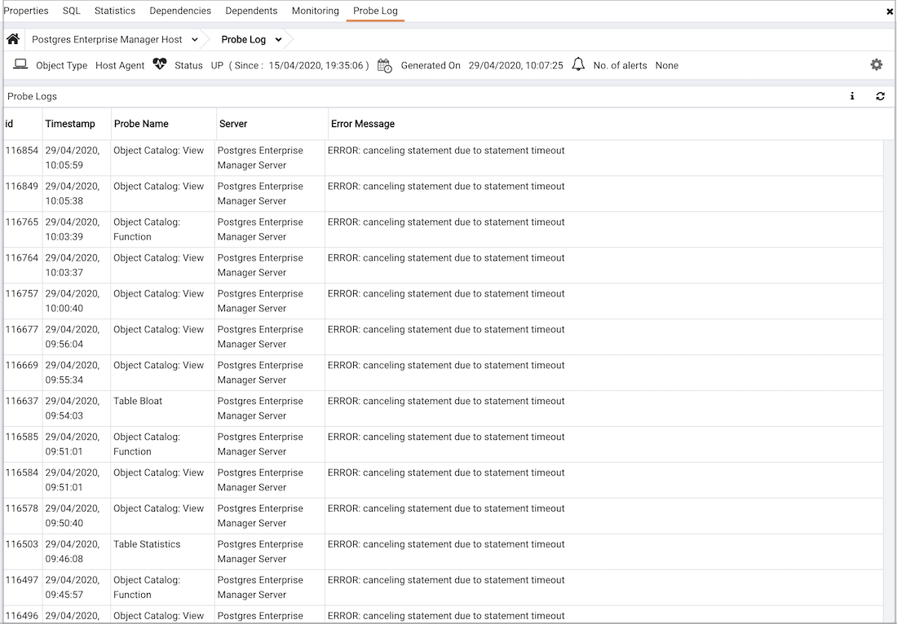

The Probe Log Analysis dashboard displays error messages from the PEM agent.

The header information includes the date and time that the server was first started, the date and time that the page was last updated, and the current number of triggered alerts.

Use parameters on the [PEM Server Configurations](../02_pem_server_config/#pem_server_config) dialog to specify the auto-refresh rate for the dashboard. To access the `Server Configuration` dialog, select `Server Configuration...` from the PEM web interface `Management` menu.

The `Probe Log` table displays error messages returned by the PEM Agent. Entries in the Probe Log table may reflect incorrect agent binding information or authentication errors between the PEM agent and the server.

-   The `Id` column displays a unique identifier for each entry in the table.
-   The `Timestamp` column displays the date and time that the log entry was made.
-   The `Probe Name` column displays the name of the probe that recorded the log entry.
-   The `Server Name` column displays the name of the server on which the error occurred.
-   The `Error Message` column displays the error message returned by the probe.
