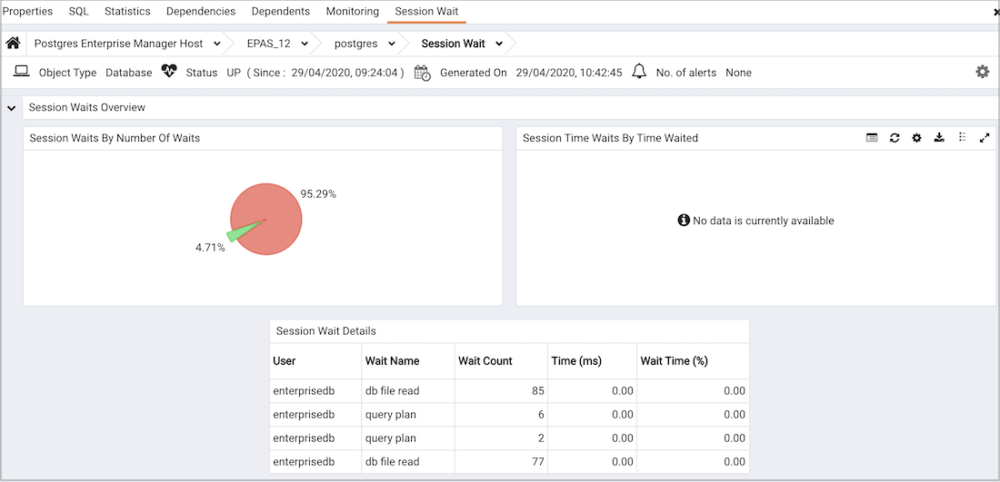

The `Session Wait Analysis` dashboard provides an overview of the current DRITA wait events for an Advanced Server session. For more information about DRITA wait events, please see the EDB Postgres Advanced Server Guide.

Use parameters on the [PEM Server Configurations](../02_pem_server_config/#pem_server_config) dialog to specify the auto-refresh rate for the `Alerts` dashboard. To access the `Server Configuration` dialog, select `Server Configuration...` from the PEM web interface `Management` menu.

The Session Wait Analysis dashboard header displays the date and time that the server started, the date and time that the dashboard was last updated, and the number of alerts currently triggered for the specified database (and monitored objects that reside within that database).

The `Session Waits Overview` displays statistics gathered by the most recent execution of the PEM probe:

-   The `Session Waits By Number Of Waits` pie chart displays the 5 most frequently encountered wait events, per Advanced Server session. For more information about the events that can cause a wait event, see the EDB Postgres Advanced Server Guide.
-   The `Session Waits By Time Waited` pie chart displays the 5 wait events that consume the most time, per Advanced Server session. To gather and display data in the `Session Time Waits by Time Waited` pie chart, you must modify the `postgresql.conf` file for the monitored server, setting *timed_statistics = on*, and restart the server. Please note that this will cause server performance to degrade. For more information about using Advanced Server DRITA timers and the events that can cause a wait event, please see the EDB Postgres Advanced Server Guide.

The `Session Waits Details` table lists the current system wait events for the selected database. Click a column heading to sort the table by the column data; click again to reverse the sort order.The table displays:

-   The `User` column displays the name of the user that encountered the wait.
-   The `Wait Name` column displays the name of the of wait event.
-   The `Wait Count` column displays the total number of waits encountered by the user.
-   The `Time (ms)` displays the number of milliseconds that the user waited for the specified event.
-   The `Wait Time (%)` column displays the percentage of the total wait time consumed by the specified wait event.

To gather and display data in the Time (ms) and Wait Time (%) columns, you must modify the `postgresql.conf` file for the monitored server, setting *timed_statistics = on*, and restart the server. Please note that this will cause server performance to degrade. For more information about using Advanced Server DRITA timers, please see the EDB Postgres Advanced Server Guide.
