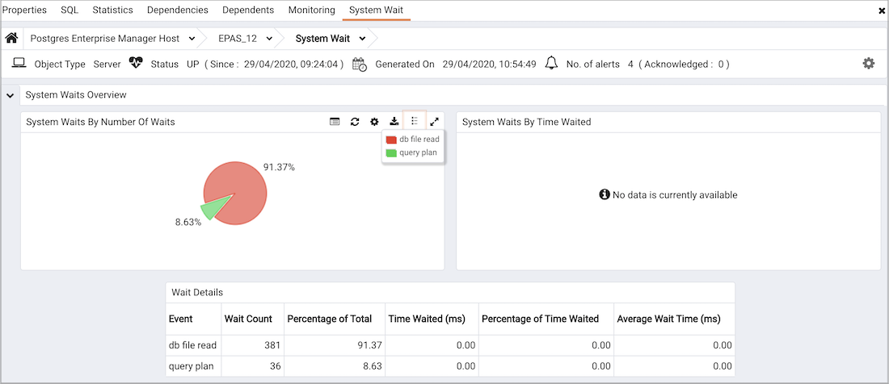

The System Wait Analysis dashboard provides an overview of the current DRITA wait events for an Advanced Server database. For more information about DRITA wait events, please see the EDB Postgres Advanced Server Guide.

Use parameters on the [PEM Server Configurations](../02_pem_server_config/#pem_server_config) dialog to specify the auto-refresh rate for the `Alerts` dashboard. To access the `Server Configuration` dialog, select `Server Configuration...` from the PEM web interface `Management` menu.

The System Waits Analysis dashboard header displays the date and time that the server started, the date and time that the System Waits Analysis dashboard was last updated, and the number of alerts currently triggered for the specified database (and monitored objects that reside within that database).

The `System Waits Overview` displays statistics gathered by the most recent execution of the PEM probe:

-   The `System Waits by Number of Waits` pie chart displays the 5 most frequently encountered wait events for the selected Advanced Server server. For more information about the events that can cause a wait event, see the EDB Postgres Advanced Server Guide.
-   The `System Waits by Time Waited` pie chart displays the 5 wait events that consume the most time for the selected Advanced Server server. To gather and display data in the `System Waits by Time Waited` pie chart, you must modify the `postgresql.conf` file for the monitored server, setting *timed_statistics = on*, and restart the server. Please note that this will cause server performance to degrade. For more information about using Advanced Server DRITA timers, please see the EDB Postgres Advanced Server Guide.

The `System Waits Details` table lists the current system wait events for the selected server. Click a column heading to sort the table by the column data; click again to reverse the sort order.The table displays:

-   The `Event` column displays the name of the wait event.
-   The `Wait Count` column contains the number of times that the wait event occurred.
-   The `Percent of Total` column displays the percentage of the total wait count consumed by this event.
-   The `Time Waited (ms)` displays the number of milliseconds that the server waited for the event.
-   The `Percent of Time Waited` displays the percentage of the total wait time consumed by this event.
-   The `Average Wait Time (ms)` column displays the average wait time for this event.

To gather and display data in the `Time Waited (ms)` and `Percent of Time Waited` columns, you must modify the `postgresql.conf` file for the monitored server, setting *timed_statistics = on*, and restart the server. Please note that this will cause server performance to degrade. For more information about using Advanced Server DRITA timers, please see the EDB Postgres Advanced Server Guide.
