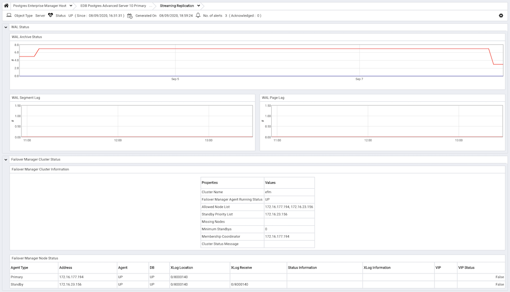
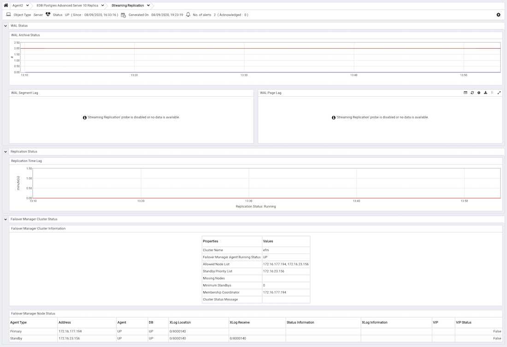
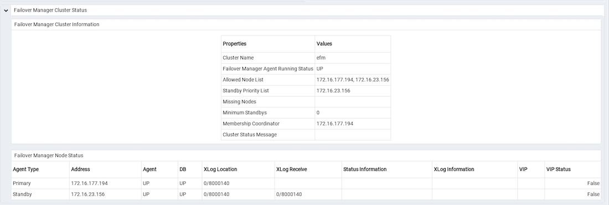

The `Streaming Replication Analysis` Dashboard displays statistical information about WAL activity for a monitored server. By default, replication probes are disabled; to view the `Streaming Replication Analysis` dashboard, you must enable probes on the primary and replica nodes. To enable the probes on the primary node, highlight the name of the primary server in the PEM client `Browser` tree control, and select `Manage Probes...` from the `Management` menu. Use the `Manage Probes` tab to enable the following probes:

-   Streaming Replication
-   WAL Archive Status

To enable the probes on the replica node, highlight the name of the replica server in the PEM client `Browser` tree control, and select `Manage Probes...` from the `Management` menu. Use the `Manage Probes` tab to enable the following probe:

-   Streaming Replication Lag Time

Then, to open the `Streaming Replication Analysis` dashboard, navigate to the `Monitoring` tab, and:

1.  Select the name of the agent that monitors the node from the `Agents` drop-down menu.
2.  Select the name of the monitored server from the `Servers` drop-down menu.
3.  Select `Streaming Replication Analysis` from the `Dashboards` drop-down menu.

The `Streaming Replication Analysis` dashboard header includes the date and time that the server was last started, the date and time that the page was last updated, and a current count of triggered alerts.

When accessing the `Streaming Replication Analysis` dashboard for the primary node of a replication scenario, the dashboard displays information about the write-ahead log activity for the server.

The `WAL Archive Status` graph displays WAL activity; the vertical key on the left side of the graph indicates the archive count; times are displayed across the bottom of the graph.

The `WAL Segment Lag` graph displays the segment lag for the replica nodes that are associated with the selected server. The vertical key on the left side of the graph indicates the archive count. Each node is displayed in a different color on the graph. The `Legend` provides a key to the identity (hostname and port) of each graphed replica node.

The `WAL Page Lag` graph displays the page lag activity for each replica node associated with the selected server. The vertical key on the left side of the graph indicates the page count. Each node is displayed in a different color on the graph. The `Legend` provides a key to the identity (hostname and port) of each graphed replica node.

## Monitoring a Replica Node

When accessing the `Streaming Replication Analysis` dashboard for the replica node of a replication scenario, the dashboard displays information about the write-ahead log activity for the server.

The `WAL Archive Status` graph displays WAL activity; the vertical key on the left side of the graph indicates the archive count; times are displayed across the bottom of the graph.

The `WAL Segment Lag` graph displays the segment lag for the replica nodes that are associated with the selected server. The vertical key on the left side of the graph indicates the archive count. Each replica node is displayed in a different color on the graph. The `Legend` provides a key to the identity (hostname and port) of each graphed slave node.

The `WAL Page Lag` graph displays the page lag activity for each replica node associated with the selected server. The vertical key on the left side of the graph indicates the page count. Each node is displayed in a different color on the graph. The `Legend` provides a key to the identity (hostname and port) of each graphed slave node.

The `Replication Time Lag` graph displays the delay between the time that an operation is performed on the primary node of the replication scenario and the time that the operation is written to the replica node. The vertical key on the left side of the graph indicates the replication delay in minutes. Hover your mouse over a point on the graph to display the date and time that corresponds to that coordinate.

A label at the bottom of the dashboard confirms the status of the replication replica.

## Monitoring a Failover Manager Cluster

If you have configured PEM to monitor a [Failover Manager](#monitoring-a-failover-manager-cluster) cluster, the Streaming Replication Analysis dashboard will display tables that provide an overview of the clusters status and configuration, and information about each cluster member. To display cluster information on the Streaming Replication dashboard, you must provide the following information on the `Advanced` tab of the server `Properties` dialog for each node of the cluster:

-   Use the `EFM Cluster Name` field to specify the name of the Failover Manager cluster. The cluster name is the prefix of the name of the cluster properties file. For example, if your cluster properties file is named `efm.properties`, your cluster name is `efm`.
-   Use the `EFM Installation Path` field to specify the location of the Failover Manager binary file. By default, the Failover Manager binary file is installed in `/usr/edb/efm-3.1/bin`.

The `Failover Manager Cluster Status` section of the Streaming Replication Analysis dashboard displays information about the monitored cluster:

The `Failover Manager Cluster Information` table provides information about the Failover Manager cluster:

-   The `Properties` column displays the name of the cluster property.
-   The `Values` column displays the current value of the property.

The `Failover Manager Node Status` table displays information about each node of the Failover Manager cluster:

-   The `Agent Type` column displays the type of agent that resides on the node; the possible values are Primary, Replica, Witness, Idle, and Promoting.
-   The `Address` column displays the IP address of the node.
-   The `Agent` column displays the status of the agent that resides on the node.
-   The `DB` column displays the status of the database that resides on the node.
-   The `XLog Location` column displays the transaction log location of the database.
-   The `Status Information` column displays any error-related information about the node.
-   The `XLog Information` column displays any error-related information about the transaction log.
-   The `VIP` column displays the VIP address that is associated with the node.
-   The `VIP Status` column displays `True` if the VIP is active for the node, `False` if the VIP is not.
