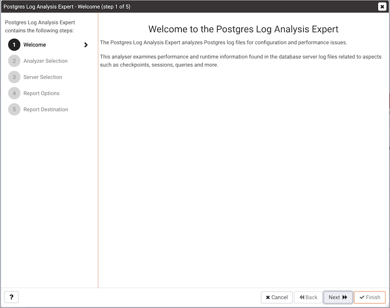
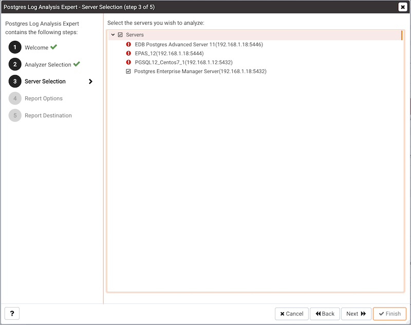
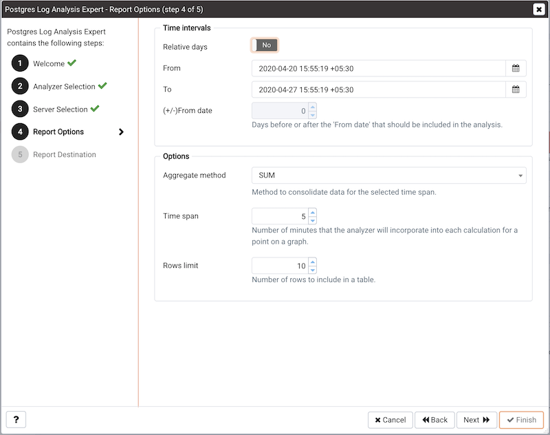
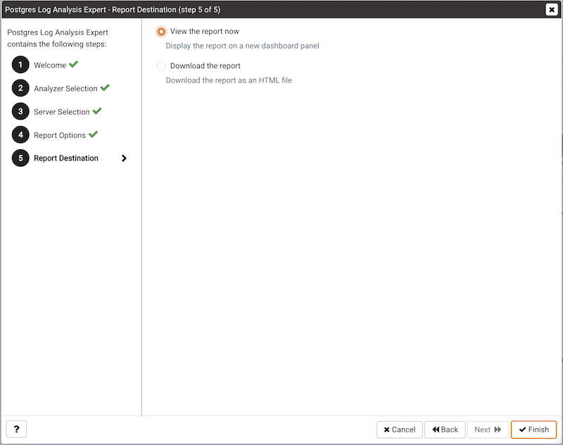
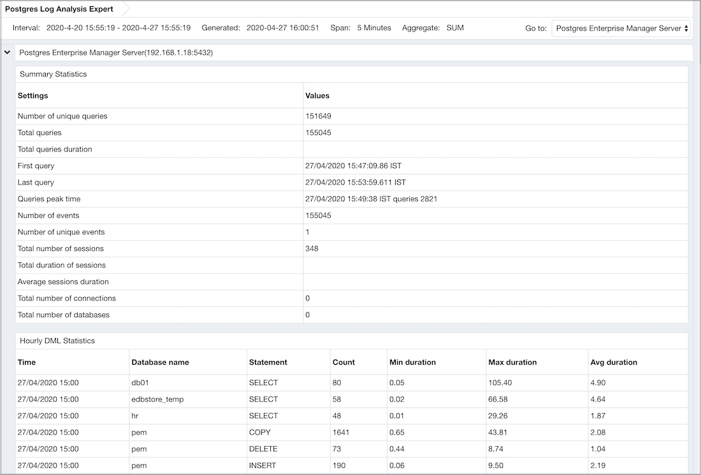

The Postgres Log Analysis Expert analyzes the log files of servers that are registered with PEM, and produces a report that provides an overview of your Postgres cluster's usage based on log file entries. You can use information on the Log Analysis Expert reports to make decisions about optimizing your cluster usage and configuration to improve performance.

Before invoking the Postgres Log Analysis Expert, you must specify the `Service ID` on the `Advanced` tab of the server's properties dialog, and use the Log Manager wizard to enable log collection by the PEM server. To invoke the Log Manager wizard, select the `Log Manager...` option from the `Management` menu; check the box next to `Import logs to PEM` in the `Import Logs` panel of the wizard to enable log collection.

To open the `Postgres Log Analysis Expert` wizard, select the `Postgres Log Analysis Expert...` option from the `Management` menu of the PEM client. When the wizard's `Welcome` dialog opens, click `Next` to continue.

The wizard's `Analyzer selection` dialog displays a list of `Analyzers` from which you can select. Each Analyzer generates a corresponding table, chart, or graph that contains information gleaned from the log files.

Check the box to the left of an Analyzer to indicate that the Log Analysis Expert should prepare the corresponding table, chart or graph. After making your selections, click `Next` to continue to the `Server selection` tree control.

Use the tree control to specify which servers you would like the Postgres Log Analysis Expert to analyze. If you select multiple servers, the resulting report will contain the corresponding result set for each server in a separate (but continuous) list. Click `Next` to continue.

Use the fields in the `Options` section to specify the analysis method and the maximum length of any resulting tables:

-   Use the `Aggregate method` drop-down to select the method used by the Log Analysis Expert to consolidate data for the selected time span - select from:
    -   `SUM` - `SUM` instructs the analyzer to calculate a value that is the sum of the collected values for the specified time span.
    -   `AVG` - `AVG` instructs the analyzer to calculate a value that is the average of the collected values for the specified time span.
    -   `MAX` - `MAX` instructs the analyzer to use the maximum value that occurs within a specified time span.
    -   `MIN` - `MIN` instructs the analyzer to use the minimum value that occurs within a specified time span.
-   Use the `Time span` field to specify the number of minutes that the analyzer will incorporate into each calculation for a point on a graph. For example, if the `Time span` is '5 minutes', and the `Aggregate method` is 'AVG', each point on the given graph will contain the average value of the activity that occurred within a five minute time span.
-   Use the `Rows limit` field to specify the maximum number of rows to include in a table.

Use the fields in the `Time Intervals` section to specify the time range that the Log Analysis Expert will analyze:

-   Set `Relative days` to `Yes` to enable the `(+/-)From date` field and specify the number of days before or after the date and time selected in the `From` field.
-   Use the `From` field to specify the starting date and time for the analysis.
-   Use the `To` field to specify the ending date and time for the analysis.
-   Use the `(+/-) From date` selector to specify the number of days before or after the `From` date that should be included in the analysis.

When you've specified the report options, click `Next` to continue.

You can select the default option (`Finish`) to view the Log Analysis Expert report in the PEM client's tabbed browser, or click the radio button next to `Download the report` to save a copy of the report to an HTML file for later use.

## Reviewing the Postgres Log Analysis Expert Report

If you've elected to review the report immediately, the Postgres Log Analysis Expert report will be displayed in the PEM Client window. If the report contains an analysis of more than one monitored server, the graphs will be displayed in sets; first the graphs, tables and charts that display statistics for one server, then the graphs for the next server in the report.

The Postgres Log Analysis Expert Report header displays the date and time that the report was generated, the time period that the report spans, and the Aggregation method specified when defining the report. The name of the server for which information is displayed is noted at the start of each section of the report.

The report displays the tables, graphs and charts that were selected in the Log Analysis Expert wizard. Use the `Jump To` button (located in the lower-right hand corner of the screen) to navigate to a specific graphic.

The report may include one or more of the following:

-   The `Summary Statistics` table displays a summary of server activity for the selected server.
    -   The `Number of unique queries` row displays the count of unique queries made against the selected server in the specified time period.
    -   The `Total queries` row displays the count of queries made against the selected server in the specified time period.
    -   The `Total queries duration` row displays the amount of time used to execute queries against the server.
    -   The `First query` row displays the time (within the specified time period) that the first query executed against the server.
    -   The `Last query` row displays the time (within the specified time period) that the last query executed against the server.
    -   The `Queries peak time` row displays the point in time (within the specified time period) that query activity reached it's highest level.
    -   The `Number of events` row displays the count of log events within the specified time period.
    -   The `Number of unique events` row displays the count of unique server events.
    -   The `Total number of sessions` row displays a count of the number of sessions recorded within the time period.
    -   The `Total duration of sessions` row displays the amount of time that sessions were connected (during the specified time period).
    -   The `Average sessions duration` row displays the average length of each session.
    -   The `Total number of connections` row displays the number of user connections made to the server.
    -   The `Total number of databases` row displays the number of databases on the selected server.
-   The `Hourly DML Statistics` table displays the statistics related to the use of various DML commands (SELECT, INSERT, UPDATE, DELETE, COPY and FETCH) within a one-hour period. To generate values in the `Min Duration(sec)`, `Max Duration(sec)`, and `Avg Duration(sec)` columns of this table, you must specify a value greater than or equal to `0` in the log_min_duration_statement configuration parameter. You can set the parameter by either modifying the `postgresql.conf` file with your editor of choice, or by specifying a value of `0` or greater in the `Log Min Duration Statement` field of the `Log Manager` wizard.
    -   The `Time` column displays the start of the one-hour period for which data was analyzed.
    -   The `Database` column displays the name of the database in which the specified DML command executed.
    -   The `Command Type` column displays the DML command type.
    -   The `Total Count` column displays the number of times that a command of the specified command type executed during the one-hour period analyzed by the report.
    -   The `Min Duration(sec)` column displays the shortest amount of time (in seconds) used by the server to respond to the specified command type.
    -   The `Max Duration(sec)` column displays the longest amount of time (in seconds) used by the server to respond to the specified command type.
    -   The `Avg Duration(sec)` column displays the average length of time (in seconds) used by the server when responding to the specified command type.
-   The `DML Statistics Timeline` section of the Log Analysis Expert report displays information about DML statement usage:
    -   The line graph displays an analysis of statement usage during the selected time period. Hover over a specific point to view detailed information about that point on the graph.
    -   The pie chart displays the percent of statement usage of each respective DML statement type during the selected time period.
-   The `DDL Statistics Timeline` section of the Log Analysis Expert report displays information about DDL statement usage:
    -   The line graph displays an analysis of statement usage during the selected time period. Hover over a specific point to view detailed information about that point on the graph.
    -   The pie chart displays the percent of statement usage of each respective DDL statement type during the selected time period.
-   The `Commit and Rollback Statistics Timeline` section of the Log Analysis Expert report displays information about the COMMIT, ROLLBACK, and SAVEPOINT statements logged during the specified time period:
    -   The line graph displays an analysis of the commit and rollback activity during the specified time period. Hover over a specific point to view detailed information about that point on the graph.
    -   The pie chart displays the comparative percent of COMMIT, SAVEPOINT, or ROLLBACK statements executed during the specified time period.
-   The `Checkpoint Statistics Timeline` section of the Log Analysis Expert report displays information about the checkpoint operations logged during the specified time period:
    -   The line graph displays an analysis of the checkpoint operation activity during the specified time period. Hover over a specific point to view detailed information about that point on the graph.
    -   The pie chart displays the comparative percent of different types of checkpoint activity logged during the specified time period.
-   The `Log Event Statistics` table lists log entries with a severity level of WARNING, ERROR, FATAL, PANIC, HINT or CONTEXT. The level of logging detail for error messages is controlled by the `log_min_error_statement` parameter. You can set the parameter by either modifying the `postgresql.conf` file with your editor of choice, or by specifying a value in the `Log Min Error Statement` field of the `Log Manager` wizard.
    -   The `Error Severity` column lists the severity level of the log entry.
    -   The `Message` column lists the log message.
    -   The `Total Count` column lists the number of times that the log entry has occurred.
-   The `Log Statistics` table lists log entries that indicate an operational severity level of LOG, DETAIL, DEBUG, NOTICE, INFO or STATEMENT. The level of logging detail for informational messages is controlled by the `log_min_messages` parameter. You can set the parameter by either modifying the `postgresql.conf` file with your editor of choice, or by specifying a value in the `Log Min Messages` field of the `Log Manager` wizard.
    -   The `Error Severity` column lists the severity level of the log entry.
    -   The `Total Count` column lists the number of times that the log entry has occurred.
-   The `Temp Generated Queries` table displays a list of queries that have created temporary files.
    -   The `Log Time` column displays the time that the log entry was generated.
    -   The `TempFile Size(Bytes)` column displays the size of the temporary file in bytes.
    -   The `Query` column displays the text of the query that created the temporary file.
-   The `Temp File Statistics Timeline` graph displays the size of temporary files over the specified time period. Hover over a specific point to view detailed information about that point on the graph.
-   The `Lock Statistics Timeline` section of the Log Analysis Expert report displays information about the locks held during the specified time period:
    -   The graph displays the number of locks held at any given point during the time period. Hover over a specific point to view detailed information about that point on the graph.
    -   The pie chart displays the relative percentage of each type of lock used during the selected time period.
-   The `Waiting Statistics Timeline` section of the Log Analysis Expert report displays information about DML statements that are waiting for a lock during the specified time period:
    -   The graph displays the number of DML statements that are waiting at any given point during the time period; each colored line represents a statement type. Hover over a specific point to view detailed information about that point on the graph.
    -   The pie chart displays the relative percentage of each type of DML statement that waited for a lock during the selected time period.
-   The `Idle Statistics Timeline` section of the Log Analysis Expert report displays information about the amount of time that a connection to the server is idle. An `IDLE` server is waiting for a connection from a client. A connection that is `IDLE in transaction` has started a transaction, but has not yet committed or rolled back the transaction and is waiting for a command from the client. A session that is IDLE in transaction (aborted)\* has started a transaction, but has not yet committed or rolled back the transaction and is waiting for a command from the client; an error has occurred within the transaction and the transaction can only be rolled-back.
    -   The graph displays the times at which the server is `IDLE`, `IDLE in transaction`, and `IDLE in transaction (aborted)`. Hover over a specific point to view detailed information about that point on the graph.
    -   The pie chart displays the relative percentage of each type of lock used during the selected time period.
-   The `Autovacuum Statistics` table displays statistics about autovacuum activity on monitored servers.
    -   The `Log Time` column displays the time that the autovacuum activity was written to the log.
    -   The `Relation` column displays the name of the table on which the autovacuum was performed.
    -   The `Index Details` column displays the number of index scans that were performed.
    -   The `Page Details` column displays the number of pages that were removed, and the number of pages that remain.
    -   The `Tuple Details` column displays the number of tuples that were removed, and the number of tuples that remain.
    -   The `Buffer Usage` column displays the number of buffers hit, missed, or dirty.
    -   The `Read Rate` column displays the average read rate in MB's per second.
    -   The `System Usage` column displays the percent of CPU time used performing autovacuum activities.
-   The `Autoanalyze Statistics` table displays logged autoanalyze activity.
    -   The `Log Time` column displays the time that the autoanalyze activity was written to the log.
    -   The `Relation` column displays the name of the table on which the autoanalyze was performed.
    -   The `System Usage` column displays the percent of CPU time used performing autoanalyze activities.
-   The `Slow Query Statistics` table displays the slowest queries executed on monitored servers. The table will include the number of entries specified in the `Rows Limit` field of the Log Analysis Expert.
    -   The `Log Time` column displays the time that the query activity was written to the log.
    -   The `Tag` column displays the command type.
    -   The `Query` column displays the text of the performed query.
    -   The `Parameters` column displays the parameters (if the query is a parameterized query).
    -   The `Duration` column displays the length of time that it took the server to execute the query.
    -   The `Host` column displays name of the host on which the query executed.
    -   The `Database` column displays the name of the database on which the query executed.
-   The `Frequently Executed Query Statistics` table displays the most frequently executed query statements. The table will include the number of entries specified in the `Rows Limit` field of the Log Analysis Expert.
    -   The `Query` column displays the text of the performed query.
    -   The `Parameters` column displays the parameters (if the query is a parameterized query).
    -   The `No. of Times Executed` column displays the number of times that the query executed.
    -   The `Total Duration` column displays the length of time that it took the server to execute the query.
-   The `Most Time Executed Query Statistics` table displays the queries that took the most execution time on the server. The table will include the number of entries specified in the `Rows Limit` field of the Log Analysis Expert.
    -   The `Query` column displays the text of the performed query.
    -   The `Parameters` column displays the parameters (if the query is a parameterized query).
    -   The `No. of Times Executed` column displays the number of times that the query executed.
    -   The `Total Duration` column displays the length of time that it took the server to execute the query.
-   The `Connections Overview Timeline` section of the Log Analysis Expert report displays information about successful and unsuccessful connection attempts during the specified time period:
    -   The `Timestamp` graph displays the number of server connections attempted and connections authenticated at any given point during the specified time period. Hover over a specific point to view detailed information about that point on the graph.
    -   The `Summary` pie chart displays the relative percentage of connections attempted and connections authenticated during the specified time period.
