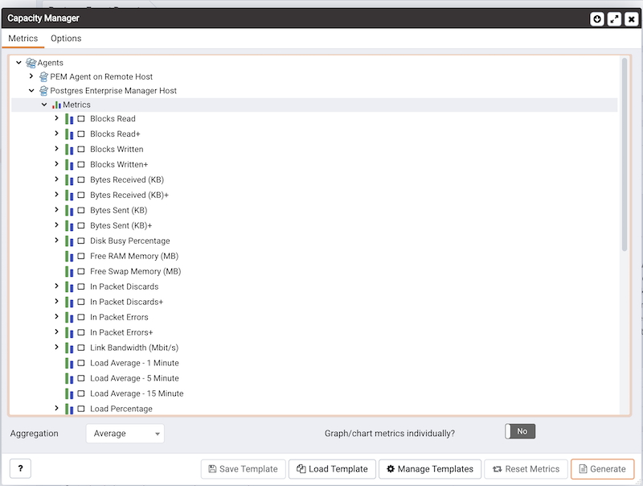
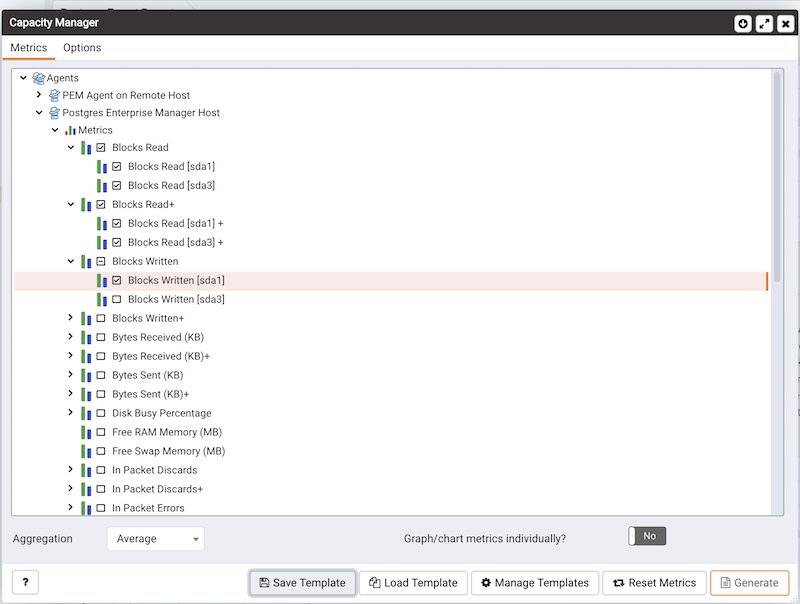

To create a Capacity Manager report, expand the tree control on the `Metrics` tab to locate the metrics that are available for the node that you wish to analyze.

To include a metric in the Capacity Manager report, check the box to the left of the name of the metric on the `Metrics` tab.

Capacity Manager will use the aggregation method specified by the `Aggregation` drop-down listbox (located at the bottom of the `Metrics` tab). The aggregation method instructs Capacity Manager how to evaluate and plot the metric values. Select from:

-   **Average:** Use the average of the values recorded during the time period.
-   **Maximum:** Use the maximum value recorded during the time period.
-   **Minimum:** Use the minimum value recorded during the time period.
-   **First:** Use the first value recorded during the time period.

To remove a metric from the Capacity Manager report, uncheck the box to the left of the name of a metric.

Move the slider next to `Graph/chart metrics individually?` to `Yes` to instruct Capacity Manager to produce a separate report for each metric selected on the `Metrics` tab. If the option is set to `No`, all selected metrics will be merged into a single graph or table.

Click the `Generate` button to display the report onscreen (accepting the default configuration options), or continue to the [Options](02_capacity_manager_options/#capacity_manager_options) tab to specify sampling boundaries, report type and report destination.
