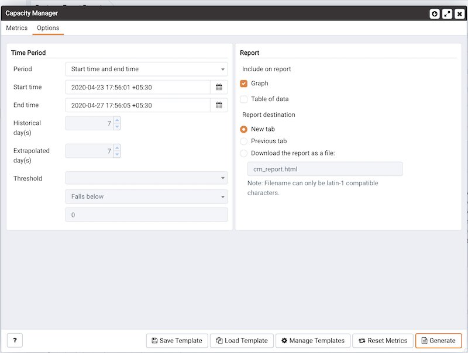

Use the fields on the `Options` tab to specify the starting and ending boundaries of the Capacity Manager report, the type of report generated, and the location to which the report will be displayed or written.

Use the fields within the `Time Period` box to define the boundaries of the Capacity Manager report:

-   Use the `Period` drop-down listbox to select the type of time period you wish to use for the report. You can select:

| Value                                 | Description                                                                                                                                                                                                   |
| ------------------------------------- | ------------------------------------------------------------------------------------------------------------------------------------------------------------------------------------------------------------- |
| Start time and end time               | Specify a start and end date and time for the report.                                                                                                                                                         |
| Start time and threshold              | Specify a start date and time, and a threshold to determine the end time and date for the report.                                                                                                             |
| Historical days and extrapolated days | Specify a start date for the report that is a number of days in the past, and an end date that is a number of days in the future. This option is useful for report templates that do not specify fixed dates. |
| Historical days and threshold         | Specify a start date that is a number of days in the past, and end it when a threshold value is reached.                                                                                                      |

After specifying the type of time period for the report, select from other options in the `Time Period` box to refine the time period:

-   Use the date and time selectors next to the `Start time` field to specify the starting date and time of the sampling period, or select the number of `Historical day(s)` of data to include in the report. By default, Capacity Manager will select a start time that is one week prior to the current date and time. The date and time specified in the `Start time` field must not be later than the current date/time.
-   Use the date and time selectors next to the `End time` field to specify an end boundary for the report, or select the number of `Extrapolated day(s)` of data to include in the report. The end boundary can be either a time, a number of days in the future, or the point at which a selected metric reaches a user-specified threshold value. The time specified in the `End time` field must be later than the time specified in the `Start time` field.

> Note that if you select an end date and time in the future, Capacity Manager will use historical usage information to extrapolate anticipated future usage. Since the projected usage is based on the sampling of historical data, the accuracy of the future usage trend will improve with a longer sampling period.
>
> To specify a threshold value, use the drop-down listbox in the `Threshold` field to select a metric (from the metrics specified on the `Metrics` tab), an operator (`Exceeds` or `Falls below`), and to enter a target value for the metric. If you choose to define the end of the report using a threshold, the Capacity Manager report will terminate when the value for the selected metric exceeds or falls below the specified value.
>
> **Please Note:** If you specify a starting boundary that is later than the ending boundary for the report, the status bar will display an error informing you that you must enter a valid time.

The cm_max_end_date_in_years &lt;pem_config_options> configuration parameter defines a default time value for the end boundary of Capacity Manager reports. If you specify a threshold value as the end boundary of a report, and the anticipated usage of the boundary is not met before the maximum time has passed (as specified in the `cm_max_date_in_years` parameter), the report will terminate at the time specified by the `cm_max_date_in_years` parameter. By default, `cm_max_end_date_in_years` is 5; use the `` `Server Configuration `` dialog &lt;pem_server_config> to modify the value of cm_max_end_date_in_years\`.

**Please Note:** The PEM client will display time in the PEM client's timezone, rather than the timezone in which the PEM server resides.

Use the fields in the `Report` box to specify the report type and destination.

The radio buttons next to `Include on report` specify the type of report produced by Capacity Manager. Choose from:

> -   Select `Graph` to instruct Capacity Manager to display the report in the form of a line graph in the PEM client window.
> -   Select `Table of data` to instruct Capacity Manager to display a table containing the report data in the PEM client window.
> -   Select `Graph and table of data` to instruct Capacity Manager to display both a line graph and a data table in the PEM client window.

Use the `Report destination` radio buttons to instruct Capacity Manager where to display or save the report:

> -   Select `New tab` to instruct Capacity Manager to display the report on a new tab in the PEM client. You must select `New tab` to display the first generation of a Capacity Manager report; for subsequent reports, you may select `Previous` tab.
> -   Select `Previous` tab to instruct Capacity Manager to re-use a previously opened tab when displaying the report.
> -   Select `Download the report as a file` and specify a file name to instruct Capacity Manager to write the report to the specified file.

Reports saved to file are stored in HTML format. You can review Capacity Manager reports with any web browser that supports Scalable Vector Graphics (SVG). Browsers that do not support SVG will be unable to display Capacity Manager graphs and may include unwanted characters.

When you have specified the report boundaries and selected the type and destination of the Capacity Manager report, click the `Generate` button to create the report.
