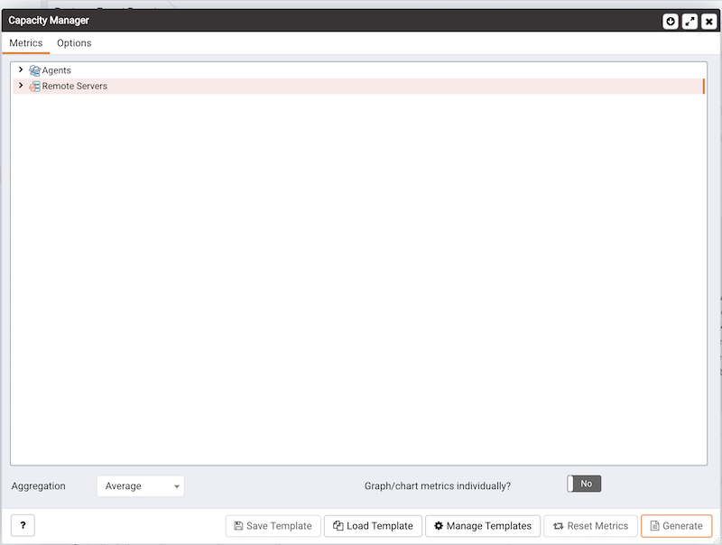

PEM's Capacity Manager analyzes collected statistics (metrics) to generate a graph or table that displays the historical usage statistics of an object, and can project the anticipated usage statistics for an object. You can configure Capacity Manager to collect and analyze metrics for a specific:

-   Host/operating system
-   EDB Postgres Advanced Server or PostgreSQL server
-   Database
-   Database object (table, index, function etc).

You can tailor the content of the Capacity Manager report by choosing a specific metric (or metrics) to include in the report, the time range over which the metrics were gathered, and a high or low threshold for the metrics analyzed. You can also specify a start and end date for the Capacity Manager report. If the end date of the report specifies a time in the future, Capacity Manager will analyze the `historical` usage of the selected object to extrapolate the `projected` object usage in the future.

To open Capacity Manager, select the `Capacity Manager...` option from the `Management` menu in the PEM client window; the `Capacity Manager` wizard opens, displaying a tree control on the `Metrics` tab.

Expand the tree control on the [Metrics](01_capacity_manager_metrics/#capacity_manager_metrics) tab to select the metrics that will be included in the Capacity Manager report.

When defining report options, you can specify an `aggregation` method for each selected metric. The aggregation method determines how Capacity Manager will analyze the data points within the sampling period to reduce the data to a more visually meaningful quantity within a report (if required). The aggregation method can instruct Capacity Manager to compute an average of the data within a time period, the high or low value, or the first sampled value.

Use the [Options](02_capacity_manager_options/#capacity_manager_options) tab to specify additional report details.

When defining the boundaries of a Capacity Manager report, specify the starting date and time, and an end boundary. The end boundary can be a point in time or a threshold boundary (when the data meets a specified criteria). If the sample contains more data points than the number of points specified by the cm_data_points_per_report &lt;pem_config_options> configuration parameter, Capacity Manager applies the aggregation method to calculate a reduced number of graph points for the report.

## Report Templates

You can save a report definition as a template for future reports. Capacity Manager report templates may be accessed by all PEM users. To save a report definition as a template:

1.  Use the `Metrics` and `Options` tabs to define your report.
2.  Click the `Save` button to open the `Save Template` dialog.
3.  Provide a report name in the Title field, select a location to store the template in the tree control.
4.  Click `OK`.

When creating a report, you can use the `Load Template` button to browse and open an existing template. Once opened, the report definition may be modified if required, and optionally saved again, either as a new template, or overwriting the original template. Use the `Manage Templates` button open a dialog that allows you to rename or remove unwanted templates.

## Available Metrics

Please Note that the available metrics will vary by platform, and are subject to change. The available metrics may include the metrics described in the table below:

| Metric Name                           | Description                                                                                                                                                      |
| ------------------------------------- | ---------------------------------------------------------------------------------------------------------------------------------------------------------------- |
| # Dead Tuples                         | The number of dead tuples in the selected table.                                                                                                                 |
| # Dead Tuples+                        | The cumulative number of dead tuples in the selected table.                                                                                                      |
| # Heap Tuples Fetched by Index Scans  | The number of heap tuples fetched by index scans.                                                                                                                |
| # Heap Tuples Fetched by Index Scans+ | The cumulative number of heap tuples fetched by index scans.                                                                                                     |
| # Idle Backends+                      | The cumulative number of currently idle backend clients.                                                                                                         |
| # Index Scans                         | The number of index scans performed on the specified object.                                                                                                     |
| # Index Scans+                        | The cumulative number of index scans performed on the specified object.                                                                                          |
| # Index Tuples Read                   | The number of index tuples read.                                                                                                                                 |
| # Index Tuples Read+                  | The cumulative number of index tuples read.                                                                                                                      |
| # Live Tuples                         | The number of tuples visible to transactions.                                                                                                                    |
| # Live Tuples+                        | The cumulative number of tuples visible to transactions.                                                                                                         |
| # Pages Estimated by ANALYZE          | The number of pages estimated by ANALYZE.                                                                                                                        |
| # Pages Estimated by ANALYZE+         | The cumulative number of pages estimated by ANALYZE.                                                                                                             |
| # Sequential Scans                    | The number of sequential scans performed on the specific table.                                                                                                  |
| # Sequential Scans+                   | The cumulative number of sequential scans performed on the specific table.                                                                                       |
| # Sequential Scan Tuples              | The number of tuples sequentially scanned in the specific table.                                                                                                 |
| # Sequential Scan Tuples+             | The cumulative number of tuples sequentially scanned in the specific table.                                                                                      |
| # Tuples Deleted                      | The number of tuples deleted.                                                                                                                                    |
| # Tuples Deleted+                     | The cumulative number of tuples deleted.                                                                                                                         |
| # Tuples Estimated by ANALYZE         | The number of live (visible) tuples estimated by ANALYZE.                                                                                                        |
| # Tuples Estimated by ANALYZE+        | The cumulative number of live tuples estimated by ANALYZE.                                                                                                       |
| # Tuples HOT Updated                  | The number of tuples HOT updated. In a HOT update, the new tuple resides in the same block as the original tuple and the tuples share an index entry.            |
| # Tuples HOT Updated+                 | The cumulative number of tuples HOT updated.                                                                                                                     |
| # Tuples Inserted                     | The number of tuples inserted into the specified table.                                                                                                          |
| # Tuples Inserted+                    | The cumulative number of tuples inserted into the specified table.                                                                                               |
| # Tuples Updated                      | The number of tuples updated in the selected table.                                                                                                              |
| # Tuples Updated+                     | The cumulative number of tuples updated in the selected table.                                                                                                   |
| Blocks Hit                            | The number of blocks found in the cache.                                                                                                                         |
| Blocks Hit+                           | The cumulative number of blocks found in the cache.                                                                                                              |
| Blocks Read                           | The number of blocks read.                                                                                                                                       |
| Blocks Read+                          | The cumulative number of blocks read.                                                                                                                            |
| Blocks Read from InfiniteCache        | The number of blocks read from InfiniteCache.                                                                                                                    |
| Blocks Read from InfiniteCache+       | The cumulative number of blocks read from InfiniteCache.                                                                                                         |
| Blocks Written                        | The number of blocks written.                                                                                                                                    |
| Blocks Written+                       | The cumulative number of blocks written.                                                                                                                         |
| Buffers Allocated                     | The number of buffers allocated.                                                                                                                                 |
| Buffers Allocated+                    | The cumulative number of buffers allocated.                                                                                                                      |
| Buffers Written - Backends            | The number of buffer blocks written to disk by server processes (processes connected to a client application).                                                   |
| Buffers Written - Backends+           | The cumulative number of buffer blocks written to disk by server processes.                                                                                      |
| Buffers Written - Checkpoint          | The number of blocks written to disk by the checkpoint process.                                                                                                  |
| Buffers Written - Checkpoint+         | The cumulative number of blocks written to disk by the checkpoint process.                                                                                       |
| Buffers Written - Cleaning Scan       | The number of blocks written to disk by the autovacuum process.                                                                                                  |
| Buffers Written - Cleaning Scan+      | The cumulative number of blocks written to disk by the autovacuum process.                                                                                       |
| Bytes Received (KB)                   | The number of bytes received from the client (in kilobytes).                                                                                                     |
| Bytes Received (KB)+                  | The cumulative number of bytes received (in kilobytes).                                                                                                          |
| Bytes Sent (KB)                       | The number of bytes sent to the client (in kilobytes).                                                                                                           |
| Bytes Sent (KB)+                      | The cumulative number of bytes sent (in kilobytes).                                                                                                              |
| Checkpoints - Timed                   | The number of checkpoint operations triggered by the checkpoint interval.                                                                                        |
| Checkpoints - Timed+                  | The cumulative number of checkpoint operations triggered by the checkpoint interval.                                                                             |
| Checkpoints - Untimed                 | The number of checkpoint operations triggered by checkpoint size.                                                                                                |
| Checkpoints - Untimed+                | The cumulative number of checkpoint operations triggered by checkpoint size.                                                                                     |
| Database Size (MB)                    | The size of the specified database (in megabytes).                                                                                                               |
| Free RAM Memory                       | The amount of free RAM memory (in megabytes).                                                                                                                    |
| Free Swap Memory                      | The amount of free swap space on disk (in megabytes).                                                                                                            |
| Heap Blocks Hit                       | The number of heap blocks found in the cache.                                                                                                                    |
| Heap Blocks Hit+                      | The cumulative number of heap blocks found in the cache.                                                                                                         |
| Heap Blocks Read                      | The number of heap blocks read.                                                                                                                                  |
| Heap Blocks Read+                     | The cumulative number of heap blocks read.                                                                                                                       |
| Index Blocks Hit                      | The number of index blocks found in the cache.                                                                                                                   |
| Index Blocks Hit+                     | The cumulative number of index blocks found in the cache.                                                                                                        |
| Index Blocks Read                     | The number of index blocks read.                                                                                                                                 |
| Index Blocks Read+                    | The cumulative number of index blocks read.                                                                                                                      |
| Index Size (MB)                       | The size of the specified index (in megabytes).                                                                                                                  |
| In Packets Discards                   | The number of inbound packets discarded.                                                                                                                         |
| In Packets Discards+                  | The cumulative number of inbound packets discarded.                                                                                                              |
| In Packets Errors                     | The number of inbound packets that contain errors.                                                                                                               |
| In Packets Errors+                    | The cumulative number of inbound packets that contain errors.                                                                                                    |
| Link Bandwidth (Mbit/s)               | The speed of the network adapter (in megabits per second).                                                                                                       |
| Load Average - 15 Minute              | CPU saturation (in percent) - 15 minute sampling average.                                                                                                        |
| Load Average - 1 Minute               | CPU saturation (in percent) - 1 minute sampling average.                                                                                                         |
| Load Average - 5 Minute               | CPU saturation (in percent) - 5 minute sampling average.                                                                                                         |
| Load Percentage                       | CPU saturation in percent.                                                                                                                                       |
| Number of Prepared Transactions+      | The cumulative number of prepared transactions.                                                                                                                  |
| Number of WAL Files+                  | The cumulative number of write-ahead log files.                                                                                                                  |
| Out Packets Discards                  | The number of outbound packets discarded.                                                                                                                        |
| Out Packets Discards+                 | The cumulative number of outbound packets discarded.                                                                                                             |
| Out Packets Errors                    | The number of outbound packets that contain errors.                                                                                                              |
| Out Packets Errors+                   | The cumulative number of outbound packets that contain errors.                                                                                                   |
| Packets Received                      | The number of packets received.                                                                                                                                  |
| Packets Received+                     | The cumulative number of packets received.                                                                                                                       |
| Packets Sent                          | The number of packets sent.                                                                                                                                      |
| Packets Sent+                         | The cumulative number of packets sent.                                                                                                                           |
| Size (MB)                             | The total size of the disk (in megabytes).                                                                                                                       |
| Size of Indexes (MB)                  | The size of indexes on the specified table (in megabytes).                                                                                                       |
| Space Available (MB)                  | The current disk space available (in megabytes).                                                                                                                 |
| Space Used (MB)                       | The current disk space used (in megabytes).                                                                                                                      |
| Table Size (MB)                       | The size of the specified table (in megabytes).                                                                                                                  |
| Tablespace Size (MB)                  | The size of the specified tablespace (in megabytes).                                                                                                             |
| Temp Buffers (MB)                     | The size of temporary buffers (in megabytes).                                                                                                                    |
| Toast Blocks Hit                      | The number of TOAST blocks found in the cache.                                                                                                                   |
| Toast Blocks Hit+                     | The cumulative number of TOAST blocks found in the cache.                                                                                                        |
| Toast Blocks Read                     | The number of TOAST blocks read.                                                                                                                                 |
| Toast Blocks Read+                    | The cumulative number of TOAST blocks read.                                                                                                                      |
| Total RAM Memory                      | The total amount of RAM memory on the system (in megabytes).                                                                                                     |
| Total Swap Memory                     | The total amount of swap space on the system (in megabytes).                                                                                                     |
| Total Table Size w/Indexes and Toast  | The total size of the specified table (including indexes and associated oversized attributes).                                                                   |
| Transactions Aborted                  | The number of aborted transactions.                                                                                                                              |
| Transactions Aborted+                 | The cumulative number of aborted transactions.                                                                                                                   |
| Transactions Committed                | The number of committed transactions.                                                                                                                            |
| Transactions Committed+               | The cumulative number of committed transactions.                                                                                                                 |
| Tuples Deleted                        | The number of tuples deleted from the specified table.                                                                                                           |
| Tuples Deleted+                       | The cumulative number of tuples deleted from the specified table.                                                                                                |
| Tuples Estimated by ANALYZE           | The number of visible tuples in the specified table.                                                                                                             |
| Tuples Estimated by ANALYZE+          | The cumulative number of visible tuples in the specified table.                                                                                                  |
| Tuples Fetched                        | The number of tuples fetched from the specified table.                                                                                                           |
| Tuples Fetched+                       | The cumulative number of tuples fetched from the specified table.                                                                                                |
| Tuples HOT Updated                    | The number of tuples HOT updated. In a HOT update, the new tuple resides in the same block as the original tuple and the tuples share an index entry.            |
| Tuples HOT Updated+                   | The cumulative number of tuples HOT updated. In a HOT update, the new tuple resides in the same block as the original tuple and the tuples share an index entry. |
| Tuples Inserted                       | The number of tuples inserted into the specified table.                                                                                                          |
| Tuples Inserted+                      | The cumulative number of tuples inserted into the specified table.                                                                                               |
| Tuples Returned                       | The number of tuples returned in result sets.                                                                                                                    |
| Tuples Returned+                      | The cumulative number of tuples returned in result sets.                                                                                                         |
| Tuples Updated                        | The number of tuples updated in the specified table.                                                                                                             |
| Tuples Updated+                       | The cumulative number of tuples updated in the specified table.                                                                                                  |
| WAL Segment Size (MB)                 | The segment size of the write-ahead log (in megabytes).                                                                                                          |

!!! Note
    The '+' following the name of a metric signifies that the data for the metric is gathered cumulatively; those metrics that are not followed by the '+' sign are collected as a 'point-in-time' value.

Contents:

capacity_manager_metrics capacity_manager_options

