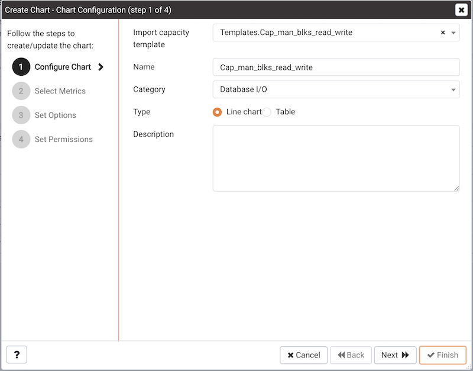
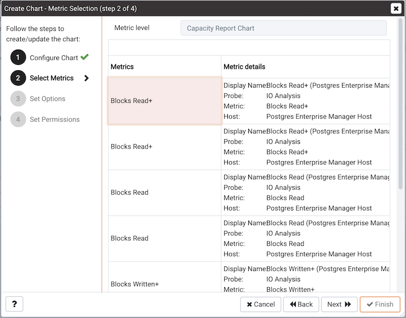
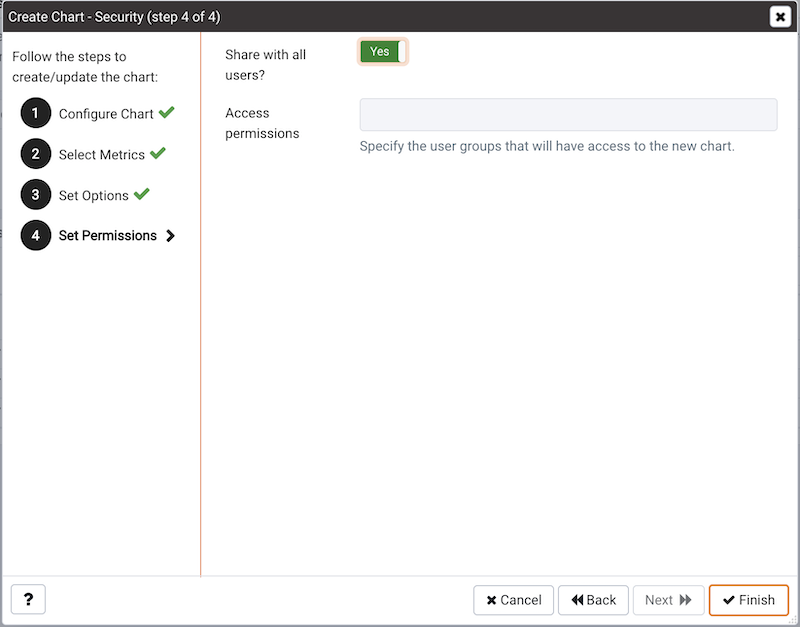

Selecting the `Import Capacity Manager Template` from the `Manage Charts` tab's `Quick Links` section opens the `Create Chart` dialog, allowing you to select from your saved Capacity Manager templates. When the dialog opens, use the `Import capacity template` drop-down listbox to select the template you would like to use for your chart.

Use the fields on the `Create Chart` dialog to provide information about the chart:

-   Specify the name of the chart in the `Name` field.
-   Use the drop-down listbox in the `Category` field to specify the category in which this chart will be displayed. When adding a custom chart to a custom dashboard, the chart will be displayed for selection in the `Category` specified.
-   Use the radio buttons in the `Type` field to specify if the chart will be a `Line chart` or a `Table`.
-   Provide a description of the chart in the `Description` field. The description will be displayed to the user viewing the chart (on a custom dashboard) when they click the information icon.

Click `Next` to continue to the `Select Metrics` window.

The `Select Metrics` window displays details about the metrics that are used by the template. When you've reviewed the metrics, click `Next` to continue to the `Set Options` window.

Use the fields on the `Set Options` window to specify display options for your chart:

-   Use the `Auto Refresh` field to specify the number of minutes between chart updates - choose a value from 1 to 999. The default auto refresh rate is 2 minutes.

-   Use the fields in the `Data extrapolation` box to specify the time period covered by the chart. You can either:

    > -   click the `Historical days and extrapolated days` label and:
    >     -   specify the number of days of historical data that should be charted in the `Historical` field.
    >     -   specify the number of projected days that should be charted in the `Extrapolated` field.
    > -   or, click the `Historical days and threshold` label and:
    >     -   provide the number of days of historical data that should be charted in the `Historical` field.
    >     -   use the threshold selection fields to specify the threshold value at which the chart will end.

When you've completed the `Set Options` window, click `Next` to continue.

After making any required modifications to the chart definition, click `Finish` to save your edits. PEM will open a popup, confirming that the edits have been saved:

