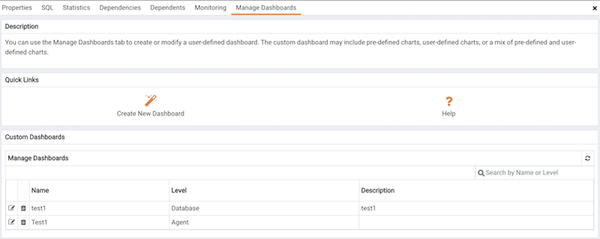

PEM displays performance statistics through a number of system-defined dashboards; each dashboard contains a series of summary views that contain charts, graphs and tables that display statistics related to the selected object. You can use the Manage Dashboards tab to create and manage custom dashboards that display the information that is most relevant to your system.

To create a custom dashboard, click the `Create New Dashboard` link (located in the `Quick Links section of the`Manage Dashboards`tab).  To modify an existing dashboard, click the edit icon to the left of a dashboard name.  The dashboard editor will open, displaying the definition of the dashboard.  When you've finished modifying the dashboard's definition, click the`Save`button to preserve your changes; click`Cancel`to exit without saving your changes.  To delete a dashboard, click the delete icon to the left of a dashboard name.  A popup will ask you to confirm that you wish to delete the dashboard; click`OK\`\` to delete the selected dashboard.

Contents:

pem_custom_dashboard pem_ops_dashboard

