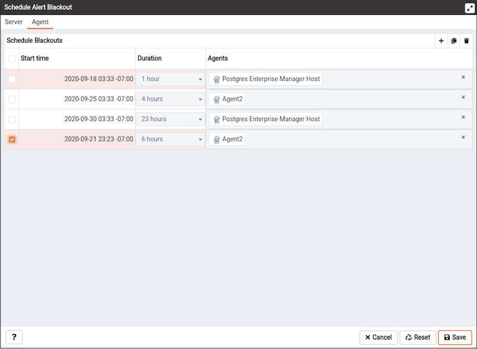

You can use the `Schedule Alert Blackout` option on the `Management` menu to schedule an alert blackout for your Postgres servers and PEM Agents during maintenance. Alerts will not be raised during a defined blackout period.

To schedule an alert blackout, click on the `Management` menu and select `Schedule Alert Blackout`.

When the `Schedule Alert Blackout` dialog opens, use the tabs on the dialog to define the blackout period for servers and agents. Open the `Server` tab and click the Add icon (+) at the top right corner to add new row.

Use the fields on the `Server` tab to provide information about a Server to blackout the alerts:

-   Use the `Start time` field to provide the date and time to start the alert blackout.
-   Use the `Duration` field to provide the interval for which you want to blackout the alerts.
-   Use the `Servers` field to provide the server name for which you want to blackout the alerts. You can also select multiple servers to blackout the alerts at same time.

Once all the details are provided, you can save the details by clicking on `Save` button on the right bottom corner of the dialog. Once saved, it cannot be edited. The alerts will not be displayed on the Alerts dashboard for the scheduled interval of that particular server.

You can also schedule a blackout period for PEM Agents via the `Agent` tab on the dialog. Open the `Agent` tab and click the Add icon (+) at the top right corner to add new row.

Use the fields on the `Agent` tab to provide the information about an Agent to blackout the alerts:

-   Use the `Start time` field to provide the date and time to start the alert blackout.
-   Use the `Duration` field to provide the interval for which you want to blackout the alerts.
-   Use the `Agents` field to provide the Agent name for which you want to blackout the alerts. All server level alerts, for the servers bind to that particular agent will blackout.

Once all the details are provided, you can save the details by clicking on `Save` button on the right bottom corner of the dialog. Once saved, it cannot be edited. The alerts will not be displayed on the Alert dashboard for the scheduled interval for that `PEM Agent`.

You can use `Clone` button from the top right corner of dialog, to clone the scheduling of alert blackout. Select the servers or agents you want to clone and then click on `Clone` button to create the cloned copy of all the selected servers or agents. You can edit newly created schedules as needed, and then click `Save`.

You can use `Delete` button from the top right corner of dialog to remove a scheduled alert blackout. Select the servers or agents and then click on highlighted `Delete` button in the right top corner to remove the scheduled alerts associated with that server or agent.

Select a server for which you wish to delete the scheduled alert backout and then click on the `Delete` button. The server will ask for confirmation before deleting that row.

You can use the `Reset` button to reset the details on the Alert Blackout dialog to the default settings. Please note that all saved blackouts will remain unaffected after resetting the current dialog values.
