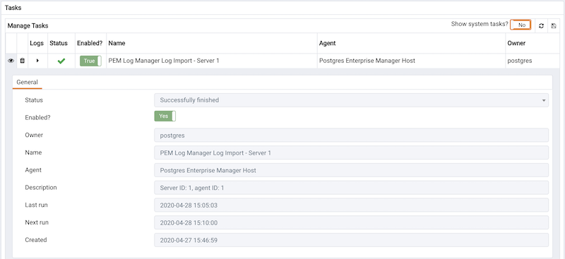

Postgres Enterprise Manager runs tasks on managed servers by scheduling them on the PEM server for the agent on the managed server to execute at the appropriate time. Tasks may be one-off, or recurring and are comprised of one or more steps, which may be a SQL script, a batch/shell script, or an internal function in the PEM agent. Tasks may be viewed using the *Scheduled Tasks dialogue.*

To open the `Scheduled Tasks dialogue`, select either a PEM Agent or a managed server in the tree control of the PEM client and select the `Scheduled Tasks` menu option from the `Server` sub-menu of the `Management` menu, or from the context menu.

The dialogue displays the task data relating to the selected object when it was opened. The following details are shown:

-   **Status** - The status of the task following the last execution.
-   **Enabled?** - An indicator showing whether the task is enabled or not.
-   **Name** - The name of the task.
-   **Server** - The server on which the task will be executed, where applicable.
-   **Description** - A description of the task.
-   **Last Run** - The time the task was last executed.
-   **Next Run** - The time the task is next scheduled to execute, if any.
-   **Created** - The time and date that the task was created.

In order to [view the log records](01_pem_log_view/#pem_log_view) for a task, select it in the list and click the `Log Viewer` button.

In order to remove tasks and their associated log records (if present), click the checkbox to select each task to be removed, and then click the `Remove` button.

!!! Note
    Tasks with no next run date will automatically be removed from the PEM server when the last run date is more than probe_log_retention_time &lt;pem_config_options> days ago.

Contents:

pem_log_view

