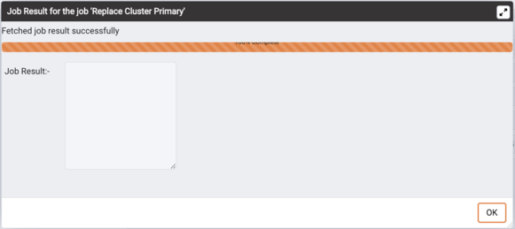
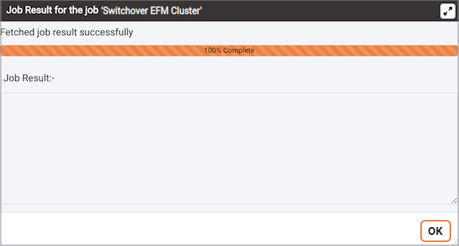

You can configure PEM to display status information about one or more Failover Manager clusters on the Streaming Replication dashboard. Before configuring PEM to monitor a Failover Manager cluster, you must install and configure Streaming Replication and Failover Manager on the cluster.

Please note that your Streaming Replication `standby.signal` file must include the following parameters:

-   primary_conninfo
-   promote_trigger_file

For information about installing and configuring Failover Manager and Streaming Replication, please see the EnterpriseDB Failover Manager Guide, available at [www.enterprisedb.com](http://www.enterprisedb.com).

To configure PEM to monitor a Failover Manager cluster, use the PEM client to create a server definition for the primary node of the Failover Manager cluster. Use the tabs on the [New Server Registration](../01_toc_pem_getting_started/07_pem_define_connection/#pem_define_connection) dialog to specify general connection properties for the primary node; use fields on the `Advanced` tab to specify information about the Failover Manager cluster:

-   Use the `EFM Cluster Name` field to specify the name of the Failover Manager cluster. The cluster name is the prefix of the name of the cluster properties file. For example, if your cluster properties file is named `efm.properties`, your cluster name is `efm`.
-   Use the `EFM Installation Path` field to specify the location of the Failover Manager binary file. By default, the Failover Manager binary file is installed in `/usr/efm-x.x/bin`.

After saving the server definition, the primary node will be included in the list of servers under the `PEM Server Directory` in the PEM client `Object browser` tree, and will be displayed on the `Global Overview` dashboard.

To include Failover Manager information on the Streaming Analysis dashboard, you must enable the following probes for each node in the Failover Manager cluster:

-   Failover Manager Cluster Info
-   Failover Manager Node Status

To enable a probe, right click on the node name, and select `Manage Probes` from the `Management` menu.

To view the `Streaming Replication Analysis` dashboard and the status of the Failover Manager cluster, right click on the name of the primary node in the `Object browser` tree control and navigate through the `Dashboards` menu to select [Streaming Replication Analysis](01_dashboards/16_str_replication_dashboard/#str_replication_dashboard).

## Promoting a Cluster

Select the `Replace Cluster Primary` from `Server` under the `Tools` menu to start the failover process. When you select `Replace Cluster Primary`, a popup opens, asking you to confirm that you wish to replace the current primary node:

Select `No` to exit the popup without replacing the current primary node.

Select `Yes` to remove the current primary node from the Failover Manager cluster and promote a replica node to the role of read/write primary node within a Failover Manager cluster. The node with the highest promotion priority (defined in Failover Manager) will become the new primary node. PEM will display a dialog, reporting the job status.

When the job completes and the Streaming Replication Analysis dashboard refreshes, you can review the `Failover Manager Node Status` table to confirm that a replica node has been promoted to the role of primary within the Failover Manager cluster.

### Switchover EFM Cluster

You can use the PEM client to switchover the primary node of a Failover Manager cluster with a replica node. To initiate the switchover process, select Switchover EFM Cluster from the Tools menu. A dialog opens, asking you to confirm that you wish to switchover EFM cluster.

Select `Yes` to switchover EFM cluster from the Failover Manager cluster and promote a replica node to the role of read/write primary node and reconfigure the primary database as a new replica within a Failover Manager cluster. The node with the highest promotion priority (defined in Failover Manager) will become the new primary node. PEM will display a dialog, reporting the job status.

When the job completes and the Streaming Replication Analysis dashboard refreshes, you can review the `Failover Manager Node Status` table to confirm that a switchover within the Failover Manager cluster.
