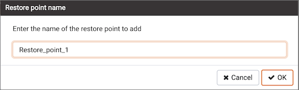

Use the `Add named restore point` dialog to take a named snapshot of the state of the server for use in a recovery file. To create a named restore point, the server's postgresql.conf file must specify a `wal_level` value of `replica`, or `logical`. You must be a database superuser to create a restore point.

When the `Restore point name` window launches, use the field `Enter the name of the restore point to add` to provide a descriptive name for the restore point.

For more information about using a restore point as a recovery target, please see the [PostgreSQL documentation](https://www.postgresql.org/docs/current/runtime-config-wal.html#RUNTIME-CONFIG-WAL-RECOVERY-TARGET).

-   Click the `OK` button to save the restore point.
-   Click the `Cancel` button to exit without saving work.
