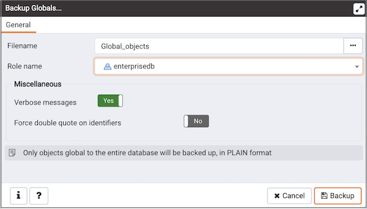
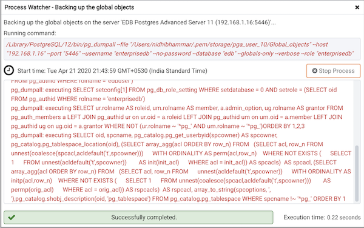

Use the `Backup Globals` dialog to create a plain-text script that recreates all of the database objects within a cluster, and the global objects that are shared by those databases. Global objects include tablespaces, roles, and object properties. You can use the PEM `Query Tool` to play back a plain-text script, and recreate the objects in the backup.

Use the fields in the `General` tab to specify the following:

-   Enter the name of the backup file in the `Filename` field. Optionally, select the `Browser` icon (ellipsis) to the right to navigate into a directory and select a file that will contain the archive.
-   Use the drop-down listbox next to `Role name` to specify a role with connection privileges on the selected server. The role will be used for authentication during the backup.

Move switches in the **Miscellaneous** field box to specify the type of statements that should be included in the backup.

-   Move the `Verbose messages` switch to the `No` position to exclude status messages from the backup. The default is `Yes`.
-   Move the `Force double quote on identifiers` switch to the `Yes` position to name identifiers without changing case. The default is `No`.

Click the `Backup` button to build and execute a command based on your selections; click the `Cancel` button to exit without saving work.

Use the **Stop Process** button to stop the Backup process.

If the backup is successful, a popup window will confirm success. Click `Click here for details` on the popup window to launch the `Process Watcher`. The `Process Watcher` logs all the activity associated with the backup and provides additional information for troubleshooting.

If the backup is unsuccessful, review the error message returned by the `Process Watcher` to resolve any issue.

Note

You can click on the  icon in the process watcher window to open the file location in the Storage Manager. You can use the [Storage Manager](05_storage_manager/#storage_manager) to download the backup file on the client machine .

