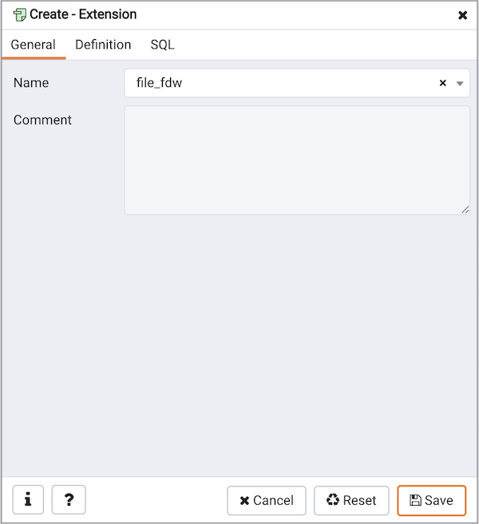
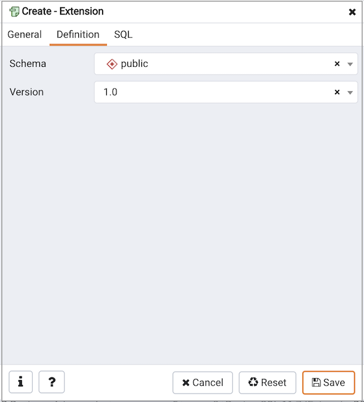
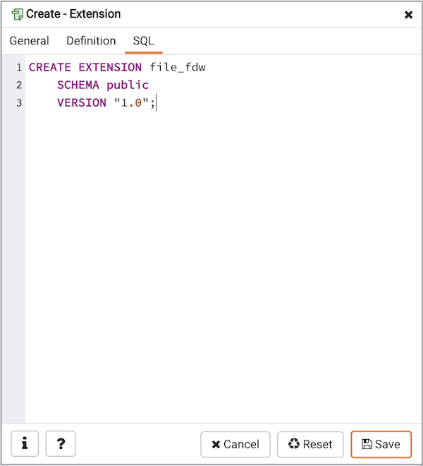

Use the `Extension` dialog to install a new extension into the current database. An extension is a collection of SQL objects that add targeted functionality to your Postgres installation. The `Extension` dialog adds the functionality of an extension to the current database only; you must register the extension in each database that use the extension. Before you load an extension into a database, you should confirm that any pre-requisite files are installed.

The `Extension` dialog allows you to implement options of the CREATE EXTENSION command through the following dialog tabs: `General` and `Definition`. The `SQL` tab displays the SQL code generated by dialog selections.

Use the fields in the `General` tab to identify an extension:

-   Use the drop-down listbox in the `Name` field to select the extension. Each extension must have a unique name.
-   Store notes about the extension in the `Comment` field.

Click the `Definition` tab to continue.

Use the `Definition` tab to select the `Schema` and `Version`:

-   Use the drop-down listbox next to `Schema` to select the name of the schema in which to install the extension's objects.
-   Use the drop-down listbox next to `Version` to select the version of the extension to install.

Click the `SQL` tab to continue.

Your entries in the `Extension` dialog generate a SQL command (see an example below). Use the `SQL` tab for review; revisit or switch tabs to make any changes to the SQL command.

**Example**

The following is an example of the sql command generated by user selections in the `Extension` dialog:

The command creates the `chkpass` extension in the `public` schema. It is version `1.0` of `chkpass`.

-   Click the `Info` button (i) to access online help. View context-sensitive help in the `Tabbed browser`, where a new tab displays the PostgreSQL core documentation.
-   Click the `Save` button to save work.
-   Click the `Cancel` button to exit without saving work.
-   Click the `Reset` button to restore configuration parameters.
